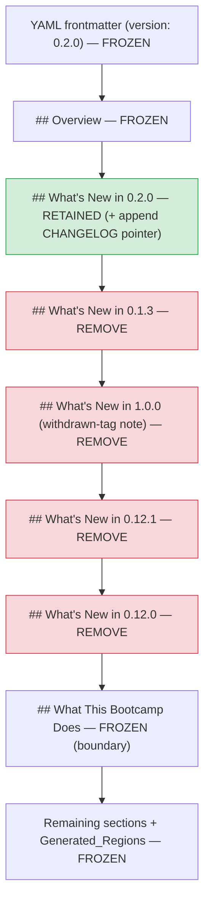

# Design Document

## Overview

This feature is a **documentation-only** cleanup of `senzing-bootcamp/POWER.md`. Today the
file carries five hand-written `## What's New in X.Y.Z` sections — `0.2.0`, `0.1.3`,
`1.0.0`, `0.12.1`, and `0.12.0`. Per the confirmed Retention_Policy, the cleanup keeps only
the current-release section (`0.2.0`, matching the frontmatter `version`), removes the four
older sections (including the `1.0.0` withdrawn-tag historical note), and appends the exact
CHANGELOG pointer sentence to the retained section.

The change is a single targeted text edit to one region of one file. It is deliberately
**not** a generator change, a script change, or a steering change. The generator-owned
regions of POWER.md, the YAML frontmatter, every other prose section, and the separate
runtime notification (`senzing-bootcamp/steering/whats-new.md`) all stay byte-for-byte
untouched. Release history that leaves POWER.md remains discoverable in
`senzing-bootcamp/CHANGELOG.md`, which already holds a release entry for every removed
version.

### Design goals

- Remove the four Older_Whats_New_Sections and keep exactly the `0.2.0` section.
- Append `See the CHANGELOG for the full release history.` to the retained section.
- Preserve everything else in POWER.md exactly, especially the frontmatter and every
  Generated_Region.
- Keep the CI validation suite green, with POWER.md remaining valid CommonMark.
- Optionally add one small `test_*.py` regression guard so the sections cannot silently
  accumulate again.

### Scope boundary

| In scope | Out of scope |
|---|---|
| Edit the What's New region of `senzing-bootcamp/POWER.md` | Any Python script, hook, or steering file |
| Optional `test_whats_new_sections.py` under `senzing-bootcamp/tests/` | The power documentation generator |
| — | YAML frontmatter (incl. `version`) |
| — | Any Generated_Region (`<!-- BEGIN/END GENERATED: ... -->`) |
| — | `senzing-bootcamp/steering/whats-new.md` (runtime notification) |
| — | `senzing-bootcamp/CHANGELOG.md` (already complete) |

## Architecture

There is no runtime architecture to change. The "architecture" of this cleanup is the
structural map of the edit: which byte ranges of POWER.md change and which are frozen.

POWER.md is organized top-to-bottom as: YAML frontmatter, the `# Senzing Bootcamp` title,
an `## Overview` section, a run of `## What's New in X.Y.Z` sections, then prose sections
(`## What This Bootcamp Does`, `## Quick Start`, ...), interleaved with generator-owned
regions delimited by `<!-- BEGIN GENERATED: <id> -->` / `<!-- END GENERATED: <id> -->`
markers (mcp-tools, hooks, steering-files, modules, example-coverage).

A **Whats_New_Section** spans from its `## What's New in X.Y.Z` heading up to the next
level-2 (`##`) heading. In the current file the sections appear in this order:



**The edit is fully bounded**: it starts at the `## What's New in 0.1.3` heading and ends
immediately before `## What This Bootcamp Does`. Nothing above the `0.2.0` section and
nothing at or below `## What This Bootcamp Does` is touched. Because no Generated_Region
lives inside the What's New run, no generator marker is affected.

### Editing approach

A **targeted manual text edit**, not a generator or programmatic rewrite:

1. **Append the pointer to the retained section.** Insert a blank line and the exact
   sentence `See the CHANGELOG for the full release history.` after the last bullet of the
   `## What's New in 0.2.0` section (the last line before the `## What's New in 0.1.3`
   heading). This mirrors how the `0.1.3` and `0.12.0` sections already close.
2. **Delete the older run.** Remove every line from the `## What's New in 0.1.3` heading
   through the last line before `## What This Bootcamp Does` (i.e. the `0.1.3`, `1.0.0`,
   `0.12.1`, and `0.12.0` sections in full, including the `1.0.0` withdrawn-tag blockquote).
3. Leave a single blank line between the retained `0.2.0` section and
   `## What This Bootcamp Does`, matching the file's existing one-blank-line spacing between
   level-2 sections (preserves CommonMark blank-line-around-headings compliance).

The two steps can be done as one contiguous replacement spanning from the end of the
`0.2.0` bullet list through the start of `## What This Bootcamp Does`.

### Why not a generator change

The What's New sections sit **outside** every Generated_Region — no script emits or parses
them. Changing the generator would be out of scope, would risk the frozen regions, and would
violate the documentation-only constraint (Requirement 6.3). A precise text edit is the
smallest correct change.

## Components and Interfaces

This is a documentation edit, so the only "interface" surfaces are (a) the POWER.md section
grammar the edit must respect and (b) the optional guard test that reads the finished file.

### POWER.md What's New grammar (observed, not changed)

- A Whats_New_Section heading matches the anchored pattern `^## What's New in (\d+\.\d+\.\d+)$`.
- A section body runs from its heading to the next `^## ` heading (or EOF).
- The retained section's body ends with the CHANGELOG_Pointer as its own paragraph:
  `See the CHANGELOG for the full release history.`

### Optional regression guard (`test_whats_new_sections.py`)

A read-only pytest module under `senzing-bootcamp/tests/` following repo conventions
(class-based organization, `sys.path` script access only if needed, Hypothesis for the one
property). It exposes no production API; it only reads `POWER.md` and `CHANGELOG.md` from
disk. Its internal helpers:

- `whats_new_versions(text: str) -> list[str]` — a pure helper that returns the ordered list
  of versions for which `text` contains a `## What's New in X.Y.Z` heading. This is the one
  piece of reusable logic and is the subject of the parser property.
- `frontmatter_version(text: str) -> str` — reads the `version` field from the leading YAML
  frontmatter block (POWER.md already ships a `version:` line; the existing
  `version.read_version_from_frontmatter` behavior can be mirrored or reused).
- `retained_section_body(text: str) -> str` — returns the body text of the sole retained
  Whats_New_Section for the pointer-sentence assertion.

The guard asserts, against the real `POWER.md`:

1. `whats_new_versions(power_md)` equals exactly `[frontmatter_version(power_md)]`
   (exactly one section, and it is the current version).
2. No version other than the frontmatter version has a Whats_New_Section (no disallowed
   version — the regression-guard behavior).
3. The retained section's final non-empty line equals the exact CHANGELOG_Pointer sentence.

## Data Models

No persistent data model changes. For the guard test's internal reasoning:

```
WhatsNewSection:
    version: str        # "X.Y.Z" parsed from the heading
    body: str           # heading-exclusive text up to the next "## " heading

RetentionPolicy (confirmed, encoded as test constants):
    current_version: str            # read from POWER.md frontmatter (== "0.2.0")
    removed_versions: list[str]     # ["0.1.3", "1.0.0", "0.12.1", "0.12.0"]
    changelog_pointer: str          # "See the CHANGELOG for the full release history."
```

These are ephemeral, in-test values derived from reading the shipped files; nothing is
written back.

## Correctness Properties

*A property is a characteristic or behavior that should hold true across all valid
executions of a system — essentially, a formal statement about what the system should do.
Properties serve as the bridge between human-readable specifications and machine-verifiable
correctness guarantees.*

This is a documentation-only cleanup, so most acceptance criteria are verified by
example-based assertions or by the CI gates (see Testing Strategy), not by property-based
testing. Two areas genuinely benefit from PBT and are captured below: the reusable
section-detection logic and the set-level guarantees over versions. They are kept
intentionally small and proportional to the change.

### Property 1: What's New version detection round-trips

*For any* set of distinct semantic-version strings `V`, a Markdown document composed of a
`## What's New in v` heading (plus arbitrary body text) for each `v` in `V` parses back —
via `whats_new_versions` — to exactly the set `V`, with no version missed and no spurious
version introduced.

**Validates: Requirements 1.1, 1.3, 7.2**

### Property 2: Only the current version has a What's New section

*For any* semantic-version string `v` that differs from the Current_Version recorded in the
POWER.md frontmatter, POWER.md contains no Whats_New_Section for `v`.

**Validates: Requirements 1.2, 1.3, 7.2**

### Property 3: No release information is lost

*For any* version whose Older_Whats_New_Section the cleanup removes, `CHANGELOG.md` contains
a matching release entry (`## [version]`), so the pruned per-version notes remain
discoverable in the authoritative history.

**Validates: Requirements 2.3**

## Error Handling

The change itself has no runtime error surface. Handling focuses on catching a mistaken edit
before it ships:

- **Malformed Markdown after the edit** — caught by `validate_commonmark.py` (Requirement
  6.1). The retained section must keep a blank line before and after each heading and end
  with the pointer sentence as its own paragraph.
- **Accidental change to a frozen region** — a stray edit to a Generated_Region, the
  frontmatter, or another section is caught by reviewing the git diff (it must fall entirely
  within the What's New run) and by the CI gates that own those regions (`validate_power.py`,
  `sync_hook_registry.py --verify`, `measure_steering.py --check`).
- **Guard-test file/parse errors** — if the optional guard cannot locate a frontmatter
  `version` or any What's New heading, it fails loudly with a message naming the missing
  element, rather than passing silently.
- **Pointer sentence drift** — the guard asserts the *exact* pointer sentence, so a
  reworded or missing pointer fails the test rather than degrading quietly.

## Testing Strategy

### Assessment: is property-based testing appropriate?

Only partially. The bulk of this change is a static documentation edit whose guarantees are
best verified by example assertions and by the existing CI gates. PBT adds value in exactly
two places, which are covered by the properties above: (1) the pure
`whats_new_versions` detection helper (a parser-style round-trip), and (2) the set-level
"only the current version has a section" guarantee. Everything else — byte-for-byte
preservation, CommonMark validity, CI-suite success, file-untouched guarantees — is
verified by diff inspection and by running the gate sequence, not by PBT.

### Property-based tests (when the optional guard is added)

- Library: **Hypothesis** (repo standard), organized in a class-based `test_*.py` module.
- Iterations: governed by the active Hypothesis profile (`thorough` → 100 in CI); do not
  hand-set `@settings(max_examples=...)` to restate the baseline.
- Each property test is tagged with a comment referencing its design property, format:
  `Feature: power-whats-new-cleanup, Property {number}: {property_text}`.
- Property 1 → generate sets of semver strings, synthesize a document, assert
  `whats_new_versions` returns exactly that set (round-trip).
- Property 2 → generate version strings `!= current_version` and assert no matching
  `## What's New in v` heading exists in the real POWER.md.
- Property 3 → iterate the removed-version set and assert each has a `## [version]` entry in
  CHANGELOG.md.

### Example-based / unit assertions (the regression guard, Requirement 7)

- POWER.md contains **exactly one** Whats_New_Section, and it is the frontmatter version
  (`0.2.0`) — Requirements 1.1, 1.2.
- The retained section's final non-empty line equals
  `See the CHANGELOG for the full release history.` — Requirements 2.1, 7.3.
- The retained section contains no Point_In_Time_Metric_Claim pattern (digits paired with
  `passed`/`failed`/`violations`) — Requirement 3.1 (guards against reintroducing drift).

### Verification mapped to the CI validation suite

Run the gate sequence exactly as CI does (`.github/workflows/validate-power.yml`) after the
edit; all must pass with zero failures (Requirement 6.2):

| Step | Command | Confirms |
|---|---|---|
| 1 | `python senzing-bootcamp/scripts/validate_power.py` | Power integrity; Generated_Regions intact (Req 4.1) |
| 2 | `python senzing-bootcamp/scripts/measure_steering.py --check` | Steering token budgets unaffected (Req 6.3) |
| 3 | `python senzing-bootcamp/scripts/validate_commonmark.py` | POWER.md still valid CommonMark (Req 6.1) |
| 4 | `python senzing-bootcamp/scripts/sync_hook_registry.py --verify` | Hook registry unchanged (Req 6.3) |
| 5 | `python -m pytest senzing-bootcamp/tests/ tests/` | Full suite green, incl. new guard (Req 6.2, 7) |

### Diff-based preservation checks (Requirements 4, 5, 6.3, 6.4)

Inspect the git diff and confirm:

- The only content-bearing changes are the removal of the `0.1.3`/`1.0.0`/`0.12.1`/`0.12.0`
  sections and the appended pointer line in the `0.2.0` section — all inside the What's New
  run (Req 4.1, 4.3).
- No frontmatter line changed; `version` is still `0.2.0` (Req 4.2); existing version tests
  (e.g. `test_version_frontmatter_properties.py`) still pass.
- `senzing-bootcamp/steering/whats-new.md` is absent from the changeset (Req 5.1); the
  runtime notification tests remain green (Req 5.2).
- The changeset touches only `senzing-bootcamp/POWER.md` and, optionally, the new
  `senzing-bootcamp/tests/test_whats_new_sections.py` (Req 6.4).
