# Design Document

## Overview

This feature corrects three presentation/sequence defects in the guided bootcamp experience by editing steering files (the agent's runtime instructions) and their tests. There is no new runtime service or Python module. The work is:

1. Add an **ER_Concepts_Banner** at the top of the entity-resolution introduction.
2. Add a **Graduation_Banner** at the start of the graduation / track-completion celebration.
3. **Reorder** the preface so the presented sequence is ER intro → welcome banner → overview → detail level → track → language → any-questions → (advanced knowledge check) → Module 1.

All three are edits to Markdown steering files that the agent reads and follows. The banners follow the existing bordered pattern from `steering/module-transitions.md` (56 `━` characters, triple-emoji title line, wrapped in a ` ```text ` fenced block when shown as a template).

## Architecture

There is no software architecture. The deliverables are edited steering Markdown files plus updated pytest assertions. The "runtime" is the agent interpreting the steering files during onboarding and graduation.

### Current vs. Target Preface Sequence

```mermaid
flowchart TD
    subgraph Current
      C3[3. ER Introduction] --> C4[4. Language Selection]
      C4 --> C5[5. Welcome Banner + Overview]
      C5 --> C5a[5a. Verbosity]
      C5a --> C5b[5b. Comprehension / Any Questions]
      C5b --> CT[phase2: Track Selection]
      CT --> C5c[5c. Advanced Knowledge Check]
      C5c --> CM1[Module 1]
    end
    subgraph Target
      T3[ER Introduction + ER_Concepts_Banner] --> TW[Welcome Banner + Overview]
      TW --> TV[Detail Level / Verbosity]
      TV --> TT[Track Selection]
      TT --> TL[Language Selection]
      TL --> TQ[Any Questions / Comprehension]
      TQ --> TA[Advanced Knowledge Check - advanced only]
      TA --> TM1[Module 1]
    end
```



### Files Touched

| File | Change |
| --- | --- |
| `steering/entity-resolution-intro.md` | Add ER_Concepts_Banner as the first presented output; add a note that it shows once per Preface (not re-shown on gate re-presentation). |
| `steering/onboarding-phase1b-intro-language.md` | Remove the Language_Selection block (Step 4) from here; keep ER intro handoff, Welcome_Banner (Step 5), overview, and Detail_Level_Step (5a). Move Any_Questions_Step (5b comprehension) out to after Language_Selection. Renumber. |
| `steering/onboarding-phase2-track-setup.md` | Track_Selection stays first here; insert Language_Selection immediately after Track_Selection; then Any_Questions_Step; keep Advanced_Knowledge_Check as the final step before Module 1. |
| `steering/onboarding-flow.md` | Update the "Sequence:" summary line and any Phase Sub-File pointers to reflect the new order and step ownership. |
| `steering/graduation.md` | Add Graduation_Banner display at the start of the graduation workflow output (before Step 0 / at the celebration entry). |
| `steering/module-completion-track.md` | Add Graduation_Banner at the start of the Path Completion Celebration so a bootcamper who declines graduation still sees it. |
| Onboarding/graduation tests | Update sequence, ownership, and banner-presence assertions (see Testing Strategy). |

### Design Decision: Relocate Steps, Do Not Rename Phase Files

The phase files are named `onboarding-phase1b-intro-language.md` and `onboarding-phase2-track-setup.md`. After the reorder, language selection lives in phase 2. Renaming files would ripple through many `#[[file:]]` references and test fixtures. **Decision:** keep file names as-is and relocate the step content between them. Add a one-line note at the top of each phase file describing the (slightly historical) name so maintainers are not confused. This minimizes blast radius while achieving the required runtime order.

### Design Decision: Single Source for Banner Geometry

All three banners (welcome, ER concepts, graduation) share the 56-`━` / triple-emoji geometry already documented in `module-transitions.md`. Rather than restate the geometry in each file, each new banner references the Banner_Block definition and reproduces the exact template inline (steering files are read independently at runtime, so each display site must contain the literal block). The emoji choice per banner:

| Banner | Emoji | Title line |
| --- | --- | --- |
| Welcome (existing) | 🎓 | `🎓🎓🎓  WELCOME TO THE SENZING BOOTCAMP!  🎓🎓🎓` |
| ER concepts (new) | 🧩 | `🧩🧩🧩  ENTITY RESOLUTION CONCEPTS  🧩🧩🧩` |
| Graduation (new) | 🎓 | `🎓🎓🎓  GRADUATION  🎓🎓🎓` |

`🧩` distinguishes the concepts phase from the `🎓` graduation/welcome celebration emoji so the two 🎓 banners (welcome at the start, graduation at the end) bookend the experience.

## Components and Interfaces

No software components. The "interface" is the sequence of agent turns the bootcamper sees. Each step remains a discrete turn governed by the existing One Question Rule and `ask-bootcamper` Stop-hook closing-question ownership.

### Gate Preservation

- Language_Selection and Track_Selection keep their ⛔ MANDATORY GATE markers and `🛑 STOP` directives verbatim; only their position moves.
- The ER_Introduction exploration gate is unchanged.
- The ER_Concepts_Banner is display-only and introduces no new question.
- The Graduation_Banner is display-only; the mandatory closing question in `graduation.md` and the celebration closing question in `module-completion-track.md` are unchanged.

## Data Models

Not applicable. No persisted schema changes. Existing persistence of `language`, `track`, and `verbosity` to `config/bootcamp_preferences.yaml` is retained; only the order in which those values are captured changes.

## Error Handling

- **Resume mid-preface:** `steering/session-resume.md` prompts only for missing preference fields in a fixed order (language, track, verbosity). Update that ordering note to `track, language, verbosity` (or otherwise consistent with the new capture order) so a resumed preface does not re-ask in the old order. This is a documentation-consistency fix, not new logic.
- **Banner rendering:** banners are static text; there is no failure mode beyond a typo, mitigated by the explicit templates in this design and the banner-presence tests.
- **Advanced_Knowledge_Check guard:** unchanged — it runs only when `track == advanced_topics` and is never a gate.

## Testing Strategy

This change is steering-text plus test updates; there is no new Python logic, so property-based testing does not apply. The existing onboarding tests are markdown-content assertions and must be updated to match the new order and banners.

### Tests to Update

- `senzing-bootcamp/tests/test_onboarding_question_ownership.py` — step-ownership and Step 4 key-content assertions: move Language_Selection ownership to the track-setup phase; assert Track before Language.
- `senzing-bootcamp/tests/test_comprehension_check.py` — assert the Any_Questions_Step now follows Language_Selection.
- `senzing-bootcamp/tests/test_onboarding_split_preservation.py` and `test_remove_duplicate_module_table.py` — update moved-content markers so the language prompt is expected in the track-setup phase file.
- `senzing-bootcamp/tests/test_onboarding_session_ux.py` — welcome-banner-position assertion still holds (ER intro before welcome); add/adjust order assertions.
- `senzing-bootcamp/tests/test_version_unit.py` and `test_module_closing_question_ownership.py` — keep welcome-banner-presence assertions; adjust any that assume language precedes the welcome banner.

### Tests to Add

- A test asserting `ENTITY RESOLUTION CONCEPTS` appears in `entity-resolution-intro.md` as a banner (with 56 `━` borders).
- A test asserting `GRADUATION` banner text appears in both `graduation.md` and `module-completion-track.md`.
- A test asserting the reordered sequence markers appear in the expected relative order across the phase files (Track_Selection prompt precedes Language_Selection prompt; Language_Selection prompt precedes the comprehension/any-questions prompt).

### Verification Approach

1. Grep each edited steering file to confirm the banner literals (56 `━`, correct title, correct emoji) are present exactly once at the intended location.
2. Run `python -m pytest senzing-bootcamp/tests/` and confirm green.
3. Run `python3 senzing-bootcamp/scripts/validate_commonmark.py` (per CI) on edited Markdown to keep style clean.
4. Manually trace the phase files end-to-end to confirm the target sequence reads correctly.

### What NOT to Test

- No property-based tests — there are no functions or transformations.
- No new integration harness — the conversational-eval harness (if run) already exercises onboarding order and can be updated separately if it encodes the old sequence.
