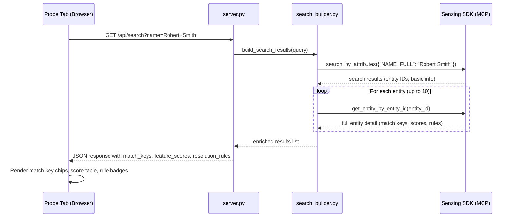

# Design Document

## Overview

This feature enriches the Probe Entities tab in the Module 3 visualization to display resolution reasoning — match keys, feature scores, and resolution rules — by default when a bootcamper searches for entities. Currently the Probe tab shows only basic entity information (name, record count, data sources). After this change, bootcampers will see *why* records resolved together, not just *that* they did.

The implementation touches three layers:

1. **Search Builder** (`search_builder.py`) — After `search_by_attributes` returns results, call `get_entity_by_entity_id` for each matched entity (up to 10) to retrieve full resolution detail including match keys, feature scores, and resolution rules.
2. **Visualization Server** (`server.py`) — The `/api/search` endpoint returns the enriched response schema with `match_keys`, `feature_scores`, and `resolution_rules` fields.
3. **Frontend** (`index.html` via `write_html.py`) — The Probe tab renders match keys as inline chips, feature scores as a structured list, and resolution rules in monospace format.
4. **Steering File** (`module-03-phase2-visualization.md`) — Updated to specify the enriched Probe tab behavior so all future bootcampers receive it.

### Design Decisions

- **Enrichment cap at 10 entities**: Calling `get_entity_by_entity_id` is an SDK call per entity. Capping at 10 prevents excessive latency while covering the vast majority of probe searches (TruthSet searches rarely return more than 10 matches).
- **Graceful degradation on error**: If enrichment fails for a specific entity, the basic search result is returned with null enrichment fields plus an `enrichment_error` string. This ensures one bad entity doesn't break the entire search response.
- **No additional API endpoints**: The enrichment happens server-side in `search_builder.py` before the response is returned. The frontend doesn't need to make additional calls — resolution reasoning arrives in the same `/api/search` response.
- **Steering file as source of truth**: Since the visualization code is *generated* by the agent during the bootcamp (not shipped statically), the steering file specification is what ensures every bootcamper gets the enriched Probe tab.

## Architecture



### Component Responsibilities

| Component | Responsibility |
|-----------|---------------|
| `search_builder.py` | Orchestrates search + enrichment; extracts match keys, feature scores, resolution rules from SDK response; handles errors per-entity |
| `server.py` | Routes `/api/search` requests to search builder; serializes response as JSON |
| `write_html.py` | Generates `index.html` with Probe tab rendering logic for enriched data |
| `module-03-phase2-visualization.md` | Specifies the enriched Probe tab behavior for agent code generation |

## Components and Interfaces

### search_builder.py — Enrichment Logic

```python
def build_search_results(query: dict) -> dict:
    """Execute search and enrich results with resolution reasoning.
    
    Args:
        query: Dict with optional keys 'name', 'address', 'phone', 'email'.
        
    Returns:
        Dict with 'results' list and 'query' echo.
    """
    ...

def _enrich_entity(entity_id: int, search_match_info: dict) -> dict:
    """Call get_entity_by_entity_id and extract resolution reasoning.
    
    Args:
        entity_id: The resolved entity ID to enrich.
        search_match_info: The match info from the search response for feature scores.
        
    Returns:
        Dict with match_keys, feature_scores, resolution_rules fields.
        On error: null values + enrichment_error string.
    """
    ...

def _extract_match_keys(entity_detail: dict) -> dict:
    """Extract entity-level and per-record match keys.
    
    Returns:
        {"entity_level": "+NAME+DOB", "per_record": ["+NAME+DOB", "+PHONE"]}
    """
    ...

def _extract_feature_scores(search_match_info: dict) -> list[dict]:
    """Extract feature comparison scores from search match info.
    
    Returns:
        [{"feature": "NAME", "score": 97, "label": "CLOSE"}, ...]
    """
    ...

def _extract_resolution_rules(entity_detail: dict) -> list[dict]:
    """Extract per-record resolution rules.
    
    Returns:
        [{"data_source": "CUSTOMERS", "record_id": "1001", "rule": "CNAME_CFF_CEXCL"}, ...]
    """
    ...
```

### server.py — API Endpoint

The existing `/api/search` handler delegates to `search_builder.build_search_results()`. No new endpoints are needed — the enrichment is transparent to the server routing layer.

### Frontend (index.html) — Probe Tab Rendering

The Probe tab JavaScript receives the enriched response and renders:

1. **Match key chips**: Each feature indicator (e.g., `+NAME`, `+DOB`) rendered as a separate inline `<span>` element with a visible border/background distinguishing it from adjacent text.
2. **Feature scores table**: A structured list showing feature name, percentage, and classification label (e.g., `NAME: 97% CLOSE`).
3. **Resolution rules**: Per-record rule strings displayed in monospace/code-style format next to each constituent record.

### Steering File Updates

The `module-03-phase2-visualization.md` steering file gains:

1. A new `/api/search` response schema section specifying `match_keys`, `feature_scores`, and `resolution_rules` fields.
2. Updated Probe_Panel specification requiring display of resolution reasoning.
3. Updated `search_builder.py` description specifying the `get_entity_by_entity_id` enrichment call.

## Data Models

### Enriched Search Response Schema

```json
{
  "results": [
    {
      "entity_id": 1,
      "entity_name": "Robert Smith",
      "record_count": 3,
      "data_sources": ["CUSTOMERS", "REFERENCE"],
      "match_keys": {
        "entity_level": "+NAME+DOB+PHONE",
        "per_record": ["+NAME+DOB", "+PHONE", "+NAME+ADDRESS"]
      },
      "feature_scores": [
        {"feature": "NAME", "score": 97, "label": "CLOSE"},
        {"feature": "DOB", "score": 100, "label": "SAME"},
        {"feature": "PHONE", "score": 100, "label": "SAME"}
      ],
      "resolution_rules": [
        {"data_source": "CUSTOMERS", "record_id": "1001", "rule": "CNAME_CFF_CEXCL"},
        {"data_source": "REFERENCE", "record_id": "2001", "rule": "CNAME_CFF"}
      ],
      "enrichment_error": null
    }
  ],
  "query": {
    "name": "Robert Smith",
    "address": null,
    "phone": null,
    "email": null
  }
}
```

### Field Definitions

| Field | Type | Description |
|-------|------|-------------|
| `match_keys.entity_level` | `string \| null` | The overall match key string for the entity |
| `match_keys.per_record` | `list[string]` | Per-record match key strings (empty list for single-record entities) |
| `feature_scores` | `list[object]` | Each entry: `feature` (string), `score` (int 0-100), `label` (string) |
| `resolution_rules` | `list[object]` | Each entry: `data_source` (string), `record_id` (string), `rule` (string) |
| `enrichment_error` | `string \| null` | Non-null if `get_entity_by_entity_id` failed; contains exception type + message |

### Error Case Response

When enrichment fails for a specific entity:

```json
{
  "entity_id": 5,
  "entity_name": "Jane Doe",
  "record_count": 2,
  "data_sources": ["WATCHLIST"],
  "match_keys": null,
  "feature_scores": null,
  "resolution_rules": null,
  "enrichment_error": "SzError: Entity 5 not found in repository"
}
```

### Single-Record Entity Response

When an entity has only one record (no resolution occurred):

```json
{
  "entity_id": 10,
  "entity_name": "Alice Johnson",
  "record_count": 1,
  "data_sources": ["CUSTOMERS"],
  "match_keys": {
    "entity_level": "+NAME",
    "per_record": []
  },
  "feature_scores": [
    {"feature": "NAME", "score": 95, "label": "CLOSE"}
  ],
  "resolution_rules": [],
  "enrichment_error": null
}
```


## Correctness Properties

*A property is a characteristic or behavior that should hold true across all valid executions of a system — essentially, a formal statement about what the system should do. Properties serve as the bridge between human-readable specifications and machine-verifiable correctness guarantees.*

### Property 1: Enrichment cap limits SDK calls

*For any* list of search results with N entities (where N ranges from 0 to 30), the search builder SHALL enrich exactly min(N, 10) entities with resolution detail, and any remaining entities (positions 11+) SHALL have null values for `match_keys`, `feature_scores`, and `resolution_rules`.

**Validates: Requirements 1.1, 1.6**

### Property 2: Match key extraction preserves structure

*For any* valid entity detail JSON containing match key data (an entity-level match key string and zero or more per-record match key strings), the `_extract_match_keys` function SHALL return a dict where `entity_level` equals the entity-level match key string from the input and `per_record` is a list whose length equals the number of constituent records with match keys in the input.

**Validates: Requirements 1.2, 5.1**

### Property 3: Feature score extraction completeness

*For any* valid search match info containing one or more feature comparisons, the `_extract_feature_scores` function SHALL return a list where each entry contains exactly three fields: `feature` (a non-empty string), `score` (an integer between 0 and 100 inclusive), and `label` (a non-empty string), and the list length equals the number of feature comparisons in the input.

**Validates: Requirements 1.3, 5.2**

### Property 4: Resolution rule extraction preserves per-record association

*For any* valid entity detail JSON containing records with resolution rules, the `_extract_resolution_rules` function SHALL return a list where each entry contains `data_source` (non-empty string), `record_id` (non-empty string), and `rule` (non-empty string), and the list length equals the number of records with resolution rules in the input.

**Validates: Requirements 1.4, 5.3**

### Property 5: Enrichment error produces graceful degradation

*For any* exception raised during `get_entity_by_entity_id` (with any exception type name and any message string), the enrichment result SHALL have `match_keys` equal to null, `feature_scores` equal to null, `resolution_rules` equal to null, and `enrichment_error` as a non-empty string containing both the exception type name and the exception message.

**Validates: Requirements 1.5, 5.4**

### Property 6: Single-record entities have empty per-record fields

*For any* entity detail representing a single-record entity (record count = 1), the enrichment result SHALL have `match_keys.per_record` as an empty list and `resolution_rules` as an empty list, while `match_keys.entity_level` and `feature_scores` remain populated from the search comparison data.

**Validates: Requirements 5.5**

## Error Handling

| Error Condition | Handling | User Impact |
|-----------------|----------|-------------|
| `get_entity_by_entity_id` raises exception for one entity | Return basic result with `enrichment_error` field; continue enriching remaining entities | Other entities still show full resolution reasoning; failed entity shows basic info with error indicator |
| `search_by_attributes` raises exception | Return HTTP 500 with `{"error": "<description>"}` | Probe tab shows error message; no results displayed |
| Entity detail response missing expected fields | Extract what's available; use null/empty for missing fields | Partial resolution reasoning displayed; no crash |
| Search returns 0 results | Return empty results list | Probe tab shows "No matching entities found" message |
| Network timeout to SDK | Exception caught by per-entity error handling | Same as first row — graceful degradation per entity |

### Error Response Format

All errors from the `/api/search` endpoint follow the existing visualization server pattern:

```json
{"error": "SDK search failed: <exception message>"}
```

Per-entity enrichment errors are embedded in the result object (not HTTP errors):

```json
{"enrichment_error": "SzError: Entity 5 not found in repository"}
```

## Testing Strategy

### Property-Based Tests (Hypothesis)

Property-based testing is appropriate for this feature because:
- The extraction functions (`_extract_match_keys`, `_extract_feature_scores`, `_extract_resolution_rules`) are pure transformations with clear input/output behavior
- The enrichment cap logic has a large input space (varying result list lengths)
- The error handling must work correctly for any exception type/message combination
- Universal properties hold across all valid inputs

**Library**: Hypothesis (already used throughout the project)
**Configuration**: Minimum 100 iterations per property test (`@settings(max_examples=100)`)
**Tag format**: `Feature: probe-entities-visualization, Property {N}: {title}`

Each correctness property (1–6) maps to one property-based test class. Tests will:
- Generate random SDK response structures using Hypothesis strategies
- Verify extraction functions produce correctly shaped output
- Verify the enrichment cap is respected regardless of input size
- Verify error handling produces the correct degraded response shape

### Unit Tests (pytest)

Unit tests cover specific examples and steering file content validation:

- **Steering file content**: Verify `module-03-phase2-visualization.md` contains specifications for match keys, feature scores, resolution rules, `get_entity_by_entity_id` call, and enriched response schema (Requirements 6.1–6.3)
- **Frontend rendering specs**: Verify steering file specifies inline chip elements for match keys, structured format for feature scores, monospace format for resolution rules (Requirements 2.4, 3.2, 4.3)
- **Conditional display logic**: Verify steering file specifies per-record match key omission for single-record entities and placeholder for missing data (Requirements 2.3, 2.5)

### Test File Location

Tests will be placed in `senzing-bootcamp/tests/test_probe_entities_visualization_properties.py` (property tests) and `senzing-bootcamp/tests/test_probe_entities_visualization_unit.py` (unit tests), following the project's existing naming convention.
