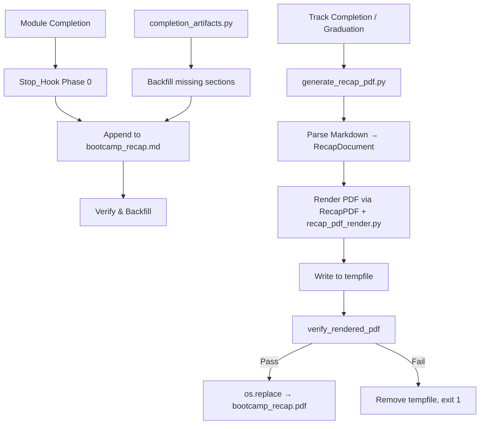
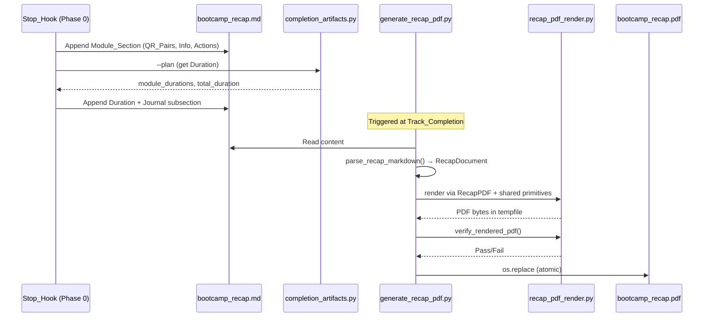

# Design Document: Professional Recap PDF

## Overview

The Professional Recap PDF feature ensures the `bootcamp_recap.pdf` is always generated at bootcamp completion with complete per-module content and professional styling. The implementation uses a two-script architecture: `generate_recap_pdf.py` (structured Markdown parser + PDF renderer) and `recap_pdf_render.py` (shared rendering primitives). Together they parse the recap Markdown into structured data, render it to a professionally styled PDF with a cover page and per-module content pages, verify the output via text extraction, and publish atomically.

Key design goals:
- **Completeness**: Every completed module's Information Shared, Questions & Responses, and Actions Taken content appears in the PDF
- **Professional appearance**: Accent colors, consistent fonts, proper margins, cover page with metadata
- **Safety**: Atomic output (tempfile + os.replace), post-generation verification, graceful degradation without fpdf2
- **Real-time capture**: The Stop_Hook (Phase 0 in `ask-bootcamper.json`) appends structured content at each module boundary, with `completion_artifacts.py` as a backfill safety net

## Architecture



### Component Interaction



## Components and Interfaces

### 1. Generator Script (`generate_recap_pdf.py`)

**Responsibilities:**
- CLI entry point (`main(argv)`) with `--input` and `--output` arguments
- Markdown parsing into `RecapDocument` (header + sections)
- Per-section schema classification (`paired` / `split` / `none`)
- PDF rendering orchestration (cover page + module pages)
- Post-generation verification via `verify_rendered_pdf`
- Atomic output via tempfile + `os.replace`

**Key Functions:**
| Function | Purpose |
|----------|---------|
| `parse_recap_markdown(content)` | Parse Markdown → `RecapDocument` |
| `classify_section(section_text)` | Classify as `paired`/`split`/`none` |
| `parse_qr_section(text)` | Parse QR_Section body → `list[QRPair]` |
| `render_pdf(doc, output_path, body_text)` | Orchestrate PDF rendering |
| `_render_cover_page(pdf, doc)` | Render professional cover page |
| `_render_module_page(pdf, section)` | Render one module on a new page |
| `_render_qr_pairs(pdf, qr_pairs)` | Render Paired_Schema pairs indented |
| `_render_qa_pairs(pdf, questions, answers)` | Render Split_List_Schema merged |
| `_build_qa_lines(questions, answers)` | Build ordered Q/A line pairs |
| `collect_verification_targets(doc, body_text)` | Collect expected module numbers + body lines |
| `identify_unrendered_content(pdf_path, doc)` | Best-effort: name first missing item |

### 2. Shared Renderer Module (`recap_pdf_render.py`)

**Responsibilities:**
- Canonical raw-Markdown → PDF rendering logic (block splitting, Latin-1 safety, per-block rendering)
- `RecapPDF` subclass of `fpdf.FPDF` with professional margins, page footers, cover page suppression
- QR_Pair formatting (`format_qr_pair`, `format_qr_section`)
- Indentation geometry (`indent_depth`, `nesting_level`, `start_x`, `wrap_text`)
- List parsing and rendering (`parse_list_block`, `render_indented_list_items`)
- Table rendering (`render_table`)
- Post-generation verification (`extract_pdf_text`, `verify_rendered_pdf`)

**Key Design Decisions:**
- **Lazy fpdf2 import**: `_build_recap_pdf_class()` factory imports `fpdf` only when rendering. Module-level `__getattr__` caches the class. This allows the module to import cleanly without fpdf2 for parsing-only use.
- **Latin-1 safety**: `safe_text()` replaces non-Latin-1 characters with `?` for core PDF fonts (Helvetica/Courier).
- **Professional constants**: `ACCENT_COLOR`, `BODY_COLOR`, `MARGINS_MM`, and font sizes are centralized module-level constants.

### 3. Backfill Reconciliation (`completion_artifacts.py`)

**Responsibilities:**
- Detect artifact gaps (modules completed but missing recap sections)
- Compute per-module Duration from ISO 8601 timestamps in `step_history`
- Produce a deterministic, idempotent backfill plan
- Append minimal sections for missing modules (append-around, never rewriting existing content)
- Migrate legacy journal entries into the consolidated recap

**Key Property:** `backfill_recap_sections` is append-around and idempotent — existing recap bytes are preserved exactly, and re-running on a complete set produces no changes.

### 4. Stop_Hook (Phase 0 in `ask-bootcamper.json`)

**Responsibilities:**
- Detect module completion boundary (new entry in `modules_completed` array)
- Gather session content: Information Shared, QR_Pairs, Actions Taken, Journal narrative
- Invoke `completion_artifacts.py --plan` to get reliable Duration values
- Append structured `## Module N:` section to `docs/bootcamp_recap.md`
- Verify the section persisted; invoke backfill if missing
- Use canonical QR format: `- **Q:** ...` / `    - **R:** ...`

## Data Models

### RecapDocument

```python
@dataclass
class RecapHeader:
    bootcamper: str = "Bootcamper"
    started: str = ""
    total_duration: str = ""

@dataclass
class QRPair:
    question: str = ""
    response: str = ""

@dataclass
class RecapSection:
    module_number: int = 0
    module_name: str = ""
    timestamp: str = ""
    information_shared: list[str]
    qr_pairs: list[QRPair]          # Paired_Schema
    questions_asked: list[str]       # Split_List_Schema (legacy)
    answers_given: list[str]         # Split_List_Schema (legacy)
    schema: str = "none"            # "paired" | "split" | "none"
    actions_taken: list[str]
    duration: str = ""
    generic_content: list[str]

@dataclass
class RecapDocument:
    header: RecapHeader
    sections: list[RecapSection]
```

### PDF Layout Model

| Element | Font | Size | Color |
|---------|------|------|-------|
| Cover title | Helvetica Bold | 32pt | ACCENT_COLOR (0,90,156) |
| Cover subtitle | Helvetica | 16pt | BODY_COLOR (40,40,40) |
| Bootcamper name | Helvetica | 20pt | BODY_COLOR |
| Module heading | Helvetica Bold | 18pt | ACCENT_COLOR |
| Subsection heading | Helvetica Bold | 14pt | ACCENT_COLOR |
| Body text | Helvetica | 11pt | BODY_COLOR |
| Code blocks | Courier | 10pt | BODY_COLOR |
| Page footer | Helvetica | 9pt | BODY_COLOR |

**Page Layout:** 20mm margins on all sides. Auto page break at 20mm from bottom. Cover page (page 1) suppresses footer. Content pages display centered "Page N".

### Verification Model

```python
verify_rendered_pdf(pdf_path, module_numbers, expected_body_lines, *, min_body_lines=3)
```

- Extracts text from the PDF via `extract_pdf_text` (stdlib zlib decompression, regex-based text-show operator extraction)
- Asserts each module number has a "Module N" string in the extracted text
- Asserts at least `min_body_lines` distinctive tokens (longest word per source line) survive into the PDF
- Raises `PdfVerificationError` on failure (caller removes tempfile, exits 1)

## Correctness Properties

*A property is a characteristic or behavior that should hold true across all valid executions of a system — essentially, a formal statement about what the system should do. Properties serve as the bridge between human-readable specifications and machine-verifiable correctness guarantees.*

### Property 1: Cover page metadata round-trip

*For any* valid RecapDocument with non-empty bootcamper name, Started value, Total Duration value, and N sections, rendering to PDF and extracting text SHALL produce output containing the bootcamper name, the Started value, the Total Duration value, and a "Modules completed: N" string.

**Validates: Requirements 2.4, 2.5, 2.6, 2.7**

### Property 2: Per-module content preservation

*For any* RecapSection with substantive (non-empty, Latin-1-safe) Information Shared items, QR_Pair question/response texts, and Actions Taken items, the rendered PDF's extracted text SHALL contain at least one distinctive token from each populated subsection.

**Validates: Requirements 4.1, 4.3, 4.6**

### Property 3: QR format canonical round-trip

*For any* list of `(question, response)` pairs where each question has at least one non-whitespace character, `format_qr_section(pairs)` SHALL produce output where: (a) parsing it back via `parse_qr_section` yields equivalent pairs, (b) each Question_Item line starts with `- **Q:** ` at indent depth 0, and (c) each Response_Item line starts with `    - **R:** ` at indent depth 4.

**Validates: Requirements 4.3, 6.2**

### Property 4: Split-schema merge correctness

*For any* RecapSection classified as `"split"` with N questions and M answers (where max(N,M) > 0), the rendered PDF SHALL contain text from both the questions and answers lists, paired by index, with unmatched entries filled by the placeholder "(no matching entry)".

**Validates: Requirements 4.4**

### Property 5: Verification detects missing content

*For any* set of module numbers and expected body lines, `verify_rendered_pdf` SHALL raise `PdfVerificationError` when the PDF text is missing a "Module N" heading for any expected module, and SHALL raise when fewer than `min_body_lines` distinctive tokens survive (capped at available tokens).

**Validates: Requirements 5.1, 5.2**

### Property 6: No placeholder stubs in substantive recaps

*For any* RecapDocument whose sections contain only substantive content (no "N/A" items, no "backfilled at track completion" strings), the rendered PDF's extracted text SHALL contain zero occurrences of these placeholder strings.

**Validates: Requirements 4.5**

### Property 7: Backfill append-around preservation

*For any* existing recap file content and any set of modules to backfill, calling `backfill_recap_sections` SHALL produce output where: (a) the original content bytes are a prefix of the new content, and (b) calling it again with the same inputs produces no further changes (idempotence).

**Validates: Requirements 6.5**

### Property 8: Atomic output safety

*For any* valid recap Markdown, if `main()` returns 0 the output file SHALL exist and be non-empty; if `main()` returns 1 (verification failure, OS error, or missing fpdf2), any pre-existing output file SHALL remain byte-for-byte unchanged.

**Validates: Requirements 8.2, 8.3**

## Error Handling

| Scenario | Behavior | Exit Code |
|----------|----------|-----------|
| Recap file not found | Print "Recap file not found" to stderr | 1 |
| Recap file empty | Print "Recap file is empty" to stderr | 1 |
| fpdf2 not installed | Print install hint to stderr, leave .md intact | 1 |
| Output directory missing | Print OS error to stderr | 1 |
| Verification: missing module | Print which module(s) missing, remove tempfile | 1 |
| Verification: body content dropped | Print content-loss details, remove tempfile | 1 |
| No module sections parsed | Warn to stderr, render raw Markdown fallback | 0 |
| Fewer sections than headings | Warn to stderr, render what parsed | 0 |
| Non-Latin-1 characters | Replace with `?` via `safe_text()`, continue | 0 |
| Cover page field empty | Skip that field silently, continue | 0 |
| Cover page field render failure | Skip that field (catch Exception), continue | 0 |

**Atomic failure guarantee:** On any failure after rendering begins, the temporary file is removed in a `finally` block. The output path is only updated via `os.replace` after both rendering and verification succeed.

## Testing Strategy

### Property-Based Tests (Hypothesis)

Property-based testing is appropriate for this feature because:
- The generator processes arbitrary Markdown content (large input space)
- Universal properties hold across all valid recap documents (round-trip preservation, format correctness)
- Pure functions like `format_qr_section`, `parse_qr_section`, `wrap_text`, `indent_depth`, `nesting_level`, and `start_x` have clear input/output behavior
- The verification function has a well-defined contract testable across generated inputs

**PBT Library:** Hypothesis (already used in the project)
**Profile:** Uses the centralized Hypothesis profiles (`fast` for local, `thorough` for CI)
**Tag format:** `Feature: professional-recap-pdf, Property N: <title>`

Each correctness property maps to a single Hypothesis test:
1. Cover page metadata round-trip — generate random header fields, render+extract, assert presence
2. Per-module content preservation — generate random section content, render+extract, assert tokens
3. QR format canonical round-trip — generate random QR pairs, format→parse, assert equivalence
4. Split-schema merge correctness — generate random question/answer lists, render, assert merged content
5. Verification detects missing content — generate PDFs with deliberate omissions, assert PdfVerificationError
6. No placeholder stubs — generate substantive sections, render, assert absence of placeholder strings
7. Backfill append-around preservation — generate existing content + missing modules, backfill, assert prefix preservation + idempotence
8. Atomic output safety — generate valid/invalid inputs, run main(), assert file state invariants

### Unit Tests (Example-Based)

- File-not-found and empty-file error paths (Requirements 1.4, 1.5)
- fpdf2-absent graceful degradation (Requirements 7.1, 7.2)
- Cover page footer suppression on page 1 (Requirement 2.8)
- 20mm margins set correctly (Requirement 3.7)
- Specific QR format edge cases: empty response → placeholder, multi-line response continuation
- `_build_qa_lines` pairing with unequal list lengths (Requirement 4.4 placeholder)
- `identify_unrendered_content` error enrichment

### Integration Tests

- End-to-end `main()` invocation with a realistic multi-module recap file
- Backfill + generate pipeline: verify backfilled sections render correctly
- Hook prompt structural validation (correct format instructions present in ask-bootcamper.json)

### Existing Tests

The project already has extensive test coverage in `senzing-bootcamp/tests/`:
- `test_recap_pdf_render_content.py` — content rendering
- `test_recap_pdf_render_fences.py` — fenced code block handling
- `test_recap_pdf_render_latin1.py` — Latin-1 safety
- `test_recap_pdf_render_structure.py` — structural/smoke tests (lazy import, no fpdf at top level)
- `test_recap_indent_geometry_properties.py` — indentation geometry properties
- `test_recap_wrap_properties.py` — text wrapping properties
- `test_qr_roundtrip_properties.py` — QR format round-trip
- `test_qr_indentation_properties.py` — QR indentation properties
- `test_qr_section_structure_properties.py` — QR section structure
- `test_split_schema_render_properties.py` — split schema rendering
- `test_generate_recap_pdf.py` — generator unit tests
