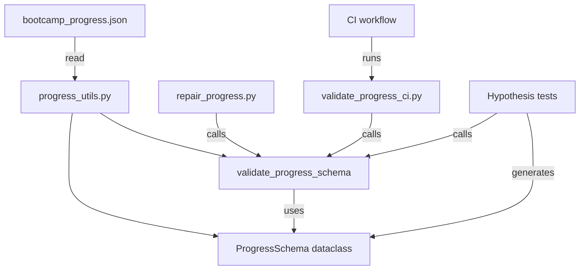

# Design Document: Progress File Schema Validation

## Overview

This feature adds a formal schema definition and validation layer for `config/bootcamp_progress.json`. The schema is defined as a Python dataclass in `progress_utils.py`, and the existing `validate_progress_schema` function is extended to validate all fields against it. A standalone CI script validates sample progress files on every PR. Property-based tests using Hypothesis verify round-trip serialization correctness and corruption detection.

### Design Decisions

1. **Dataclass over TypedDict**: A `@dataclass` with a `from_dict` classmethod provides runtime validation hooks and clear field documentation. TypedDict only provides static type checking.
2. **Extend existing function**: Rather than creating a new module, the existing `validate_progress_schema` in `progress_utils.py` is extended. This preserves the import path used by all consumers (repair tool, tests, hooks).
3. **Stdlib only**: No `jsonschema` library — validation is hand-written using `dataclasses`, `re`, and `datetime` from stdlib, per project conventions.
4. **Non-breaking**: All new fields are optional in validation. Legacy files with only `modules_completed`, `current_module`, `data_sources`, and `database_type` continue to validate cleanly.

## Architecture



### Data Flow

1. **Write path**: `write_checkpoint()` and `repair_progress.py --fix` produce progress dicts → call `validate_progress_schema()` before writing to disk.
2. **Read path**: `_read_progress()` loads JSON → consumers use the dict directly (no schema enforcement on read, only on write/CI).
3. **CI path**: `validate_progress_ci.py` loads a sample progress file → calls `validate_progress_schema()` → exits 0/1.
4. **Test path**: Hypothesis generates valid dicts from `st_progress_file()` strategy → tests round-trip and validation properties.

## Components and Interfaces

### 1. `ProgressSchema` Dataclass (`progress_utils.py`)

```python
@dataclass
class ProgressSchema:
    """Canonical schema for bootcamp_progress.json."""
    current_module: int  # 1–11
    modules_completed: list[int]  # each 1–11
    data_sources: list[str]
    database_type: str
    # Optional fields (backward-compatible)
    current_step: int | str | None = None
    track: str | None = None  # quick_demo | core_bootcamp | advanced_topics
    preferences: dict[str, str | bool] | None = None
    session_id: str | None = None
    started_at: str | None = None  # ISO 8601
    last_activity: str | None = None  # ISO 8601
    step_history: dict[str, dict] | None = None
```

The dataclass serves as documentation and as the basis for the Hypothesis strategy. It does NOT enforce validation itself — that remains in `validate_progress_schema()`.

### 2. `validate_progress_schema()` (extended)

The existing function is extended to validate all fields defined in `ProgressSchema`:

```python
def validate_progress_schema(data: dict) -> list[str]:
    """Validate a progress dict against the full schema.
    
    Returns an empty list when valid, or a list of human-readable error strings.
    Never short-circuits — all fields are checked.
    """
```

**New validations added:**
- `current_module`: type check (int) + range check (1–11)
- `modules_completed`: type check (list) + element range check (1–11)
- `track`: enum check against allowed values
- `preferences`: type check (dict) + key/value type checks
- `session_id`: type check (str) + non-empty check
- `started_at` / `last_activity`: ISO 8601 format check
- `data_sources`: type check (list of str)
- `database_type`: type check (str)

**Preserved validations** (already exist):
- `current_step`: int | str (sub-step format) | None
- `step_history`: dict with int-string keys 1–12, entries with `last_completed_step` and `updated_at`

### 3. `validate_progress_ci.py` (new script)

```python
#!/usr/bin/env python3
"""CI script: validate bootcamp_progress.json schema.

Usage:
    python senzing-bootcamp/scripts/validate_progress_ci.py [path]

Exits 0 on success, 1 on validation failure.
"""
```

- Accepts an optional path argument (defaults to `config/bootcamp_progress.json`)
- If the file doesn't exist, validates a built-in minimal sample to confirm schema consistency
- Prints errors to stderr, success message to stdout
- Integrates into `.github/workflows/validate-power.yml`

### 4. Repair Tool Integration (`repair_progress.py`)

The `main()` function in `repair_progress.py` is modified to:
1. After constructing the progress dict, call `validate_progress_schema(prog)`
2. If errors are returned, print them to stderr and `sys.exit(1)` without writing
3. Only write the file if validation passes

## Data Models

### Progress File Schema (complete field reference)

| Field | Type | Required | Constraints |
|-------|------|----------|-------------|
| `current_module` | `int` | Yes | 1–11 |
| `modules_completed` | `list[int]` | Yes | Each element 1–11 |
| `data_sources` | `list[str]` | Yes | — |
| `database_type` | `str` | Yes | — |
| `current_step` | `int \| str \| None` | No | str must match `^\d+\.\d+$` or `^\d+[a-zA-Z]$` |
| `track` | `str` | No | `quick_demo` \| `core_bootcamp` \| `advanced_topics` |
| `preferences` | `dict[str, str\|bool]` | No | Keys: str, Values: str or bool |
| `session_id` | `str` | No | Non-empty |
| `started_at` | `str` | No | Valid ISO 8601 |
| `last_activity` | `str` | No | Valid ISO 8601 |
| `step_history` | `dict[str, dict]` | No | Keys: str of int 1–12; values have `last_completed_step` + `updated_at` |

### Required vs Optional (Backward Compatibility)

**Required fields** (must be present for validation to pass):
- `current_module`, `modules_completed`, `data_sources`, `database_type`

**Optional fields** (absence produces no error):
- All others. This ensures legacy files with only the four required fields validate cleanly.

## Correctness Properties

*A property is a characteristic or behavior that should hold true across all valid executions of a system — essentially, a formal statement about what the system should do. Properties serve as the bridge between human-readable specifications and machine-verifiable correctness guarantees.*

### Property 1: JSON Round-Trip Serialization

*For any* valid progress file dict generated from the schema, serializing it to JSON with `json.dumps` and deserializing back with `json.loads` SHALL produce a dict equal to the original.

**Validates: Requirements 5.1**

### Property 2: Valid Dicts Validate Cleanly

*For any* valid progress file dict generated from the schema (with all field constraints satisfied), `validate_progress_schema` SHALL return an empty error list.

**Validates: Requirements 2.1, 5.2**

### Property 3: Corrupted Dicts Are Detected

*For any* valid progress file dict that has been corrupted by replacing a field's value with an invalid type or out-of-range value, `validate_progress_schema` SHALL return a non-empty error list containing at least one error string that identifies the corrupted field.

**Validates: Requirements 2.2, 2.3, 2.4, 2.5, 2.6, 2.8, 5.3**

### Property 4: Backward Compatibility Under Field Removal

*For any* valid progress file dict and any subset of optional fields (`track`, `preferences`, `session_id`, `started_at`, `last_activity`, `step_history`, `current_step`), removing those fields from the dict SHALL result in `validate_progress_schema` returning an empty error list.

**Validates: Requirements 2.7, 3.1, 3.2**

## Error Handling

### Validation Errors

- Each error is a human-readable string identifying the field name, the expected constraint, and (where applicable) the actual value.
- Format: `"{field_name} must be {constraint}, got {actual}"` or `"{field_name} value {value} is out of range {range}"`.
- All errors are collected (no short-circuiting) and returned as a list.

### CI Script Errors

- Non-zero exit code (1) when validation fails.
- Each error printed to stderr on its own line.
- Exit code 0 with "Schema validation passed" to stdout on success.

### Repair Tool Errors

- If the reconstructed dict fails validation, errors are printed to stderr.
- The file is NOT written.
- Exit code 1.
- Message: `"Repair aborted: reconstructed progress file fails schema validation"`.

## Testing Strategy

### Property-Based Tests (Hypothesis)

**Library**: `hypothesis` with `@settings(max_examples=100)`

**Test file**: `senzing-bootcamp/tests/test_progress_schema_validation_properties.py`

Four property tests corresponding to the four correctness properties above:

1. **Round-trip serialization** — Generate valid dicts, serialize/deserialize, assert equality.
2. **Valid dicts validate** — Generate valid dicts, call validator, assert empty errors.
3. **Corruption detection** — Generate valid dicts, corrupt a field, call validator, assert non-empty errors mentioning the field.
4. **Backward compatibility** — Generate valid dicts, remove random optional fields, call validator, assert empty errors.

**Hypothesis strategies**:
- `st_progress_file()`: Generates fully valid progress dicts with all constraints satisfied.
- `st_corrupted_progress_file()`: Takes a valid dict and corrupts one field.
- `st_optional_field_subset()`: Generates random subsets of optional field names.

Each test is tagged: `Feature: progress-file-schema-validation, Property {N}: {title}`

### Unit Tests

**Test file**: `senzing-bootcamp/tests/test_progress_schema_validation_unit.py`

- Specific examples for each error message format (Requirements 2.2–2.6)
- Legacy file examples (Requirements 3.2, 3.3)
- CI script exit code tests (Requirements 4.1–4.4)
- Repair tool integration tests (Requirements 7.1, 7.2)

### Integration Tests

- Existing `test_progress_utils.py` must continue to pass unchanged (Requirement 6.3)
- CI workflow runs the new validation script
