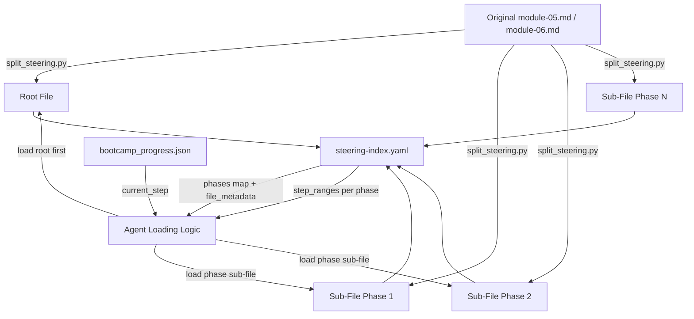

# Design Document: Progressive Context Loading

## Overview

Modules 5 (5,355 tokens) and 6 (9,176 tokens) are the largest steering files in the bootcamp. Currently the agent loads the entire file when a user enters the module, consuming a disproportionate share of the context budget in one operation. This design splits those two files into phase-level sub-files and updates the steering index and agent loading instructions so the agent loads only the phase relevant to the current workflow step.

The approach is conservative: the original file paths remain as "root files" containing shared preamble and a manifest, while new sub-files hold the phase content. No module content changes — only the file boundaries and metadata move.

### Key Design Decisions

1. **Root file stays at original path** — existing cross-references from other steering files resolve without changes.
2. **Sub-files live alongside root files in `steering/`** — no new directories, consistent with the flat steering file layout.
3. **A Python splitting script performs the split** — deterministic, testable, and re-runnable. The script parses phase boundaries from the markdown, writes root + sub-files, and updates `steering-index.yaml`.
4. **`measure_steering.py` is extended** (not replaced) to handle sub-file metadata — the existing token counting and index update logic is reused.
5. **Step-to-phase mapping is added to `steering-index.yaml`** — the agent uses this to determine which sub-file to load for a given checkpoint step.

## Architecture



The agent's loading flow for a split module:

1. Read `steering-index.yaml` to check if the module has a `phases` entry.
2. If yes, load the root file (preamble + manifest).
3. Determine the current phase from `bootcamp_progress.json` `current_step` using the `step_ranges` in the phases map.
4. Load only the sub-file for that phase.
5. On phase transition, unload the previous sub-file and load the next.

## Components and Interfaces

### 1. `split_steering.py` — Splitting Script

**Location:** `senzing-bootcamp/scripts/split_steering.py`

**Purpose:** Splits a module steering file into a root file and phase-level sub-files. Updates `steering-index.yaml` with the new metadata.

**Interface:**

```python
def parse_phases(content: str) -> tuple[str, list[Phase]]:
    """Parse a module steering file into preamble and phases.
    
    Args:
        content: Full markdown content of the module steering file.
    
    Returns:
        Tuple of (preamble_text, list_of_Phase_objects).
        preamble_text includes everything before the first phase heading.
        Each Phase has: name, slug, content, step_range (start, end).
    """

def build_root_file(front_matter: str, preamble: str, phases: list[Phase], sub_file_paths: list[str]) -> str:
    """Build the root file content with preamble and manifest.
    
    Args:
        front_matter: YAML front matter string (e.g., "---\ninclusion: manual\n---").
        preamble: Shared preamble text (title, purpose, prerequisites, before/after).
        phases: List of Phase objects for manifest generation.
        sub_file_paths: List of sub-file filenames for the manifest.
    
    Returns:
        Complete root file content as a string.
    """

def build_sub_file(front_matter: str, phase: Phase) -> str:
    """Build a sub-file for a single phase.
    
    Args:
        front_matter: YAML front matter string.
        phase: Phase object containing the phase content.
    
    Returns:
        Complete sub-file content as a string.
    """

def split_module(module_path: Path, output_dir: Path, sub_file_names: list[str]) -> SplitResult:
    """Split a module file into root + sub-files.
    
    Args:
        module_path: Path to the original module steering file.
        output_dir: Directory to write root and sub-files.
        sub_file_names: Expected sub-file names for each phase.
    
    Returns:
        SplitResult with root_path, sub_file_paths, and phase metadata.
    """

def update_steering_index(index_path: Path, module_number: int, split_result: SplitResult) -> None:
    """Update steering-index.yaml with phase metadata for a split module.
    
    Adds a `phases` map under the module entry, updates `file_metadata`
    with root + sub-file entries, removes the original monolithic entry,
    and recalculates `budget.total_tokens`.
    """
```

**Data structures:**

```python
@dataclass
class Phase:
    name: str           # e.g., "Phase 1 — Quality Assessment"
    slug: str           # e.g., "phase1-quality-assessment"
    content: str        # Complete phase markdown content
    step_start: int     # First checkpoint step number in this phase
    step_end: int       # Last checkpoint step number in this phase

@dataclass
class SplitResult:
    root_path: Path
    sub_files: list[Path]
    phases: list[Phase]
    root_token_count: int
    sub_file_token_counts: list[int]
```

### 2. Steering Index Schema Extensions

**New fields in `steering-index.yaml`:**

```yaml
modules:
  5:
    root: module-05-data-quality-mapping.md
    phases:
      phase1-quality-assessment:
        file: module-05-phase1-quality-assessment.md
        token_count: 2800
        size_category: large
        step_range: [1, 7]
      phase2-data-mapping:
        file: module-05-phase2-data-mapping.md
        token_count: 1900
        size_category: medium
        step_range: [8, 20]
      phase3-test-load:
        file: module-05-phase3-test-load.md
        token_count: 600
        size_category: medium
        step_range: [21, 26]

budget:
  total_tokens: 74725
  reference_window: 200000
  warn_threshold_pct: 60
  critical_threshold_pct: 80
  split_threshold_tokens: 5000
```

For non-split modules, the existing format (`5: module-05-data-quality-mapping.md`) is preserved as-is. Split modules use the expanded object format with `root` and `phases`.

### 3. Agent Instructions Updates

**Module Steering section** — add phase-level loading rules:

- When entering a split module, load the root file first (preamble + manifest).
- Determine the current phase from `bootcamp_progress.json` `current_step` using the `step_ranges` in `steering-index.yaml`.
- Load only the sub-file for the current phase.
- On phase transition (step crosses a phase boundary), unload the previous sub-file and load the next.
- If a sub-file is missing, fall back to loading the root file and log a warning.

**Context Budget section** — reference the `phases` metadata:

- For split modules, use the phase-level `token_count` from `steering-index.yaml` `phases` entries instead of the monolithic file count.
- The root file token count is always loaded; the phase sub-file token count is additive.

### 4. Step-to-Phase Mapping Logic

The agent (and the splitting script) must map checkpoint step numbers to phases. This mapping is derived from the steering file content:

**Module 5:**
| Phase | Steps | Sub-File |
|-------|-------|----------|
| Phase 1 — Quality Assessment | 1–7 | `module-05-phase1-quality-assessment.md` |
| Phase 2 — Data Mapping | 8–20 | `module-05-phase2-data-mapping.md` |
| Phase 3 — Test Load | 21–26 | `module-05-phase3-test-load.md` |

**Module 6:**
| Phase | Steps | Sub-File |
|-------|-------|----------|
| Phase A — Build Loading Program | 1–3 | `module-06-phaseA-build-loading.md` |
| Phase B — Load First Source | 4–10 | `module-06-phaseB-load-first-source.md` |
| Phase C — Multi-Source Orchestration | 11–19 | `module-06-phaseC-multi-source.md` |
| Phase D — Validation | 20–27 | `module-06-phaseD-validation.md` |

The `step_range` arrays in `steering-index.yaml` encode this mapping. The agent reads `current_step` from `bootcamp_progress.json`, finds the phase whose `step_range` contains that step, and loads the corresponding sub-file.

### 5. Session Resume Integration

`session-resume.md` already reads `current_step` from `bootcamp_progress.json`. The updated `agent-instructions.md` will instruct the agent to:

1. Check if the current module has a `phases` entry in `steering-index.yaml`.
2. If yes, use `current_step` to determine the phase and load only that sub-file.
3. If `current_step` is absent or doesn't fall within any phase's `step_range`, load the root file only.

## Data Models

### Phase Metadata (in steering-index.yaml)

```yaml
# Per-phase entry under modules.{N}.phases
phase_key:                    # slug identifier, e.g., "phase1-quality-assessment"
  file: string                # sub-file filename
  token_count: integer        # approximate token count (chars / 4)
  size_category: string       # "small" | "medium" | "large"
  step_range: [int, int]      # inclusive [start_step, end_step]
```

### SplitResult (Python dataclass)

```python
@dataclass
class SplitResult:
    root_path: Path                    # Path to the written root file
    sub_files: list[Path]              # Paths to written sub-files
    phases: list[Phase]                # Phase metadata
    root_token_count: int              # Token count of root file
    sub_file_token_counts: list[int]   # Token counts of each sub-file
```

### Module Entry Formats (steering-index.yaml)

```yaml
# Non-split module (unchanged)
modules:
  3: module-03-quick-demo.md

# Split module (new format)
modules:
  5:
    root: module-05-data-quality-mapping.md
    phases:
      phase1-quality-assessment:
        file: module-05-phase1-quality-assessment.md
        token_count: 2800
        size_category: large
        step_range: [1, 7]
```

## Correctness Properties

*A property is a characteristic or behavior that should hold true across all valid executions of a system — essentially, a formal statement about what the system should do. Properties serve as the bridge between human-readable specifications and machine-verifiable correctness guarantees.*

### Property 1: Content Preservation Round-Trip

*For any* valid module steering file with phase headings, splitting it into a root file and sub-files and then concatenating the preamble from the root file with all sub-file phase contents should produce text that contains every line of instructional content from the original file, with no omissions or additions.

**Validates: Requirements 1.6, 2.6**

### Property 2: Sub-File YAML Front Matter Invariant

*For any* sub-file produced by the splitting script, the sub-file content shall begin with YAML front matter containing `inclusion: manual`.

**Validates: Requirements 1.5, 2.5**

### Property 3: Steering Index Metadata Consistency After Split

*For any* module that has been split, the steering index shall contain a `phases` map with entries for each sub-file (including `token_count` and `size_category`), `file_metadata` entries for the root file and each sub-file, and no `file_metadata` entry for the original monolithic filename (when it differs from the root filename — in this design the root keeps the original name, so the entry is updated rather than removed).

**Validates: Requirements 3.1, 3.2, 3.3**

### Property 4: Total Tokens Sum Invariant After Split

*For any* set of file_metadata entries in the steering index after a split operation, `budget.total_tokens` shall equal the sum of all `token_count` values in `file_metadata`.

**Validates: Requirements 3.4**

### Property 5: Threshold-Based Splitting Eligibility

*For any* steering file whose `token_count` in `file_metadata` exceeds `budget.split_threshold_tokens`, that file shall be identified as a candidate for phase-level splitting. Files at or below the threshold shall not be flagged.

**Validates: Requirements 5.2**

### Property 6: Step-to-Phase Mapping Correctness

*For any* valid checkpoint step number within a split module's total step range, the step-to-phase mapping shall return exactly one phase whose `step_range` contains that step number, and the corresponding sub-file path shall be a valid entry in the steering index.

**Validates: Requirements 6.2**

### Property 7: Fallback Behavior When Sub-File Missing

*For any* sub-file path that does not exist on disk, the loading logic shall fall back to the root file path, which must exist.

**Validates: Requirements 6.3**

## Error Handling

| Scenario | Handling |
|----------|----------|
| Module file has no recognizable phase headings | `parse_phases` returns the entire content as preamble with an empty phases list. The script logs a warning and does not split. |
| Sub-file cannot be written (permissions, disk full) | `split_module` raises `IOError`. The original file is not modified. |
| `steering-index.yaml` is malformed or missing | `update_steering_index` raises a descriptive error. The split files are still written but the index is not updated. |
| `current_step` in progress file doesn't match any phase's `step_range` | Agent loads the root file only and logs a warning. |
| Sub-file missing at expected path during agent loading | Agent falls back to root file and logs a warning (Requirement 6.3). |
| `split_threshold_tokens` field missing from budget section | Agent treats all files as non-split (backward compatible). |
| Phase heading regex doesn't match expected pattern | `parse_phases` treats unrecognized headings as part of the preceding phase's content. The script logs which headings were recognized vs. skipped. |

## Testing Strategy

### Property-Based Tests (Hypothesis)

The feature is well-suited for property-based testing because the core operations (parsing, splitting, metadata generation, step mapping) are pure functions with clear input/output behavior and universal properties that hold across a wide input space.

**Library:** [Hypothesis](https://hypothesis.readthedocs.io/) (Python) — already used in the project.

**Configuration:** Minimum 100 iterations per property test (`@settings(max_examples=100)`).

**Tag format:** `Feature: progressive-context-loading, Property {N}: {title}`

Each of the 7 correctness properties above maps to a single property-based test:

| Property | Test Strategy |
|----------|---------------|
| P1: Content preservation | Generate random preamble + phase content, split, recombine, verify all original lines present |
| P2: Sub-file front matter | Generate random phase content, build sub-files, verify YAML front matter |
| P3: Index metadata consistency | Generate random phase metadata, update index, verify structure |
| P4: Total tokens sum | Generate random file metadata, update index, verify sum |
| P5: Threshold eligibility | Generate random token counts and thresholds, verify classification |
| P6: Step-to-phase mapping | Generate random step numbers within valid ranges, verify correct phase returned |
| P7: Fallback behavior | Generate random sub-file paths (some missing), verify fallback to root |

### Example-Based Unit Tests

| Test | What it verifies |
|------|-----------------|
| Module 5 sub-file names | Exact filenames: `module-05-phase1-quality-assessment.md`, `module-05-phase2-data-mapping.md`, `module-05-phase3-test-load.md` |
| Module 6 sub-file names | Exact filenames: `module-06-phaseA-build-loading.md`, `module-06-phaseB-load-first-source.md`, `module-06-phaseC-multi-source.md`, `module-06-phaseD-validation.md` |
| Root file YAML front matter | Both root files start with `---\ninclusion: manual\n---` |
| `split_threshold_tokens` exists | `steering-index.yaml` budget section contains the field |
| Root files at original paths | `module-05-data-quality-mapping.md` and `module-06-load-data.md` remain at their original paths |
| `agent-instructions.md` updated | Module Steering section documents phase-level loading; Context Budget section references phases metadata |

### Integration Tests

| Test | What it verifies |
|------|-----------------|
| End-to-end split of real Module 5 | Split the actual file, verify 3 sub-files + root, verify `measure_steering.py --check` passes |
| End-to-end split of real Module 6 | Split the actual file, verify 4 sub-files + root, verify `measure_steering.py --check` passes |
| Steering index consistency after split | Run `measure_steering.py --check` after splitting — no mismatches |
