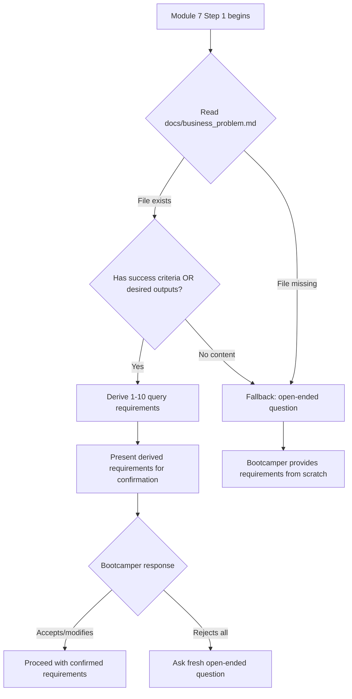

# Design Document: Query Requirements Context

## Overview

This feature modifies Module 7 Step 1 in the bootcamp steering file so the agent reads the business problem document (`docs/business_problem.md`) created in Module 1 before asking the bootcamper about query requirements. Instead of starting with an open-ended question, the agent derives query requirements from the bootcamper's previously-stated success criteria and desired outputs, presents them for confirmation, and only falls back to the open-ended question when the document is missing or lacks usable content.

The change is entirely within the steering file `senzing-bootcamp/steering/module-07-query-visualize-discover.md`. No new scripts or runtime code are needed — the deliverable is updated Markdown instructions that govern agent behavior.

### Design Rationale

The bootcamp already produces `docs/business_problem.md` in Module 1 Phase 2 (Step 12). This document contains structured sections including "Success Criteria" and "Desired Output" that directly inform what queries the bootcamper needs. By reading this artifact first, the agent:

1. Demonstrates continuity across modules (builds trust)
2. Reduces bootcamper effort (no repeating themselves)
3. Produces better-targeted query requirements (grounded in stated goals)

## Architecture

The architecture is simple — this is a steering file modification with no new components:



### Steering File Structure (Step 1 replacement)

The current Step 1 in `module-07-query-visualize-discover.md`:

```markdown
1. **Define query requirements**:
   Ask: "What questions do you need to answer with your data?"
```

Will be replaced with a multi-path instruction block that:
1. Reads the business problem document
2. Branches based on content availability
3. Either derives and presents requirements, or falls back to the open-ended question

## Components and Interfaces

### Component: Module 7 Step 1 Steering Instructions

**File:** `senzing-bootcamp/steering/module-07-query-visualize-discover.md`

**Interface:** The steering file instructs the agent via natural language directives. The agent interprets these instructions to determine its behavior.

**Key instruction blocks:**

| Block | Purpose | Trigger |
|-------|---------|---------|
| Read instruction | Agent reads `docs/business_problem.md` | Always (first action in Step 1) |
| Content check | Agent evaluates if success criteria or desired outputs exist | After successful read |
| Derivation instruction | Agent derives query requirements from document content | Content available |
| Presentation instruction | Agent presents derived requirements with attribution | After derivation |
| Confirmation prompt | Agent asks bootcamper to confirm/modify/add | After presentation |
| Rejection handler | Agent asks fresh question without referencing rejected items | Bootcamper rejects all |
| Fallback instruction | Agent asks open-ended question | File missing or empty sections |

### Business Problem Document Structure (Input)

The agent parses `docs/business_problem.md` looking for these sections (as defined in Module 1 Phase 2):

```markdown
## Success Criteria
- [Measurable outcome 1]
- [Measurable outcome 2]
- [Measurable outcome 3]

## Desired Output
**Format**: [Master list / API / Reports / Database export]
**Use case**: [One-time / Ongoing / Real-time]
**Integration**: [Standalone / Integrated with [systems]]
```

The agent considers the document "usable" if at least one bullet under Success Criteria exists OR the Desired Output section has non-empty content.

## Data Models

No new data models are introduced. The feature operates on existing artifacts:

### Input: Business Problem Document

| Field | Type | Source |
|-------|------|--------|
| Success Criteria | List of strings (bullet items) | `docs/business_problem.md` § Success Criteria |
| Desired Output Format | String | `docs/business_problem.md` § Desired Output → Format |
| Desired Output Use Case | String | `docs/business_problem.md` § Desired Output → Use case |
| Desired Output Integration | String | `docs/business_problem.md` § Desired Output → Integration |

### Output: Derived Query Requirements

| Field | Type | Description |
|-------|------|-------------|
| Query requirement | String | A question the bootcamper needs to answer with their data |
| Source attribution | String | Which success criterion or desired output this derives from |

### Constraints

- Derived requirements count: 1–10 (bounded to avoid overwhelming the bootcamper)
- Each derived requirement must trace to a specific success criterion or desired output
- Attribution sentence format: "Based on your business problem from Module 1, here are the query requirements I've derived:"

## Correctness Properties

*A property is a characteristic or behavior that should hold true across all valid executions of a system — essentially, a formal statement about what the system should do. Properties serve as the bridge between human-readable specifications and machine-verifiable correctness guarantees.*

### Property 1: Read-before-interact ordering

*For any* valid Module 7 Step 1 steering content, the instruction to read `docs/business_problem.md` SHALL appear before any pointing question (👉), "Ask:" directive, or bootcamper interaction prompt in the step's primary flow.

**Validates: Requirements 1.1, 3.1, 3.5**

### Property 2: Derivation bounds and traceability

*For any* business problem document containing N success criteria and M desired output fields (where N + M ≥ 1), the derivation logic SHALL produce between 1 and 10 query requirements, and each derived requirement SHALL reference at least one source criterion or desired output.

**Validates: Requirements 1.2**

### Property 3: Fallback on missing or empty content

*For any* state where `docs/business_problem.md` does not exist, OR exists but contains zero success criteria AND zero desired output content, the system SHALL signal the fallback path (open-ended question) rather than the derivation path.

**Validates: Requirements 2.1, 2.2**

### Property 4: Derive when content is available

*For any* business problem document that contains at least one success criterion OR at least one non-empty desired output field, the system SHALL signal the derivation path (not the fallback path).

**Validates: Requirements 2.3**

## Error Handling

| Scenario | Handling |
|----------|----------|
| `docs/business_problem.md` does not exist | Fallback to open-ended question; no mention of missing file |
| Document exists but is empty (0 bytes) | Treat as "no success criteria and no desired outputs" → fallback |
| Document exists but has malformed Markdown | Agent best-effort parses; if no sections found → fallback |
| Bootcamper rejects all derived requirements | Agent asks fresh open-ended question without referencing rejected items |
| Document has success criteria but no desired outputs (or vice versa) | Derive from whatever is available |

The fallback path must never reference Module 1, prior steps, or missing documents. It should phrase the question as forward-looking: "What questions do you need to answer with your data?"

## Testing Strategy

### Property-Based Tests (Hypothesis)

Property-based testing applies to this feature because:
- The parsing/extraction logic has clear input/output behavior (document content → derivation signal or fallback signal)
- There are universal properties that hold across a wide range of inputs (any document with content → derive; any empty/missing → fallback)
- The input space is large (arbitrary Markdown documents with varying section content)

**Library:** Hypothesis (Python)
**Location:** `senzing-bootcamp/tests/test_query_requirements_context_properties.py`
**Configuration:** Minimum 100 examples per property test

Each property test will:
- Generate random business problem documents using Hypothesis strategies
- Parse them using the same logic the steering file describes
- Verify the correctness properties hold

**Tag format:** `Feature: query-requirements-context, Property {number}: {property_text}`

### Unit Tests (Example-Based)

**Location:** `senzing-bootcamp/tests/test_query_requirements_context_unit.py`

| Test | Validates |
|------|-----------|
| Steering file Step 1 contains read instruction before any question | Req 1.1, 3.1 |
| Steering file primary path includes derivation instructions | Req 1.2, 3.2 |
| Steering file includes confirmation phrasing ("add or change") | Req 1.3, 3.3 |
| Steering file includes attribution example sentence | Req 1.4 |
| Steering file includes rejection handler without back-references | Req 1.5 |
| Steering file fallback path does not mention Module 1 or missing docs | Req 2.4 |
| Steering file fallback path is conditional (IF missing/empty) | Req 3.4 |
| Open-ended question retained only as fallback, not primary path | Req 3.5 |

### Integration Tests

| Test | Validates |
|------|-----------|
| Full steering file passes existing structural validators (frontmatter, checkpoints, STOP markers) | Structural integrity after modification |
| Module 7 entry in steering-index.yaml still resolves correctly | No regression in module resolution |
