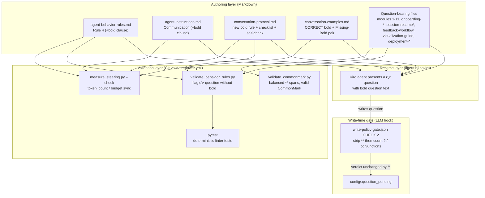

# Design Document

## Overview

This feature adds a second, additive visual cue to every question the agent poses to a bootcamper: the **question text is rendered in bold** (CommonMark strong emphasis, `**...**`). The existing 👉 `Pointer_Indicator` convention (defined in `agent-behavior-rules.md` Rule 4) is preserved unchanged — bold is layered on top of it, never as a replacement.

The change is deliberately narrow in behavior but broad in reach. There is almost no new runtime logic: the agent is a language model steered by Markdown, so "make questions bold" is primarily a documentation change across the authoritative steering files plus every file that carries a literal 👉 question example. The parts that *are* code — the behavior-rules validator, the token-budget measurer, the CommonMark check, and the write-policy-gate hook — are touched only to (a) enforce the new convention and (b) prove the new markers do not perturb existing guarantees.

The design touches six concerns:

1. **Steering rule documentation** — state the bold-question rule in the four authoritative steering files (`agent-behavior-rules.md`, `agent-instructions.md`, `conversation-protocol.md`, `conversation-examples.md`), including the Pre-Output Validation Checklist and Self-Check.
2. **Canonical examples** — update the CORRECT examples to show bold, and add a Missing-Bold WRONG/CORRECT pair.
3. **Consistent application** — apply bold to every literal 👉 question example across modules 1–11 and the other question-bearing steering files.
4. **Write-policy-gate compatibility** — make the single-question validation (CHECK 2) strip bold markers before counting question marks and detecting conjunctions, so verdicts are unchanged.
5. **CommonMark validity** — every bold span is a single, balanced, correctly-closed `**...**` pair that stays within one paragraph.
6. **Automated validation + budget sync** — extend `validate_behavior_rules.py` to flag a 👉 question whose text is not bold, and re-sync `steering-index.yaml` token counts via `measure_steering.py`.

The design is grounded in the real workspace: file paths, function names, the CI pipeline (`.github/workflows/validate-power.yml`), and the existing test conventions in `senzing-bootcamp/tests/` are all referenced directly.

## Architecture

The bold-question convention is enforced through four layers that already exist in the power. This feature threads the new rule through each layer rather than introducing a new subsystem.



**Layer responsibilities**

- **Authoring layer** is the source of truth. The agent's behavior is a product of what the steering files say. Changing behavior = changing these files.
- **Runtime layer** is the agent applying the documented rule when it composes a turn.
- **Write-time gate** is the `PreToolUse` hook that fires when `config/.question_pending` is written. It is an LLM-prompt hook (`action.type: "agent"`), so the "code" here is the natural-language instruction in `write-policy-gate.json`.
- **Validation layer** is CI. `validate-power.yml` runs, in order: `validate_power.py`, `measure_steering.py --check`, `validate_commonmark.py`, `sync_hook_registry.py --verify`, then `pytest`. This feature extends `validate_behavior_rules.py` (invoked by the test suite / `validate_power.py`) and relies on the existing `measure_steering.py` and `validate_commonmark.py` behavior.

**Sequencing constraint.** Because the extended validator flags *any* 👉 question that lacks bold, all question-bearing files must be updated **before** the validator change is activated, or CI will go red on the not-yet-converted files. The task breakdown must convert content first, then enable enforcement, then re-sync token counts.

## Components and Interfaces

### 1. `agent-behavior-rules.md` — Rule 4 (Consistent Pointer Indicator)

`inclusion: auto`. Rule 4 currently requires the 👉 prefix. Add a clause stating that the question text of every leading question is wrapped in bold **in addition to** the 👉 prefix (not as a replacement).

- **Interface:** prose rule text. No structural change to headings (the unit test `test_file_has_four_rule_sections` asserts `## Rule 1`–`## Rule 4` still exist).
- **Addresses:** R2.1, R4.1.

### 2. `agent-instructions.md` — Communication section

`inclusion: always`. The Communication bullet that currently says "Prefix input-required questions with 👉" gains a clause: every input-requiring prompt is prefixed with 👉 **and** has its question text wrapped in bold.

- **Interface:** prose. This file is always-loaded, so token cost is budget-sensitive (see Data Models → Token budget).
- **Addresses:** R4.2.

### 3. `conversation-protocol.md` — new bold rule, checklist item, self-check item

`inclusion: auto`. Three distinct edits:

- A **new, separately identifiable rule** (its own heading, e.g. `## Bold Question Text`) stating: the question text of a leading question is wrapped in bold; bold is additive to and does not replace the 👉 pointer; in a choice question the bold applies only to the lead question while numbered options stay plain; bold is presentational and does not change the One Question Rule; the question count per turn is driven by 👉 occurrences and is unaffected by bold markers; the 🛑 STOP marker stays plain.
- A **new Pre-Output Validation Checklist item** requiring confirmation, before output, that the closing question's text is wrapped in bold.
- A **new Self-Check item** requiring verification that the closing question renders its text in bold.
- Update the embedded CORRECT examples (e.g. the `Sub-Step Completion (CORRECT)`, `Choice Formatting`, `Rewrite Examples` CORRECT blocks) to show bold on the lead/question text.

- **Interface:** prose + Markdown blockquote examples.
- **Addresses:** R1.1, R1.3, R2.2, R3.4, R3.5, R4.3, R4.4, R4.5, R5.2, R7.1, R7.3, R7.5.

### 4. `conversation-examples.md` — canonical examples

`inclusion: manual`. Update every CORRECT non-choice example so the question text is bold with 👉 retained on the same line. For CORRECT choice examples, bold the lead question and keep numbered options plain. Add a **Missing-Bold** example pair whose two members differ *only* in the presence of bold:

```markdown
## Missing-Bold (WRONG)

> 👉 What language would you like to use?

## Missing-Bold (CORRECT)

> 👉 **What language would you like to use?**
```

- **Interface:** Markdown blockquote examples grouped under `(WRONG)` / `(CORRECT)` headings — the same convention already used throughout the file.
- **Addresses:** R5.1, R5.3, R5.4.

### 5. Question-bearing steering files — literal example conversion

Every file that contains a literal 👉 question example gets bold applied to the question text, with the 👉 retained immediately preceding it. Scope (from `steering-index.yaml`): `module-01-*` … `module-11-*`, `onboarding-flow.md`, `onboarding-phase1b-intro-language.md`, `onboarding-phase2-track-setup.md`, `session-resume*.md`, `feedback-workflow.md`, `visualization-guide.md`, `deployment-aws.md`/`-azure.md`/`-gcp.md`/`-onpremises.md`/`-kubernetes.md`, and any other file whose lines start with 👉.

Canonical transformation (bold wraps the entire question text from first through last character, including any surrounding quotes the example uses and the terminal `?`):

```text
before:  👉 "Do you already have a Senzing license?"
after:   👉 **"Do you already have a Senzing license?"**
```

Choice question (lead bold, options plain):

```text
👉 **What would you like to do next?**

1. Create a one-page executive summary
2. Move on to Module 2
```

Soft-wrapped question (single balanced span across the paragraph, opening after 👉 on the first line and closing on the last line, never crossing a blank line or a numbered-list boundary — R8.3):

```text
> 👉 **Will the entity resolution results need to interface with other
> software — for example, a CRM, search engine, data warehouse, or
> downstream application?**
```

- **Interface:** Markdown. No headings or step numbering change.
- **Addresses:** R1.2, R1.4, R1.5, R2.3, R3.1, R3.2, R3.3, R11.1, R11.2, R11.3.

### 6. `write-policy-gate.json` — CHECK 2 (single-question enforcement)

The hook is a `PreToolUse` LLM-prompt hook (`matcher: "fs_write|str_replace|fs_append"`, `action.type: "agent"`). Its "logic" is the natural-language prompt. CHECK 2 validates content written to `config/.question_pending`.

Add one instruction at the top of CHECK 2: **before** evaluating rules 1–5 (exactly one question mark, no joining conjunctions, no appended alternatives, unambiguous yes/no, no follow-up-after-confirmation), remove all bold-emphasis markers (`**`) from the question content and run all counting/detection on that marker-stripped wording. Everything else in CHECK 2 — including the existing `⚠️ COMPOUND QUESTION DETECTED` output format — is unchanged.

- **Rationale for correctness:** `**` markers contain no `?` and no conjunction words, and they act as word boundaries, so stripping them cannot change the question-mark count or the `\bor\b`-style conjunction matches. Stripping is therefore verdict-preserving by construction; the instruction makes the invariance explicit and future-proof.
- **Registry sync:** because the hook prompt text changes, run `sync_hook_registry.py` after the edit so `sync_hook_registry.py --verify` (a CI step) stays green.
- **Interface:** JSON string (the `then`/`action.prompt` value). Schema (`version`, `hooks[].name/trigger/matcher/action`) is unchanged.
- **Addresses:** R6.1, R6.2, R6.3, R6.4.

### 7. `validate_behavior_rules.py` — bold-question detection

Extend the existing validator (which currently checks Rule 1 pause language in `validate_steering_file`) with a Rule 4 bold check. Reuse the existing `has_pointer_prefix()` helper and the `Violation` dataclass.

New / changed functions (stdlib only, Python 3.11+, type-hinted, Google-style docstrings, per Python conventions):

- `strip_bold(text: str) -> str` — remove paired `**...**` markers, returning the underlying wording. Shared helper mirroring the gate's strip step; also useful in tests.
- `question_text_is_bold(question_text: str) -> bool` — return True iff the reconstructed question text is a single balanced `**...**` span covering its entire (whitespace-trimmed) content: it starts with `**`, ends with `**`, and contains no other unbalanced/extra `**` between them. Italic (`*...*`), partial bold, and unbalanced markers return False.
- `extract_question_block(lines: list[str], index: int) -> tuple[str, int]` — reconstruct a possibly soft-wrapped question. Starting at a 👉 line, strip the blockquote marker (`>`), any list marker, and leading whitespace, take the text after `👉 `, then append following lines that belong to the same paragraph/blockquote (same blockquote depth, non-blank, not a new heading, not a numbered list item, not a fenced-code fence, not a new 👉) until a boundary. Returns the joined question text and the index of the last consumed line.
- `is_negative_example_context(lines: list[str], index: int) -> bool` — walk backward to the nearest Markdown heading; return True if that heading text contains `WRONG` (case-insensitive). Negative examples are intentionally un-bolded and must not be flagged (this is what lets the Missing-Bold WRONG example and every other `(WRONG)` example coexist with the validator).
- Extend `validate_steering_file(path)` to: track fenced-code-block state (skip fenced content); for each line where `has_pointer_prefix()` is True and the line is **not** in a negative-example context, call `extract_question_block()` then `question_text_is_bold()`; on failure append a `Violation(rule=4, line_number=..., message=...)` identifying the file (via the caller's per-file print) and the offending question snippet.

Detection scope precisely honors R10.3: only lines that carry 👉 (start-of-line, after stripping blockquote/list markers/whitespace) are candidates; inline mentions like `"...: \"👉 Does that...\""` do not start with 👉 and are never flagged; option lines and prose are never flagged.

- **CLI:** unchanged (`--check`, file args, exit 0/1). `main()` already scans `steering/*.md` by default and prints `path:` then `Line N [Rule 4]: <message>` for each violation, then exits 1 if any exist — satisfying "identifies the offending file and question" and "non-passing result."
- **Addresses:** R10.1, R10.2, R10.3.

### 8. `measure_steering.py` — token/budget re-sync (no code change)

After all edits, run `python senzing-bootcamp/scripts/measure_steering.py` (update mode) to regenerate `file_metadata` and the `budget` block in `steering-index.yaml`. This makes each modified file's stored `token_count` exactly equal to `round(len(content)/4)` and makes `budget.total_tokens` exactly equal to the sum of per-file counts (the exact-equality check in `--check`). The always-loaded baseline (`agent-instructions.md`, `module-transitions.md`, `security-privacy.md`) stays far under the ceiling (see Data Models).

- **Interface:** existing CLI. No code change expected.
- **Addresses:** R9.1, R9.2, R9.3, R9.4, R9.5.

### 9. `validate_commonmark.py` — CommonMark check (no code change)

The existing markdownlint-based check runs over `senzing-bootcamp/**/*.md`. Balanced `**...**` spans that stay within a paragraph are valid CommonMark and pass. The bold-detector in `validate_behavior_rules.py` provides the stronger "single balanced span covering the whole question" guarantee that markdownlint does not specifically enforce.

- **Addresses:** R8.1, R8.2, R8.3, R8.4.

## Data Models

There is no persistent runtime data model for this feature; the "models" are the structural conventions the tooling operates on.

### Leading question (rendered form)

```text
<blockquote?><list-marker?>👉 <SPACE> ** <question-text> **
```

- `👉` (`U+1F449`) is at the start of the line (after optional blockquote `>` and/or list markers) and is **outside** the bold span.
- Exactly one space separates 👉 from the opening `**`.
- The bold span opens at the first character of the question text and closes at its last character (R1.2, R1.3).
- For a **choice question**, only this lead line is bold; the following numbered option lines carry no `**` (R3.1, R3.3).
- The 🛑 STOP marker, when present, is a separate line and stays plain (R7.5).

### `Violation` (existing dataclass, reused)

```python
@dataclass
class Violation:
    rule: int          # 4 for bold-question violations
    line_number: int   # line of the offending 👉 question
    message: str       # human-readable, includes the question snippet
```

### `steering-index.yaml` — `file_metadata` and `budget` (existing schema)

Per-file entry and budget block that `measure_steering.py` maintains:

```yaml
file_metadata:
  agent-instructions.md:
    token_count: <round(len(content)/4)>
    size_category: small | medium | large   # <500 | <=2000 | >2000
budget:
  total_tokens: <sum of all file_metadata token_count>
  reference_window: 200000
  warn_threshold_pct: 60
  always_loaded_ceiling_pct: 25
```

**Always-loaded budget headroom (computed from current values):**

- Warn threshold = `60% * 200000 = 120000` tokens.
- Always-loaded ceiling = `25% * 120000 = 30000` tokens.
- Always-loaded baseline footprint = `agent-instructions.md (4470) + module-transitions.md (1908) + security-privacy.md (278) = 6656` tokens.

Only `agent-instructions.md` gains content in this feature, and by a handful of tokens. The baseline stays an order of magnitude under the 30000-token ceiling, so R9.2/R9.5 pass with wide margin. The exact figures will be re-measured by `measure_steering.py`; the numbers above establish that the change cannot breach the budget.

## Correctness Properties

This feature is **not** a fit for property-based testing, so this section is intentionally omitted in favor of deterministic testing (see Testing Strategy for the full rationale and test plan). In brief:

- The bulk of the work is **documentation edits** (steering Markdown), a **natural-language prompt edit** (the write-policy-gate hook), and a **configuration re-sync** (`steering-index.yaml`). None of these have a "for all inputs X, property P(X) holds" shape.
- The one genuinely code-level addition — the bold-question detector in `validate_behavior_rules.py` — is a **deterministic linter**. The requirements deliberately specify deterministic tests for it: R10.4 and R10.5 mandate deterministic tests, and R10.5 defines *deterministic* as producing "identical results across repeated runs with no dependence on randomness, wall-clock time, or external state." That explicitly rules out randomized (Hypothesis) generation for this rule. As the requirements note, formatting presence does not vary meaningfully with generated input: a question either has a balanced bold span or it does not, and the interesting cases (missing bold, italic-not-bold, unbalanced markers, partial bold, choice options, soft-wrapped spans, negative-example exemption) are a small, enumerable set best covered by curated examples.

## Error Handling

- **Validator on malformed files.** `validate_steering_file()` already tolerates unreadable files (UTF-8 then latin-1 fallback, returns `[]` on failure) and empty content. The bold check inherits this: a file that cannot be read contributes no violations rather than crashing.
- **Unbalanced / partial bold.** `question_text_is_bold()` returns False for unbalanced (`**text`), italic-only (`*text*`), and partial (`**What** language?`) spans, producing a Rule 4 violation with the line number and question snippet. This is the primary failure mode the validator exists to catch (R10.1).
- **Negative examples.** Intentional `(WRONG)` examples (including the Missing-Bold WRONG member) are exempted via `is_negative_example_context()`. Without this exemption the validator would flag the very examples that teach the rule, and CI would be unable to go green — so the exemption is a correctness requirement, not a convenience.
- **Fenced code blocks.** Content inside ``` fences is skipped so illustrative code/output containing 👉 is not misread as a live leading question.
- **Write-policy-gate.** The gate's marker-stripping is verdict-preserving (see Component 6). If a bold-wrapped question genuinely violates the One Question Rule, the gate still emits its existing `⚠️ COMPOUND QUESTION DETECTED` output on the stripped wording (R6.4). If all checks pass, the gate stays silent (zero tokens) and the write proceeds, exactly as before.
- **CommonMark failure.** If a bad edit introduces invalid Markdown, `validate_commonmark.py` fails the CI documentation check, prints the offending files, and leaves file content unchanged (R8.4). The bold-detector independently fails `pytest` on unbalanced spans, giving two independent safety nets.
- **Token drift.** If `steering-index.yaml` is not re-synced after edits, `measure_steering.py --check` fails and names each mismatched file (per-file >10% tolerance) and/or reports the `budget.total_tokens` exact-equality mismatch (R9.4). The fix is to run update mode. If the always-loaded footprint ever exceeded the ceiling, the check would report the budget breach and list contributing files (R9.5) — not expected here given the headroom above.

## Testing Strategy

### Why deterministic, not property-based

Per the requirements (R10.4, R10.5) and the nature of the change, testing is deterministic and example-based. Hypothesis property tests are deliberately **not** used for the bold-question rule because R10.5 requires "no dependence on randomness." Property-based testing remains the right tool elsewhere in this repo (parsers, token math, schema round-trips), but "is this question's text wrapped in a balanced bold span?" is a linter check whose meaningful cases are finite and enumerable. The repo already contains precedent for deterministic steering-content and hook-content assertions (e.g. `test_agent_behavior_rules_unit.py`, `test_write_gate_guard.py`, `test_lint_steering_unit.py`), and this feature follows that pattern.

### Test placement and conventions

- Power tests live in `senzing-bootcamp/tests/`, class-based (`class TestFeatureName:`), importing scripts via the `sys.path` insert pattern already used across the suite.
- Tests are pure and deterministic: fixed input strings and fixed on-disk steering content, no randomness, no clock, no network.

### Deterministic unit tests — bold detector (`validate_behavior_rules.py`)

New file, e.g. `senzing-bootcamp/tests/test_bold_question_validation_unit.py`:

- **R10.4 (flags missing bold):** a 👉 question whose text lacks a balanced bold span produces a Rule 4 violation. Cases: no markers, italic-only (`*...*`), unbalanced (`**text`), partial bold.
- **R10.5 (accepts bold):** a 👉 question whose text is a single balanced `**...**` span produces no violation. Cases: plain bold, bold wrapping a quoted question, choice lead-question bold with plain numbered options, soft-wrapped multi-line span.
- **R10.3 (scope):** non-👉 lines (prose, headings, numbered options, inline `👉` mentions inside quotes, fenced-code content) never produce a bold violation.
- **Negative-example exemption:** a 👉 question under a `(WRONG)` heading is not flagged; the same text under a `(CORRECT)` heading is required to be bold.
- **`strip_bold` / `question_text_is_bold` helpers:** direct unit assertions on the enumerated shapes above.

### Deterministic integration tests — real steering content

New file, e.g. `senzing-bootcamp/tests/test_bold_question_steering.py`:

- Run `validate_steering_file()` (and/or the `--check` CLI) over the actual `steering/` directory and assert **zero** Rule 4 violations once conversion is complete (R11.1–R11.3, R1.x, R3.x).
- Assert the four authoritative files contain the required rule text: `agent-behavior-rules.md` Rule 4 bold clause (R4.1), `agent-instructions.md` Communication bold clause (R4.2), `conversation-protocol.md` distinct bold rule + checklist item + self-check item (R4.3–R4.5), and `conversation-examples.md` bold CORRECT examples + a Missing-Bold pair that differs only by `**` (R5.1, R5.3, R5.4).
- Assert `conversation-protocol.md` and `conversation-examples.md` render `🛑 STOP` plain (no bold on the STOP marker) (R7.5).

### Deterministic content tests — write-policy-gate hook

New file, e.g. `senzing-bootcamp/tests/test_write_gate_bold_strip.py`:

- Assert `write-policy-gate.json` CHECK 2 instructs stripping `**` before counting question marks / detecting conjunctions (R6.2).
- Assert the existing `⚠️ COMPOUND QUESTION DETECTED` output format and rules 1–5 remain present (R6.1, R6.4).
- (Optional reference-implementation test) if `strip_bold()` is shared, assert `strip_bold(q_with_bold) == strip_bold(q_without_bold)` for identical wording, demonstrating the verdict-preserving invariance behind R6.3.

### CommonMark and token-budget (existing CI checks)

- `validate_commonmark.py` over `senzing-bootcamp/**/*.md` reports zero errors after edits (R8.2); a deliberately malformed span fails it (R8.4) — covered by the existing check plus the bold-detector's balanced-span test.
- After edits, `measure_steering.py` update mode re-syncs `steering-index.yaml`; `measure_steering.py --check` then passes: per-file counts match and `budget.total_tokens` equals the sum (R9.1, R9.3), and the always-loaded footprint stays under the ceiling (R9.2). A test can assert `--check` exits 0 on the synced index (mirroring existing `test_measure_steering.py` / `test_steering_index_token_count_sync_*` patterns).

### CI pipeline

All of the above run under `.github/workflows/validate-power.yml`: `validate_power.py` → `measure_steering.py --check` → `validate_commonmark.py` → `sync_hook_registry.py --verify` → `pytest`. The feature is complete when this pipeline is green with the extended validator active and all question-bearing files converted.

### Requirements coverage summary

| Requirement | Test type | Where |
|---|---|---|
| R1.1, R1.3, R2.2, R3.4, R3.5, R7.1, R7.3 | Content assertion | `conversation-protocol.md` rule text |
| R1.2, R1.4, R1.5, R2.3, R3.1–R3.3, R11.1–R11.3 | Integration (validator over steering/) | bold detector = 0 violations |
| R2.1, R4.1 | Content assertion | `agent-behavior-rules.md` |
| R4.2 | Content assertion | `agent-instructions.md` |
| R4.3, R4.4, R4.5 | Content assertion | `conversation-protocol.md` |
| R5.1, R5.3, R5.4, R5.2 | Content assertion | `conversation-examples.md` / protocol examples |
| R6.1–R6.4 | Hook-content assertion (+ optional strip invariance) | `write-policy-gate.json` |
| R7.5 | Content assertion | STOP marker stays plain |
| R8.1–R8.4 | CommonMark check + balanced-span unit test | `validate_commonmark.py`, detector |
| R9.1–R9.5 | Budget sync check | `measure_steering.py --check` |
| R10.1, R10.2, R10.3 | Deterministic unit tests | bold detector |
| R10.4, R10.5 | Deterministic unit tests (explicitly no randomness) | bold detector |
