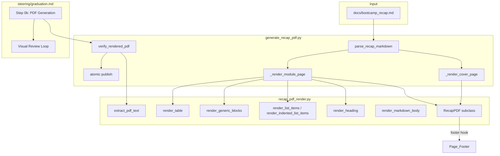

# Design Document: Recap PDF Professional Design

## Overview

This design upgrades the recap PDF renderer from a functional-but-plain layout to a
distribution-ready professional document while preserving the tolerant parser, raw-Markdown
fallback, and round-trip content verification that prior specs delivered. The redesign is
additive — the visual layer wraps around the full per-module detail, never replacing it.

The approach subclasses `fpdf.FPDF` to introduce page footers, color accents, and margin
management via the standard fpdf2 `header()`/`footer()` override pattern. Cover page, typography
hierarchy, and table rendering are added as new rendering primitives in the shared
`recap_pdf_render.py` module. The graduation flow gains a visual review loop that confirms
content completeness before reporting the PDF as distribution-ready.

Key design decisions:

1. **Subclass over configuration**: fpdf2's `footer()` hook fires on every page break, making it
   the natural place for page numbers. A subclass (`RecapPDF`) encapsulates all professional-layout
   state (accent color, margin values, cover-page flag) and exposes the same interface downstream.
2. **Accent color as a constant tuple**: A single `ACCENT_COLOR` RGB constant is used for all
   headings, ensuring consistency without per-call parameterization.
3. **Table rendering via pipe-table parser**: A new `render_table` primitive splits pipe-delimited
   lines into cells and renders them using `multi_cell` in a grid — no external table library.
4. **Visual review loop as optional enhancement**: When image-rendering tooling is available, the
   graduation flow renders pages to images for inspection; when absent, the text-based
   Content_Verification (already mandatory) is sufficient — the loop is Non_Blocking.

## Architecture



### Rendering Pipeline

1. `main()` reads the Recap_Markdown and calls `parse_recap_markdown`.
2. A `RecapPDF` instance (subclass of `FPDF`) is created with professional margins, auto page
   break, and the `footer()` override active.
3. `_render_cover_page` emits the cover with title, subtitle, bootcamper name, start date,
   duration, and headline stats (module count).
4. For each module section, `_render_module_page` renders the heading in accent color, then the
   five subsections via shared primitives.
5. The completed PDF is written to a temp file.
6. `verify_rendered_pdf` re-reads the temp PDF and asserts per-module sections and body-line
   tokens are present.
7. On success, the temp file is atomically moved to the output path.

## Components and Interfaces

### `RecapPDF` (new class in `recap_pdf_render.py`)

```python
class RecapPDF(FPDF):
    """Professional-layout FPDF subclass with page footers and accent color."""

    ACCENT_COLOR: tuple[int, int, int] = (0, 90, 156)  # Senzing blue
    BODY_COLOR: tuple[int, int, int] = (40, 40, 40)    # Near-black
    MARGINS_MM: float = 20.0
    FOOTER_FONT_SIZE: int = 9

    def __init__(self) -> None: ...
    def footer(self) -> None: ...
    def is_cover_page(self) -> bool: ...
```

- `footer()` renders `Page {page_no}` centered at the bottom of every Content_Page. On the
  Cover_Page (page 1), the footer is suppressed.
- Margins are set to `MARGINS_MM` (20 mm) on all sides via `set_margins` and
  `set_auto_page_break(margin=MARGINS_MM)`.
- `is_cover_page()` returns `True` when `self.page_no() == 1`, used by `footer()` to suppress
  the page number on the cover.

### Updated `render_heading` (in `recap_pdf_render.py`)

```python
def render_heading(pdf: "FPDF", text: str, level: int) -> None:
    """Render a heading at the given level with accent color.

    Level 2 (module headings): font size 18, bold, accent color.
    Level 3 (subsection headings): font size 14, bold, accent color.
    Body text resets to BODY_COLOR after the heading.
    """
```

Changes from current:
- Sets `pdf.set_text_color(*ACCENT_COLOR)` before rendering.
- Resets to `pdf.set_text_color(*BODY_COLOR)` after rendering.
- Module heading font size increased from 16 → 18.
- Subsection heading font size increased from 13 → 14.
- Body text font size remains 11.

### New `render_table` (in `recap_pdf_render.py`)

```python
def render_table(pdf: "FPDF", block: str) -> None:
    """Render a Markdown pipe table as a PDF table.

    Parses the pipe-delimited lines, strips the separator row (---),
    renders each cell's text via multi_cell in a uniform grid.
    No cell text is omitted.
    """
```

- Splits the block into rows on `\n`, each row into cells on `|`.
- Detects and skips the alignment/separator row (matches `^[|\\s:\\-]+$`).
- Computes column widths proportionally based on available page width.
- Renders header row in bold, data rows in normal weight.
- All cell text is rendered via `safe_text` (Latin-1 safe).

### Updated `_render_cover_page` (in `generate_recap_pdf.py`)

```python
def _render_cover_page(pdf: "RecapPDF", doc: RecapDocument) -> None:
    """Render a professional cover page with headline stats."""
```

Changes from current:
- Title rendered larger (32pt bold, accent color, centered).
- New subtitle line: `"Bootcamp Completion Recap"` (16pt, body color, centered).
- Bootcamper name rendered at 20pt, centered.
- Start date and total duration rendered as labeled fields.
- New Headline_Stats block: `"Modules completed: {count}"` with the count derived from
  `len(doc.sections)`.
- All fields are optional — if a value is empty/missing, that line is simply skipped without
  aborting.

### Updated `render_markdown_body` (in `recap_pdf_render.py`)

The existing block-dispatch logic is extended with a new table-detection branch:

```python
# Pipe table — the first line contains at least one | and the second is a separator.
if _is_pipe_table(lines):
    render_table(pdf, block)
    continue
```

### Visual Review Loop (graduation flow addition)

A new helper function (or inline logic in the graduation steering) performs the review:

1. After `generate_recap_pdf.py` exits 0, the graduation flow calls `verify_rendered_pdf`
   (already embedded in the generator — this is the content gate).
2. Optionally, if `pdf2image` or `pymupdf` is available (checked lazily), render the first and
   last content pages to images and inspect them for the presence of Required_Detail_Section
   headings.
3. If the visual review finds a section missing, the flow treats the PDF as not
   distribution-ready and reports a warning.
4. The loop is Non_Blocking: any failure (tooling absent, image rendering error, inspection
   inconclusive) logs a warning and graduation continues.

This is integrated into `graduation.md` Step 0b as a post-generation check.

## Data Models

### Constants (in `recap_pdf_render.py`)

```python
# Professional layout constants
ACCENT_COLOR: tuple[int, int, int] = (0, 90, 156)   # Senzing blue
BODY_COLOR: tuple[int, int, int] = (40, 40, 40)     # Near-black body text
MARGINS_MM: float = 20.0                             # All-sides margin
TITLE_FONT_SIZE: int = 32                            # Cover page title
SUBTITLE_FONT_SIZE: int = 16                         # Cover page subtitle
BOOTCAMPER_FONT_SIZE: int = 20                       # Cover page name
MODULE_HEADING_FONT_SIZE: int = 18                   # Module-level headings
SUBSECTION_HEADING_FONT_SIZE: int = 14               # Subsection headings
BODY_FONT_SIZE: int = 11                             # Body text
CODE_FONT_SIZE: int = 10                             # Code blocks
FOOTER_FONT_SIZE: int = 9                            # Page footer
```

### `RecapPDF` instance state

| Field | Type | Purpose |
|-------|------|---------|
| `page` | int | Current page number (inherited from FPDF) |
| `_cover_page_num` | int | Page number of the cover page (always 1) |

No new dataclasses are needed. The existing `RecapHeader`, `RecapSection`, and `RecapDocument`
remain unchanged.

### Heading Hierarchy (rendered sizes)

| Level | Element | Font | Size | Color |
|-------|---------|------|------|-------|
| Cover title | "Senzing Bootcamp Recap" | Helvetica Bold | 32 | Accent |
| Cover subtitle | "Bootcamp Completion Recap" | Helvetica | 16 | Body |
| Module heading | "Module N: Name" | Helvetica Bold | 18 | Accent |
| Subsection heading | "Information Shared" etc. | Helvetica Bold | 14 | Accent |
| Body text | List items, prose | Helvetica | 11 | Body |
| Code | Fenced blocks, inline | Courier | 10 | Body |
| Footer | "Page N" | Helvetica | 9 | Body |

## Correctness Properties

*A property is a characteristic or behavior that should hold true across all valid executions of
a system — essentially, a formal statement about what the system should do. Properties serve as
the bridge between human-readable specifications and machine-verifiable correctness guarantees.*

### Property 1: Cover page contains Headline_Stats

*For any* valid RecapDocument with a non-empty bootcamper name and at least one module section,
the rendered Recap_PDF's extracted text SHALL contain the document title "Senzing Bootcamp Recap",
the bootcamper name (Latin-1 safe), and the module section count.

**Validates: Requirements 2.1, 2.2, 2.4, 2.7, 12.4**

### Property 2: Content round-trip completeness

*For any* valid RecapDocument with N module sections, where each module's Required_Detail_Sections
(Information Shared, Questions & Responses, Actions Taken) contain a total of M items, the rendered
Recap_PDF's extracted text SHALL contain the distinctive token of at least `min(M, MIN_BODY_LINES)`
of those items — ensuring no Required_Detail_Section content is condensed, summarized, or dropped
during professional-layout rendering.

**Validates: Requirements 8.1, 8.2, 8.3, 8.5, 9.1, 12.1, 12.2**

### Property 3: Page footer presence on content pages

*For any* RecapDocument that renders to more than one page, the extracted text of the Recap_PDF
SHALL contain at least one page-number token matching the pattern `Page N` (where N > 0),
confirming that the Page_Footer renders on Content_Pages.

**Validates: Requirements 4.3**

### Property 4: Table cell text preservation

*For any* Recap_Markdown containing a pipe table with C cells of text, the rendered Recap_PDF's
extracted text SHALL contain the distinctive token of every cell, confirming no cell is omitted.

**Validates: Requirements 6.4**

### Property 5: Accent color consistency

*For any* RecapDocument with multiple module sections, every call to `set_text_color` made
immediately before rendering a module-level heading SHALL use the same RGB triple, and every call
made immediately before rendering a subsection-level heading SHALL use the same RGB triple — the
two may be equal but each level is internally consistent.

**Validates: Requirements 5.1, 5.3**

## Error Handling

| Scenario | Behavior | Requirement |
|----------|----------|-------------|
| `fpdf2` not installed | Print `pip install fpdf2` to stderr, exit 1, no traceback | 11.2 |
| Input file missing | Print "not found" to stderr, exit 1 | 11.4 |
| Input file empty | Print "empty" to stderr, exit 1 | 11.4 |
| Cover page field (date/duration) missing | Skip that field, continue rendering | 2.8 |
| Content_Verification fails (missing module) | Do not publish PDF, exit 1, print error identifying the missing module | 9.2, 9.4 |
| Content_Verification fails (body content dropped) | Do not publish PDF, exit 1, print error identifying the offending content | 9.3, 9.4 |
| Visual review loop tooling absent | Log warning, point to Markdown recap, continue graduation | 10.4 |
| Visual review loop finds missing section | Treat PDF as not distribution-ready, log warning, continue graduation | 10.3, 10.4 |
| Table parsing fails (malformed pipe table) | Fall through to prose-paragraph rendering (no crash) | Tolerant_Parser principle |
| `os.replace` fails (filesystem error) | Print "Failed to write PDF" to stderr, exit 1 | existing behavior |

All error paths preserve the atomic-publish guarantee: no partial or invalid PDF is ever left at
the output path. The temp file is cleaned up in a `finally` block.

## Testing Strategy

### Dual Testing Approach

- **Unit tests**: Specific examples testing the recording-stub render path (font sizes, colors,
  heading hierarchy), CLI flag defaults, edge cases (empty sections, missing fields).
- **Property-based tests**: Universal properties verified across randomly generated
  RecapDocuments using Hypothesis.

Both live in `senzing-bootcamp/tests/test_generate_recap_pdf.py`, following the project's
class-based test organization and `sys.path` import pattern.

### Property-Based Testing

**Library**: Hypothesis (already in use)  
**Configuration**: Minimum 100 iterations per property test via the `thorough` profile
(`HYPOTHESIS_PROFILE=thorough`). The `fast` profile (5 examples) is the local default.

Each property test references its design document property:

```python
# Feature: recap-pdf-professional-design, Property 1: Cover page contains Headline_Stats
```

**Property tests to implement:**

| # | Property | Strategy |
|---|----------|----------|
| 1 | Cover page Headline_Stats | `st_recap_document()` → render PDF → extract text → assert title, name, count |
| 2 | Content round-trip completeness | `st_recap_document()` → render PDF → extract text → assert distinctive tokens |
| 3 | Page footer presence | `st_recap_document(min_size=3)` → render PDF → extract text → assert "Page" token |
| 4 | Table cell preservation | Custom strategy generating pipe tables → render → extract → assert cells |
| 5 | Accent color consistency | `st_recap_document()` → recording stub → assert set_text_color calls |

### Unit Tests (example-based)

| Test | What it verifies |
|------|------------------|
| `test_cover_page_title_and_subtitle` | Fixed text elements on cover page |
| `test_heading_font_hierarchy` | Recording stub: module size > subsection size > body size |
| `test_accent_color_applied_to_headings` | Recording stub: set_text_color called with ACCENT_COLOR before headings |
| `test_body_color_distinct_from_accent` | Recording stub: body text uses BODY_COLOR ≠ ACCENT_COLOR |
| `test_footer_suppressed_on_cover_page` | Recording stub: footer() does not render on page 1 |
| `test_margins_at_least_15mm` | Verify RecapPDF sets margins >= 15mm |
| `test_verification_rejects_incomplete_pdf` | Existing test: exit 1, no "PDF generated:" line |
| `test_graceful_degradation_no_fpdf2` | Existing test: hint printed, exit 1 |
| `test_empty_section_renders_none_indicator` | Existing test: empty sections show "None" |
| `test_table_renders_all_cells` | Fixed pipe table input → all cell text in extracted PDF |

### Integration with Existing Tests

The existing `TestRoundTrip`, `TestStructuralCompleteness`, `TestBugConditionContentLoss`,
`TestPreservationStrictSchema`, and `TestPreservationGracefulDegradation` classes continue to
run unchanged — they validate that the professional redesign does not regress the tolerant
parser, fallback rendering, or round-trip fidelity. New professional-layout tests are added as
new test classes (e.g., `TestProfessionalLayout`, `TestCoverPage`, `TestPageFooter`,
`TestTableRendering`).

### Tag Format

Each property-based test includes a comment tag:

```python
# Feature: recap-pdf-professional-design, Property {N}: {property_text}
```
