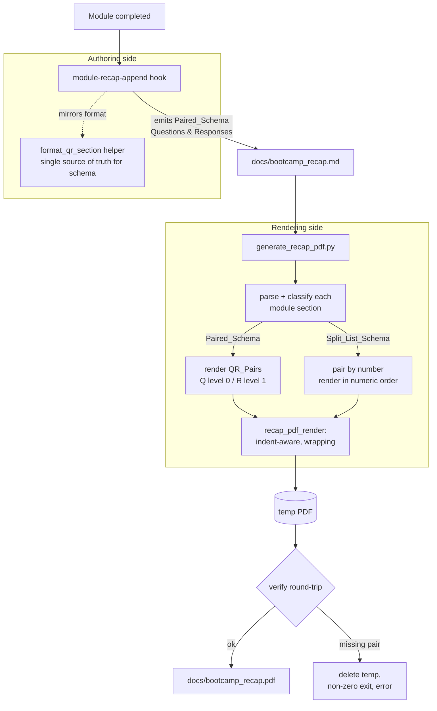

# Design Document

## Overview

This feature changes how per-module questions and answers are recorded in the bootcamp recap
and how they are rendered to PDF. Today the `module-recap-append` agentStop hook writes two
parallel lists per module — `### Questions Asked` (numbered) and `### Answers Given` (numbered,
keyed 1:1 by number) — and the PDF renderer re-pairs them by index at render time. Readers of the
raw Markdown must cross-reference the two lists by number.

The new design has two coordinated parts:

1. **Authoring side (Paired_Schema).** The `module-recap-append` hook is updated to emit a single
   `### Questions & Responses` (QR_Section) per module. Each exchange (QR_Pair) is a Question_Item
   line prefixed `- **Q:**` immediately followed by its Response_Item line prefixed `- **R:**` and
   indented four spaces so the response nests beneath the question. The exact byte-level formatting
   rules (prefixes, four-space-per-level indentation, placeholders) are captured in a single pure
   helper, `format_qr_section`, so the schema has one machine-verifiable source of truth that the
   hook prompt mirrors.

2. **Rendering side (indent-aware, backward compatible).** The shared PDF renderer
   (`recap_pdf_render.py`) is extended to honor the leading indentation of Markdown list items:
   each item's horizontal start position is the left margin plus `nesting_level × per-level offset`,
   and item text wraps within the page margins instead of being truncated. The recap generators
   (`generate_recap_pdf.py` and, through the shared module, `generate_recap_pdf_inline.py`) classify
   each module section independently as Paired_Schema (has a `### Questions & Responses` heading) or
   Split_List_Schema (has both `### Questions Asked` and `### Answers Given` headings) and render each
   according to its own schema, so previously generated recaps continue to render correctly.

The design is stdlib-only Python (3.11+). `fpdf2` (`import fpdf`) remains an optional, lazily
imported dependency used only inside the render path; nothing new is imported at module top level.

## Research Summary

Key findings from reading the existing code that inform the design:

- **`recap_pdf_render.py`** is the `Shared_Renderer_Module`. Its `render_list_items` places every
  bullet at a *fixed* horizontal position (`pdf.l_margin + 6`) regardless of the item's Markdown
  indentation, and it renders item text with `pdf.write`, which auto-wraps at the right margin but
  resets wrapped continuation lines to the left margin. `render_markdown_body` detects list blocks by
  stripping each line (`ln.strip()`), which *discards indentation* — so nesting information is lost
  before rendering. Both are the root causes the indentation requirement (Requirement 3) must fix.
- **`generate_recap_pdf.py`** parses module sections with `_MODULE_HEADING_RE`, splits `###`
  subsections in `_split_subsections`, and stores `questions_asked` / `answers_given` as separate
  lists on `RecapSection`. It already re-pairs them at render time in `_build_qa_lines` /
  `_render_qa_pairs` using the placeholders `(no question recorded)` / `(no answer recorded)`. This
  index-pairing logic is the template for Split_List_Schema rendering, but its placeholders differ
  from the ones the requirements specify and must be reconciled.
- **`generate_recap_pdf.py`** currently writes the PDF *directly to the output path* and only then
  runs `verify_rendered_pdf`. Requirements 4.2 and 5.2 require that a rendering failure leave *no*
  recap PDF written, so the write must become atomic (render to a temporary file, verify, then move
  into place; delete the temporary file on failure).
- **`generate_recap_pdf_inline.py`** reuses `generate_recap_pdf`'s parser/renderer when importable
  and otherwise renders raw Markdown via the shared module. It inherits renderer fixes automatically,
  so no schema logic needs to be duplicated there.
- **`completion_artifacts.py`** (the deterministic backfill applier) and `normalize_markdown.py` both
  recognize the legacy subsection names. The backfill applier writes Split_List_Schema sections; those
  remain valid input for the renderer via the backward-compatibility path (Requirement 5), so backfill
  is out of scope for the authoring change. `normalize_markdown.py` must, however, learn to treat
  `Questions & Responses` as a known subsection so normalization does not corrupt the new schema.

## Architecture



### Design principles

- **One schema source of truth.** `format_qr_section` (a pure function) encodes the prefixes,
  four-space-per-level indentation, and placeholder rules. The hook prompt describes exactly what this
  helper produces, so the byte-level schema is machine-verifiable rather than living only in prose.
- **Indentation is data, not decoration.** The renderer computes a nesting level from the leading
  spaces of each list item (`Indent_Depth`), and maps level → horizontal offset. This is the single
  mechanism that satisfies both the visual nesting (Requirement 3) and the Q-above-R ordering
  (Requirement 2 → rendered by Requirement 3.2).
- **Per-section classification.** Schema detection is per module section, never per document, so a
  recap that mixes old and new sections renders each correctly (Requirement 5.5).
- **Fail loud, write nothing on failure.** Rendering is atomic: verify a temporary artifact before it
  becomes the published PDF (Requirements 4.1, 4.2, 5.1, 5.2).

## Components and Interfaces

### 1. `module-recap-append.kiro.hook` (Recap_Append_Hook) — updated prompt

The prompt's session-gathering and append-template steps change from two parallel lists to one
interspersed QR_Section:

- **Gather** questions and their responses as an ordered list of pairs (preserving the sequence in
  which questions were asked during the module).
- **Emit** a single `### Questions & Responses` heading, then for each pair a Question_Item line
  `- **Q:** <question text>` immediately followed by a Response_Item line indented four spaces
  `    - **R:** <response text>`.
- **Zero substantive questions:** emit the heading followed by exactly one item `- None` (Requirement 1.5).
- **Absent/whitespace response:** emit `    - **R:** (no response recorded)` (Requirement 1.6).
- **Never** emit `### Questions Asked` or `### Answers Given` (Requirement 1.4).

The prompt references the exact format produced by `format_qr_section` so the authored Markdown and
the tested helper agree. A "substantive question" is one whose text has at least one non-whitespace
character after stripping leading/trailing whitespace (Requirement 1.1).

### 2. `format_qr_section` / `format_qr_pair` (new, in `recap_pdf_render.py`)

Pure formatting helpers — the machine-verifiable source of truth for the Paired_Schema.

```python
INDENT_UNIT = 4  # spaces per nesting level

def format_qr_pair(question: str, response: str) -> list[str]:
    """Return the two Markdown lines for one QR_Pair.

    Line 1: '- **Q:** ' + question (Indent_Depth 0).
    Line 2: (INDENT_UNIT spaces) + '- **R:** ' + response-or-placeholder
            (Indent_Depth == INDENT_UNIT). A response that is absent or
            whitespace-only becomes '(no response recorded)'.
    Continuation lines of a multi-line response are each prefixed with at
    least INDENT_UNIT spaces so they stay nested (Requirement 2.5).
    """

def format_qr_section(pairs: list[tuple[str, str]]) -> str:
    """Return the full '### Questions & Responses' section text.

    Substantive pairs (question has a non-whitespace char after strip) are
    emitted in order as Question_Item + Response_Item. When there are no
    substantive pairs, emit the heading followed by exactly '- None'.
    """
```

### 3. `recap_pdf_render.py` (Shared_Renderer_Module) — indent-aware rendering

New/changed functions:

```python
PER_LEVEL_INDENT_MM = 6.0  # fixed, positive per-level horizontal offset

def indent_depth(line: str) -> int:
    """Count leading ASCII-space (0x20) characters of a list-item line.
    Tab characters are not counted as indentation units."""

def nesting_level(depth: int, unit: int = INDENT_UNIT) -> int:
    """Map an Indent_Depth to a nesting level: depth // unit (floor, >= 0)."""

def parse_list_block(block: str) -> list[tuple[int, bool, str]]:
    """Parse a list block into (level, numbered, text) triples, preserving
    indentation. Continuation (non-marker) lines fold into the preceding
    item's text. Marker and any '**Q:**'/'**R:**' bold prefix are retained in
    'text' or stripped by the caller depending on render context."""

def render_indented_list_items(pdf, items: list[tuple[int, str]]) -> None:
    """Render (level, text) items. For each item set the horizontal start to
    l_margin + level * PER_LEVEL_INDENT_MM and render the text with multi_cell
    using width = (right margin - start_x) so text wraps within the margins
    instead of being truncated (Requirements 3.1, 3.3, 3.4). Text is rendered
    verbatim (Latin-1-safe) so characters are reproduced exactly (Requirement 4.3)."""
```

`render_markdown_body`'s list-detection branch is changed so it **does not strip leading spaces**
before classifying/measuring a list block; it computes each item's level from `indent_depth` and
routes to `render_indented_list_items`. The legacy `render_list_items` remains for any caller that
renders flat lists, but recap module rendering goes through the indent-aware path.

### 4. `generate_recap_pdf.py` (Bundled_Generator) — schema-aware parsing and rendering

- **`QRPair` dataclass** (new): `question: str`, `response: str`.
- **`RecapSection`** gains `qr_pairs: list[QRPair]` and a `schema: str` field
  (`"paired"` | `"split"` | `"none"`). Existing `questions_asked` / `answers_given` remain for the
  Split_List_Schema path.
- **Classification** (`classify_section`): a section is `"paired"` when it contains a
  `### Questions & Responses` heading; `"split"` when it contains both `### Questions Asked` and
  `### Answers Given`; otherwise `"none"`. Applied per section (Requirement 5.5).
- **Paired parsing** (`parse_qr_section`): extract QR_Pairs from the QR_Section, pairing each
  Question_Item with the immediately following Response_Item, dropping the `- **Q:** ` / `- **R:** `
  prefixes and the response indentation while preserving the remaining text character-for-character.
  `- None` yields zero pairs.
- **Split parsing**: unchanged extraction of the two numbered lists.
- **Rendering** (`_render_module_page`):
  - Paired: render each QR_Pair as a Question_Item at level 0 and a Response_Item at level 1 via
    `render_indented_list_items`, under a single `Questions & Responses` heading (Requirements 3.2, 3.5, 4.4).
  - Split: pair answer N with question N, render in ascending numeric order; unmatched items render
    with the placeholder `(no matching entry)` for the missing counterpart (Requirements 5.1, 5.3, 5.4).
- **Atomic write** (`render_pdf` / `main`): render to a temporary file, run round-trip verification,
  then move into place on success; on verification failure delete the temporary file, print an error
  identifying the offending QR_Pair/item, and return exit code 1 (Requirements 4.1, 4.2, 5.1, 5.2).
- **Verification targets** (`collect_verification_targets`): include the question and response text of
  every QR_Pair (Paired) and every paired item (Split) so a dropped pair fails verification.

### 5. `generate_recap_pdf_inline.py` (Inline_Generator)

No schema logic added — it reuses the bundled parser/renderer when importable and otherwise renders
raw Markdown through the shared module, inheriting the indent-aware rendering and wrapping fixes.

### 6. `normalize_markdown.py` — schema awareness (supporting change)

Add `"questions & responses"` to the set of recognized recap subsections so normalization preserves
the QR_Section rather than treating it as unknown content. This keeps the Markdown recap stable across
normalization passes.

## Data Models

```python
@dataclass
class QRPair:
    """One question and its corresponding response within a QR_Section."""
    question: str      # text after the '- **Q:** ' prefix, verbatim
    response: str      # text after the '- **R:** ' prefix, verbatim, or a placeholder

@dataclass
class RecapSection:
    module_number: int = 0
    module_name: str = ""
    timestamp: str = ""
    information_shared: list[str] = field(default_factory=list)
    # Paired_Schema:
    qr_pairs: list[QRPair] = field(default_factory=list)
    # Split_List_Schema (legacy, retained for backward compatibility):
    questions_asked: list[str] = field(default_factory=list)
    answers_given: list[str] = field(default_factory=list)
    # Which schema this section was classified as: "paired" | "split" | "none"
    schema: str = "none"
    actions_taken: list[str] = field(default_factory=list)
    duration: str = ""
    generic_content: list[str] = field(default_factory=list)
```

Rendering intermediate model: a parsed list item is a triple `(level: int, numbered: bool, text: str)`
where `level = indent_depth(line) // INDENT_UNIT`. A render item is a pair `(level: int, text: str)`.

Constants:

- `INDENT_UNIT = 4` — spaces per nesting level in the Markdown (Requirements 2.1–2.4).
- `PER_LEVEL_INDENT_MM = 6.0` — fixed, positive horizontal offset per nesting level in the PDF
  (Requirement 3.1).

### Placeholder vocabulary

| Situation | Placeholder | Requirement |
|---|---|---|
| Paired: response absent/whitespace at authoring time | `(no response recorded)` | 1.6 |
| Split: question/answer has no counterpart of the same number | `(no matching entry)` | 5.4 |

## Correctness Properties

*A property is a characteristic or behavior that should hold true across all valid executions of a
system — essentially, a formal statement about what the system should do. Properties serve as the
bridge between human-readable specifications and machine-verifiable correctness guarantees.*

The properties below are derived from the prework analysis. Redundant criteria were consolidated:
the four indentation criteria (2.1–2.4) collapse into one indentation invariant; the ordering
criteria (1.2, 4.4) and the count/text criteria (4.1, 4.3) collapse into one paired round-trip
property; and the two heading-structure criteria (1.1, 1.4) collapse into one section-structure
property. Error-condition and single-label criteria (1.5, 2.5, 3.5, 4.2, 5.2) are covered by
edge-case and example unit tests in the Testing Strategy rather than properties.

### Property 1: QR_Section has exactly one heading and no legacy headings

*For any* list of QR_Pairs containing at least one substantive pair, the section produced by
`format_qr_section` contains exactly one `### Questions & Responses` heading and contains neither a
`### Questions Asked` heading nor a `### Answers Given` heading.

**Validates: Requirements 1.1, 1.4**

### Property 2: Every QR_Pair carries the correct prefixes

*For any* list of QR_Pairs, every emitted question line begins with the literal `- **Q:**` and every
emitted response line, after its leading indentation, begins with the literal `- **R:**`.

**Validates: Requirements 1.3**

### Property 3: Absent or whitespace responses render the placeholder

*For any* QR_Pair whose response is absent or contains only whitespace, the emitted response line
contains the literal `(no response recorded)` immediately after the `- **R:**` prefix.

**Validates: Requirements 1.6**

### Property 4: Fixed four-space indentation invariant

*For any* QR_Pair emitted by `format_qr_section`, the Question_Item line has an Indent_Depth of 0
with no tab characters, the Response_Item line has an Indent_Depth of exactly 4 with no tab
characters, and the Response_Item Indent_Depth is exactly 4 greater than its Question_Item
Indent_Depth — uniformly across every pair and every section.

**Validates: Requirements 2.1, 2.2, 2.3, 2.4**

### Property 5: Paired round-trip preserves text, order, adjacency, and count

*For any* list of substantive QR_Pairs, formatting the pairs into a QR_Section and then parsing that
section back yields exactly the same pairs, in the same first-to-last order, with each response
immediately following its question, and with the question and response text reproduced
character-for-character (excluding the `- **Q:**` / `- **R:**` prefixes and the response
indentation).

**Validates: Requirements 1.2, 4.1, 4.3, 4.4**

### Property 6: Per-level horizontal offset geometry

*For any* nesting level N from 0 up to the maximum level produced by the Paired_Schema, the rendered
horizontal start position equals the left margin plus N times a fixed positive per-level offset; the
spacing between consecutive levels is constant; the start position stays at or right of the left
margin and strictly left of the right margin; and a Response_Item (level 1) always starts at a
greater horizontal position than its Question_Item (level 0).

**Validates: Requirements 3.1, 3.2, 3.3**

### Property 7: Text wraps within margins without dropping content

*For any* item text and any available line width greater than one character, wrapping the text
produces lines that each fit within the available width, and rejoining the wrapped lines reproduces
every token of the original text with no word truncated or dropped.

**Validates: Requirements 3.4**

### Property 8: Split_List rendering is complete, number-paired, and ordered

*For any* Split_List_Schema section, rendering pairs the answer numbered N with the question numbered
N, emits every question and every answer with its text and number preserved (none omitted or
duplicated), and orders the resulting pairs in ascending numeric order — regardless of the order in
which the questions and answers appear in the source lists.

**Validates: Requirements 5.1, 5.3**

### Property 9: Split_List unmatched items are retained with a placeholder

*For any* Split_List_Schema section containing a question with no answer of the same number or an
answer with no question of the same number, the unmatched item is rendered with its text preserved
and its missing counterpart rendered as the literal placeholder `(no matching entry)` — the item is
never dropped.

**Validates: Requirements 5.4**

### Property 10: Per-section schema classification is independent

*For any* recap document mixing Paired_Schema and Split_List_Schema module sections, each section is
classified independently — as Paired_Schema exactly when it contains a `### Questions & Responses`
heading, and as Split_List_Schema exactly when it contains both a `### Questions Asked` heading and
an `### Answers Given` heading — and each section is rendered according to its own classification.

**Validates: Requirements 5.5**

## Error Handling

- **Unrenderable content (Requirements 4.2, 5.2).** The generator renders to a temporary file, then
  runs round-trip verification (`verify_rendered_pdf`) covering every QR_Pair (Paired) and every
  number-paired item (Split). If any expected pair/item is missing from the rendered text, the
  generator deletes the temporary file (so no recap PDF is written), prints an error to stderr that
  identifies the specific QR_Pair or numbered item that could not be rendered, and returns exit
  code 1.
- **Missing / empty input.** Preserved from current behavior: a missing input file or an empty recap
  prints an error to stderr and returns exit code 1.
- **Optional `fpdf2` absent.** The lazy `import fpdf` raises `ImportError`, which is caught to print
  the `pip install fpdf2` hint and return exit code 1 without a traceback — the Markdown recap is
  left intact. `fpdf` is never imported at module top level.
- **Non-Latin-1 characters.** `safe_text` continues to replace characters outside Latin-1 with `?`
  for core-font safety. Character-for-character reproduction (Property 5) is therefore asserted over
  Latin-1-safe text, matching the renderer's contract.
- **Malformed indentation in authored Markdown.** The parser tolerates responses indented by more
  than four spaces (nesting level is `depth // INDENT_UNIT`) and folds unmarked continuation lines
  into the preceding item, so hand-edited recaps do not crash the renderer.
- **File-system errors on write/move.** `OSError` during render or atomic move prints
  `Failed to write PDF: <error>` to stderr and returns exit code 1; any temporary file is removed.

## Testing Strategy

The feature is well suited to property-based testing: the schema formatting, indentation parsing,
Q/R pairing, geometry, and text wrapping are all pure functions with universal properties over a
large input space. Testing uses **pytest + Hypothesis**, stdlib-only, following the repo conventions.

### Property-based tests

- Library: **Hypothesis**. Each of the 10 correctness properties above is implemented by a **single**
  property-based test.
- Iterations: governed by the registered Hypothesis profiles (`fast` → 5 locally, `thorough` → 100 in
  CI). Property tests must not hand-set `@settings(max_examples=...)` to restate the baseline; use the
  profile. The baseline satisfies the "minimum 100 iterations" intent under the `thorough`/CI profile.
- Each property test is tagged with a comment referencing its design property, format:
  `# Feature: recap-qr-formatting, Property N: <property text>`.
- Strategies (prefixed `st_`): `st_qr_pair()` (question/response text, including whitespace-only and
  multi-line responses and Latin-1-safe content), `st_qr_pairs()` (ordered lists, including empty),
  `st_split_section()` (numbered question/answer lists with arbitrary order and asymmetric numbering
  gaps), `st_mixed_recap()` (documents interleaving paired and split sections), `st_wrap_text()` and
  `st_width()` for the wrapping property, and `st_level()` for the geometry property.
- Tests import scripts via the documented `sys.path` pattern; PDF geometry properties test the pure
  `start_x`/`nesting_level`/wrapping helpers directly (no binary PDF parsing needed).

### Unit and edge-case tests (example-based)

- **Requirement 1.5** (edge): empty pair list and all-whitespace-question lists → heading followed by
  exactly `- None`, zero pairs parse back.
- **Requirement 2.5** (edge): multi-line responses → every continuation line has ≥ 4 leading spaces.
- **Requirement 3.5** (example): a rendered Paired_Schema section emits exactly one
  `Questions & Responses` heading.
- **Requirement 4.2 / 5.2** (edge/error): inject an unrenderable pair/omitted item → non-zero exit,
  no output PDF exists, stderr identifies the offending content.
- **Backward-compatibility fixtures**: render existing Split_List_Schema recap fixtures end-to-end and
  assert unchanged, complete output (guards Requirement 5 against regressions).
- **Hook prompt content test** (repo-root `tests/`): assert the `module-recap-append.kiro.hook` prompt
  describes the Paired_Schema (`### Questions & Responses`, `- **Q:**`, `- **R:**`, four-space
  indentation, `- None`, `(no response recorded)`) and no longer instructs writing `### Questions
  Asked` / `### Answers Given`. This validates the authoring-side wording of Requirements 1 and 2,
  which an LLM-driven hook cannot verify at runtime.

### Integration tests

- `generate_recap_pdf.py` and `generate_recap_pdf_inline.py` produce a PDF (when `fpdf2` is present)
  for a recap mixing paired and split sections, and round-trip verification passes — one or two
  representative examples, not property-based (PDF generation is comparatively expensive and the
  binary output does not vary meaningfully with input beyond what the pure properties already cover).
