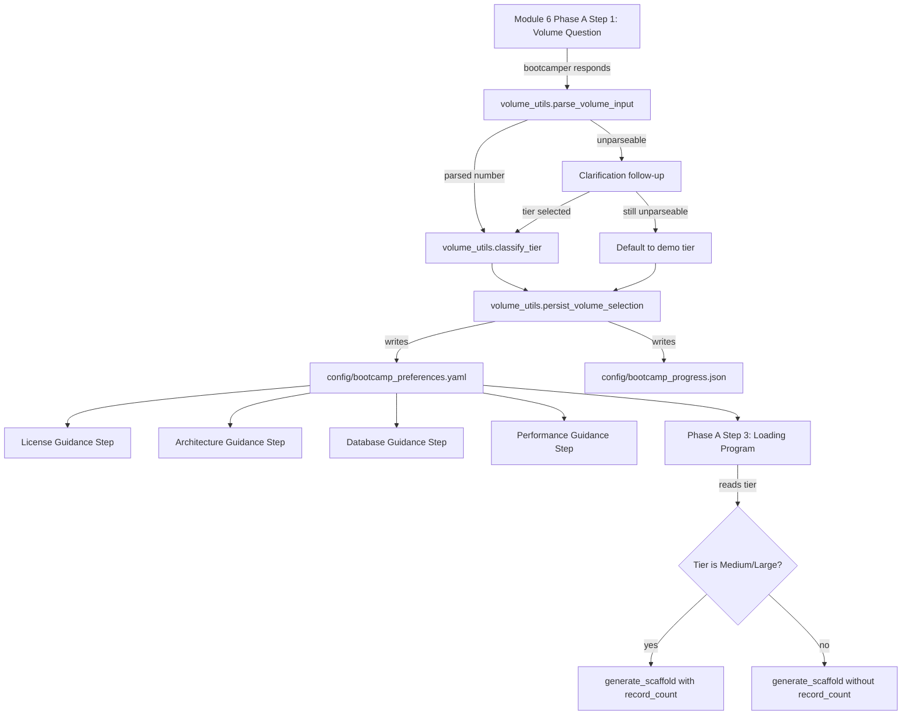

# Design Document: Record Volume Guidance

## Overview

This feature adds a record volume guidance step to Module 6 (Data Processing) Phase A that asks the bootcamper about their expected production record volume early in the data loading workflow. The answer drives personalized guidance on licensing, architecture, database selection, and performance expectations — helping bootcampers think ahead about production requirements while learning.

The feature consists of two main components:

1. **Volume classification logic** — a Python utility module (`volume_utils.py`) that parses free-text numeric input, classifies it into one of four tiers, persists the selection, and generates tier-specific guidance text.
2. **Steering file modifications** — updates to Module 6 Phase A steering to insert the volume question step, renumber existing steps, and add conditional agent instructions that pass volume context to MCP `generate_scaffold` calls.

### Design Decisions

- **Pure Python utility module**: All classification, persistence, and guidance generation logic lives in `senzing-bootcamp/scripts/volume_utils.py`. This keeps the steering files declarative (agent instructions reference the utility) and makes the logic independently testable.
- **Regex-based numeric parsing**: Uses stdlib `re` to handle formats like "1M", "500k", "10 million", plain digits, and comma-separated numbers. No NLP or third-party libraries needed.
- **Tier boundaries as constants**: The four tier boundaries (500, 500_000, 10_000_000) are defined as module-level constants for easy adjustment.
- **Guidance as pure functions**: Each guidance generator (license, architecture, database, performance) is a pure function taking tier and optional config context, returning a formatted string. This enables property-based testing.

## Architecture



### Component Interaction

The volume step is the first step in Phase A. After the bootcamper answers, the utility persists the selection. Subsequent guidance steps (license, architecture, database, performance) are informational — they read the persisted tier and display guidance without blocking. The loading program step (formerly step 2, now step 3) conditionally passes `record_count` to MCP based on the tier.

## Components and Interfaces

### 1. `senzing-bootcamp/scripts/volume_utils.py`

Core utility module providing all volume-related logic.

```python
# Constants
TIER_DEMO = "demo"
TIER_SMALL = "small"
TIER_MEDIUM = "medium"
TIER_LARGE = "large"
VALID_TIERS = (TIER_DEMO, TIER_SMALL, TIER_MEDIUM, TIER_LARGE)

TIER_BOUNDARIES = {
    TIER_DEMO: (0, 500),
    TIER_SMALL: (500, 500_000),
    TIER_MEDIUM: (500_000, 10_000_000),
    TIER_LARGE: (10_000_000, float("inf")),
}

# Parsing
def parse_volume_input(text: str) -> int | None:
    """Parse free-text volume input into an integer record count.

    Handles: plain digits, comma-separated ("1,000,000"), abbreviations
    ("1M", "500k", "10m"), plain-language ("10 million", "five hundred").

    Args:
        text: Raw bootcamper input string.

    Returns:
        Integer record count, or None if unparseable.
    """

def classify_tier(record_count: int) -> str:
    """Classify a record count into a volume tier.

    Args:
        record_count: Non-negative integer record count.

    Returns:
        One of: "demo", "small", "medium", "large".

    Raises:
        ValueError: If record_count is negative.
    """

def should_ask_volume(preferences: dict) -> bool:
    """Determine if the volume question should be asked.

    Returns False if preferences contains a valid production_volume entry
    (both raw_value as int and tier as recognized string). Returns True
    otherwise (missing, empty, invalid tier).

    Args:
        preferences: Parsed bootcamp_preferences dict.

    Returns:
        True if the volume question should be asked.
    """

# Persistence
def persist_volume_selection(
    raw_value: int,
    tier: str,
    preferences_path: str,
    progress_path: str,
    step_number: int,
) -> None:
    """Persist volume selection to preferences and write checkpoint.

    Writes production_volume key to preferences YAML and updates
    progress JSON with the step number.

    Args:
        raw_value: Parsed integer record count.
        tier: Classified tier string.
        preferences_path: Path to bootcamp_preferences.yaml.
        progress_path: Path to bootcamp_progress.json.
        step_number: Step number for checkpoint.
    """

# Guidance generators
def get_license_guidance(tier: str | None) -> str | None:
    """Generate license guidance text for the given tier.

    Args:
        tier: Volume tier string, or None if not set.

    Returns:
        Formatted guidance string, or None if tier is not set (skip).
    """

def get_architecture_guidance(tier: str) -> str:
    """Generate architecture guidance text for the given tier.

    Always includes production recommendation label and bootcamp
    single-threaded disclaimer.

    Args:
        tier: Volume tier string.

    Returns:
        Formatted guidance string.
    """

def get_database_guidance(tier: str, current_database: str = "sqlite") -> str:
    """Generate database guidance text for the given tier.

    Args:
        tier: Volume tier string.
        current_database: Currently configured database type.

    Returns:
        Formatted guidance string.
    """

def get_performance_guidance(tier: str) -> str:
    """Generate performance expectations text for the given tier.

    Always references MCP search_docs with category="configuration".

    Args:
        tier: Volume tier string.

    Returns:
        Formatted guidance string.
    """
```

### 2. Steering File: `module-06-phaseA-build-loading.md`

Modified to insert the volume step as step 1 and renumber existing steps to 2–4.

**New Step 1 structure:**
- Numbered heading with bold title: `1. **Assess production record volume:**`
- Pointing question (👉) asking about expected volume
- 🛑 STOP directive
- Example ranges for all four tiers
- Agent instruction blockquote with parsing/classification/persistence logic
- Fallback instruction for unparseable input
- Checkpoint line

**Modified Steps 2–4:**
- Former step 1 → step 2 (Identify input data)
- Former step 2 → step 3 (Create production loading program) — with added conditional agent instruction to read `production_volume` and pass `record_count` to `generate_scaffold` for medium/large tiers
- Former step 3 → step 4 (Use MCP tools for code generation)

### 3. Steering File: `module-06-data-processing.md`

Updated "Phase Sub-Files" section:
- Phase A: steps 1–4 (was 1–3)
- Phase B: steps 5–11 (was 4–10)
- Phase C: steps 12–20 (was 11–19)
- Phase D: steps 21–28 (was 20–27)

### 4. Config: `steering-index.yaml`

Updated Module 6 phase entries:
- `phase1-build-loading-program`: `step_range: [1, 4]`
- `phase2-load-first-source`: `step_range: [5, 11]`
- `phase3-multi-source-orchestration`: `step_range: [12, 20]`
- `phase4-validation`: `step_range: [21, 28]`

### 5. Config: `bootcamp_preferences.yaml.example`

Added `production_volume` key documentation:

```yaml
# Production volume selection (set during Module 6 Phase A)
# raw_value: integer record count
# tier: one of demo, small, medium, large
production_volume: null
```

## Data Models

### Production Volume Entry (in `bootcamp_preferences.yaml`)

```yaml
production_volume:
  raw_value: 1000000    # integer — parsed record count
  tier: medium          # string — one of: demo, small, medium, large
```

### Tier Classification Boundaries

| Tier | Lower Bound (inclusive) | Upper Bound (exclusive) | Description |
|------|------------------------|------------------------|-------------|
| demo | 0 | 500 | Demo/evaluation |
| small | 500 | 500,000 | Small production |
| medium | 500,000 | 10,000,000 | Medium production |
| large | 10,000,000 | ∞ | Large production |

### Numeric Input Parsing Patterns

| Pattern | Example | Parsed Value |
|---------|---------|-------------|
| Plain digits | `1000000` | 1,000,000 |
| Comma-separated | `1,000,000` | 1,000,000 |
| K/k suffix | `500k`, `500K` | 500,000 |
| M/m suffix | `1M`, `1m`, `1.5M` | 1,000,000 / 1,500,000 |
| B/b suffix | `1B`, `1b` | 1,000,000,000 |
| Word multipliers | `10 million`, `5 thousand` | 10,000,000 / 5,000 |
| Mixed | `1.5 million` | 1,500,000 |

## Correctness Properties

*A property is a characteristic or behavior that should hold true across all valid executions of a system — essentially, a formal statement about what the system should do. Properties serve as the bridge between human-readable specifications and machine-verifiable correctness guarantees.*

### Property 1: Numeric input classification correctness

*For any* string containing a recognizable numeric value (digits, abbreviations like "500k"/"1M", or word forms like "10 million"), `parse_volume_input` SHALL return an integer, and `classify_tier` applied to that integer SHALL return the tier whose boundary range contains that value.

**Validates: Requirements 1.4**

### Property 2: Non-numeric input rejection

*For any* string that contains no recognizable numeric content (no digits, no numeric abbreviations, no numeric word forms), `parse_volume_input` SHALL return None, signaling that clarification is needed.

**Validates: Requirements 1.5**

### Property 3: Volume persistence round-trip

*For any* valid record count (non-negative integer) and its correctly classified tier, persisting via `persist_volume_selection` and reading back from the YAML file SHALL produce a `production_volume` entry where `raw_value` equals the original integer and `tier` equals the classified tier string.

**Validates: Requirements 1.6, 2.1**

### Property 4: Session resume skip detection

*For any* preferences dict containing a `production_volume` key with a valid integer `raw_value` and a tier value in `VALID_TIERS`, `should_ask_volume` SHALL return False.

**Validates: Requirements 2.3**

### Property 5: Session resume re-ask detection

*For any* preferences dict where `production_volume` is missing, None, has a non-integer `raw_value`, or has a `tier` value not in `VALID_TIERS`, `should_ask_volume` SHALL return True.

**Validates: Requirements 2.4**

### Property 6: License guidance for non-demo tiers

*For any* tier in {small, medium, large}, `get_license_guidance` SHALL return a string that mentions both a production license requirement AND presents MCP/sales contact options.

**Validates: Requirements 3.2, 3.3**

### Property 7: Architecture guidance universal disclaimers

*For any* tier in {demo, small, medium, large}, `get_architecture_guidance` SHALL return a string containing both a "production recommendation" label and a statement that the bootcamp uses single-threaded loading regardless of tier.

**Validates: Requirements 4.5**

### Property 8: Database guidance — SQLite sufficient for low tiers

*For any* tier in {demo, small}, `get_database_guidance` SHALL return a string confirming SQLite is sufficient for production use at the stated volume.

**Validates: Requirements 5.1**

### Property 9: Database guidance — PostgreSQL for high tiers

*For any* tier in {medium, large} with `current_database="sqlite"`, `get_database_guidance` SHALL return a string recommending PostgreSQL and explaining the SQLite single-writer limitation.

**Validates: Requirements 5.2**

### Property 10: Database guidance — bootcamp disclaimer for all tiers

*For any* tier in {demo, small, medium, large}, `get_database_guidance` SHALL return a string containing a statement that the bootcamp continues using the currently configured database.

**Validates: Requirements 5.3**

### Property 11: Database guidance — PostgreSQL acknowledgment

*For any* tier in {medium, large} with `current_database="postgresql"`, `get_database_guidance` SHALL return a string that acknowledges the existing PostgreSQL configuration and does NOT contain the SQLite single-writer limitation explanation.

**Validates: Requirements 5.4**

### Property 12: Performance guidance — fast completion for low tiers

*For any* tier in {demo, small}, `get_performance_guidance` SHALL return a string indicating loading completes in seconds to minutes.

**Validates: Requirements 6.1**

### Property 13: Performance guidance — MCP reference for all tiers

*For any* tier in {demo, small, medium, large}, `get_performance_guidance` SHALL return a string referencing `search_docs` with `category="configuration"`.

**Validates: Requirements 6.4**

## Error Handling

| Scenario | Handling |
|----------|----------|
| `parse_volume_input` receives empty/whitespace string | Returns None (triggers clarification) |
| `parse_volume_input` receives non-numeric text | Returns None (triggers clarification) |
| `classify_tier` receives negative number | Raises `ValueError` |
| `persist_volume_selection` cannot write preferences file | Raises `OSError`; agent instruction handles gracefully |
| `persist_volume_selection` cannot write progress file | Raises `OSError`; agent instruction handles gracefully |
| Preferences file missing `production_volume` key | `should_ask_volume` returns True; guidance functions return None/skip |
| Preferences file has corrupted YAML | Caught by existing `parse_yaml` error handling; volume step re-asks |
| MCP `generate_scaffold` unavailable | Steering instruction tells agent to present recommendation without MCP output |
| Tier value not in VALID_TIERS | `should_ask_volume` returns True (re-ask); guidance functions treat as None |

## Testing Strategy

### Property-Based Tests (Hypothesis)

Property-based testing is appropriate for this feature because:
- The volume parsing function has a large input space (arbitrary strings with numeric content)
- The tier classification has clear boundary conditions that benefit from randomized testing
- The guidance generators have universal properties that must hold across all valid tier inputs
- The session resume logic has clear boolean properties over structured input

**Library**: Hypothesis (already used in the project)
**Configuration**: `@settings(max_examples=20)` per project convention
**Tag format**: `Feature: record-volume-guidance, Property {N}: {title}`

Each of the 13 correctness properties maps to one property-based test in `senzing-bootcamp/tests/test_record_volume_guidance_properties.py`.

### Unit Tests (pytest)

Example-based tests in `senzing-bootcamp/tests/test_record_volume_guidance_unit.py` covering:

- Specific parsing examples: "500", "1M", "10 million", "1,000,000", "1.5M"
- Tier boundary values: 0, 499, 500, 499_999, 500_000, 9_999_999, 10_000_000
- License guidance content for demo tier (500-record evaluation license sufficient)
- Architecture guidance content per tier (single-threaded, multi-threaded, distributed)
- Performance guidance content for medium (minutes to hours, Module 8) and large (hours to days, Modules 8 and 11)
- Default fallback to demo tier after two unparseable inputs
- Steering file format validation (👉, 🛑, checkpoint line)

### Integration Tests

- End-to-end flow: parse → classify → persist → read back → generate guidance
- Steering file structure validation: step numbering, phase ranges in steering-index.yaml
- CI pipeline pass: `validate_power.py`, `measure_steering.py --check`, `validate_commonmark.py`, `pytest`

### Test File Organization

```
senzing-bootcamp/tests/
├── test_record_volume_guidance_properties.py  # 13 property tests
├── test_record_volume_guidance_unit.py        # Example-based unit tests
└── test_record_volume_guidance_integration.py # Integration tests
```
