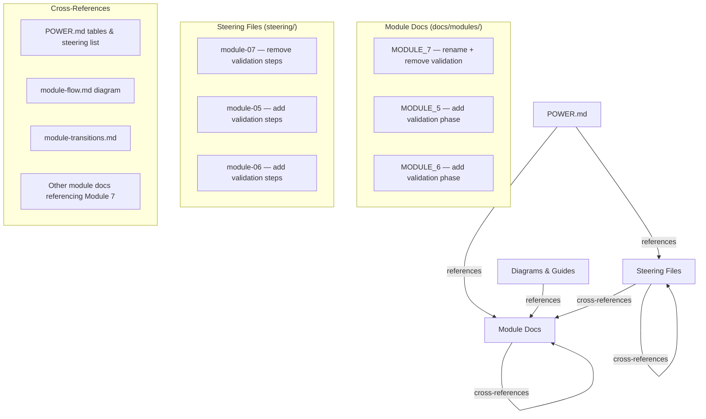

# Design: Refocus Module 8 on Query & Visualize

## Overview

This design covers the documentation refactoring needed to rename Module 7 from "Query, Visualize & Validate" to "Query & Visualize" and relocate validation steps (UAT, match accuracy checking, stakeholder sign-off) into the data loading modules (5 and 6) as their natural conclusion.

**Current state:** Module 7 bundles querying, visualization, and validation into one module. Validation (UAT, match accuracy, sign-off) is conceptually the final phase of loading, not a querying activity.

**Target state:** Module 7 focuses purely on building query programs, overlap reports, search programs, and visualizations. Validation becomes the final phase of Modules 5 and 6, completing the mapping → loading → validation flow within those modules.

> Note: The requirements reference "Module 8" based on the original feedback item, but the current codebase numbers this module as Module 7 (after a prior renumbering). This design operates on the actual current numbering: Module 7 is the query/validation module being refactored.

## Architecture

The refactoring touches three layers of documentation:

### Change Strategy

1. **Rename Module 7** — Update title, banner, overview, and all descriptive text to "Query & Visualize"
2. **Extract validation content** — Identify and remove validation steps (UAT, match accuracy, sign-off, results validation) from Module 7 docs and steering
3. **Insert validation into Modules 5 & 6** — Add validation as the final phase of single-source loading (Module 5) and multi-source orchestration (Module 6)
4. **Update cross-references** — Fix all references in POWER.md, diagrams, guides, other module docs, and steering files

## Components and Interfaces

### Component 1: Module 7 Documentation (Rename + Trim)

**File:** `senzing-bootcamp/docs/modules/MODULE_7_QUERY_VALIDATION.md`

Changes:
- Rename to reflect "Query & Visualize" focus (file stays `MODULE_7_QUERY_VALIDATION.md` to avoid breaking existing links, but title/banner/content updated)
- Update banner: `MODULE 7: QUERY AND VISUALIZE`
- Update overview to focus on query programs, search programs, overlap reports, and visualizations
- Remove sections: "Create UAT Test Cases" (Step 5), "Execute UAT Tests" (Step 6), "Resolve Issues" (Step 7), "Get Sign-Off" (Step 8), "User Acceptance Testing (UAT)" section, UAT-related file locations, UAT-related validation gates
- Keep sections: Query requirements (Step 1), Generate query program (Step 2), Customize query program (Step 3), Test query program (Step 4), visualization offers, query examples, integration patterns
- Update validation gates to focus on query/visualization completeness only
- Update success indicators to remove UAT references
- Update "Related Documentation" to remove UAT steering reference

### Component 2: Module 7 Steering File (Rename + Trim)

**File:** `senzing-bootcamp/steering/module-07-query-validation.md`

Changes:
- Update title to "Module 7: Query and Visualize"
- Update Purpose line to focus on query programs and visualizations
- Update Before/After framing to remove validation language
- Remove steps 4-7 (UAT test cases, execute UAT, validate results quality, document findings related to validation)
- Keep: Define query requirements (step 1), Create query programs (step 2), Run exploratory queries + visualization offers (step 3), Integration patterns
- Replace the "Iterate vs. Proceed Decision Gate" — remove UAT pass rate logic, replace with query completeness check
- Remove stakeholder summary section (validation-specific)
- Update success criteria to remove UAT/validation references

### Component 3: Module 5 Documentation (Add Validation Phase)

**File:** `senzing-bootcamp/docs/modules/MODULE_5_SINGLE_SOURCE_LOADING.md`

Changes:
- Add a new "Validation Phase" section after loading and verification steps
- Include: match accuracy checking, basic UAT for single-source scenarios, results validation
- Update validation gates to include validation checks
- Update success indicators to include validation completion
- Add UAT-related file locations to the file tree
- Update "Integration with Other Modules" to reflect that validation now lives here

### Component 4: Module 5 Steering File (Add Validation Steps)

**File:** `senzing-bootcamp/steering/module-05-single-source.md`

Changes:
- Add validation steps after loading verification: validate match accuracy, run basic UAT, document results
- Include the results dashboard visualization offer (moved from Module 7 steering)
- Update success criteria to include validation

### Component 5: Module 6 Documentation (Add Validation Phase)

**File:** `senzing-bootcamp/docs/modules/MODULE_6_MULTI_SOURCE_ORCHESTRATION.md`

Changes:
- Add a "Validation Phase" section as the final phase after all sources are loaded
- Include: cross-source match accuracy, full UAT with business users, stakeholder sign-off, results validation
- This is the more comprehensive validation since multi-source is where cross-source matching happens
- Update validation gates and success indicators
- Add UAT-related file locations
- Update "Integration with Other Modules"

### Component 6: Module 6 Steering File (Add Validation Steps)

**File:** `senzing-bootcamp/steering/module-06-multi-source.md`

Changes:
- Add validation steps as the final phase: validate cross-source results, execute UAT, get stakeholder sign-off
- Include the results dashboard visualization offer
- Include the "Iterate vs. Proceed Decision Gate" (moved from Module 7) with UAT pass rate logic
- Include stakeholder summary offer
- Update success criteria

### Component 7: POWER.md Updates

**File:** `senzing-bootcamp/POWER.md`

Changes:
- Update Module 7 row in the main module table: change description from "Query, Visualize, and Validate Results" to "Query and Visualize"
- Update Module 7 row in "Why It Matters" column accordingly
- Update the Bootcamp Modules table at the bottom
- Update steering file list entry for `module-07-query-validation.md` description
- Update Module 5 and 6 descriptions to mention validation as part of their scope

### Component 8: Cross-Reference Updates

**Files affected:**
- `senzing-bootcamp/docs/diagrams/module-flow.md` — Update Module 7 box label from "Query, Viz & Validate" to "Query & Visualize"
- `senzing-bootcamp/docs/modules/MODULE_8_PERFORMANCE_TESTING.md` — Update "After validating results in Module 7" reference
- `senzing-bootcamp/steering/module-08-performance.md` — Update prerequisite description if it references Module 7 validation
- `senzing-bootcamp/docs/modules/README.md` — Update Module 7 entry if it lists module names
- Any other files referencing Module 7's old name or validation scope

## Data Models

Not applicable — this is a documentation-only refactoring with no data model changes.

## Error Handling

### Risk: Broken Cross-References

After making changes, all internal cross-references must be verified. The `validate_power.py` script can check for broken references.

### Risk: Incomplete Validation Coverage

When moving validation steps, ensure nothing is lost. The validation content from Module 7 must be fully accounted for in Modules 5 and 6 — Module 5 gets single-source validation, Module 6 gets the full cross-source UAT and sign-off flow.

### Risk: Hook References

Hooks that reference Module 7 or Module 8 by name (e.g., `offer-visualization`, `enforce-visualization-offers`) may need description updates. The hooks themselves trigger on file patterns, not module names, so functional behavior won't break — but descriptions should be accurate.

## Testing Strategy

Since this is a documentation-only refactoring (markdown files, no executable code), property-based testing does not apply. There are no functions, algorithms, or data transformations to test.

**Validation approach:**
- Manual review of all changed files for completeness and consistency
- Run `python3 senzing-bootcamp/scripts/validate_power.py` to check cross-reference integrity
- Run `python3 senzing-bootcamp/scripts/validate_commonmark.py` to verify markdown formatting
- Verify that validation content removed from Module 7 is fully present in Modules 5/6
- Check that no module references the old "Query, Visualize & Validate" name
