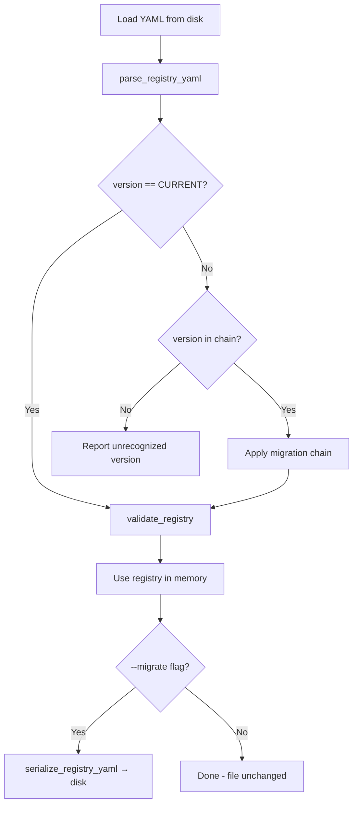

# Design Document: Registry Schema Versioning

## Overview

The data source registry (`config/data_sources.yaml`) currently uses a hardcoded `version: "1"` with no migration logic. When new fields like `test_load_status` and `test_entity_count` are added, older registries lack them, causing validation failures or silent data loss. This design adds schema versioning with automatic migration to `scripts/data_sources.py`: a `CURRENT_SCHEMA_VERSION` constant, a `migrate_v1_to_v2` function that backfills missing fields with sensible defaults, a migration chain that applies incremental migrations sequentially, and transparent migration-on-load so users never need a separate upgrade step.

### Key Design Decisions

1. **In-place migration chain** — migrations are pure functions (`dict → dict`) stored in an ordered mapping. Adding version 3 later requires only writing `migrate_v2_to_v3` and adding it to the chain. No framework or external tooling needed.
2. **Read-only by default, write-on-flag** — loading a v1 registry migrates it in memory for validation and display, but does not overwrite the file unless `--migrate` is explicitly passed. This prevents accidental data loss during read-only operations.
3. **Null defaults for new optional fields** — `test_load_status` and `test_entity_count` default to `null` during migration, matching the existing `RegistryEntry` dataclass defaults and avoiding false validation errors.
4. **No third-party dependencies** — the migration logic uses only Python standard library, consistent with the existing `data_sources.py` design.

## Architecture



## Components and Interfaces

### 1. Constants

```python
CURRENT_SCHEMA_VERSION: str = "2"
```

Replaces all hardcoded `"1"` comparisons in version checks and new registry creation.

### 2. Migration Functions

```python
def migrate_v1_to_v2(raw: dict) -> dict:
    """Migrate a version '1' registry dict to version '2'.

    For each source entry:
      - Adds 'test_load_status': None if missing
      - Adds 'test_entity_count': None if missing
      - Preserves all existing fields (including 'issues')
    Sets version to '2'.

    Args:
        raw: Registry dict with version '1'.

    Returns:
        Registry dict with version '2' and backfilled fields.
    """
```

### 3. Migration Chain

```python
MIGRATION_CHAIN: dict[str, Callable[[dict], dict]] = {
    "1": migrate_v1_to_v2,
}

def apply_migrations(raw: dict) -> dict:
    """Apply the migration chain to bring a registry to CURRENT_SCHEMA_VERSION.

    Args:
        raw: Registry dict at any known version.

    Returns:
        Registry dict at CURRENT_SCHEMA_VERSION.

    Raises:
        ValueError: If the version is unrecognized (not in chain and not current).
    """
```

### 4. Updated Load Flow

```python
def load_registry(path: str, write_back: bool = False) -> Registry:
    """Load, migrate (if needed), validate, and return a Registry.

    Args:
        path: Path to the YAML registry file.
        write_back: If True, write the migrated registry back to disk.

    Returns:
        Validated Registry object at CURRENT_SCHEMA_VERSION.
    """
```

### 5. Updated Validation

```python
def validate_registry(raw: dict) -> list[str]:
    """Validate registry structure. Updated to accept version '1' or '2'.

    New checks for version '2':
      - test_load_status: must be in VALID_TEST_LOAD_STATUSES or None
      - test_entity_count: must be a non-negative integer or None
    """
```

### 6. CLI Update

The `main()` function gains a `--migrate` flag:

```python
parser.add_argument("--migrate", action="store_true",
                    help="Write migrated registry back to disk")
```

## Data Models

### Migration Chain Structure

| Key | Value | Description |
|-----|-------|-------------|
| `"1"` | `migrate_v1_to_v2` | Upgrades v1 → v2 by adding `test_load_status` and `test_entity_count` defaults |

### Source Entry Field Changes (v1 → v2)

| Field | v1 | v2 | Default on Migration |
|-------|----|----|---------------------|
| `test_load_status` | absent | optional | `null` |
| `test_entity_count` | absent | optional | `null` |
| All other fields | present | preserved | — |

### Version Validation Rules

| Version | Accepted by `validate_registry` | Notes |
|---------|-------------------------------|-------|
| `"1"` | Yes (after migration to `"2"`) | Only reaches validator post-migration |
| `"2"` | Yes | Current schema |
| Other | No — error raised before validation | `apply_migrations` raises `ValueError` |

## Correctness Properties

*A property is a characteristic or behavior that should hold true across all valid executions of a system — essentially, a formal statement about what the system should do. Properties serve as the bridge between human-readable specifications and machine-verifiable correctness guarantees.*

### Property 1: Migration Version Upgrade

*For any* valid version `"1"` registry dict, applying `migrate_v1_to_v2` shall produce a dict with `version` equal to `"2"`.

**Validates: Requirements 2.1**

### Property 2: Missing Fields Backfilled with Null

*For any* valid version `"1"` registry dict where source entries lack `test_load_status` or `test_entity_count`, applying `migrate_v1_to_v2` shall add both fields with value `null` to every source entry that was missing them.

**Validates: Requirements 2.2, 2.3**

### Property 3: Existing Fields Preserved

*For any* valid version `"1"` registry dict, applying `migrate_v1_to_v2` shall preserve every field that existed in each original source entry (including `issues`, `test_load_status`, and `test_entity_count` if already present) without modification.

**Validates: Requirements 2.4, 2.5, 7.1, 7.3**

### Property 4: Migration Chain Reaches Current Version

*For any* valid registry dict with a version present in the migration chain, applying `apply_migrations` shall produce a dict with `version` equal to `CURRENT_SCHEMA_VERSION`.

**Validates: Requirements 3.2**

### Property 5: Unrecognized Version Raises Error

*For any* version string that is not in the migration chain and not equal to `CURRENT_SCHEMA_VERSION`, calling `apply_migrations` shall raise a `ValueError`.

**Validates: Requirements 3.4**

### Property 6: Migration Idempotence

*For any* valid version `"1"` registry dict, migrating to version `"2"`, serializing, then migrating again shall produce a byte-identical serialized output.

**Validates: Requirements 6.1, 6.2**

### Property 7: Serialization Round-Trip After Migration

*For any* valid version `"1"` registry dict, migrating to version `"2"`, serializing with `serialize_registry_yaml`, and parsing back with `parse_registry_yaml` shall produce a dict with identical source data.

**Validates: Requirements 7.2**

### Property 8: Validation Accepts Migrated Registries

*For any* valid version `"1"` registry dict, after applying `migrate_v1_to_v2`, calling `validate_registry` shall return zero errors.

**Validates: Requirements 5.1, 5.4**

### Property 9: Validation Rejects Invalid Field Values

*For any* registry dict where a source entry has `test_load_status` set to a value not in `{complete, skipped, null}` or `test_entity_count` set to a negative integer or non-integer, `validate_registry` shall return one or more errors.

**Validates: Requirements 5.2, 5.3**

## Error Handling

| Scenario | Handling |
|----------|----------|
| Registry file missing | Script prints error and exits with code 1 (existing behavior) |
| Unrecognized schema version | `apply_migrations` raises `ValueError` with message identifying the version; `main()` catches and prints error, exits with code 1 |
| YAML parse error | Existing error handling in `parse_registry_yaml` (prints error, exits 1) |
| Validation errors after migration | Errors printed to stdout, exit code 1 (existing behavior) |
| `--migrate` with read-only filesystem | Python `OSError` caught, error printed, exit code 1 |
| Version field missing entirely | `validate_registry` reports "Missing required field: 'version'" (existing behavior) |

## Testing Strategy

### Property-Based Tests (Hypothesis)

The migration functions are pure `dict → dict` transformations, making them ideal for property-based testing.

**Library:** Hypothesis (Python) — already used in the project.

**Configuration:** Minimum 100 iterations per property test (`@settings(max_examples=100)`).

**Tag format:** `Feature: registry-schema-versioning, Property {N}: {title}`

Each of the 9 correctness properties maps to a single property-based test:

| Property | Test Strategy |
|----------|---------------|
| P1: Migration version upgrade | Generate random v1 registry dicts, apply `migrate_v1_to_v2`, verify version is `"2"` |
| P2: Missing fields backfilled | Generate random v1 entries without `test_load_status`/`test_entity_count`, migrate, verify fields are `null` |
| P3: Existing fields preserved | Generate random v1 entries with all fields (including `issues`), migrate, verify all original fields unchanged |
| P4: Chain reaches current version | Generate random v1 registries, apply `apply_migrations`, verify version equals `CURRENT_SCHEMA_VERSION` |
| P5: Unrecognized version error | Generate random version strings not in chain, verify `ValueError` raised |
| P6: Migration idempotence | Generate random v1 registries, migrate, serialize, migrate again, serialize, compare byte-for-byte |
| P7: Serialization round-trip | Generate random v1 registries, migrate, serialize, parse, compare source data |
| P8: Validation accepts migrated | Generate random v1 registries, migrate, validate, verify zero errors |
| P9: Validation rejects invalid | Generate registries with invalid `test_load_status`/`test_entity_count`, validate, verify errors |

### Example-Based Unit Tests

| Test | What it verifies |
|------|-----------------|
| `CURRENT_SCHEMA_VERSION` equals `"2"` | Constant value (Req 1.1) |
| No hardcoded `"1"` in version comparisons | Code organization (Req 1.2) |
| New registry creation uses `CURRENT_SCHEMA_VERSION` | Default version (Req 1.3) |
| `--migrate` flag writes file to disk | CLI behavior (Req 4.4) |
| Read-only operations don't modify file | No side effects (Req 4.3) |
| Migration of real `config/data_sources.yaml` | Integration with actual data (Req 2.1) |

### Integration Tests

| Test | What it verifies |
|------|-----------------|
| Full CLI run with v1 registry and `--summary` | Migration + display without file modification |
| Full CLI run with v1 registry and `--migrate` | Migration + file write |
| Script runs with no third-party imports | Only stdlib dependencies |
