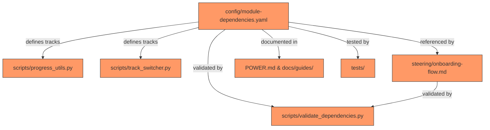

# Design Document: Remove Verification Track

## Overview

This feature removes the `quick_demo` track (displayed as "Quick Demo" / "System Verification") from the Senzing Bootcamp, reducing the track count from three to exactly two: **Core Bootcamp** and **Advanced Topics**.

The change is a coordinated removal across configuration, scripts, steering files, documentation, diagrams, and tests. Module 3 ("System Verification") itself remains — it is part of both surviving tracks — but the standalone two-module track that existed solely for quick verification is eliminated.

### Design Rationale

The `quick_demo` track (Modules 2, 3) was a subset of Core Bootcamp. Removing it simplifies onboarding (fewer choices), reduces maintenance surface, and eliminates a track that provided no unique content beyond what Core Bootcamp already includes. Bootcampers who want a quick verification can simply start Core Bootcamp and stop after Module 3.

## Architecture

The change touches seven layers of the bootcamp system. No new components are introduced; this is purely a removal/update operation.



All orange nodes require modification. The dependency graph (A) is the single source of truth — all other files derive their track information from it or must be consistent with it.

### Change Propagation Order

1. **Config** — Remove `quick_demo` from `module-dependencies.yaml`
2. **Scripts** — Update `VALID_TRACKS` in `progress_utils.py`, update docstring/examples in `track_switcher.py`
3. **Validation** — Update `validate_dependencies.py` expectations (track count, removed-track detection)
4. **Steering** — Update `onboarding-flow.md` Step 5, `inline-status.md`, diagrams
5. **Documentation** — Update `POWER.md`, `QUICK_START.md`
6. **Tests** — Update constants, strategies, remove `quick_demo`-only test classes

## Components and Interfaces

### 1. Track Registry (`config/module-dependencies.yaml`)

**Change:** Delete the entire `quick_demo` block from the `tracks:` section.

```yaml
# BEFORE (3 tracks)
tracks:
  quick_demo:
    name: "Quick Demo"
    description: "Fastest path to see Senzing in action"
    modules: [2, 3]
    recommendation: "neutral"
  core_bootcamp:
    ...
  advanced_topics:
    ...

# AFTER (2 tracks)
tracks:
  core_bootcamp:
    name: "Core Bootcamp"
    description: "Recommended foundation covering problem definition through query/visualize"
    modules: [1, 2, 3, 4, 5, 6, 7]
    recommendation: "recommended"
  advanced_topics:
    name: "Advanced Topics"
    description: "Adds production-readiness (performance, security, monitoring, deployment) on top of core bootcamp — not recommended for bootcamp"
    modules: [1, 2, 3, 4, 5, 6, 7, 8, 9, 10, 11]
    recommendation: "not_recommended"
```

All other sections (`metadata`, `modules`, `gates`) remain unchanged.

### 2. Progress Utilities (`scripts/progress_utils.py`)

**Change:** Update the `VALID_TRACKS` constant.

```python
# BEFORE
VALID_TRACKS = ("quick_demo", "core_bootcamp", "advanced_topics")

# AFTER
VALID_TRACKS = ("core_bootcamp", "advanced_topics")
```

The `validate_progress_schema()` function already uses `VALID_TRACKS` for validation — no logic changes needed. After the constant update, any progress record with `track: "quick_demo"` will automatically fail validation with an error message listing the accepted tracks.

### 3. Track Switcher (`scripts/track_switcher.py`)

**Changes:**
- Update module docstring to remove `quick_demo` from usage examples
- No logic changes needed — `compute_switch()` validates against `track_definitions` loaded from YAML, and `quick_demo` will no longer be in that dict

The CLI already exits with code 1 and prints to stderr when `compute_switch()` raises `ValueError` for an invalid track name.

### 4. Validate Dependencies (`scripts/validate_dependencies.py`)

**Changes:**
- Add `"quick_demo"` and `"Quick Demo"` to the `LEGACY_TRACK_IDENTIFIERS` / `LEGACY_TRACK_PHRASES` sets so the validator detects any lingering references
- The `validate_onboarding_flow()` function already cross-references tracks from YAML against the onboarding file — with `quick_demo` removed from YAML, it will no longer expect a matching bullet

```python
# Add to existing legacy detection
LEGACY_TRACK_IDENTIFIERS = {
    "fast_track", "complete_beginner", "full_production",
    "quick_demo",  # Added
    "A", "B", "C", "D",
}

LEGACY_TRACK_PHRASES = [
    "Path A", "Path B", "Path C", "Path D",
    "Quick Demo",  # Added
    "System Verification",  # Added
]
```

### 5. Onboarding Flow (`steering/onboarding-flow.md`)

**Changes to Step 5:**
- Remove the "System Verification" bullet and description
- Remove the `"verify"/"system_verification"→start at Module 2` mapping from interpreting-responses
- Retain the `"core"/"core_bootcamp"` and `"advanced"/"advanced_topics"` mappings

### 6. Documentation Files

**POWER.md:**
- Remove the "Quick Demo" track bullet from the Quick Start section
- Retain Module 3 in the Core Bootcamp module sequence and in the Bootcamp Modules table

**docs/guides/QUICK_START.md:**
- Remove "Quick Demo" as a path name or selectable option
- Map "quick demo" user requests to Module 3 within Core Bootcamp
- Remove any "After A" section referencing Quick Demo path

**steering/inline-status.md:**
- Remove Quick Demo from the "Track module lists" section

**docs/diagrams/module-prerequisites.md:**
- Remove Quick Demo row from Learning Paths table
- Retain M2→M3 dependency edge in mermaid graph

**docs/diagrams/module-flow.md:**
- Remove Quick Demo subsection under Learning Paths

### 7. Test Suite

**Constants to update:**
- `VALID_TRACKS` in `test_track_switcher_properties.py`: `{"core_bootcamp", "advanced_topics"}`
- `TRACK_DEFINITIONS` in `test_track_switcher_properties.py`: remove `"quick_demo": [2, 3]`
- `_VALID_TRACK_IDS` or equivalent in other test files
- Hypothesis strategies: `st.sampled_from(("core_bootcamp", "advanced_topics"))`

**Tests to remove:**
- Any test class/method that exclusively tests `quick_demo` switching scenarios
- `quick_demo`-specific branches in mixed test classes

**Tests to retain:**
- All Module 3 content/functionality tests
- All property tests for track switching logic (updated to two-track domain)
- All progress schema validation tests (updated VALID_TRACKS)

## Data Models

### Track Definition (unchanged structure)

```yaml
track_key:
  name: str          # Display name
  description: str   # User-facing description
  modules: list[int] # Ordered module numbers
  recommendation: str # "recommended" | "not_recommended"
```

### Valid Track Domain (after change)

| Track Key | Display Name | Modules |
|-----------|-------------|---------|
| `core_bootcamp` | Core Bootcamp | 1, 2, 3, 4, 5, 6, 7 |
| `advanced_topics` | Advanced Topics | 1, 2, 3, 4, 5, 6, 7, 8, 9, 10, 11 |

### Progress File Schema (unchanged structure, narrowed domain)

```json
{
  "track": "core_bootcamp | advanced_topics",
  "current_module": 1,
  "modules_completed": [1, 2, 3],
  "...": "..."
}
```

The `track` field now only accepts two values instead of three.

## Correctness Properties

*A property is a characteristic or behavior that should hold true across all valid executions of a system — essentially, a formal statement about what the system should do. Properties serve as the bridge between human-readable specifications and machine-verifiable correctness guarantees.*

### Property 1: Invalid track rejection produces descriptive error

*For any* string that is not in `("core_bootcamp", "advanced_topics")` — including `"quick_demo"` — when used as the `track` field in a progress record, `validate_progress_schema()` SHALL return a non-empty error list containing both the invalid value and the tuple of accepted tracks.

**Validates: Requirements 3.2, 3.3**

### Property 2: Valid track switching succeeds for all module states

*For any* pair of tracks drawn from `{"core_bootcamp", "advanced_topics"}` and *for any* subset of modules 1–11 as `modules_completed`, `compute_switch()` SHALL return a `SwitchResult` without raising an exception, and the result's `remaining_modules` ∪ (`modules_completed` ∩ target track modules) SHALL equal the target track's module set.

**Validates: Requirements 4.1**

### Property 3: Invalid track switch is side-effect-free

*For any* string not in the track definitions loaded from `module-dependencies.yaml` (which after this change means any string not in `{"core_bootcamp", "advanced_topics"}`), when provided as source or target to the track switcher CLI with `--apply`, the progress file SHALL remain byte-for-byte identical to its state before the command was invoked.

**Validates: Requirements 4.2, 4.3**

## Error Handling

### Progress Validation Errors

When `validate_progress_schema()` encounters `track: "quick_demo"` (or any other invalid track value):
- Appends error: `"track must be one of ('core_bootcamp', 'advanced_topics'), got 'quick_demo'"`
- Does NOT short-circuit — continues validating remaining fields
- Returns the complete error list to the caller

### Track Switcher Errors

When `compute_switch()` receives an invalid track name:
- Raises `ValueError` with message: `"Invalid track name: 'quick_demo'. Valid tracks: advanced_topics, core_bootcamp"`
- CLI catches the `ValueError`, prints to stderr, exits with code 1
- Progress file is never opened for writing (no side effects)

### Validate Dependencies Errors

When `validate_dependencies.py` detects a legacy track reference:
- Creates a `Violation(level="ERROR", description="Legacy track identifier 'quick_demo' found in ...")` 
- Continues checking all other validations (no short-circuit)
- Exits with code 1 if any ERROR-level violations exist

### Migration Path for Existing Progress Files

Bootcampers with existing `bootcamp_progress.json` containing `track: "quick_demo"`:
- `validate_progress_schema()` will report an error on the `track` field
- `repair_progress.py` (if it exists) should map `quick_demo` → `core_bootcamp` since Core Bootcamp is a superset
- The track switcher can be used: `--from core_bootcamp --to core_bootcamp` (after manual edit of the track field)

## Testing Strategy

### Property-Based Tests (Hypothesis)

The feature is suitable for property-based testing in the validation and switching logic layers. Use `pytest` + `Hypothesis` with `@settings(max_examples=100)`.

**Library:** Hypothesis (already in use across the test suite)

**Property tests to write/update:**

| Property | Test Location | Tag |
|----------|--------------|-----|
| Property 1: Invalid track rejection | `test_progress_schema_validation_properties.py` | Feature: remove-verification-track, Property 1: Invalid track rejection produces descriptive error |
| Property 2: Valid track switching | `test_track_switcher_properties.py` | Feature: remove-verification-track, Property 2: Valid track switching succeeds for all module states |
| Property 3: Side-effect-free rejection | `test_track_switcher_properties.py` | Feature: remove-verification-track, Property 3: Invalid track switch is side-effect-free |

**Hypothesis strategies to update:**
- `st_track_name()`: `st.sampled_from(("core_bootcamp", "advanced_topics"))`
- `st_invalid_track_name()`: filter must exclude only the two valid tracks (previously excluded three)
- `st_progress_file()` track field: sample from `("core_bootcamp", "advanced_topics")`

### Unit/Example Tests

| What | Assertion | File |
|------|-----------|------|
| YAML has exactly 2 tracks | `len(tracks) == 2` | `test_dependency_graph_unit.py` |
| `quick_demo` absent from YAML | `"quick_demo" not in tracks` | `test_dependency_graph_unit.py` |
| Core Bootcamp properties preserved | name, modules, recommendation match expected | `test_dependency_graph_unit.py` |
| Onboarding Step 5 has 2 bullets | count track bullets == 2 | `test_module_flow_integration.py` |
| "System Verification" absent from Step 5 | text not in section | `test_module_flow_integration.py` |
| CLI rejects `quick_demo` | exit code 1, stderr message | `test_track_switcher_unit.py` |
| POWER.md lists 2 tracks | count track entries == 2 | `test_track_reorganization.py` |
| Module 3 retained in modules table | "System Verification" in table | `test_track_reorganization.py` |
| validate_dependencies passes | exit code 0 | `test_validate_module.py` |

### Integration Tests

- Run `validate_dependencies.py` against the modified files and assert exit code 0
- Run the full test suite (`pytest senzing-bootcamp/tests/`) and assert all tests pass

### Tests to Remove

- Any test class in `test_track_switcher_properties.py` or `test_track_switcher_unit.py` that exclusively tests `quick_demo` scenarios
- `quick_demo` entries in `TRACK_DEFINITIONS` constants
- `quick_demo` entries in `VALID_TRACKS` sets within test files
- Assertions checking for "System Verification" track bullet presence in onboarding flow tests
