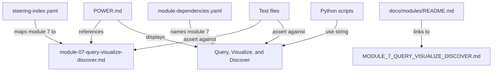

# Design Document: Rename Module 7

## Overview

This design covers the atomic rename of Module 7 from "Query & Visualize" to "Query, Visualize, and Discover" across the senzing-bootcamp Kiro Power codebase. The operation touches display names, headings, filenames, YAML keys, string literals, and cross-references — but introduces zero behavioral changes.

The rename is a coordinated find-and-replace plus two file moves, applied in a single commit to prevent broken cross-references at any point in git history.

### Scope

| Change Type | Count | Examples |
|---|---|---|
| File renames | 2 | `module-07-query-validation.md` → `module-07-query-visualize-discover.md`, `MODULE_7_QUERY_VALIDATION.md` → `MODULE_7_QUERY_VISUALIZE_DISCOVER.md` |
| YAML value updates | 3 | `steering-index.yaml`, `module-dependencies.yaml`, `file_metadata` key |
| Markdown heading/prose updates | ~10 files | POWER.md, docs indexes, steering cross-refs |
| Python string literal updates | 4 scripts | `validate_module.py`, `rollback_module.py`, `status.py`, `visualize_dependencies.py` |
| Test file string updates | 8 test files | Various `test_*.py` files |

### Design Rationale

- **Atomic commit**: All changes land in one commit so no intermediate state has broken references.
- **No behavioral changes**: Gate conditions, prerequisite rules, step ranges, and workflow logic remain untouched.
- **Filename convention preserved**: New filenames follow existing patterns (`module-NN-description.md` for steering, `MODULE_N_DESCRIPTION.md` for docs).

## Architecture

The rename operation has no architectural impact. The existing module system architecture remains unchanged:



### Change Categories

1. **File moves** — git-tracked renames preserving history
2. **YAML updates** — key and value changes in config files
3. **Markdown updates** — headings, table cells, inline references, link targets
4. **Python updates** — string literals in module name mappings/dicts

## Components and Interfaces

No new components are introduced. The rename touches existing files across these layers:

### Steering Layer (`senzing-bootcamp/steering/`)

| File | Change |
|---|---|
| `module-07-query-validation.md` | Rename to `module-07-query-visualize-discover.md`; update internal heading |
| `steering-index.yaml` | Update module 7 entry and `file_metadata` key |
| `module-prerequisites.md` | Update Module 7 display name |
| `module-transitions.md` | Update Module 7 references in journey map |
| `visualization-guide.md` | Update filename reference |

### Config Layer (`senzing-bootcamp/config/`)

| File | Change |
|---|---|
| `module-dependencies.yaml` | Update `modules.7.name` from `"Query & Visualize"` to `"Query, Visualize, and Discover"` |

### Documentation Layer (`senzing-bootcamp/docs/`)

| File | Change |
|---|---|
| `docs/modules/MODULE_7_QUERY_VALIDATION.md` | Rename to `MODULE_7_QUERY_VISUALIZE_DISCOVER.md`; update headings |
| `docs/modules/README.md` | Update filename link and display name |
| `docs/README.md` | Update filename reference |
| `docs/diagrams/module-flow.md` | Update Module 7 label |
| `docs/guides/ARCHITECTURE.md` | Update Module 7 references |
| `docs/modules/MODULE_5_DATA_QUALITY_AND_MAPPING.md` | Update Module 7 forward-reference |
| `docs/modules/MODULE_6_DATA_PROCESSING.md` | Update Module 7 forward-reference |

### Root Documentation

| File | Change |
|---|---|
| `POWER.md` | Update module table, steering file list, bootcamp modules table, prose references |

### Scripts Layer (`senzing-bootcamp/scripts/`)

| File | Change |
|---|---|
| `validate_module.py` | Update Module 7 name string |
| `rollback_module.py` | Update Module 7 name string |
| `status.py` | Update Module 7 name string and hint text |
| `visualize_dependencies.py` | Update Module 7 name string |

### Test Layer (`senzing-bootcamp/tests/`)

| File | Change |
|---|---|
| `test_track_switcher_properties.py` | Update Module 7 name string |
| `test_track_switcher_unit.py` | Update Module 7 name string |
| `test_visualization_web_service.py` | Update filename reference |
| `test_self_answering_questions_bug.py` | Update filename reference |
| `test_self_answering_questions_preservation.py` | Update filename reference |
| `test_mapping_workflow_integration.py` | Update filename reference |
| `test_module_closing_question_ownership.py` | Update filename reference |
| `test_er_quality_evaluation.py` | Update filename reference |

## Data Models

No data model changes. The only structured data affected is:

### steering-index.yaml (module 7 entry)

**Before:**
```yaml
  7: module-07-query-validation.md
```

**After:**
```yaml
  7: module-07-query-visualize-discover.md
```

And in `file_metadata`:

**Before:**
```yaml
  module-07-query-validation.md:
    token_count: 2968
    size_category: large
```

**After:**
```yaml
  module-07-query-visualize-discover.md:
    token_count: 2968
    size_category: large
```

### module-dependencies.yaml (module 7 name)

**Before:**
```yaml
  7:
    name: "Query & Visualize"
    requires: [6]
    skip_if: "Already validated"
```

**After:**
```yaml
  7:
    name: "Query, Visualize, and Discover"
    requires: [6]
    skip_if: "Already validated"
```

## Error Handling

The rename operation itself has minimal error surface:

| Risk | Mitigation |
|---|---|
| Partial rename (some files updated, others not) | Apply all changes in a single atomic commit |
| Missed reference (grep miss) | Run full CI pipeline after rename; search for old strings as verification step |
| Broken YAML syntax after edit | CI runs `validate_power.py` which parses all YAML configs |
| Broken Markdown links | CI runs `validate_commonmark.py` which checks link targets |
| Test failures from stale strings | CI runs full pytest suite; test files are explicitly listed in requirements |

### Verification Strategy

After applying the rename, run these checks:

1. `grep -r "Query & Visualize" senzing-bootcamp/` — should return zero matches
2. `grep -r "module-07-query-validation" senzing-bootcamp/` — should return zero matches
3. `grep -r "MODULE_7_QUERY_VALIDATION" senzing-bootcamp/` — should return zero matches
4. Full CI pipeline pass: `validate_power.py`, `measure_steering.py --check`, `validate_commonmark.py`, `sync_hook_registry.py --verify`, pytest

## Testing Strategy

### Why Property-Based Testing Does Not Apply

This feature is a pure rename operation — a set of specific, concrete string replacements and file moves. There are no:
- Pure functions with input/output behavior to test across a range of inputs
- Universal properties that hold for all valid inputs
- Parsers, serializers, or data transformations
- Algorithmic logic that varies with input

Each acceptance criterion is a specific assertion ("file X exists", "file Y contains string Z", "old file path no longer exists"). These are best validated with:
- **Example-based integration tests** — verify each renamed file exists with correct content
- **Smoke tests** — verify the CI pipeline passes end-to-end
- **Grep-based absence checks** — verify no old references remain

### Test Approach

**Unit/Integration Tests (example-based):**
- Verify `module-07-query-visualize-discover.md` exists and contains the correct heading
- Verify `MODULE_7_QUERY_VISUALIZE_DISCOVER.md` exists and contains the correct heading
- Verify old file paths do not exist
- Verify `steering-index.yaml` parses correctly and maps module 7 to the new filename
- Verify `module-dependencies.yaml` has the updated name string
- Verify no occurrences of old name strings remain in the codebase

**CI Pipeline (smoke):**
- `validate_power.py` — validates overall power structure including YAML configs
- `measure_steering.py --check` — validates steering index consistency
- `validate_commonmark.py` — validates Markdown link integrity
- `sync_hook_registry.py --verify` — validates hook registry consistency
- `pytest` — runs full test suite including all updated test files

**Post-rename grep verification:**
```bash
# These should all return exit code 1 (no matches)
grep -r "Query & Visualize" senzing-bootcamp/
grep -r "module-07-query-validation" senzing-bootcamp/
grep -r "MODULE_7_QUERY_VALIDATION" senzing-bootcamp/
```

### Execution Order

The implementation should follow this order to minimize risk:

1. Rename the two files (steering file, docs module file)
2. Update YAML configs (`steering-index.yaml`, `module-dependencies.yaml`)
3. Update POWER.md
4. Update documentation cross-references
5. Update steering cross-references
6. Update Python scripts
7. Update test files
8. Run verification grep checks
9. Run full CI pipeline
