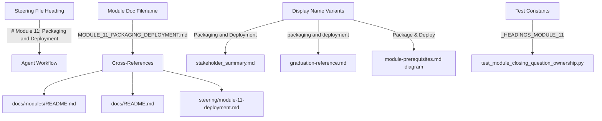

# Design Document: Rename Module 11 — Packaging and Deployment

## Overview

Module 11 is currently named "Deployment and Packaging" in several places across the codebase, but its internal structure covers Packaging first (Steps 2–11) and Deployment second (Steps 12–15). This feature renames the module to "Packaging and Deployment" to match the actual content order.

The change is a coordinated search-and-replace across 8 files, plus one file rename. No new files are created (other than the renamed module doc). References that already use the correct order ("Package & Deploy", "Package and Deploy") are left unchanged.

### Scope

**In scope:**

- Rename the steering file heading from "Deployment and Packaging" to "Packaging and Deployment"
- Rename the module doc file from `MODULE_11_DEPLOYMENT_PACKAGING.md` to `MODULE_11_PACKAGING_DEPLOYMENT.md`
- Update all cross-references to the renamed file
- Update description text in docs README, stakeholder summary, and graduation reference
- Fix the incorrect Mermaid diagram label (remove "Monitoring" from Module 11's label)
- Update the test constant `_HEADINGS_MODULE_11` to match the new heading

**Out of scope:**

- The steering filename `module-11-deployment.md` (stays the same — internal agent reference)
- The steering index `steering-index.yaml` (references the steering filename, not the display name)
- `POWER.md` (already uses "Package & Deploy" / "Package and Deploy" — correct order)
- The module doc's internal heading `# Module 11: Package and Deploy` (already correct)
- The module doc's banner `MODULE 11: PACKAGE AND DEPLOY` (already correct)

## Architecture

This is a pure text-replacement operation with no architectural changes. The codebase's module naming system has three layers:



**Key invariant:** The steering filename (`module-11-deployment.md`) and steering index (`steering-index.yaml`) are decoupled from the display name and must not change.

## Components and Interfaces

### Component 1: Steering File Heading (Requirement 1)

**File:** `senzing-bootcamp/steering/module-11-deployment.md`

**Change:** Replace the heading on line 6:

- Old: `# Module 11: Deployment and Packaging`
- New: `# Module 11: Packaging and Deployment`

Also update the Module_Doc reference on line 10:

- Old: `> **User reference:** See \`docs/modules/MODULE_11_DEPLOYMENT_PACKAGING.md\` for background.`
- New: `> **User reference:** See \`docs/modules/MODULE_11_PACKAGING_DEPLOYMENT.md\` for background.`

**Preserved:** The user message text `"Module 11 has two phases. First we'll package your code."` remains unchanged.

### Component 2: Module Doc File Rename (Requirement 2)

**Action:** Rename `senzing-bootcamp/docs/modules/MODULE_11_DEPLOYMENT_PACKAGING.md` to `senzing-bootcamp/docs/modules/MODULE_11_PACKAGING_DEPLOYMENT.md`.

**Preserved:** All content inside the file remains unchanged — the heading `# Module 11: Package and Deploy` and banner `MODULE 11: PACKAGE AND DEPLOY` already use the correct order.

### Component 3: Module Documentation Index (Requirement 3)

**File:** `senzing-bootcamp/docs/modules/README.md`

**Change:** Update the Module 11 file link:

- Old: `**File**: [MODULE_11_DEPLOYMENT_PACKAGING.md](MODULE_11_DEPLOYMENT_PACKAGING.md)`
- New: `**File**: [MODULE_11_PACKAGING_DEPLOYMENT.md](MODULE_11_PACKAGING_DEPLOYMENT.md)`

### Component 4: Docs README File Listing (Requirement 4)

**File:** `senzing-bootcamp/docs/README.md`

**Changes:**

- Old: `- \`MODULE_11_DEPLOYMENT_PACKAGING.md\` - Deployment packaging`
- New: `- \`MODULE_11_PACKAGING_DEPLOYMENT.md\` - Packaging and deployment`

### Component 5: Stakeholder Summary Template (Requirements 5, 9)

**File:** `senzing-bootcamp/templates/stakeholder_summary.md`

**Changes:**

1. Module 10 (Monitoring) next-steps line:
   - Old: `1. Proceed to deployment packaging (Module 11)`
   - New: `1. Proceed to packaging and deployment (Module 11)`

2. Module 11 section header:
   - Old: `MODULE 11 — Deployment and Packaging`
   - New: `MODULE 11 — Packaging and Deployment`

3. Module 11 `[module_name]` placeholder value:
   - Old: `[module_name]   → "Deployment and Packaging"`
   - New: `[module_name]   → "Packaging and Deployment"`

### Component 6: Graduation Reference (Requirement 6)

**File:** `senzing-bootcamp/steering/graduation-reference.md`

**Changes:** Two checklist item lines:

- Old: `- **Deployment**: Add \`- [ ] Review deployment packaging from Module 11 (check deployment artifacts)\``
- New: `- **Deployment**: Add \`- [ ] Review packaging and deployment from Module 11 (check deployment artifacts)\``

- Old: `- **Deployment**: Add \`- [ ] ⚠️ Deployment packaging was not covered during the bootcamp — complete these items before deploying\``
- New: `- **Deployment**: Add \`- [ ] ⚠️ Packaging and deployment was not covered during the bootcamp — complete these items before deploying\``

### Component 7: Module Prerequisites Diagram (Requirement 7)

**File:** `senzing-bootcamp/docs/diagrams/module-prerequisites.md`

**Change:** Fix the Mermaid node label (Module 11 does not cover Monitoring — that is Module 10):

- Old: `M10 --> M11[Module 11: Monitoring, Package & Deploy]`
- New: `M10 --> M11[Module 11: Package & Deploy]`

### Component 8: Test File Heading Constants (Requirement 8)

**File:** `senzing-bootcamp/tests/test_module_closing_question_ownership.py`

**Change:** Update the first entry in `_HEADINGS_MODULE_11`:

- Old: `"# Module 11: Deployment and Packaging",`
- New: `"# Module 11: Packaging and Deployment",`

### Component 9: Preserved Files (Requirement 10)

The following files must NOT be modified:

| File | Reason |
|---|---|
| `senzing-bootcamp/POWER.md` | Already uses "Package & Deploy" and "Package and Deploy" (correct order) |
| `senzing-bootcamp/steering/steering-index.yaml` | References the steering filename, not the display name |
| `senzing-bootcamp/steering/module-11-deployment.md` (filename) | Internal agent reference, not user-facing |

## Data Models

No data model changes. This feature modifies only display text and filenames — no structured data, configuration schemas, or APIs are affected.

## Error Handling

**Risk: Broken cross-references.** If the file rename is applied but a cross-reference is missed, links will break. Mitigation: the test suite (`test_module_closing_question_ownership.py`) validates heading constants, and a post-change grep for the old filename `MODULE_11_DEPLOYMENT_PACKAGING` will catch any missed references.

**Risk: Unintended changes to preserved files.** If a broad search-and-replace accidentally modifies POWER.md or the steering index, it could break the power. Mitigation: each replacement targets a specific file and specific string — no global find-and-replace.

**Risk: Test failures from stale constants.** The test file `test_module_closing_question_ownership.py` has a `_HEADINGS_MODULE_11` constant that must match the actual steering file heading. If the heading is changed but the constant is not, the preservation tests will fail. Mitigation: the constant update is an explicit task (Requirement 8).

## Testing Strategy

### Why Property-Based Testing Does Not Apply

This feature is a deterministic search-and-replace across a fixed set of files. Every acceptance criterion checks that a specific string exists (or does not exist) in a specific file. There is no input space to vary — no user input, no generated data, no parameterized logic. Running 100 iterations of the same file-content assertion adds no value over running it once.

PBT is designed for features with universal properties across a wide input space (parsers, serializers, business logic). This feature has none of those characteristics.

### Testing Approach: Example-Based Unit Tests

All 11 requirements map to concrete, deterministic assertions:

**Rename verification tests (Requirements 1–9):**

- For each modified file, assert the new text is present and the old text is absent
- For the renamed file, assert the new path exists and the old path does not
- For cross-references, assert they point to the new filename

**Preservation tests (Requirement 10):**

- For each preserved file (POWER.md, steering-index.yaml, steering filename), assert content is unchanged
- For preserved text within modified files (e.g., "Package and Deploy" heading in the module doc), assert it remains

**Regression test (Requirement 11):**

- Run the full test suite with `pytest senzing-bootcamp/tests/` and verify zero failures
- The existing `test_module_closing_question_ownership.py` heading-preservation tests will validate the heading constant update

### Test Organization

Tests live in `senzing-bootcamp/tests/` following the project convention. The existing test file `test_module_closing_question_ownership.py` already validates Module 11 headings via `_HEADINGS_MODULE_11` — updating that constant is sufficient for heading regression coverage.

New tests (if needed) should follow the class-based pattern with `pytest`:

```python
class TestRenameModule11:
    def test_steering_heading_updated(self) -> None: ...
    def test_module_doc_renamed(self) -> None: ...
    def test_old_filename_absent(self) -> None: ...
    def test_cross_references_updated(self) -> None: ...
    def test_preserved_files_unchanged(self) -> None: ...
```

### Test Execution

```bash
pytest senzing-bootcamp/tests/ -v
```

The existing test suite provides sufficient coverage for this change. The `_HEADINGS_MODULE_11` constant in `test_module_closing_question_ownership.py` is the primary automated check — if the heading rename is applied correctly and the constant is updated, all heading-preservation tests will pass.
