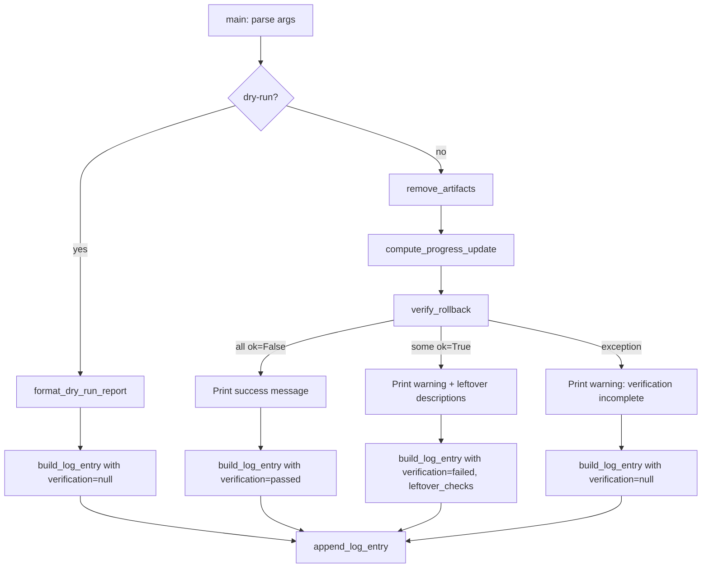

# Design Document: Rollback Verification

## Overview

After `rollback_module.py` removes a module's artifacts and updates the progress file, it currently has no way to confirm the rollback actually worked. This design adds a post-rollback verification step that re-runs the module's validator (from `validate_module.py`) to confirm all artifact checks now fail — meaning the module is back to a "not started" state. If any validator check still passes after rollback, the script warns the user about leftover artifacts.

The change is minimal: a new `verify_rollback` function in `rollback_module.py`, called after artifact removal and progress update in the `main` function, plus two new fields (`verification`, `leftover_checks`) on the `RollbackLogEntry` dataclass.

### Key Design Decisions

1. **Reuse existing validators** — the `VALIDATORS` dict in `validate_module.py` already defines per-module checks that return `(ok, description, detail)` tuples. Verification simply invokes the same validator and checks that all `ok` values are `False`.
2. **Verification is advisory, not blocking** — a failed verification prints a warning but does not undo the rollback or change the exit code. The rollback itself is the primary operation; verification is a confidence check.
3. **Dry-run skips verification entirely** — dry-run is a read-only preview. Running validators during dry-run would be misleading (artifacts haven't been removed yet, so checks would pass).
4. **Exception tolerance** — if the validator itself raises an exception (e.g., a validator tries to read a file that was just deleted and fails unexpectedly), the script catches it, warns, and continues. Verification should never break a rollback.
5. **Log entry records verification outcome** — the existing `RollbackLogEntry` gains a `verification` field (`"passed"`, `"failed"`, or `null`) and an optional `leftover_checks` list, providing an audit trail.

## Architecture



The verification step slots into the existing `main` flow between progress update and log entry creation. It does not alter the removal or progress logic.

## Components and Interfaces

### 1. `verify_rollback` Function

**Location:** `senzing-bootcamp/scripts/rollback_module.py`

**Purpose:** Invoke the module validator after rollback and classify the result.

```python
@dataclass
class VerificationResult:
    status: str | None          # "passed", "failed", or None
    leftover_checks: list[str]  # Descriptions of checks that still pass (ok=True)

def verify_rollback(module: int) -> VerificationResult:
    """Run the module validator and check that all checks return ok=False.
    
    Args:
        module: The module number that was rolled back (1–11).
    
    Returns:
        VerificationResult with:
          - status="passed" if all checks return ok=False
          - status="failed" if any check returns ok=True
          - status=None if the validator raises an exception
        leftover_checks contains the description strings of any
        checks where ok=True.
    
    The function catches all exceptions from the validator and
    returns VerificationResult(status=None, leftover_checks=[]).
    """
```

### 2. Updated `RollbackLogEntry`

**Location:** `senzing-bootcamp/scripts/rollback_module.py`

Two new fields added to the existing dataclass:

```python
@dataclass
class RollbackLogEntry:
    timestamp: str
    module: int
    removed_files: list
    removed_dirs: list
    skipped_missing: list
    failed_items: list
    database_restored: object    # bool or None
    backup_used: object          # str or None
    warnings: list
    verification: str | None     # NEW: "passed", "failed", or None
    leftover_checks: list[str]   # NEW: descriptions of still-passing checks
```

### 3. Updated `build_log_entry`

The existing `build_log_entry` function gains two new parameters:

```python
def build_log_entry(
    module,
    removal_result,
    database_restored,
    backup_used,
    warnings,
    verification=None,          # NEW
    leftover_checks=None,       # NEW
) -> RollbackLogEntry:
    """Construct a log entry from rollback results.
    
    Args:
        ...existing args...
        verification: "passed", "failed", or None.
        leftover_checks: List of check descriptions (default empty).
    """
```

### 4. Updated `main` Flow

The `main` function is modified to:

1. After artifact removal and progress update, check if `--dry-run` is active.
2. If dry-run: set `verification=None`, `leftover_checks=[]`.
3. If not dry-run: call `verify_rollback(module)`.
4. Print the appropriate message based on `VerificationResult.status`.
5. Pass `verification` and `leftover_checks` to `build_log_entry`.

### 5. Stdout Messages

| Condition | Message |
|-----------|---------|
| All checks ok=False | `"✅ Verification passed: Module {N} is back to 'not started' state."` |
| Some checks ok=True | `"⚠ Verification warning: {count} check(s) still passing after rollback:"` followed by each description |
| Validator exception | `"⚠ Verification could not be completed: {error}. Rollback was still performed."` |

## Data Models

### VerificationResult (new dataclass)

```python
@dataclass
class VerificationResult:
    status: str | None          # "passed" | "failed" | None
    leftover_checks: list[str]  # Empty when status is "passed" or None
```

### Updated RollbackLogEntry JSON

When verification passes:
```json
{"timestamp":"...","module":5,...,"verification":"passed","leftover_checks":[]}
```

When verification finds leftovers:
```json
{"timestamp":"...","module":5,...,"verification":"failed","leftover_checks":["Transformation program(s) created"]}
```

When verification is skipped or errors:
```json
{"timestamp":"...","module":5,...,"verification":null,"leftover_checks":[]}
```

## Correctness Properties

*A property is a characteristic or behavior that should hold true across all valid executions of a system — essentially, a formal statement about what the system should do. Properties serve as the bridge between human-readable specifications and machine-verifiable correctness guarantees.*

### Property 1: Validator Invocation with Correct Module

*For any* module number in [1, 11] and a non-dry-run rollback, the verification step shall invoke the Module_Validator for exactly that module number.

**Validates: Requirements 1.1**

### Property 2: Verification Passed — Output and Log

*For any* module whose validator returns a list of checks where all `ok` values are `False`, the verification step shall print a success message to stdout AND the resulting log entry shall contain `"verification": "passed"` with an empty `"leftover_checks"` list.

**Validates: Requirements 1.2, 3.1**

### Property 3: Verification Failed — Output and Log

*For any* module whose validator returns a list of checks where one or more `ok` values are `True`, the verification step shall print a warning listing each still-passing check's description AND the resulting log entry shall contain `"verification": "failed"` with a `"leftover_checks"` list containing exactly those descriptions.

**Validates: Requirements 1.3, 3.2**

### Property 4: Dry-Run Skips Verification

*For any* module number and a dry-run invocation, the Module_Validator shall not be called AND the resulting log entry shall contain `"verification": null`.

**Validates: Requirements 2.1, 2.2, 3.3**

## Error Handling

| Scenario | Handling |
|----------|----------|
| Module_Validator raises an exception | `verify_rollback` catches the exception, returns `VerificationResult(status=None, leftover_checks=[])`. The script prints a warning and continues. Log entry gets `verification: null`. (Req 1.4, 3.3) |
| Module number has no validator in VALIDATORS dict | `verify_rollback` returns `VerificationResult(status=None, leftover_checks=[])` and prints a warning. This shouldn't happen in practice since `main` already validates module numbers. |
| Validator returns an empty list of checks | Treated as "passed" (no checks to fail). This is correct — if there are no checks, there are no leftover artifacts. |

## Testing Strategy

### Property-Based Tests (Hypothesis)

The feature is well-suited for property-based testing because `verify_rollback` is a pure function (given a mocked validator) with clear input/output behavior. The verification logic, log entry construction, and dry-run bypass are all testable across a wide input space.

**Library:** [Hypothesis](https://hypothesis.readthedocs.io/) (Python) — already used in the project.

**Configuration:** Minimum 100 iterations per property test (`@settings(max_examples=100)`).

**Tag format:** `Feature: rollback-verification, Property {N}: {title}`

| Property | Test Strategy |
|----------|---------------|
| P1: Validator invocation | Generate random module numbers, mock VALIDATORS, run verify_rollback, verify the correct validator was called |
| P2: Verification passed | Generate random lists of (ok=False, desc, detail) tuples, run verify_rollback, verify status="passed" and success message printed, verify log entry |
| P3: Verification failed | Generate random lists of check tuples with at least one ok=True, run verify_rollback, verify status="failed", warning printed with correct descriptions, verify log entry |
| P4: Dry-run skips | Generate random module numbers, run main with --dry-run, verify validator not called and log entry has verification=null |

### Example-Based Unit Tests

| Test | What it verifies |
|------|-----------------|
| `verify_rollback` with all checks passing (ok=False) | Returns status="passed", empty leftover_checks |
| `verify_rollback` with mixed checks | Returns status="failed", correct leftover_checks |
| `verify_rollback` when validator raises RuntimeError | Returns status=None, empty leftover_checks |
| `verify_rollback` when validator returns empty list | Returns status="passed" |
| `build_log_entry` with verification="passed" | Log entry contains verification field |
| `build_log_entry` with verification="failed" and leftover_checks | Log entry contains both fields |
| `build_log_entry` with verification=None | Log entry contains null verification |
| Dry-run output does not mention verification | Dry-run report unchanged |
| `serialize_log_entry` round-trip with new fields | Serialize then parse preserves verification and leftover_checks |

### Integration Tests

| Test | What it verifies |
|------|-----------------|
| Full rollback of module 1 with artifacts present | Artifacts removed, verification passes, log entry has verification="passed" |
| Full rollback with leftover artifact (simulated) | Verification warns, log entry has verification="failed" |
| Dry-run rollback | No verification, log entry has verification=null |
| Rollback with validator exception (mocked) | Warning printed, rollback completes, log entry has verification=null |
