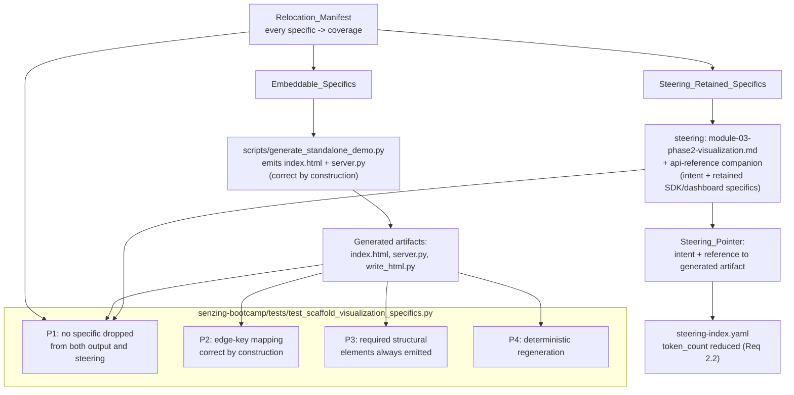

# Design Document

## Overview

Module 3's visualization is pinned by a large block of prescriptive prose in
`steering/module-03-phase2-visualization.md` (echoed in `visualization-guide.md`): use the Python
stdlib HTTP server, load D3.js v7 from the d3js.org CDN, write the page with a `write_html.py`
generator, use `function(){}` callbacks (not arrow functions), set explicit SVG `width`/`height`,
and — the highest-value lesson — **map each `/api/graph` edge's `source_entity_id`/`target_entity_id`
to D3's `source`/`target` before `forceLink`**, or the graph renders empty with no console error
(the "blank-graph silent failure", Critical Lesson 7). These constraints exist in steering precisely
because getting any one of them wrong is a silent failure the agent has hit before.

Keeping this much implementation detail in always-loadable steering is costly (context budget) and
brittle (it is restated in two steering files and must be kept in sync). The
`scaffold-visualization-specifics` feature relocates the specifics that **can** live in executable
code into the one local artifact that already emits working visualization code —
`scripts/generate_standalone_demo.py` — so they are **correct by construction** rather than
re-derived from prose, and then shrinks the steering to a **Steering_Pointer** (intent + a reference
to that generated artifact).

The important boundary, called out in the requirements' open questions, is that the Senzing
`generate_scaffold` tool is **server-side MCP** — this power cannot change its output. So the
relocation splits into two disjoint sets:

- **Embeddable_Specifics** — client-side rendering constraints that `generate_standalone_demo.py`
  already bakes into the `index.html`/`server.py` it emits (stdlib server, D3 v7 CDN, single
  self-contained page, `function(){}` callbacks, explicit SVG dimensions, TruthSet source colors,
  node-radius formula, and the edge-key mapping). These become correct by construction in the local
  generated output.
- **Steering_Retained_Specifics** — constraints that depend on the server-side MCP scaffold or live
  SDK and therefore **cannot** be embedded in the local static generator: the four `/api/*`
  endpoint schemas, SDK relationship discovery (`find_network_by_entity_id` /
  `SZ_ENTITY_INCLUDE_ALL_RELATIONS`), the `search_builder.py` enrichment spec, and the full
  four-tab Step 9 dashboard. These stay in steering (the API-reference companion already holds the
  bulk), because no locally generated artifact guarantees them.

This is a refactor of **where the specifics live**, not a change to visualization behavior. The
Module 3 Step 9 mandatory gate, Governing Rule 15 ("always create a visualization"), and the
`module3-first-visualization-guarantee` opt-out/deferred flow are all unchanged. The net-new work is
a **Relocation_Manifest** that records, for every specific, whether it is guaranteed by the generated
output or retained in steering; a test suite that enforces the manifest and the correct-by-construction
edge-key mapping; the steering reduction itself; and the `steering-index.yaml` token-count update.

### Design Goals

- Make the blank-graph silent failure **impossible in the locally generated output** by keeping the
  edge-key mapping correct by construction in `generate_standalone_demo.py` and locking it with a test
  (Requirements 1.2, 4.1).
- Shrink `module-03-phase2-visualization.md` to a Steering_Pointer for the Embeddable_Specifics while
  **retaining every constraint not guaranteed by the generated output** (Requirements 2.1, 2.3).
- Keep a single source of truth for each specific: executable code for Embeddable_Specifics, steering
  for Steering_Retained_Specifics — never both, never neither (Requirement 4.1).
- Preserve the Step 9 mandatory gate, the always-create rule, and consistency with
  `module3-first-visualization-guarantee` (Requirements 3.1, 3.3).
- Update the affected token counts in `steering-index.yaml` so the budget reflects the reduction
  (Requirement 2.2).

### Non-Goals

- Changing `generate_scaffold` (server-side MCP) or any SDK behavior — out of this power's control
  (requirements open question).
- Changing the visualization's runtime behavior, the four-tab Step 9 dashboard, or the `/api/*`
  contract (Requirement 3.2).
- Weakening the Step 9 mandatory gate or Governing Rule 15 (Requirement 3.1).
- Adding third-party dependencies — the generator and tests remain Python 3.11+ stdlib only
  (pytest + Hypothesis for tests).

## Architecture

The feature has three coordinated edits plus a test harness. The **Relocation_Manifest** is the
pivot: it is the declared list of every Visualization_Specific with its `coverage` (guaranteed by
generated output, retained in steering, or both). The steering reduction is driven by the manifest,
and the tests verify both sides against it so nothing is dropped from both places.



### What actually changes

1. **`scripts/generate_standalone_demo.py`** — the embedding site. The Embeddable_Specifics are
   *already* baked into `_INDEX_HTML` (the `drawGraph` edge mapping, `function(){}` callbacks,
   explicit SVG `width`/`height`, the D3 v7 CDN `<script>`, TruthSet color map, node-radius formula)
   and `_SERVER_PY` (stdlib `http.server`, localhost bind). Behavior does **not** change; the design
   treats this file as the authoritative source for those specifics and, where useful, adds short
   provenance comments naming the constraint each block satisfies so the manifest's detectors are
   stable.
2. **`steering/module-03-phase2-visualization.md`** — the verbose, duplicated client-rendering prose
   (the seven "CRITICAL LESSONS" list and the "D3.js Code Style Constraints" block that restates
   lessons 5/6/7) is replaced by a **Steering_Pointer**: a short section stating the intent and
   pointing to the generated standalone demo as the correct-by-construction reference for the
   client-rendering constraints. The silent-failure warning, the **render smoke check gate**, the
   four-tab dashboard spec, the `/api/*` schemas, SDK relationship discovery, and enrichment (the
   Steering_Retained_Specifics) stay, because the Step 9 dashboard is built by the agent with the
   server-side scaffold, not by the local generator.
3. **`steering/steering-index.yaml`** — recompute and lower `token_count` for
   `module-03-phase2-visualization.md` in both `file_metadata` and `modules.3.phases.phase2-visualization`,
   and adjust `budget.total_tokens`. The file stays in `split_allowlist` (unchanged rationale).

### Why the split is correct

The local generator produces a **single, self-contained force-directed graph** with data baked in —
so every client-side rendering rule it needs is inside the code it writes, and a test can assert the
output is correct by construction. The Step 9 dashboard, by contrast, has four tabs backed by four
live `/api/*` endpoints whose data comes from SDK calls (`find_network_by_entity_id`, the
relationship-inclusion export flag, `search_by_attributes` enrichment). None of that is produced by
`generate_standalone_demo.py`, and this power cannot change the server-side `generate_scaffold`. Per
Requirement 1.3 and 2.3, those specifics must remain in steering. The edge-key mapping lesson is the
subtle case: it is **guaranteed by construction in the local demo** *and* still needed as guidance for
the hand-built Step 9 dashboard graph — so the manifest marks it `coverage: both`, the steering keeps
the warning and the render smoke-check gate, and the pointer directs the reader to the generated
`drawGraph` as the worked reference.

### Supporting security note

`module-03-phase2-visualization.md` currently references the external URL `d3js.org/d3.v7.min.js` in
prose, which the workspace security rule flags (steering referencing external URLs = MEDIUM). After
reduction the CDN URL lives only in the generated artifact **code** (`_INDEX_HTML`'s `<script src>`),
where an external dependency reference belongs — not in steering prose facts. The reduction therefore
also removes the external-URL reference from steering.

## Components and Interfaces

### 1. `scripts/generate_standalone_demo.py` (existing — authoritative embedding site)

No behavior change. The design pins these existing pieces as the source of truth for the
Embeddable_Specifics; each is a stable detector target for the manifest tests:

| Piece | Embedded specific(s) | Detector (test keys on) |
|---|---|---|
| `_INDEX_HTML` `<script src="…/d3.v7.min.js">` | D3.js v7 from CDN | CDN `<script>` tag present exactly once |
| `_INDEX_HTML` `drawGraph()` edge map (`DATA.edges.map(function (e) { return { source: e.source_entity_id, target: e.target_entity_id, ... } })` **before** `d3.forceLink(links)`) | Edge-key mapping (Critical Lesson 7) | mapped `source`/`target` assignment appears before `forceLink(` in source order |
| `_INDEX_HTML` embedded `DATA` (`nodes[].entity_id`, `edges[].source_entity_id`/`target_entity_id`) | TruthSet-shaped graph data; no dangling edges | every edge endpoint resolves to a node `entity_id` |
| `_INDEX_HTML` callbacks (`function (event, d) {...}`) | `function(){}` callback syntax | no arrow-function (`=>`) used as a D3 callback |
| `_INDEX_HTML` `svg ... .attr("width", width).attr("height", height)` | Explicit SVG dimensions | `width`/`height` set as SVG attributes |
| `_INDEX_HTML` `COLORS = { CUSTOMERS: "#3b82f6", REFERENCE: "#22c55e", WATCHLIST: "#f59e0b" }` and `nodeRadius` | TruthSet source colors; node sizing | color map + radius formula present |
| `_SERVER_PY` (`from http.server import HTTPServer, SimpleHTTPRequestHandler`, bind `127.0.0.1`) | stdlib HTTP server, localhost only | stdlib import present; no Flask/FastAPI |
| `_build_write_html()` → generated `write_html.py` | Python-generator (`write_html.py`) pattern; single self-contained page | generated `write_html.py` writes `index.html` |
| `generate_demo(...)` / `_print_fallback(...)` | success clears owed marker; failure preserves it | unchanged; covered by existing first-visualization tests |

Optional light edit: add one-line provenance comments (e.g. `# Specific: explicit-svg-dimensions`)
above each embedded block so detectors match on a stable anchor rather than incidental formatting.
This is additive and does not change generated output.

### 2. Reduced steering: `steering/module-03-phase2-visualization.md`

The client-rendering prose is replaced by a Steering_Pointer section, for example:

> **Client-rendering constraints (correct by construction).** The stdlib HTTP server, D3.js v7,
> single self-contained page, `function(){}` callbacks, explicit SVG dimensions, and the
> `source_entity_id`/`target_entity_id` → `source`/`target` edge-key mapping are demonstrated,
> correct by construction, in the artifact emitted by `scripts/generate_standalone_demo.py`
> (its `drawGraph` is the reference for the edge-key mapping). When hand-building the Step 9
> dashboard graph, apply the **same** edge-key mapping before `forceLink` — omitting it is a silent
> failure (empty graph, no error). Verify with the render smoke check below.

Retained verbatim (Steering_Retained_Specifics — not guaranteed by any local generated output):

- The **⛔ MANDATORY GATE** block and the Governing Rule 15 scope note (Requirement 3.1).
- The **render smoke check** (generated-code check + rendered/data check) and its Fix_Instruction,
  because it guards the hand-built Step 9 dashboard graph.
- Step 9 four-tab dashboard component spec, the four `/api/*` endpoint summaries, SDK relationship
  discovery (`find_network_by_entity_id` / relationship-inclusion flag confirmed via MCP), and the
  `#[[file:...]]` reference to `module-03-visualization-api-reference.md`.

### 3. `steering/steering-index.yaml` token-count update

- `file_metadata['module-03-phase2-visualization.md'].token_count` and
  `modules.3.phases.phase2-visualization.token_count` recomputed via `scripts/measure_steering.py`.
- `budget.total_tokens` decremented by the same delta.
- `split_allowlist` entry for the file is retained (the render smoke check + dashboard build stay one
  continuous procedure).

### 4. New test module: `senzing-bootcamp/tests/test_scaffold_visualization_specifics.py`

Follows the project pattern: `sys.path` import of `scripts/`, class-based organization, pytest +
Hypothesis, `st_`-prefixed strategies, and a module-level `RELOCATION_MANIFEST` constant (test-owned
data). Generates artifacts into a `tmp_path` working directory by calling `generate_demo(...)` and
inspects the emitted `index.html` / `server.py` plus the reduced steering file.

## Data Models

### Relocation_Manifest

The single declared source of truth for the split. A module-level constant in the test module:

```python
@dataclass(frozen=True)
class Specific:
    """One Visualization_Specific and where it is guaranteed to live."""
    id: str                     # stable id, e.g. "edge-key-mapping"
    description: str            # human-readable constraint
    coverage: str               # "output" | "steering" | "both"
    output_marker: str | None   # substring/regex detectable in generated output (when covered there)
    steering_anchor: str | None # substring detectable in the reduced steering (when retained there)
```

| id | description | coverage | detector |
|---|---|---|---|
| `stdlib-http-server` | Python stdlib `http.server`, no third-party framework | output | `server.py` import |
| `d3-v7-cdn` | D3.js v7 from d3js.org CDN | output | `index.html` `<script src>` |
| `single-self-contained-page` | one HTML file, embedded CSS/JS | output | single `index.html` |
| `function-callbacks` | `function(){}` D3 callbacks, no arrow fns | output | no `=>` D3 callback |
| `explicit-svg-dimensions` | SVG `width`/`height` attributes | output | `.attr("width"...)` |
| `edge-key-mapping` | `*_entity_id` → `source`/`target` before `forceLink` | **both** | output map + steering warning/gate |
| `truthset-source-colors` | CUSTOMERS/REFERENCE/WATCHLIST color map | output | `COLORS` map |
| `node-radius-formula` | radius = min(max(8 + record_count×4, 8), 40) | output | `nodeRadius` |
| `api-endpoints` | four `/api/*` endpoint schemas | steering | api-reference anchor |
| `sdk-relationship-discovery` | `find_network_by_entity_id` / inclusion flag | steering | steering anchor |
| `search-enrichment` | `search_builder.py` enrichment + 10-cap | steering | api-reference anchor |
| `four-tab-dashboard` | Entity Graph / Merges / Stats / Probe tabs | steering | steering anchor |
| `mandatory-gate` | Step 9 unconditional gate + Rule 15 | steering | ⛔ gate anchor |

Coverage semantics used by Property 1: a specific is **covered** iff
(`coverage` includes `output` AND its `output_marker` is found in the generated artifacts) OR
(`coverage` includes `steering` AND its `steering_anchor` is found in the reduced steering). A
`both` specific must satisfy **both** sides. No specific may end up covered by neither.

### Embedded graph data (from `_INDEX_HTML` `DATA`)

| Field | Shape | Invariant checked |
|---|---|---|
| `nodes[]` | `{entity_id, entity_name, record_count, data_sources[]}` | `entity_id` unique |
| `edges[]` | `{source_entity_id, target_entity_id, match_key, relationship_type}` | both endpoints ∈ node `entity_id` set (no dangling edge → no blank graph) |

### Generated artifacts (from `generate_demo`)

| File | Contract |
|---|---|
| `write_html.py` | deterministic: writes byte-identical `index.html` on every run |
| `index.html` | contains all `output`-covered specifics; edge map precedes `forceLink` |
| `server.py` | stdlib `http.server`, binds `127.0.0.1` only |

## Correctness Properties

*A property is a characteristic or behavior that should hold true across all valid executions of a
system — essentially, a formal statement about what the system should do. Properties serve as the
bridge between human-readable specifications and machine-verifiable correctness guarantees.*

Each property below is universally quantified and implemented as a single Hypothesis property test.
Example counts come from the active Hypothesis profile baseline (`fast`=5 locally, `thorough`=100 in
CI) — no inline `@settings(max_examples=...)` is set. Each test is tagged
`# Feature: scaffold-visualization-specifics, Property {number}: {property_text}`.

### Property 1: No relocated constraint is silently dropped

*For any* specific in the Relocation_Manifest, it is **covered**: if its `coverage` includes
`output`, its `output_marker` is present in the artifacts emitted by `generate_standalone_demo.py`;
if its `coverage` includes `steering`, its `steering_anchor` is present in the reduced
`module-03-phase2-visualization.md` (or its api-reference companion); a `both` specific satisfies
both sides. No specific is covered by neither.

**Validates: Requirements 1.3, 2.3, 4.1**

### Property 2: Edge-key mapping is correct by construction (blank graph impossible)

*For any* generation of the standalone demo, the emitted `index.html` maps each edge's
`source_entity_id`/`target_entity_id` to D3's `source`/`target` **before** `forceLink` in source
order, and *for every* edge in the embedded graph data both endpoints resolve to an embedded node
`entity_id` — so the demo cannot render the blank-graph silent failure.

**Validates: Requirements 1.2, 3.2, 4.1**

### Property 3: Required client-rendering structural elements are always emitted

*For any* generation (any `output_dir` and `port`), the emitted artifacts contain every
`output`-covered Embeddable_Specific: the stdlib `http.server` import with a localhost bind and no
third-party HTTP framework, exactly one D3.js v7 CDN `<script>`, a single self-contained
`index.html`, `function(){}` D3 callbacks with no arrow-function callbacks, explicit SVG
`width`/`height` attributes, and the TruthSet source-color map with the node-radius formula.

**Validates: Requirements 1.1, 3.2, 4.1**

### Property 4: Regeneration is deterministic

*For any* output directory, generating the demo and then re-running the emitted `write_html.py` any
number of times yields byte-identical `index.html`, `server.py`, and `write_html.py` — the generated
output is reproducible and never varies between runs.

**Validates: Requirements 1.1**

## Error Handling

This feature adds no new runtime surface; error handling is inherited from the existing generator and
the CI validators.

| Failure mode | Handling |
|---|---|
| Generator write failure (`OSError`) | Existing `generate_demo` catches it, prints Step-9-style manual fallback, leaves the `first_visualization: owed` marker unchanged so the deferred guarantee still applies (Requirement 3.3). Unchanged by this feature. |
| Generated `write_html.py` fails to produce `index.html` | Existing `_print_fallback` path; `generate_demo` returns `False` and the owed marker is preserved. Unchanged. |
| A relocated specific is missing from **both** output and steering | Caught at test time by Property 1 (the build fails), not at runtime — this is the anti-regression guard for the reduction (Requirement 2.3). |
| Edge-key mapping regresses (map removed or moved after `forceLink`, or a dangling edge is introduced) | Caught by Property 2 before merge; prevents reintroducing the blank-graph silent failure (Requirement 1.2). |
| `steering-index.yaml` token_count drifts from the reduced file | Caught by `measure_steering.py --check` in CI (Requirement 2.2). |
| Reduced steering accidentally drops the mandatory gate or Rule 15 | Caught by the `mandatory-gate` manifest specific (Property 1) and the example gate test (Requirement 3.1). |

The generator remains non-fatal to the bootcamp journey: any failure degrades to the documented
manual fallback and preserves the deferred first-visualization guarantee.

## Testing Strategy

Tests live in `senzing-bootcamp/tests/test_scaffold_visualization_specifics.py`, follow the project
pattern (pytest + Hypothesis, class-based, `sys.path` import of `scripts/`), and property tests draw
their example count from the active Hypothesis profile — no hand-set `max_examples`. Fixtures are
synthetic; the generator's own embedded TruthSet-shaped sample carries no PII (power-distribution
safety rule).

### Property-based tests (Hypothesis)

PBT IS appropriate for the relocation invariants: the manifest coverage, the edge-key mapping, the
structural-element presence, and regeneration determinism are all universally quantified over the
manifest set, the embedded edges, and generation parameters. One property test per property above:

- **Property 1** — strategy `st_manifest_specific()` draws a `Specific` from `RELOCATION_MANIFEST`;
  the test generates the artifacts once (module-scoped fixture) and asserts the drawn specific is
  covered per its `coverage`. Also run as a parametrized sweep over the full manifest so every entry
  is checked at least once regardless of sampling.
- **Property 2** — strategy `st_generation_params()` draws `output_dir` names and `port` values;
  the test generates into `tmp_path`, asserts the `source`/`target` mapping precedes `forceLink` in
  the emitted `index.html`, parses the embedded `DATA`, and asserts every edge endpoint is in the
  node id set.
- **Property 3** — reuses `st_generation_params()`; asserts each `output`-covered marker is present
  and that no arrow function is used as a D3 callback.
- **Property 4** — reuses `st_generation_params()`; generates, captures bytes, re-runs the emitted
  `write_html.py` N times (N drawn small), asserts byte-identical output each time.

Custom strategies are `st_`-prefixed. `RELOCATION_MANIFEST` is a module-level constant; a guard test
asserts it lists every specific named in the design's Data Models table (so the manifest itself
cannot silently shrink).

### Unit / example and smoke tests

Complement the properties with focused checks:

- **Steering_Pointer present, duplication gone (Req 2.1):** assert the reduced steering references
  `generate_standalone_demo.py` as the client-rendering reference and no longer contains the
  duplicated seven-lesson / D3-code-style block.
- **Mandatory gate + Rule 15 retained (Req 3.1):** assert the ⛔ MANDATORY GATE block and the Rule 15
  scope note remain in the reduced steering.
- **Render smoke check retained (Req 2.3):** assert the generated-code check and its Fix_Instruction
  remain (they guard the hand-built Step 9 dashboard).
- **First-visualization consistency (Req 3.3):** example test that `generate_demo` clears the owed
  marker (`satisfied_by="standalone_demo"`) on success and leaves it on a simulated write failure —
  reusing the existing first-visualization progress helpers.
- **Token-count consistency (Req 2.2):** smoke test / CI `measure_steering.py --check` asserting the
  recorded `token_count` for `module-03-phase2-visualization.md` matches the measured value.

### Integration with CI

The new test module runs under the existing pytest job; `measure_steering.py --check` and
`validate_commonmark.py` in `validate-power.yml` cover the steering-index and Markdown consistency of
the reduced steering file. No new CI wiring is required.
