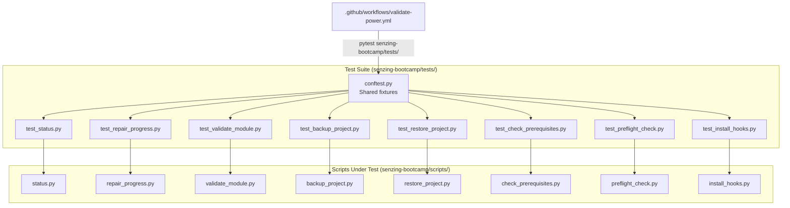

# Design Document: Script Test Suite

## Overview

This feature adds a comprehensive pytest-based test suite for the 8 Python scripts in `senzing-bootcamp/scripts/`. The scripts handle bootcamp lifecycle operations — status reporting, module validation, progress repair, backup/restore, prerequisite checking, pre-flight checks, CommonMark validation, and hook installation. All scripts are currently untested.

The test suite lives in `senzing-bootcamp/tests/` (inside the power distribution, per repository organization policy) and uses `pytest` with `unittest.mock` for isolation. Each script gets a dedicated test module. A shared `conftest.py` provides reusable fixtures for temporary directories, mock file systems, and sample data. The CI workflow at `.github/workflows/validate-power.yml` is updated to run these tests.

The scripts are primarily I/O-heavy CLI tools that read/write files, check environment state, and print colored output. The testing strategy focuses on isolating pure logic (detection functions, validation checks, exclusion filters) from I/O side effects using `tmp_path` fixtures and `unittest.mock`.

## Architecture



### Test Isolation Strategy

Each script uses `os.chdir()`, `Path(__file__)`, or reads from fixed paths. Tests isolate these by:

1. Using `tmp_path` (pytest built-in) as a fake project root
2. Using `monkeypatch.chdir(tmp_path)` to redirect working-directory-relative paths
3. Using `unittest.mock.patch` to mock `sys.argv`, `shutil.which`, `subprocess.run`, and `sys.exit`
4. Importing script functions directly rather than running scripts as subprocesses

## Components and Interfaces

### conftest.py — Shared Fixtures

| Fixture | Scope | Description |
|---------|-------|-------------|
| `project_root` | function | `tmp_path` configured as a fake project root with `monkeypatch.chdir` |
| `sample_progress_data` | session | Returns a factory function that creates valid `bootcamp_progress.json` content with configurable `modules_completed`, `current_module`, and `language` |
| `write_progress_file` | function | Writes `config/bootcamp_progress.json` into `project_root` from a dict |
| `mock_no_color` | function | Sets `NO_COLOR=1` environment variable to disable ANSI codes in output |

### Test Modules

Each test module imports functions from the corresponding script and tests them in isolation:

| Test Module | Script Under Test | Key Functions Tested |
|---|---|---|
| `test_status.py` | `status.py` | `main()`, `sync_progress_tracker()`, `color_supported()` |
| `test_repair_progress.py` | `repair_progress.py` | `detect()`, `detect_steps()`, `main()` |
| `test_validate_module.py` | `validate_module.py` | `check_path()`, `check_file_not_empty()`, `check_dir_has_files()`, `validate_module_N()`, `VALIDATORS` dict |
| `test_backup_project.py` | `backup_project.py` | `_is_excluded()`, `main()` |
| `test_restore_project.py` | `restore_project.py` | `main()` |
| `test_check_prerequisites.py` | `check_prerequisites.py` | `check_command()`, `main()` |
| `test_preflight_check.py` | `preflight_check.py` | `main()`, `_get_total_memory_gb()` |
| `test_install_hooks.py` | `install_hooks.py` | `discover_hooks()`, `install_hooks()` |

## Data Models

### Progress Data (JSON)

```json
{
  "modules_completed": [1, 2, 3],
  "current_module": 4,
  "language": "python",
  "database_type": "sqlite",
  "data_sources": [],
  "current_step": 2,
  "step_history": {
    "1": {"last_completed_step": 10, "updated_at": "2025-01-01T00:00:00+00:00"}
  }
}
```

### Validation Result Tuple

Each `check_*` function in `validate_module.py` returns:

```python
(ok: bool, description: str, detail: str)
```

### Hook Discovery Entry

`discover_hooks()` returns a list of tuples:

```python
(filename: str, display_name: str, description: str)
```


## Correctness Properties

*A property is a characteristic or behavior that should hold true across all valid executions of a system — essentially, a formal statement about what the system should do. Properties serve as the bridge between human-readable specifications and machine-verifiable correctness guarantees.*

### Property 1: Status computation correctness

*For any* subset of modules from {1..12} marked as completed in Progress_Data, `status.py` SHALL compute the completion percentage as `len(completed) * 100 // 12` and report the correct status label ("Not Started" for empty, "Complete" for all 12, "In Progress" or "Ready to Start" otherwise).

**Validates: Requirements 2.1**

### Property 2: Sync tracker reflects progress data

*For any* valid Progress_Data with a set of completed modules and a current module, running `sync_progress_tracker()` SHALL produce a `PROGRESS_TRACKER.md` file where each completed module is marked with ✅, the current module is marked with 🔄, and remaining modules are marked with ⬜.

**Validates: Requirements 2.4**

### Property 3: Artifact detection correctness

*For any* subset of module artifacts created on disk, `detect()` in `repair_progress.py` SHALL return exactly the set of module numbers whose artifacts are present.

**Validates: Requirements 3.1**

### Property 4: Repair progress round-trip

*For any* set of module artifacts on disk, calling `detect()` to get the completed set, then running `main()` with `--fix` to write Progress_Data, then calling `detect()` again SHALL produce the same set of completed modules.

**Validates: Requirements 3.5**

### Property 5: Module validator passes on complete artifacts

*For any* module number in {1..12}, when all required artifacts for that module exist on disk, the corresponding validator function SHALL return results where every tuple has `ok=True`.

**Validates: Requirements 4.1**

### Property 6: Module validator fails on missing artifacts

*For any* module number in {1..12} that has at least one required artifact, when that module's required artifacts are absent, the corresponding validator function SHALL return at least one result tuple with `ok=False`.

**Validates: Requirements 4.2**

### Property 7: Exclusion filter correctness

*For any* file path where at least one path component matches an entry in `EXCLUDE_PATTERNS`, `_is_excluded()` SHALL return `True`. *For any* file path where no component matches any exclusion pattern, `_is_excluded()` SHALL return `False`.

**Validates: Requirements 5.2, 5.3**

### Property 8: check_command reflects command availability

*For any* command name, when `shutil.which` returns a non-None path, `check_command()` SHALL increment the passed count. When `shutil.which` returns `None` and the command is required, `check_command()` SHALL increment the failed count.

**Validates: Requirements 7.1, 7.2, 7.5**

### Property 9: Language runtime detection prevents false failure

*For any* single language runtime (python3, java, dotnet, rustc, node) being available while all others are absent, `check_prerequisites.py` SHALL NOT report a language runtime failure.

**Validates: Requirements 7.4**

### Property 10: Hook discovery completeness

*For any* set of `.kiro.hook` files in a directory, `discover_hooks()` SHALL return exactly one entry per hook file, and the set of filenames in the result SHALL equal the set of hook files in the directory.

**Validates: Requirements 9.1**

### Property 11: Unknown hook name derivation

*For any* hook filename not present in the known `HOOKS` list, `discover_hooks()` SHALL derive the display name by removing the `.kiro.hook` suffix, replacing hyphens with spaces, and title-casing the result.

**Validates: Requirements 9.2**

### Property 12: Hook install copy and skip correctness

*For any* list of hooks to install where some already exist at the destination and some do not, `install_hooks()` SHALL copy each non-existing hook and skip each existing one, returning `(installed, skipped)` counts that sum to the number of hooks with valid source files.

**Validates: Requirements 9.3, 9.4, 9.5**

## Error Handling

| Scenario | Script | Expected Behavior |
|---|---|---|
| Missing `bootcamp_progress.json` | `status.py` | Reports "Not Started", no exception |
| Corrupted JSON in progress file | `status.py`, `repair_progress.py` | Catches `JSONDecodeError`, falls back to defaults |
| Empty `modules_completed` list | `status.py` | Treats as not started (module 1, 0%) |
| Out-of-range module numbers in progress | `status.py` | Processes without crash; out-of-range values ignored in display |
| Missing backup file path | `restore_project.py` | Prints usage, exits with code 1 |
| Non-ZIP backup file | `restore_project.py` | Prints error, exits with code 1 |
| Missing BACKUP_ITEMS directories | `backup_project.py` | Skips missing items, continues with available ones |
| `shutil.which` returns None | `check_prerequisites.py`, `preflight_check.py` | Reports command as missing, increments failure/warning count |
| `subprocess.run` timeout | `check_prerequisites.py`, `preflight_check.py` | Catches exception, returns "unknown" version |
| Empty directory for `check_dir_has_files` | `validate_module.py` | Returns `(False, description, "No pattern files in dir/")` |
| Empty file for `check_file_not_empty` | `validate_module.py` | Returns `(False, description, "path is empty")` |
| Write permission denied | `preflight_check.py` | Catches `OSError`, increments ERRORS |

## Testing Strategy

### Framework and Dependencies

- **Test framework**: `pytest` (already used in the project's top-level `tests/`)
- **Property-based testing**: `hypothesis` (already a dependency in CI — `pip install pytest hypothesis`)
- **Mocking**: `unittest.mock` (stdlib)
- **No additional dependencies required**

### Test Organization

```
senzing-bootcamp/tests/
├── conftest.py
├── test_status.py
├── test_repair_progress.py
├── test_validate_module.py
├── test_backup_project.py
├── test_restore_project.py
├── test_check_prerequisites.py
├── test_preflight_check.py
└── test_install_hooks.py
```

### Property-Based Testing Configuration

- Library: **Hypothesis** (Python)
- Minimum iterations: 100 per property (Hypothesis default `max_examples=100`)
- Each property test is tagged with a comment: `# Feature: script-test-suite, Property N: <title>`
- Properties 1–12 from the Correctness Properties section are each implemented as a single `@given`-decorated test

### Unit Test Coverage

Example-based and edge-case tests cover:
- Specific CLI argument parsing (`--next 1`, `--sync`, `--fix`)
- Error scenarios (missing files, invalid ZIP, corrupted JSON)
- Boundary conditions (empty lists, out-of-range values, empty files/directories)
- Environment variable effects (`NO_COLOR`)
- `VALIDATORS` dictionary completeness (all 12 keys present)

### CI Integration

The existing `.github/workflows/validate-power.yml` already has a "Run tests" step. It will be updated to run `python -m pytest senzing-bootcamp/tests/ tests/ -v --tb=short` so both the new script tests and existing tests execute. The workflow already installs `pytest` and `hypothesis`.
