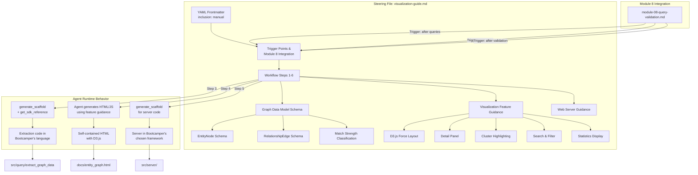
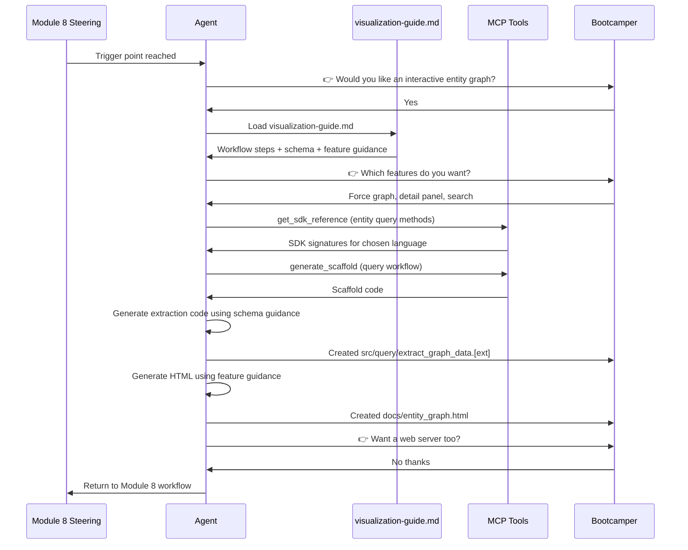

# Design Document: Senzing Visualization Steering File

## Overview

This feature produces a single steering file (`senzing-bootcamp/steering/visualization-guide.md`) that guides the agent when a bootcamper decides to build an interactive entity graph visualization. No Python scripts, no test files, no executable code ships with the power. The agent uses the steering file's knowledge — graph data model schema, D3.js integration patterns, interactive feature guidance, web server options — combined with MCP tools (`generate_scaffold`, `get_sdk_reference`, `find_examples`) to help the bootcamper write the visualization code themselves, in their chosen language, with their chosen web framework, for their own data.

The steering file follows the same conventions as all other files in `senzing-bootcamp/steering/`: YAML frontmatter with `inclusion: manual`, numbered workflow steps, `> **Agent instruction:**` blocks, WAIT markers after every question, and `👉` prefixes on input-required questions.

The deliverable replaces the current `senzing-bootcamp/scripts/generate_visualization.py` approach. Instead of shipping a Python script, the power ships knowledge that the agent applies dynamically at runtime.

## Architecture



### Document Flow



## Components and Interfaces

### 1. Steering File Structure

The steering file is a single markdown document with these top-level sections:

| Section | Purpose |
| ------- | ------- |
| YAML Frontmatter | `inclusion: manual` — loaded only on demand |
| Header & Purpose | One-line purpose, before/after framing, prerequisites |
| Trigger Points | When the agent should offer visualization |
| Agent Workflow (Steps 1-6) | Sequential steps the agent follows |
| Graph Data Model Schema | EntityNode and RelationshipEdge JSON schemas |
| Match Strength Classification | Match level → category → color mapping |
| Visualization Feature Guidance | D3.js layout, detail panel, clustering, search, stats |
| Web Server Guidance | Framework-agnostic server endpoints and generation |
| File Placement Rules | Where generated files go in the project |

### 2. YAML Frontmatter

```yaml
---
inclusion: manual
---
```

This matches the convention used by `module-08-query-validation.md`, `design-patterns.md`, `common-pitfalls.md`, and all other non-always-loaded steering files.

### 3. Trigger Points and Module 8 Integration

The steering file documents three trigger points where the agent should offer visualization:

1. After running exploratory queries in Module 8 step 3
2. When the bootcamper explicitly asks to "visualize", "show me the entity graph", or "generate a visualization"
3. After validation results are presented in Module 8 step 6

The existing `module-08-query-validation.md` step 3 currently references `senzing-bootcamp/scripts/generate_visualization.py`. This must be updated to reference `visualization-guide.md` instead. The offer text changes from running a script to loading the steering file and walking the bootcamper through building their own visualization.

After visualization is complete, the agent returns to the Module 8 workflow by referencing `module-08-query-validation.md`.

The `steering-index.yaml` file must be updated to register the new steering file under the `keywords` section:

```yaml
keywords:
  # ... existing entries ...
  visualization: visualization-guide.md
  graph: visualization-guide.md
  entity graph: visualization-guide.md
```

### 4. Agent Workflow Steps

The steering file defines six sequential steps, each with a WAIT marker:

**Step 1 — Confirm intent:** Ask the bootcamper if they want a visualization. WAIT for response. If they decline, return to Module 8.

**Step 2 — Gather requirements:** Ask what data source(s) to visualize and which interactive features to include (present the feature menu from the Visualization Feature Guidance section). WAIT for response.

**Step 3 — Generate data extraction code:**

> **Agent instruction:** Read the bootcamper's Chosen_Language from `config/bootcamp_preferences.yaml`. Load the appropriate language steering file (`lang-python.md`, `lang-java.md`, etc.). Use `get_sdk_reference` to get correct SDK method signatures for the chosen language. Use `generate_scaffold` with `workflow='query'` and the chosen language. Generate extraction code that follows the Graph Data Model Schema section, iterating over loaded records using `get_entity_by_record_id`. Save to `src/query/extract_graph_data.[ext]`.

WAIT for the bootcamper to run the extraction and confirm the output JSON.

**Step 4 — Generate HTML visualization:** Using the feature guidance sections for whichever features the bootcamper selected, generate a single self-contained HTML file with D3.js, CSS, and data inline. Save to `docs/entity_graph.html`. WAIT for the bootcamper to open it and provide feedback.

**Step 5 — Optional web server:** Ask if the bootcamper wants a served deployment. If yes, follow the Web Server Guidance section. If no, skip. WAIT for response.

**Step 6 — Iterate and refine:** Ask if the bootcamper wants changes. If yes, regenerate the affected component using the same MCP tools and guidance. WAIT for response. When done, return to Module 8.

### 5. Graph Data Model Schema

The steering file documents the intermediate JSON structure that extraction code produces and the HTML visualization consumes. This is the contract between backend and frontend.

**Top-level structure:**

```json
{
  "metadata": {
    "dataSource": "string — primary data source name",
    "generatedAt": "string — ISO 8601 timestamp",
    "entityCount": "number — total entities",
    "recordCount": "number — total records across all entities",
    "relationshipCount": "number — total relationships",
    "dataSources": ["string — all unique data source names"]
  },
  "nodes": ["EntityNode[]"],
  "edges": ["RelationshipEdge[]"]
}
```

**EntityNode schema:**

| Field | Type | Description |
| ----- | ---- | ----------- |
| entityId | number | Senzing entity ID |
| primaryName | string | Best name from resolved entity |
| recordCount | number | Number of contributing records |
| dataSources | string[] | Unique data source names contributing records |
| primaryDataSource | string | Data source contributing the most records |
| records | object[] | Array of `{ recordId: string, dataSource: string }` |
| features | object | Map of feature type → string[] values (NAME, ADDRESS, PHONE, EMAIL, etc.) |

**RelationshipEdge schema:**

| Field | Type | Description |
| ----- | ---- | ----------- |
| sourceEntityId | number | Entity ID of the source node |
| targetEntityId | number | Entity ID of the target node |
| matchLevel | number | Senzing match level integer |
| matchStrength | string | Categorical classification: "strong", "moderate", or "weak" |
| sharedFeatures | string[] | Feature types shared between the two entities |

### 6. Match Strength Classification and Color Scheme

The steering file documents the mapping from Senzing match levels to categorical strengths and visual colors:

| Senzing Match Level | Classification | Edge Color | Hex |
| ------------------- | -------------- | ---------- | --- |
| 1 (resolved) | strong | green | #22c55e |
| 2 (possibly same) | moderate | orange | #f59e0b |
| 3+ (possibly related) | weak | red | #ef4444 |

For cluster highlighting by match strength, node colors are based on the average match level of connected relationships:

- Average ≤ 1.5 → green (strong)
- Average ≤ 2.5 → orange (moderate)
- Average > 2.5 → red (weak)
- No relationships → gray (#9ca3af)

### 7. Visualization Feature Guidance

The steering file provides guidance sections for each feature the agent can generate. The agent presents these as a menu and generates only the features the bootcamper selects.

**Force-Directed Graph Layout (D3.js):**

- Use D3.js v7 force simulation
- Node sizing proportional to record count (minimum radius for single-record entities)
- Edge coloring by match strength (green/orange/red per the classification table)
- Drag-to-reposition nodes
- Zoom and pan on the SVG canvas
- Tooltip on hover showing entity name

**Entity Detail Panel:**

- Click a node to open a side panel
- Display: entity ID, primary name, all contributing data sources, record list (record ID + data source), shared features that caused resolution
- Click another node or click away to dismiss

**Cluster Highlighting:**

- A control (dropdown or toggle) to switch between: data source coloring, match strength coloring, no clustering
- Data source mode: each unique data source gets a color from D3 `schemeCategory10`, node colored by `primaryDataSource`
- Match strength mode: node colored by average match strength of connected relationships
- Legend updates to reflect the active mode

**Search and Filter:**

- Text input that filters nodes by primary name or record ID (case-insensitive substring match)
- Matching nodes highlighted, non-matching nodes dimmed (reduced opacity)
- "No matches found" message when search returns zero results
- Clear button to reset the filter

**Summary Statistics Display:**

- Total entity count, total record count, total relationship count
- Number of unique data sources
- Cross-source match rate (entities with records from >1 data source / total entities × 100%)

### 8. Web Server Guidance

The steering file provides framework-agnostic server guidance for when the bootcamper wants a served deployment:

**Endpoints:**

| Endpoint | Method | Purpose |
| -------- | ------ | ------- |
| `/` | GET | Serve the visualization HTML |
| `/health` | GET | Return `{ "status": "ok", "lastRefresh": "<ISO timestamp>" }` |
| `/refresh` | POST | Re-query Senzing SDK, regenerate graph data, return updated JSON |

**Generation approach:**

- Ask the bootcamper which web framework they prefer (WAIT for response)
- Use `generate_scaffold` with the chosen language and framework
- Save server code to `src/server/`
- If the bootcamper wants container deployment, generate a Dockerfile appropriate for the chosen language and framework

**If no served deployment requested:** Produce only the self-contained HTML file. No server code generated.

### 9. MCP Tool References

The steering file instructs the agent to use these MCP tools at specific points:

| Tool | When Used | Purpose |
| ---- | --------- | ------- |
| `get_sdk_reference` | Before generating extraction code (Step 3) | Get correct SDK method signatures for the chosen language |
| `generate_scaffold` | Step 3 (extraction), Step 5 (server) | Generate code scaffolds in the chosen language |
| `find_examples` | Step 3 (extraction), Step 5 (server) | Find relevant query and visualization patterns |
| `search_docs` | When bootcamper asks about Senzing features | Get current Senzing documentation |
| `explain_error_code` | When SDK errors occur during extraction | Explain Senzing error codes |

### 10. Data Extraction Guidance

The steering file provides language-agnostic extraction logic (what to do, not how in a specific language):

1. Read the bootcamper's Chosen_Language from `config/bootcamp_preferences.yaml`
2. Load the appropriate language steering file for language-specific best practices
3. Initialize the Senzing SDK engine using `database/G2C.db`
4. Iterate over loaded records using `get_entity_by_record_id(data_source, record_id)` — never iterate over guessed entity ID ranges
5. Deduplicate entities (multiple records map to the same entity — track seen entity IDs)
6. For each unique entity, extract: entity ID, primary name, record count, contributing data sources, record list
7. For each unique entity, use `get_entity_by_entity_id` with relationship flags to retrieve relationships
8. For each relationship, extract: source entity ID, target entity ID, match level, shared features
9. Classify match strength using the match level → category mapping
10. If entity count exceeds 500, warn the bootcamper about potential rendering performance and offer to limit output
11. On per-entity SDK errors, log the error with entity/record context and continue processing
12. Write the assembled Graph Data Model as JSON

The HTML/JavaScript visualization frontend is always generated in JavaScript (using D3.js) regardless of the bootcamper's Chosen_Language, since it runs in the browser.

### 11. File Placement

| Generated File | Location | Notes |
| -------------- | -------- | ----- |
| Extraction code | `src/query/extract_graph_data.[ext]` | Extension matches chosen language |
| Graph data JSON | `data/temp/graph_data.json` | Intermediate output consumed by HTML |
| Visualization HTML | `docs/entity_graph.html` | Self-contained, openable in any browser |
| Server code | `src/server/` | Only if served deployment requested |
| Dockerfile | `src/server/Dockerfile` | Only if container deployment requested |

### 12. Error Handling Guidance

The steering file instructs the agent to generate these error handling patterns in the extraction code:

| Error Condition | Handling | User Feedback |
| --------------- | -------- | ------------- |
| SDK not initialized / missing database | Exit with clear error | "Senzing database not found at database/G2C.db. Complete Module 6 first." |
| Empty database (no entities) | Exit with clear error | "No entities found. Load data using Module 6 first." |
| Per-entity SDK error | Log warning, skip entity, continue | "Warning: Failed to retrieve entity for record {record_id}: {error}. Skipping." |
| Per-relationship SDK error | Log warning, skip relationship, continue | "Warning: Failed to retrieve relationships for entity {entity_id}: {error}. Skipping." |
| Entity count > 500 | Warn and offer to limit | "Warning: {count} entities found. Rendering may be slow. Limit to 500?" |
| No relationships found | Continue with isolated nodes | "No relationships found. Graph will show isolated nodes." |

For browser-side errors, the steering file instructs the agent to wrap D3.js initialization in a try/catch that displays a user-friendly error message in the graph area if JSON parsing or rendering fails.

## Data Models

The primary data model for this feature is the Graph Data Model schema documented in the steering file (see Components section 5 above). This schema serves as the contract between the extraction code (backend, any language) and the visualization (frontend, JavaScript/D3.js).

There are no database models, no ORM entities, and no persistent state. The graph data is a transient JSON structure written to `data/temp/graph_data.json` and embedded inline in the HTML file.

### Schema Summary

```json
{
  "metadata": {
    "dataSource": "CUSTOMERS",
    "generatedAt": "2026-06-15T10:30:00Z",
    "entityCount": 150,
    "recordCount": 200,
    "relationshipCount": 45,
    "dataSources": ["CUSTOMERS", "CRM"]
  },
  "nodes": [
    {
      "entityId": 1,
      "primaryName": "John Smith",
      "recordCount": 3,
      "dataSources": ["CUSTOMERS", "CRM"],
      "primaryDataSource": "CUSTOMERS",
      "records": [
        { "recordId": "CUST-001", "dataSource": "CUSTOMERS" },
        { "recordId": "CRM-042", "dataSource": "CRM" }
      ],
      "features": {
        "NAME": ["John Smith", "J. Smith"],
        "ADDRESS": ["123 Main St, Springfield IL"],
        "PHONE": ["555-123-4567"]
      }
    }
  ],
  "edges": [
    {
      "sourceEntityId": 1,
      "targetEntityId": 2,
      "matchLevel": 1,
      "matchStrength": "strong",
      "sharedFeatures": ["NAME", "ADDRESS"]
    }
  ]
}
```

## Correctness Properties

*A property is a characteristic or behavior that should hold true across all valid executions of a system — essentially, a formal statement about what the system should do. Properties serve as the bridge between human-readable specifications and machine-verifiable correctness guarantees.*

Since this feature produces a steering file (a markdown document) rather than executable code, the correctness properties focus on the structural and content integrity of the steering file itself. These properties can be validated by parsing the steering file and checking that required patterns, sections, and content are present.

### Property 1: Every major workflow step has a WAIT marker

*For any* numbered workflow step (Steps 1-6) in the steering file, there SHALL be a WAIT marker (the text "WAIT") following the step's content, ensuring the agent pauses for bootcamper input before proceeding.

**Validates: Requirements 2.2**

### Property 2: Graph Data Model schema documents all required fields

*For any* field required by the EntityNode schema (entityId, primaryName, recordCount, dataSources, primaryDataSource, records, features) or the RelationshipEdge schema (sourceEntityId, targetEntityId, matchLevel, matchStrength, sharedFeatures), the steering file SHALL contain a documented entry with the field's name, type, and description.

**Validates: Requirements 3.1, 3.5, 3.6**

### Property 3: All visualization features have guidance sections

*For any* visualization feature in the required set (force-directed graph layout, entity detail panel, cluster highlighting, search and filter, summary statistics), the steering file SHALL contain a dedicated guidance section describing how the agent should generate that feature.

**Validates: Requirements 4.1**

### Property 4: Match strength classification is complete and consistent

*For any* Senzing match level integer (1, 2, or 3+), the steering file SHALL document a mapping to exactly one categorical strength ("strong", "moderate", or "weak") and exactly one edge color hex value (#22c55e, #f59e0b, or #ef4444 respectively). No match level SHALL map to more than one category.

**Validates: Requirements 4.3**

### Property 5: MCP tool references appear at correct workflow steps

*For any* workflow step that involves generating backend code (Steps 3 and 5), the steering file SHALL contain instructions to use `get_sdk_reference` for SDK method signatures and `generate_scaffold` with the bootcamper's chosen language for code generation, ensuring the agent never guesses SDK method names or hand-codes Senzing-specific logic.

**Validates: Requirements 2.3, 2.4, 2.5, 7.3**

## Error Handling

Error handling for this feature operates at two levels:

### Steering File Content Errors

If the steering file is missing required sections or contains incorrect guidance, the agent may generate incorrect code for the bootcamper. The correctness properties above serve as the validation mechanism — they define what "correct" means for the steering file's content.

### Agent Runtime Error Guidance

The steering file instructs the agent how to handle errors that occur during the visualization workflow:

1. **SDK not available:** If the Senzing SDK is not initialized, instruct the bootcamper to complete Module 6 first. Do not attempt to generate extraction code without a working SDK.
2. **Per-entity extraction errors:** Log the error with record context, skip the entity, continue processing. Never abort the entire extraction for a single entity failure.
3. **Large dataset warning:** When entity count exceeds 500, warn about browser rendering performance and offer to limit output. Do not silently truncate.
4. **No relationships found:** Continue with isolated nodes. This is a valid result, not an error.
5. **Browser rendering failure:** The generated HTML should include a try/catch wrapper around D3.js initialization that displays a user-friendly error message instead of a blank page.
6. **MCP tool failure:** If `generate_scaffold` or `get_sdk_reference` fails, follow the standard MCP failure protocol from `agent-instructions.md` (retry once, then load `mcp-offline-fallback.md`).

## Testing Strategy

Since the deliverable is a steering file (a markdown document), not executable code, the testing strategy focuses on validating that the steering file works correctly when the agent uses it.

### Structural Validation (Automated)

These checks can be automated by parsing the steering file:

- File exists at `senzing-bootcamp/steering/visualization-guide.md`
- YAML frontmatter contains `inclusion: manual`
- File contains numbered workflow steps (1 through 6)
- Each workflow step is followed by a WAIT marker
- File contains `> **Agent instruction:**` blocks
- File contains `👉` prefixes on input-required questions
- `steering-index.yaml` contains `visualization`, `graph`, and `entity graph` keywords mapping to `visualization-guide.md`
- Graph Data Model schema section contains all required EntityNode and RelationshipEdge fields
- Match strength classification table is present with all three levels
- All five visualization feature guidance sections are present
- MCP tool references (`generate_scaffold`, `get_sdk_reference`, `find_examples`) appear in the appropriate workflow steps
- File contains no standalone executable scripts (no `if __name__` blocks, no shebang lines)

### Agent Behavior Validation (Manual)

These checks require running the agent with the steering file loaded:

- Agent correctly offers visualization at Module 8 trigger points
- Agent reads `config/bootcamp_preferences.yaml` for language before generating code
- Agent loads the appropriate language steering file before generating code
- Agent uses `get_sdk_reference` before generating SDK-calling code
- Agent uses `generate_scaffold` with the correct language parameter
- Agent generates extraction code that iterates over loaded records (not entity ID ranges)
- Agent generates extraction code that deduplicates entities
- Agent generates a self-contained HTML file with all JS, CSS, and data inline
- Agent presents the feature menu and waits for bootcamper selection
- Agent generates only the features the bootcamper selected
- Agent correctly handles the "no server" path (static HTML only)
- Agent correctly handles the "server" path (asks for framework, generates server code in `src/server/`)
- Agent returns to Module 8 workflow after visualization is complete

### Cross-Reference Validation

- `module-08-query-validation.md` references `visualization-guide.md` (not `generate_visualization.py`) at the visualization offer step
- `steering-index.yaml` contains the visualization keyword entries
- The steering file references `module-08-query-validation.md` for returning to Module 8
- The steering file references `config/bootcamp_preferences.yaml` for language preference
- The steering file references all five language steering files (`lang-python.md`, `lang-java.md`, `lang-csharp.md`, `lang-rust.md`, `lang-typescript.md`)
