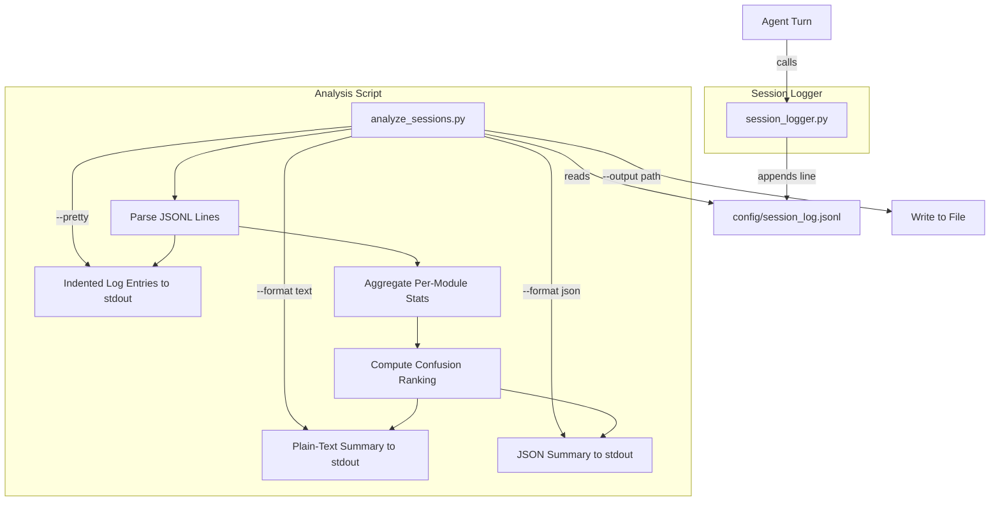

# Design Document: Session Analytics

## Overview

The bootcamp tracks module completion via `config/bootcamp_progress.json` but captures no session-level data — how long each module took, how many corrections occurred, or which steps caused confusion. This design adds two components:

1. **`scripts/session_logger.py`** — a Python module that appends structured JSONL entries to `config/session_log.jsonl` on each agent turn.
2. **`scripts/analyze_sessions.py`** — a CLI script that reads the log and produces per-module summary reports, confusion rankings, and pretty-printed log output.

### Key Design Decisions

1. **Append-only JSONL format** — each log entry is a self-contained JSON object on one line. This is simple, corruption-resistant (a bad line doesn't invalidate the file), and easy to parse incrementally.
2. **Separate logger and analyzer** — the logger is a small module the agent imports; the analyzer is a standalone CLI script. This keeps the agent's hot path minimal.
3. **No external dependencies** — both scripts use only the Python standard library (`json`, `datetime`, `argparse`, `pathlib`, `sys`, `os`, `uuid`), consistent with the project's existing scripts.
4. **Correction density as confusion indicator** — `corrections / turns` is a simple, interpretable metric. Modules with zero turns are excluded from ranking to avoid division by zero.
5. **Dual output formats** — plain text for human reading, JSON for programmatic consumption. Text is the default.

## Architecture



The data flow is strictly one-directional: the logger writes, the analyzer reads. There is no shared state beyond the JSONL file.

## Components and Interfaces

### 1. `session_logger.py` — Session Logger

**Location:** `senzing-bootcamp/scripts/session_logger.py`

**Purpose:** Append structured log entries to the session log file.

**Interface:**

```python
LOG_PATH_DEFAULT = "config/session_log.jsonl"

VALID_EVENTS = {"turn", "correction", "module_start", "module_complete"}

@dataclass
class LogEntry:
    timestamp: str           # ISO 8601 UTC datetime string
    session_id: str          # Constant within a session, changes between sessions
    module: int              # 1–11
    step: Union[str, int]    # Current step within the module
    event: str               # One of VALID_EVENTS
    duration_seconds: float  # Non-negative, seconds since previous entry (0 for first)
    message: str             # Free-text summary of the turn

def build_log_entry(
    session_id: str,
    module: int,
    step: Union[str, int],
    event: str,
    duration_seconds: float,
    message: str,
) -> LogEntry:
    """Construct a LogEntry with the current UTC timestamp.
    
    Args:
        session_id: Session identifier string.
        module: Module number (1–11).
        step: Step identifier within the module.
        event: Event type from VALID_EVENTS.
        duration_seconds: Non-negative elapsed time since previous entry.
        message: Free-text summary.
    
    Returns:
        A LogEntry dataclass instance.
    
    Raises:
        ValueError: If module is not in 1–11, event is not in VALID_EVENTS,
                    or duration_seconds is negative.
    """

def serialize_entry(entry: LogEntry) -> str:
    """Serialize a LogEntry to a single JSON string (no trailing newline).
    
    Returns:
        A compact JSON string representing the entry.
    """

def append_entry(log_path: str, entry: LogEntry) -> None:
    """Append a serialized LogEntry as a single line to the log file.
    
    Creates the file and parent directories if they don't exist.
    On file-system errors, prints a warning to stderr and returns
    without raising.
    """
```

### 2. `analyze_sessions.py` — Analysis Script

**Location:** `senzing-bootcamp/scripts/analyze_sessions.py`

**Purpose:** Read the session log and produce summary reports, confusion rankings, or pretty-printed entries.

**Interface:**

```python
LOG_PATH_DEFAULT = "config/session_log.jsonl"

@dataclass
class ParseResult:
    entries: list[dict]    # Successfully parsed log entry dicts
    error_count: int       # Number of lines that failed JSON parsing

@dataclass
class ModuleSummary:
    module: int
    turns: int
    corrections: int
    total_seconds: float

@dataclass
class SummaryReport:
    modules: list[ModuleSummary]       # Sorted ascending by module number
    overall_turns: int
    overall_corrections: int
    overall_seconds: float
    confusion_ranking: list[tuple[int, float]]  # (module, density) sorted desc

def parse_log(file_path: str) -> ParseResult:
    """Parse a JSONL session log file.
    
    Each line is parsed as an independent JSON object.
    Invalid lines are skipped and counted in error_count.
    
    Returns:
        ParseResult with parsed entries and error count.
    """

def compute_summary(entries: list[dict]) -> SummaryReport:
    """Compute per-module statistics and confusion ranking.
    
    For each module present in entries:
      - Count turns (events == 'turn' or 'correction' or 'module_start' or 'module_complete')
      - Count corrections (events == 'correction')
      - Sum duration_seconds
    
    Confusion ranking: modules sorted by correction_density (corrections/turns)
    descending. Modules with zero turns are excluded.
    Density is rounded to two decimal places.
    
    Returns:
        SummaryReport with modules in ascending order and overall totals.
    """

def format_text(report: SummaryReport) -> str:
    """Format the summary report as a human-readable plain-text table."""

def format_json(report: SummaryReport) -> str:
    """Format the summary report as a single valid JSON object."""

def pretty_print_entries(entries: list[dict], module_filter: int | None = None) -> str:
    """Pretty-print log entries as indented JSON (2-space indent).
    
    Each entry is separated by a blank line.
    If module_filter is provided, only entries with matching module are included.
    """

def main(argv: list[str] | None = None) -> int:
    """CLI entry point.
    
    Arguments:
        [file_path]         Session log path (default: config/session_log.jsonl)
        --format text|json  Output format (default: text)
        --output PATH       Write to file instead of stdout
        --pretty            Pretty-print individual log entries
        --module N          Filter by module number (with --pretty)
    """
```

### 3. Validation Logic

The `build_log_entry` function validates inputs before constructing a `LogEntry`:

| Field | Validation |
|-------|-----------|
| `module` | Integer in range [1, 11] |
| `event` | String in `VALID_EVENTS` |
| `duration_seconds` | Non-negative number (int or float) |
| `session_id` | Non-empty string |
| `step` | String or integer |
| `message` | String |

Invalid inputs raise `ValueError` with a descriptive message.

## Data Models

### LogEntry (Python dataclass)

```python
@dataclass
class LogEntry:
    timestamp: str           # ISO 8601 UTC, e.g., "2025-01-15T14:30:00+00:00"
    session_id: str          # e.g., "a1b2c3d4-e5f6-7890-abcd-ef1234567890"
    module: int              # 1–11
    step: Union[str, int]    # e.g., 3 or "3a"
    event: str               # "turn" | "correction" | "module_start" | "module_complete"
    duration_seconds: float  # >= 0.0
    message: str             # e.g., "Explained SDK initialization"
```

### JSONL Line Format

```json
{"timestamp":"2025-01-15T14:30:00+00:00","session_id":"a1b2c3d4","module":5,"step":3,"event":"turn","duration_seconds":45.2,"message":"Reviewed data quality report"}
```

### SummaryReport (Python dataclass)

```python
@dataclass
class ModuleSummary:
    module: int
    turns: int
    corrections: int
    total_seconds: float

@dataclass
class SummaryReport:
    modules: list[ModuleSummary]                # Ascending by module number
    overall_turns: int
    overall_corrections: int
    overall_seconds: float
    confusion_ranking: list[tuple[int, float]]  # (module, density) descending
```

### JSON Output Format

```json
{
  "modules": [
    {"module": 1, "turns": 12, "corrections": 2, "total_seconds": 340.5},
    {"module": 2, "turns": 8, "corrections": 0, "total_seconds": 210.0}
  ],
  "overall": {
    "turns": 20,
    "corrections": 2,
    "total_seconds": 550.5
  },
  "confusion_ranking": [
    {"module": 1, "correction_density": 0.17},
    {"module": 2, "correction_density": 0.00}
  ]
}
```


## Correctness Properties

*A property is a characteristic or behavior that should hold true across all valid executions of a system — essentially, a formal statement about what the system should do. Properties serve as the bridge between human-readable specifications and machine-verifiable correctness guarantees.*

### Property 1: Append Preserves Existing Lines and Adds Exactly One

*For any* existing session log content (zero or more valid JSONL lines) and any valid LogEntry, appending the entry to the log shall not modify any existing lines and shall add exactly one new line to the end of the file.

**Validates: Requirements 1.1, 1.3**

### Property 2: Log Entry Schema and JSONL Format Validity

*For any* valid LogEntry constructed via `build_log_entry`, the serialized output shall be valid JSON containing all required fields (`timestamp`, `session_id`, `module`, `step`, `event`, `duration_seconds`, `message`) with correct types: `timestamp` is a valid ISO 8601 UTC string, `module` is an integer in [1, 11], `event` is one of the allowed values, and `duration_seconds` is non-negative.

**Validates: Requirements 1.5, 2.1, 2.2, 2.3, 2.4, 2.5, 2.6, 2.7**

### Property 3: Write-Parse Round-Trip

*For any* valid LogEntry, writing it with the Session_Logger and then parsing the resulting JSONL line with the Analysis_Script shall produce a dictionary with identical field names and values.

**Validates: Requirements 3.1, 3.4**

### Property 4: Invalid Line Resilience

*For any* JSONL file containing a mix of valid JSON lines and invalid lines (arbitrary non-JSON strings), the parser shall return exactly the valid entries, skip all invalid lines, and report an error count equal to the number of invalid lines.

**Validates: Requirements 3.2**

### Property 5: Per-Module Aggregation Correctness

*For any* list of valid log entries (possibly spanning multiple sessions), the summary report shall compute per-module turns, corrections, and total_seconds that equal the manually calculated sums from the input entries for each module.

**Validates: Requirements 4.1, 4.4**

### Property 6: Summary Report Structure Invariant

*For any* summary report produced from a non-empty set of log entries, the modules list shall be in ascending order by module number, and the overall totals (turns, corrections, seconds) shall equal the sum of the corresponding per-module values.

**Validates: Requirements 4.2, 4.3**

### Property 7: Confusion Ranking Correctness

*For any* set of log entries where at least one module has non-zero turns, the confusion ranking shall list only modules with non-zero turns, sorted by correction density (corrections / turns) in descending order, with each density value rounded to two decimal places.

**Validates: Requirements 5.1, 5.2, 5.3**

### Property 8: JSON Output Validity

*For any* summary report, formatting with `--format json` shall produce a single valid JSON object that can be parsed back into a dictionary containing `modules`, `overall`, and `confusion_ranking` keys.

**Validates: Requirements 6.2**

### Property 9: Pretty-Print Round-Trip

*For any* valid LogEntry, pretty-printing it as indented JSON and then stripping whitespace and re-parsing shall produce a dictionary identical to the original entry.

**Validates: Requirements 7.1, 7.3**

### Property 10: Module Filter Correctness

*For any* set of log entries and any module number N, filtering with `--module N` shall return exactly the entries whose `module` field equals N — no matching entries omitted, no non-matching entries included.

**Validates: Requirements 7.2**

## Error Handling

| Scenario | Handling |
|----------|----------|
| Session log file does not exist on write | `append_entry` creates the file and parent directories, then appends (Req 1.2) |
| File-system error during write (permissions, disk full) | `append_entry` prints a warning to stderr and returns without raising (Req 1.4) |
| Invalid `module` value passed to `build_log_entry` | Raises `ValueError` with descriptive message |
| Invalid `event` value passed to `build_log_entry` | Raises `ValueError` with descriptive message |
| Negative `duration_seconds` passed to `build_log_entry` | Raises `ValueError` with descriptive message |
| Session log line is not valid JSON | `parse_log` skips the line, increments error counter, continues (Req 3.2) |
| Session log file does not exist on read | `parse_log` returns empty entries list with error_count 0 |
| Session log is empty or has no valid entries | `compute_summary` returns a report indicating no data available (Req 4.5) |
| Module has zero turns in confusion ranking | Excluded from ranking to avoid division by zero (Req 5.2) |
| `--output` path is not writable | Script prints error to stderr and exits with non-zero code |
| `--module N` with N not in any entry | Pretty-print produces empty output (no entries match) |

## Testing Strategy

### Property-Based Tests (Hypothesis)

The feature is well-suited for property-based testing because the core operations (entry construction, serialization, parsing, aggregation, ranking, formatting) are pure functions with clear input/output behavior and universal properties across a wide input space.

**Library:** [Hypothesis](https://hypothesis.readthedocs.io/) (Python) — already used in the project.

**Configuration:** Minimum 100 iterations per property test (`@settings(max_examples=100)`).

**Tag format:** `Feature: session-analytics, Property {N}: {title}`

Each of the 10 correctness properties maps to a single property-based test:

| Property | Test Strategy |
|----------|---------------|
| P1: Append preserves + adds one | Generate random existing JSONL lines + a new entry, append, verify existing lines unchanged and exactly one new line added |
| P2: Schema and JSONL validity | Generate random valid entry parameters, build entry, serialize, parse JSON, verify all fields present with correct types/ranges |
| P3: Write-parse round-trip | Generate random valid entries, serialize, parse, verify identical field names and values |
| P4: Invalid line resilience | Generate random mixes of valid JSON lines and arbitrary invalid strings, parse, verify correct entries returned and error count matches |
| P5: Per-module aggregation | Generate random entry lists across modules/sessions, compute summary, verify per-module sums match manual calculation |
| P6: Summary structure | Generate random entries, compute summary, verify ascending module order and overall totals equal per-module sums |
| P7: Confusion ranking | Generate random entries with varying correction rates, verify ranking order, rounding, and zero-turn exclusion |
| P8: JSON output validity | Generate random entries, compute summary, format as JSON, parse back, verify structure |
| P9: Pretty-print round-trip | Generate random valid entries, pretty-print, strip whitespace, re-parse, verify identical |
| P10: Module filter | Generate random entries across modules, filter by random module N, verify exact match |

### Example-Based Unit Tests

| Test | What it verifies |
|------|-----------------|
| `build_log_entry` with valid inputs | Returns a LogEntry with correct field values |
| `build_log_entry` rejects module 0 and 12 | Raises ValueError for out-of-range modules |
| `build_log_entry` rejects invalid event | Raises ValueError for event not in VALID_EVENTS |
| `build_log_entry` rejects negative duration | Raises ValueError for duration_seconds < 0 |
| `append_entry` creates missing directories | File and parent dirs created on first write |
| `append_entry` handles write error gracefully | Warning to stderr, no exception |
| `parse_log` with default path | Uses `config/session_log.jsonl` when no path given |
| `compute_summary` with empty entries | Returns report indicating no data |
| `format_text` produces readable table | Output contains column headers and aligned data |
| `--format json` default is text | No `--format` flag produces text output |
| `--output` writes to file | Output written to specified path instead of stdout |
| `--pretty --module 5` filters correctly | Only module 5 entries in output |

### Integration Tests

| Test | What it verifies |
|------|-----------------|
| End-to-end: write entries then analyze | Write 10 entries via session_logger, run analyze_sessions, verify summary matches |
| Multi-session aggregation | Write entries with 2 different session_ids, verify summary aggregates across both |
| Pretty-print with real log | Write entries, run `--pretty`, verify indented JSON output |
