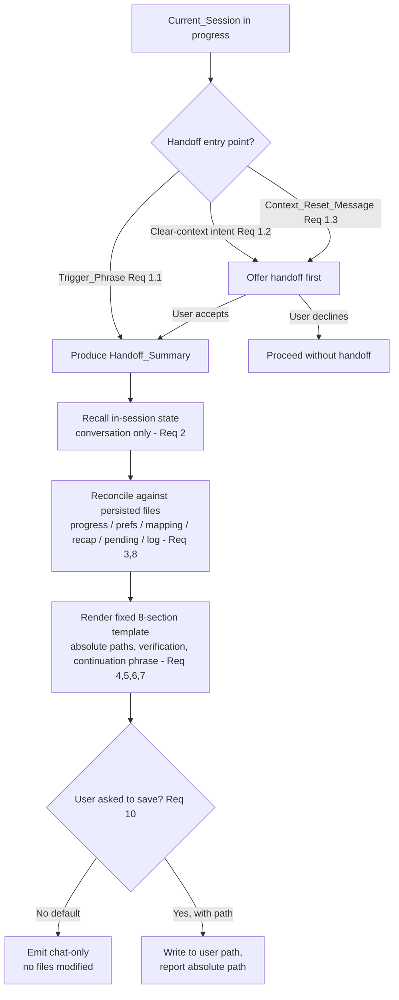

# Design Document

## Overview

The Session_Handoff capability is delivered as **Kiro Power content**, not as a running program. Its
single primary artifact is a manual-inclusion steering file,
`senzing-bootcamp/steering/session-handoff.md`, whose body is a set of Agent instructions telling the
Agent (Kiro) how to synthesize and format a fixed-structure Handoff_Summary from the Current_Session
and the bootcamp's already-persisted state files. The Handoff_Summary is chat-only by default and is
addressed to a *future Agent instance*, not to a human stakeholder (Introduction; Req 10.1).

The design's central decision is **where the work lives**: the handoff is produced by the Agent
*reading the conversation it is already in*, not by a script that parses repository state. There is no
runtime program that "generates" a handoff. This keeps the capability faithful to Requirement 2
(session-scoped synthesis) — a script would have to sweep files and git history to reconstruct state,
which Req 2.2 explicitly forbids. The Agent already holds the full Current_Session in context, so
synthesis is a formatting-and-recall task, not a discovery task.

Two supporting artifacts are scoped:

1. **A hook-in from `agent-context-management.md`** (edit, not a new hook) so that when the Agent emits
   a Context_Reset_Message it also offers the handoff (Req 1.3). No new `.kiro.hook` is required for v1;
   the "Optional Trigger Hook" analysis below explains why an event hook is *not* warranted and sketches
   what it would look like if added later.
2. **An optional, stdlib-only helper validator** `senzing-bootcamp/scripts/validate_handoff_summary.py`
   that checks a candidate Handoff_Summary string for the structural invariants (section set + order,
   absolute-path references, forbidden-phrase exclusion, no emoji). This validator is the **testable
   surface** for the property-based tests. It does **not** produce handoffs and is never on the critical
   path of a live session; it exists so the structural properties in this design are machine-verifiable.

The capability strictly coordinates with three existing steering files and never duplicates or
overrides them: `session-resume.md` (reconstructs persisted state next session), `agent-context-management.md`
(owns the Context_Reset_Message and Continuation_Phrase convention), and `module-completion-artifacts.md`
(sole writer of recap/certificate/progress artifacts). The Session_Handoff *reads and references* those
files' outputs and *reuses* their conventions; it writes none of them (Req 8.2, 8.3, 10.2).

## Architecture

### Artifact map

| Artifact | Type | Role | Requirements |
|---|---|---|---|
| `senzing-bootcamp/steering/session-handoff.md` | Manual-inclusion steering (prose) | Primary artifact: Agent instructions for triggering, synthesis, template, precision, verification, tone, output destination | 1–10, 11.1 |
| `senzing-bootcamp/steering/steering-index.yaml` | YAML registry (edit) | Register the new steering file in `file_metadata` with `token_count` + `size_category` | 11.2 |
| `senzing-bootcamp/steering/agent-context-management.md` | Steering (edit) | Add the handoff-offer hook-in to the Context_Reset_Message flow | 1.3, 8.4 |
| `senzing-bootcamp/scripts/validate_handoff_summary.py` | Python (stdlib-only, optional) | Structural validator; testable surface for PBT | 11.5, Correctness Properties |
| `senzing-bootcamp/tests/test_handoff_summary.py` | pytest + Hypothesis | Property + example tests over the validator | Testing Strategy |

### Delivery mechanism — why manual-inclusion steering

`inclusion: manual` steering is the correct vehicle because the handoff must be **invoked on demand**
(Req 1.1 Trigger_Phrases), not loaded on every turn. Manual inclusion mirrors the existing
`slash-git-commit.md` and `session-resume.md` pattern: the file is loaded only when its subject is in
play, keeping it out of the always-loaded context budget. The frontmatter carries `inclusion: manual`
and a `description` (Req 11.1); the body is verbatim Agent instructions.

### What is Agent behavior vs. helper script

This distinction is load-bearing for the whole design:

- **Agent behavior (the steering file):** recognizing Trigger_Phrases, recalling in-session decisions
  and open questions, reconciling recall against the persisted state files, applying the fixed template,
  writing in a terse tone, and emitting chat-only output. None of this is executable code — it is prose
  the Agent follows. The Agent is the only component that can satisfy Req 2 (session-scoped synthesis)
  because only the Agent holds the conversation.
- **Helper script (the validator):** a pure function over *already-produced text*. It answers "does this
  string conform to the structural rules?" It has no access to the session, does no synthesis, and is
  optional at runtime. Its purpose is to make the structural Correctness Properties testable and,
  optionally, to let the Agent self-check its own output before sending.

### Trigger detection (Req 1)

The Agent recognizes three distinct entry points, all handled by instruction (no event hook):

1. **Explicit Trigger_Phrase (Req 1.1):** the user message contains a phrase such as "session handoff",
   "wrap up session", "hand off", "handoff summary", or "summarize before I clear", or a near-equivalent.
   The Agent produces the Handoff_Summary immediately.
2. **Clear-context intent (Req 1.2):** the user signals intent to clear/reset the conversation before any
   handoff has been produced. The Agent *offers* to produce the Handoff_Summary first (it does not force
   one).
3. **Context_Reset_Message hook-in (Req 1.3, 8.4):** when the Agent itself emits the Context_Reset_Message
   defined in `agent-context-management.md` (triggered at ~80% context or on degraded quality), it appends
   an offer to produce a Handoff_Summary before the user opens a fresh chat. This is wired by a small edit
   to `agent-context-management.md` so the two mechanisms stay coordinated rather than competing.

### Optional trigger hook — analysis (Req 11.6)

A `.kiro.hook` was considered for automating the "offer on reset" behavior. It is **not warranted for v1**:

- The repo's hooks fire on tool/lifecycle events (`PostToolUse`, `Stop`, `UserPromptSubmit`, …). A handoff
  offer is a *conversational* judgment ("the user wants to wrap up"), which is exactly what the
  `review-bootcamper-input` (`UserPromptSubmit`) design already treats as agent reasoning, not a regex gate.
- The Context_Reset_Message is already emitted by the Agent, so the cleanest coordination is an instruction
  hook-in in the same steering file that owns the reset — no event plumbing, no registry churn.
- Adding a hook incurs `hooks.lock.yaml` sync (Req 11.6) and a registry-module entry for zero behavioral
  gain over the instruction path.

If a hook is added later, it would be `offer-handoff-on-reset.json`, schema `v1`, with `name`, `trigger`,
and `action` fields, most plausibly a `UserPromptSubmit` matcher that injects the offer as context when a
clear-context intent is detected, and it MUST be added to `hooks.lock.yaml` via
`python3 senzing-bootcamp/scripts/sync_hook_registry.py --write`. This is documented as deferred, not built.

### Handoff flow



## Components and Interfaces

### Component 1: `session-handoff.md` steering file (primary)

The steering file body is organized into the instruction sections below. Each maps to requirements and
is written as directives to the Agent.

1. **Invocation & Offers (Req 1).** Enumerates Trigger_Phrases and near-equivalents; defines the two
   *offer* paths (clear-context intent, Context_Reset_Message) as one-line offers that respect the
   conversation protocol (a single 👉 question, then 🛑 STOP) so the offer never violates the
   one-question-per-turn rule. Handles the empty-session case (Req 1.4): still emit all 8 sections with
   "none".
2. **Session-Scoped Synthesis (Req 2).** Directs the Agent to derive content *only* from the
   Current_Session conversation and artifacts it touched this session; explicitly prohibits git-history
   queries and repo-wide file searches; requires using the whole conversation, not just recent turns.
3. **State Gathering & Reconciliation (Req 3, 8.1).** Lists every state item to collect (module/step,
   completed modules, track, language, data sources, database type, generated code, mapping checkpoints,
   MCP status, background processes + ports, pending question, and the in-session decisions/open questions
   that live in *no* file). Instructs the Agent to reconcile recall against the persisted files that
   `session-resume.md` reads (`config/bootcamp_progress.json`, `config/bootcamp_preferences.yaml`,
   `config/mapping_state_*.json`, `config/session_log.jsonl`, `config/.question_pending`,
   `docs/bootcamp_recap.md`) — reading them for accuracy, never writing them.
4. **Output Template (Req 4).** The fixed, ordered 8-section skeleton (see Data Models) with "none" for
   empty sections and a single next action in "Pick up here".
5. **Precision Rules (Req 5).** Absolute paths everywhere; Driving_Artifact first in "Key files";
   per-process port + stop command; database as absolute SQLite path or PostgreSQL connection description;
   MCP status in "Running state".
6. **Verification Block (Req 6).** The baked-in verification content (see Data Models → Verification block).
7. **Pick Up Here & Continuation (Req 7).** Emits the quoted Continuation_Phrase naming the Current_Module
   read from `current_module`; reuses the `agent-context-management.md` convention; excludes the eight
   forbidden temporal phrases.
8. **Coordination Boundaries (Req 8).** Explicit "never rewrite" list and reference-by-absolute-path rule.
9. **Tone & Discipline (Req 9).** Terse engineering tone; no emojis/celebration/retrospective; only the
   single "Pick up here" recommendation; "none" over inference.
10. **Output Destination (Req 10).** Chat-only by default; write a file only on explicit user request to a
    user-specified absolute path, then report that path.

### Component 2: `agent-context-management.md` edit (coordination)

A small addition to the "Context Reset Communication" section: after the Context_Reset_Message elements,
add a directive that the Agent offer a Session_Handoff before the user opens the fresh chat, and that the
handoff reuse the same Continuation_Phrase/module convention already defined there (Req 1.3, 7.3, 8.4).
The Context_Reset_Message's own four required elements and forbidden-phrase list are unchanged — the
handoff reuses them.

### Component 3: `validate_handoff_summary.py` (optional helper, testable surface)

Pure, stdlib-only module. Interface:

```python
@dataclass
class HandoffFinding:
    code: str        # e.g. "MISSING_SECTION", "SECTION_OUT_OF_ORDER", "RELATIVE_PATH",
                     # "FORBIDDEN_PHRASE", "EMOJI", "EMPTY_SECTION_NOT_NONE"
    detail: str      # human-readable specifics (which section / token)

@dataclass
class HandoffValidation:
    ok: bool                       # True iff findings is empty
    findings: list[HandoffFinding]

def validate_handoff_summary(text: str) -> HandoffValidation: ...
```

Checks performed (each maps to a Correctness Property):

- All 8 canonical section headings present, in the canonical order (Req 4.1).
- Every section has content; an empty section must read exactly "none" (Req 4.3, 9.4).
- Every path-like token under file sections is absolute (starts with `/`) (Req 5.1).
- The "Pick up here" section contains none of the eight forbidden temporal phrases (Req 7.4).
- No emoji characters anywhere in the summary (Req 9.2).
- The Continuation_Phrase in "Pick up here" is enclosed in quotation marks (Req 7.2).

The validator follows the repo Python conventions: `#!/usr/bin/env python3`, `from __future__ import
annotations`, dataclasses, `argparse` `main(argv=None)`, exit 0/1, stdlib-only (Req 11.5). CLI usage:
`python3 senzing-bootcamp/scripts/validate_handoff_summary.py <path-to-summary.md>`.

## Data Models

### Handoff source-to-section reconciliation

The Agent gathers state from the Current_Session and reconciles it against persisted files. This table
defines *what feeds which section* and *which file is authoritative for accuracy* (never rewritten):

| State item (Req 3) | In-session source | Persisted file (read-only, for accuracy) | Feeds Section |
|---|---|---|---|
| Current_Module, Current_Step, completed modules | conversation | `config/bootcamp_progress.json` (`current_module`, `current_step`, `modules_completed`) | Where it started / Pick up here |
| Track, Language | conversation | `config/bootcamp_preferences.yaml` | Where it started |
| Data sources loaded, database type | conversation | `config/bootcamp_progress.json` | Running state |
| Generated code artifacts (this session) | conversation | files touched this session | Decisions locked + what shipped / Key files |
| Active Mapping_Checkpoints | conversation | `config/mapping_state_*.json` | Running state / Key files |
| MCP_Session status | conversation | — (live) | Running state |
| Visualization_Service / Background_Process + port | conversation | — (live) | Running state |
| Pending_Question | conversation | `config/.question_pending` | Deferred + open questions |
| In-session decisions / open questions not in any file | conversation only | none (this is the unique value-add over session-resume) | Decisions locked / Deferred + open questions |
| Recap / certificate / progress artifacts | — | `docs/bootcamp_recap.md`, `docs/progress/MODULE_N_COMPLETE.md` | Key files (referenced by absolute path, Req 8.3) |

### Fixed Handoff_Summary template (Req 4.1)

The eight Sections appear in exactly this order; empty Sections read "none" (Req 4.3):

```text
# Handoff: <one-line subject of the session>            (1) Title (Req 4.2)

## Where it started                                     (2)
<starting module/step, track, language, initial goal>

## Decisions locked + what shipped                      (3)
<in-session decisions made; code/artifacts produced this session>

## Key files for next session                           (4)
- <Driving_Artifact absolute path — FIRST if one exists (Req 5.2)>
- <other absolute paths>

## Running state                                        (5)
- Database: <absolute SQLite path | PostgreSQL connection description> (Req 5.4)
- MCP: <connected | disconnected> (Req 5.5)
- Processes: <name @ port — stop with `<command>`> | none (Req 5.3)

## Verification — how to confirm things still work      (6)
- Re-establish MCP: call get_capabilities — expect a reachable Senzing MCP server and a capabilities list (Req 6.2)
- Run: python3 senzing-bootcamp/scripts/baseline_status.py — expect the data-source coverage report (Req 6.3)
- Confirm Module <N> artifacts exist: <absolute paths> — expect all present (Req 6.4)

## Deferred + open questions                            (7)
<pending question text; unresolved in-session questions> | none

## Pick up here                                         (8)
<single most-likely next action (Req 4.4)>
Resume phrase: "continue the bootcamp from module <N>" (Req 7.1, 7.2, 7.3)
```

### Concrete bootcamp-flavored example

```text
# Handoff: Module 5 data mapping for CUSTOMERS_CRM (in progress)

## Where it started
Resumed Module 5 (Data Quality & Mapping), step 5.3. Track: Core (A). Language: Python.
Goal: finish the CUSTOMERS_CRM mapping and run a test load.

## Decisions locked + what shipped
- Mapped CRM full_name to Senzing NAME_FULL; split addr into ADDR_LINE1 / ADDR_CITY / ADDR_STATE.
- Decided to defer phone normalization to a follow-up rather than block the test load.
- Produced /home/bootcamper/senzing/mappers/customers_crm_mapper.py this session.

## Key files for next session
- /home/bootcamper/senzing/.kiro/specs/module-05/mapping-plan.md
- /home/bootcamper/senzing/mappers/customers_crm_mapper.py
- /home/bootcamper/senzing/config/mapping_state_customers_crm.json

## Running state
- Database: /home/bootcamper/senzing/var/senzing.db
- MCP: connected
- Processes: none

## Verification — how to confirm things still work
- Re-establish MCP: call get_capabilities — expect a reachable Senzing MCP server and a capabilities list.
- Run: python3 senzing-bootcamp/scripts/baseline_status.py — expect CUSTOMERS_CRM listed with coverage status.
- Confirm Module 5 artifacts exist: /home/bootcamper/senzing/mappers/customers_crm_mapper.py,
  /home/bootcamper/senzing/config/mapping_state_customers_crm.json — expect both present.

## Deferred + open questions
- Pending: should REFERENCE data sources use a separate DATA_SOURCE code? (from config/.question_pending)
- Open: confirm whether phone normalization is in scope for Module 5 or deferred to Module 6.

## Pick up here
Validate the CUSTOMERS_CRM mapping against the sample records, then run the Module 5 test load.
Resume phrase: "continue the bootcamp from module 5"
```

## Correctness Properties

*A property is a characteristic or behavior that should hold true across all valid executions of a
system — essentially, a formal statement about what the system should do. Properties serve as the bridge
between human-readable specifications and machine-verifiable correctness guarantees.*

**Scope note.** Most of this feature is Agent behavior (recalling session content, choosing tone,
avoiding file writes) and cannot be verified as a universal property over generated inputs — those
criteria are enforced by the steering instructions and are called out under "Enforced by agent
instruction (not property-testable)" below. The properties here cover only the **structural invariants of
the Handoff_Summary text**, which are checkable by the pure `validate_handoff_summary()` helper. The
helper is the testable surface; it validates already-produced text and performs no synthesis.

### Property 1: Structure stability

*For any* Handoff_Summary text, `validate_handoff_summary()` reports `ok` only when all eight canonical
Sections — Title, "Where it started", "Decisions locked + what shipped", "Key files for next session",
"Running state", "Verification — how to confirm things still work", "Deferred + open questions", "Pick up
here" — are present in exactly that order, with a single-line non-empty Title, and every Section that has
no content reads exactly "none"; permuting the order, omitting a Section, or leaving a Section empty
without "none" must produce a finding.

**Validates: Requirements 1.4, 4.1, 4.2, 4.3, 9.4**

### Property 2: Absolute-path invariant

*For any* Handoff_Summary text, if any file reference (including the SQLite database entry in "Running
state" and any completion-artifact reference) is a relative path, `validate_handoff_summary()` reports a
finding; a summary whose file references are all absolute paths passes this check.

**Validates: Requirements 5.1, 5.4, 8.3**

### Property 3: Forbidden temporal-phrase exclusion

*For any* Handoff_Summary text, `validate_handoff_summary()` reports `ok` for this check only when the
text contains none of the eight forbidden temporal phrases ("come back later", "come back tomorrow",
"take a break", "try again in a while", "when you're ready", "try again later", "wait a moment", "give it
some time"); injecting any one of these phrases into an otherwise-conformant summary must flip the result
to a finding.

**Validates: Requirements 7.4**

### Property 4: No-emoji discipline

*For any* Handoff_Summary text, if the text contains any emoji code point, `validate_handoff_summary()`
reports a finding; an emoji-free summary passes this check.

**Validates: Requirements 9.2**

### Property 5: Quoted continuation phrase

*For any* Handoff_Summary text, `validate_handoff_summary()` reports `ok` for this check only when the
resume phrase in the "Pick up here" Section is enclosed in quotation marks; an unquoted resume phrase must
produce a finding.

**Validates: Requirements 7.2**

### Enforced by agent instruction (not property-testable)

These criteria depend on the specific conversation, agent judgment, or file-system side effects, so they
are enforced by the `session-handoff.md` instructions and verified by example/smoke tests rather than
property tests: 1.1, 1.2, 1.3 (invocation/offer behavior); 2.1–2.3 (session-scoped sourcing); 3.1–3.9
(content recall/accuracy); 4.4 (single next action, semantic); 5.2 (Driving_Artifact ordering, semantic);
5.3, 5.5 (process/MCP content); 6.1–6.4 (fixed verification block — checked by example, see Testing
Strategy); 7.1, 7.3 (module-number sourcing / convention reuse); 8.1–8.4 (coordination and non-rewrite
side effects); 9.1, 9.3 (tone/recommendation limits, semantic); 10.1–10.3 (delivery channel and file-write
side effects).

## Error Handling

- **Missing or corrupt persisted state files.** The handoff never blocks on file state. If
  `config/bootcamp_progress.json` or another persisted file is missing or unparsable, the Agent records
  what it observed in-session for the affected Section and uses "none" where nothing is known — it does not
  invent values (Req 9.4) and does not attempt repair (that is `session-resume.md`'s job). The handoff is
  best-effort and always produces all eight Sections (Req 1.4, 4.3).
- **No in-session work (empty session).** Produce the full template with "none" in every content Section
  (Req 1.4).
- **Unknown Current_Module for the continuation phrase.** If `current_module` cannot be read, the Agent
  states the module is unknown in "Pick up here" rather than guessing a number, and still quotes the
  resume phrase form; it never emits a forbidden temporal phrase (Req 7.4).
- **User declines the offer** (Req 1.2/1.3 paths): proceed without producing a handoff; take no other
  action.
- **Save requested to an unwritable/relative path** (Req 10.3): report that the path must be absolute and
  writable, do not fall back to writing elsewhere, and keep the chat-only output.
- **Validator (helper) robustness.** `validate_handoff_summary()` never raises on arbitrary input; it
  returns findings for malformed text and `ok=False` rather than throwing (mirrors the read-only,
  never-raise posture of `baseline_status.py`). CLI exits 0 when `ok`, 1 otherwise.

## Testing Strategy

### Dual approach

- **Property tests** (Hypothesis, over `validate_handoff_summary()`): cover the five structural
  Correctness Properties across generated conformant and mutated summaries.
- **Example / smoke tests** (pytest): cover the fixed verification block, packaging conformance, and the
  agent-instruction criteria that are not property-testable.

### Property-based tests

Library: **Hypothesis** (already used repo-wide). Tests live in
`senzing-bootcamp/tests/test_handoff_summary.py`, class-based (`class TestHandoffSummaryProperties:`),
with `st_`-prefixed strategies (e.g., `st_handoff_summary()` building a conformant summary from random
section contents, `st_relative_path()`, `st_forbidden_phrase()`). Per repo convention, example counts come
from the active Hypothesis profile baseline (`fast`=5 locally, `thorough`=100 in CI) — do not hand-set
`@settings(max_examples=...)` to restate the baseline. Each property test is tagged with a comment:

`# Feature: session-handoff, Property N: <property text>`

Property → test mapping:

- **Property 1 (Structure stability):** generate conformant summaries → `ok`; then apply a random mutation
  (drop a section, swap two sections, blank a section without "none") → expect the matching finding
  (`MISSING_SECTION` / `SECTION_OUT_OF_ORDER` / `EMPTY_SECTION_NOT_NONE`). Metamorphic style.
- **Property 2 (Absolute-path):** generate "Key files"/"Running state" entries mixing absolute and random
  relative paths → `ok` iff all absolute; a relative entry yields `RELATIVE_PATH`.
- **Property 3 (Forbidden phrase):** start from a conformant summary; randomly inject one of the eight
  phrases → expect `FORBIDDEN_PHRASE`; without injection → no such finding.
- **Property 4 (No-emoji):** inject a random emoji code point → expect `EMOJI`; emoji-free → none.
- **Property 5 (Quoted continuation):** generate quoted vs. unquoted resume phrases → `ok` iff quoted.

### Example and smoke tests

- **Verification block (Req 6.1–6.4):** assert a representative Handoff_Summary's Verification Section
  contains the `get_capabilities` re-establish line, the exact
  `python3 senzing-bootcamp/scripts/baseline_status.py` command, and the current-module artifact-existence
  check, each paired with an expected outcome.
- **Packaging conformance (Req 11.1, 11.2, 11.5):** assert `session-handoff.md` exists with kebab-case
  name and frontmatter `inclusion: manual` + a `description`; assert it is registered in
  `steering-index.yaml` `file_metadata` with a `token_count`; assert `validate_handoff_summary.py` imports
  only standard-library modules.
- **Security conformance (Req 11.3, 11.4):** scan `session-handoff.md` for PII/credentials/internal URLs
  and confirm no external endpoint other than the Senzing MCP host is referenced (the MCP host string
  itself lives only in `mcp.json`; the steering file refers to it by name/tool, not URL).
- **Token budget (Req 11.2):** CI runs `measure_steering.py --check`; the new file must stay under the
  `split_threshold_tokens` (5000) budget or be justified in `split_allowlist`. Target: keep
  `session-handoff.md` a single cohesive file well under 5000 tokens.

### Coordination regression checks

- Assert `agent-context-management.md` still contains its four required Context_Reset_Message elements and
  forbidden-phrase list after the handoff-offer edit (no regression to Req-owning content).
- Confirm the design adds no writer of `config/bootcamp_progress.json`, `config/bootcamp_preferences.yaml`,
  or `docs/bootcamp_recap.md` (Req 8.2, 10.2) — the handoff path performs no writes absent an explicit
  save request.

### CI conformance

The existing pipeline (`validate_power.py`, `measure_steering.py --check`, `validate_commonmark.py`,
`sync_hook_registry.py --verify`, then pytest) must pass. No hook is added in v1, so `sync_hook_registry
--verify` is unaffected; if the optional `offer-handoff-on-reset.json` is added later, it must be
registered via `sync_hook_registry.py --write` and conform to the `v1` schema (Req 11.6).
