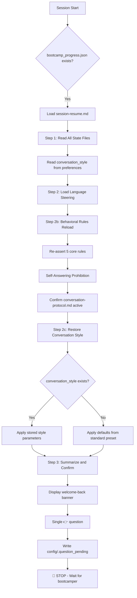
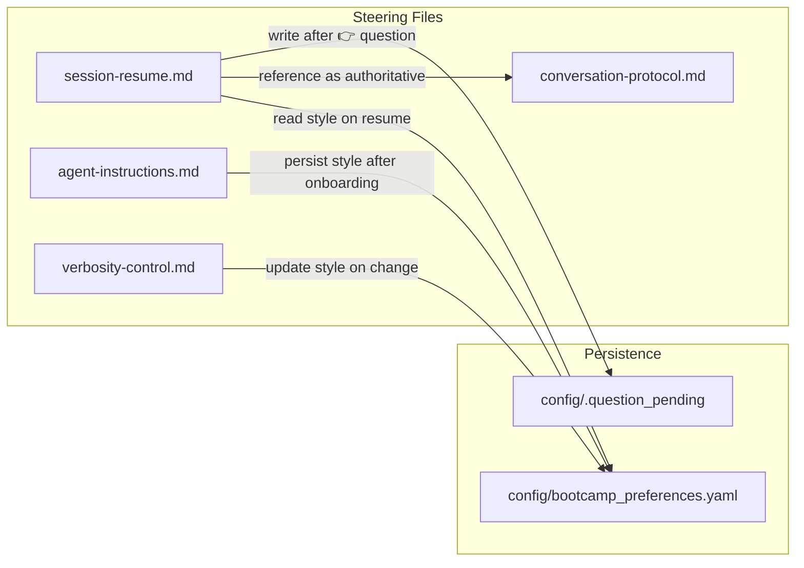

# Design Document: Session Resume Behavioral Rules

## Overview

This feature enhances the `session-resume.md` steering file to fully reinitialize behavioral guardrails, restore conversation style parameters, and explicitly prohibit self-answering before the first bootcamper interaction in a resumed session.

Currently, `session-resume.md` restores progress state (module, step, data sources) but does not re-assert the behavioral rules defined in `conversation-protocol.md`. This causes three observable failures: (1) rule violations like multi-question turns and missing 👉 prefixes, (2) self-answering where the agent responds to its own questions, and (3) conversation style drift where tone and pacing change after resume.

The solution modifies three steering files:
- **`session-resume.md`** — Add a Behavioral Rules Reload section (Step 2b expansion), Self-Answering Prohibition subsection, conversation style restoration instructions, and tone descriptor mapping
- **`agent-instructions.md`** — Add instruction to persist conversation style profile after onboarding
- **`verbosity-control.md`** — Add instruction to update conversation style profile on style changes

No new scripts or runtime code are needed. This is a steering-file-only change that modifies agent instructions to enforce existing rules more explicitly at session boundaries.

## Architecture



### Data Flow



## Components and Interfaces

### 1. Behavioral Rules Reload Section (session-resume.md Step 2b)

**Purpose:** Re-assert all five core conversation rules before any bootcamper-facing output.

**Location:** Between Step 2 (Load Language Steering) and Step 3 (Summarize and Confirm).

**Content structure:**
- Authoritative source declaration (references conversation-protocol.md)
- Enumeration of five core rules with enforcement mechanisms
- Self-Answering Prohibition subsection with violation/correct examples
- Equal priority statement (conversation-protocol rules = agent-instructions rules)

### 2. Self-Answering Prohibition Subsection (within Step 2b)

**Purpose:** Explicitly prohibit the agent from generating text that answers its own questions after resume.

**Content structure:**
- Prohibition statement with exact wording from requirements
- Concrete violation examples (WRONG patterns)
- Correct behavior examples (CORRECT patterns)
- Question_pending enforcement instruction

### 3. Conversation Style Restoration (session-resume.md Step 2c)

**Purpose:** Restore conversation style parameters from the preferences file before generating output.

**Location:** After Behavioral Rules Reload, before Step 3.

**Content structure:**
- Read `conversation_style` key from `config/bootcamp_preferences.yaml`
- If exists: apply stored parameters (verbosity, question framing, tone, pacing)
- If missing: apply defaults from standard preset + conversation-protocol patterns
- Tone descriptor mapping (concise → short lead-ins, conversational → moderate, detailed → full context)
- Style drift detection and self-correction instruction

### 4. Conversation Style Persistence (agent-instructions.md addition)

**Purpose:** Instruct the agent to write the initial conversation style profile after onboarding establishes a baseline.

**Content:** Single paragraph in the State & Progress section instructing the agent to write `conversation_style` to preferences after the first module interaction.

### 5. Conversation Style Update (verbosity-control.md addition)

**Purpose:** Keep the conversation style profile in sync when the bootcamper adjusts verbosity or style.

**Content:** Addition to the Adjustment Instructions section instructing the agent to update the `conversation_style` key when style changes occur.

## Data Models

### Conversation Style Profile (YAML)

Stored in `config/bootcamp_preferences.yaml` under the `conversation_style` key:

```yaml
conversation_style:
  verbosity_preset: "standard"          # concise | standard | detailed | custom
  category_levels:                       # only present when preset is "custom"
    explanations: 2
    code_walkthroughs: 2
    step_recaps: 2
    technical_details: 2
    code_execution_framing: 2
  question_framing: "moderate"           # minimal | moderate | full
  tone: "conversational"                 # concise | conversational | detailed
  pacing: "one_concept_per_turn"         # one_concept_per_turn | grouped_concepts
```

**Field definitions:**

| Field | Type | Values | Description |
|-------|------|--------|-------------|
| `verbosity_preset` | string | concise, standard, detailed, custom | Active verbosity preset name |
| `category_levels` | mapping | int 1-3 per category | Per-category levels (only when custom) |
| `question_framing` | string | minimal, moderate, full | Length of contextual lead-in before 👉 questions |
| `tone` | string | concise, conversational, detailed | Overall tone descriptor |
| `pacing` | string | one_concept_per_turn, grouped_concepts | How much content per turn |

### Tone Descriptor Mapping

| Tone | Observable Characteristics |
|------|---------------------------|
| `concise` | Short contextual lead-ins (1-2 sentences), minimal preamble before questions, direct language |
| `conversational` | Moderate lead-ins (2-4 sentences), friendly framing, balanced explanation depth |
| `detailed` | Full contextual framing (4+ sentences), thorough explanations, explicit rationale for each step |

### Question Pending File

No changes to existing format. `config/.question_pending` contains the question text as plain text.

## Correctness Properties

*A property is a characteristic or behavior that should hold true across all valid executions of a system — essentially, a formal statement about what the system should do. Properties serve as the bridge between human-readable specifications and machine-verifiable correctness guarantees.*

### Property 1: Behavioral Rules Reload completeness

*For any* session-resume.md file, the Behavioral Rules Reload section SHALL enumerate all five core rules with their enforcement mechanisms: (a) one-question-per-turn with STOP, (b) 👉 prefix required, (c) STOP markers as end-of-turn boundaries, (d) no self-answering, (e) no dead-end responses.

**Validates: Requirements 1.1, 1.3**

### Property 2: Document ordering — rules before interaction

*For any* session-resume.md file, the Behavioral Rules Reload section SHALL appear after Step 1 (Read All State Files) and before Step 3 (Summarize and Confirm), ensuring rules are internalized before the first bootcamper-facing message.

**Validates: Requirements 1.2, 1.4, 6.1**

### Property 3: Self-Answering Prohibition with violation and correct examples

*For any* session-resume.md file, the Self-Answering Prohibition subsection within Behavioral Rules Reload SHALL contain both violation examples (WRONG patterns) and correct behavior examples (CORRECT patterns) demonstrating the prohibition.

**Validates: Requirements 2.1, 2.2**

### Property 4: Question pending enforcement after welcome-back question

*For any* session-resume.md file, the Step 3 section SHALL contain an instruction to write `config/.question_pending` after the welcome-back 👉 question, enforcing the turn boundary.

**Validates: Requirements 2.3, 6.3**

### Property 5: Conversation style profile schema round-trip

*For any* valid conversation style profile containing verbosity_preset, question_framing, tone, and pacing fields, serializing to YAML under the `conversation_style` key and deserializing SHALL produce an equivalent data structure.

**Validates: Requirements 4.2, 4.4**

### Property 6: Authoritative reference as summary not duplication

*For any* session-resume.md file, the Behavioral Rules Reload section SHALL reference conversation-protocol.md as authoritative, summarize the five core rules, and be significantly shorter than the full conversation-protocol.md content (not a duplication).

**Validates: Requirements 5.1, 5.4**

### Property 7: Welcome-back single question constraint

*For any* session-resume.md file, Step 3 (Summarize and Confirm) SHALL contain exactly one 👉 question, with no additional 👉 questions or substantive content following it before the next section heading.

**Validates: Requirements 6.2, 6.4**

### Property 8: Conversation style read during Step 1

*For any* session-resume.md file, Step 1 (Read All State Files) SHALL include an instruction to read the `conversation_style` key from `config/bootcamp_preferences.yaml`.

**Validates: Requirements 3.1**

### Property 9: Tone descriptor mapping completeness

*For any* session-resume.md file, the conversation style restoration section SHALL include a mapping of all three tone descriptors (concise, conversational, detailed) to observable output characteristics.

**Validates: Requirements 7.2**

### Property 10: Agent-instructions style persistence instruction

*For any* agent-instructions.md file, there SHALL be an instruction to write a conversation_style profile to `config/bootcamp_preferences.yaml` after onboarding completes and the first module interaction establishes a baseline style.

**Validates: Requirements 4.1**

## Error Handling

### Missing Preferences File

If `config/bootcamp_preferences.yaml` does not exist or is corrupted during session resume:
- Apply default conversation style (standard preset, conversational tone, moderate framing, one_concept_per_turn pacing)
- Log a note in the welcome-back summary that preferences were reset
- Continue with resume flow — do not block on missing style data

### Missing conversation_style Key

If the preferences file exists but lacks the `conversation_style` key:
- Apply defaults derived from the `verbosity` key if present (map preset name to tone descriptor)
- If no `verbosity` key either, use full defaults (standard/conversational/moderate/one_concept_per_turn)
- Do not create the key during resume — it will be created on next style interaction

### Malformed conversation_style Data

If the `conversation_style` key exists but contains invalid data (wrong types, unknown values):
- Fall back to defaults
- Inform the bootcamper that style preferences were reset
- Overwrite the malformed data with defaults on next style interaction

### conversation-protocol.md Not Loaded

Since `conversation-protocol.md` has `inclusion: auto`, it should always be loaded during active sessions. If for some reason it is not available:
- The Behavioral Rules Reload section contains a summary of all five rules as a fallback
- The agent can still enforce rules from the summary alone
- Log a warning but do not block the resume flow

## Testing Strategy

### Property-Based Tests (Hypothesis)

Property-based testing is appropriate for this feature because:
- The steering files have structural invariants that must hold regardless of content variations
- The conversation style profile has a schema that can be validated via round-trip serialization
- Document ordering constraints are universal properties

**Library:** Hypothesis (Python)
**Configuration:** Minimum 100 iterations per property test
**Tag format:** `Feature: session-resume-behavioral-rules, Property {N}: {title}`

Tests will live in `senzing-bootcamp/tests/test_session_resume_behavioral_rules_properties.py`.

**Strategies:**
- `st_conversation_style_profile()` — generates random valid conversation style profiles
- `st_tone_descriptor()` — generates random tone values from the valid set
- `st_verbosity_preset()` — generates random preset names from the valid set
- `st_pacing_preference()` — generates random pacing values from the valid set

### Unit Tests

Tests will live in `senzing-bootcamp/tests/test_session_resume_behavioral_rules_unit.py`.

Unit tests cover:
- Specific examples of valid/invalid conversation style profiles
- Edge cases: empty preferences file, missing keys, malformed YAML
- Integration between session-resume.md instructions and conversation-protocol.md rules
- Verification that violation examples in the Self-Answering Prohibition are correctly formatted

### What Is NOT Tested

- Actual agent behavior (whether the agent follows the instructions) — this is a steering file, not executable code
- UI rendering of the welcome-back banner
- MCP server interactions during resume
- The existing session-resume flow steps (already tested elsewhere)
