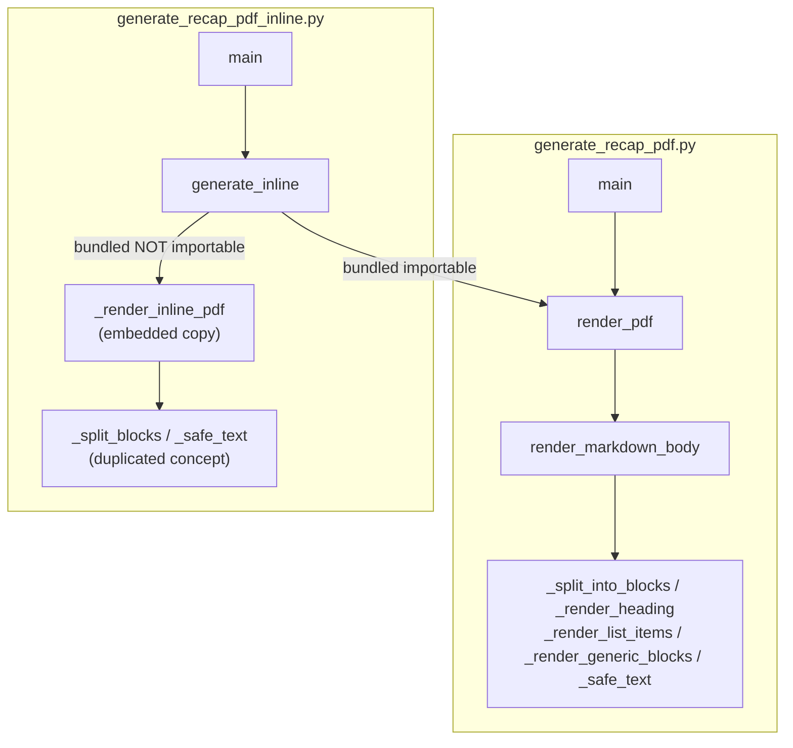
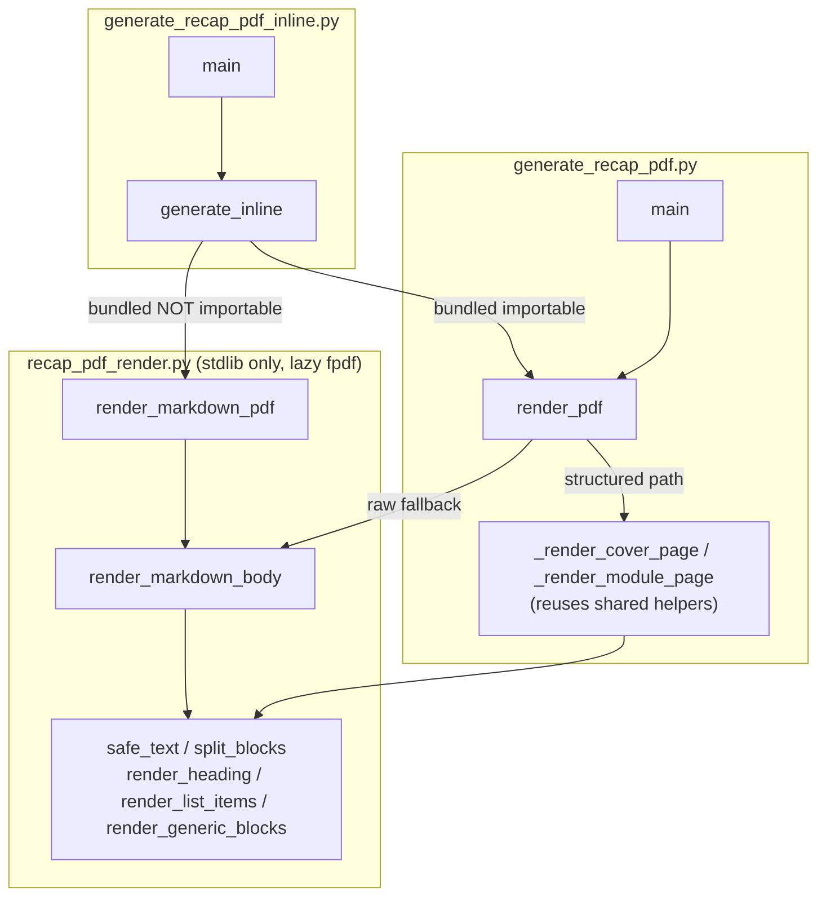

# Design Document

## Overview

This is a **behavior-preserving refactor**. Today, two scripts in
`senzing-bootcamp/scripts/` each carry their own copy of the raw-Markdown → PDF rendering concept:

- `generate_recap_pdf.py` (the **Bundled_Generator**) parses recap Markdown into a structured model
  and renders a rich PDF. When no structured sections parse, it falls back to rendering the raw
  Markdown body via `render_markdown_body`, backed by `_split_into_blocks`, `_render_heading`,
  `_render_list_items`, `_render_generic_blocks`, and `_safe_text`.
- `generate_recap_pdf_inline.py` (the **Inline_Generator**) reuses the bundled parser/renderer when
  it is importable, and otherwise renders the raw Markdown body with its **own** embedded minimal
  renderer (`_render_inline_pdf`, plus `_split_blocks` and `_safe_text`).

The embedded inline renderer duplicates the raw-Markdown rendering concept that also lives in the
bundled fallback path. As this code changes, the two copies risk drifting apart — handling the same
Markdown construct (fenced code, headings, Latin-1-unsafe text, block boundaries) differently.

This refactor introduces a single canonical, stdlib-only module — **`recap_pdf_render.py`**
(the **Shared_Renderer_Module**) — that owns the raw-Markdown → PDF rendering logic. Both generator
scripts import it, eliminating the duplication. The refactor preserves every externally observable
behavior of both scripts:

- the same `--input` / `--output` CLI flags and defaults,
- the same `PDF generated: <path>` stdout success contract,
- the same exit codes (0 on a written PDF, 1 on every no-PDF outcome),
- the same graceful degradation when `fpdf2` is absent (the `pip install fpdf2` hint, no traceback),
- the same no-false-success rule, and
- the same non-empty PDF body containing recap content.

The Shared_Renderer_Module lazily imports `fpdf` (never at module top level) and never depends on
the structured parser/model, so the Inline_Generator keeps its independence from the bundled module.

### Resolved Open Design Decisions

The requirements list four open design decisions. They are resolved here:

1. **Module name and location.** A new stdlib-only module
   `senzing-bootcamp/scripts/recap_pdf_render.py`, importable via the documented `sys.path` pattern
   (scripts are not packages). It does not depend on the Structured_Module.

2. **Public function signatures.** A small set of functions mirroring the existing helpers rather
   than a single monolithic entry point, because the Bundled_Generator's *structured* path also
   reuses `safe_text`, `render_heading`, `render_list_items`, and `render_generic_blocks`. The
   canonical entry points are:
   - `render_markdown_body(pdf, body_text)` — renders raw-Markdown blocks into an **existing** FPDF
     instance (no page/cover management, no `fpdf` import); used by both generators' raw-body paths.
   - `render_markdown_pdf(body_text, output_path, *, title="Senzing Bootcamp Recap")` — a
     convenience entry that **lazily imports `fpdf`**, creates the document, emits the single cover
     line, calls `render_markdown_body`, and writes the file; used by the Inline_Generator in place
     of the removed `_render_inline_pdf`. The cover line title is a parameter with a default that
     preserves current behavior.

3. **Whether to migrate the Bundled_Generator's fallback too.** **Yes — option (a).** The
   Bundled_Generator's raw-Markdown fallback is migrated onto the Shared_Renderer so there is
   exactly one canonical raw renderer. The shared primitives (`safe_text`, `split_blocks`,
   `render_heading`, `render_list_items`, `render_generic_blocks`, `render_markdown_body`) become the
   single home for this logic; the Bundled_Generator imports them and uses them in both its
   structured path and its fallback path. This most fully eliminates the duplication that motivated
   the feature.

4. **Reconciling cosmetic differences.** Cover treatment stays **per-script** and unchanged:
   - the Inline_Generator keeps its single bold **cover line** (it renders raw Markdown without
     parsing a header), produced by `render_markdown_pdf`;
   - the Bundled_Generator keeps its full **cover page** (built from the parsed header in
     `_render_cover_page`) and then calls the shared `render_markdown_body` for the fallback body.

   Body rendering is unified onto the canonical renderer. The Inline_Generator's body output gains
   the canonical renderer's richer list handling (bulleted/numbered items render as list entries
   rather than prose), which is a cosmetic improvement that still satisfies each script's observable
   contract: a non-empty PDF body containing the recap content.

## Architecture

### Before



### After



The embedded `_render_inline_pdf`, `_split_blocks`, and `_safe_text` helpers are removed from the
Inline_Generator. The duplicated raw-Markdown rendering concept now exists in exactly one place.

### Module boundaries and dependency direction

- `recap_pdf_render.py` depends on: Python standard library only at top level; `fpdf` lazily inside
  `render_markdown_pdf`. It does **not** import `generate_recap_pdf` (no Structured_Module
  dependency), keeping it independently importable.
- `generate_recap_pdf.py` depends on `recap_pdf_render` for the shared raw/primitive rendering, plus
  its own structured parser/model and cover-page rendering.
- `generate_recap_pdf_inline.py` depends on `recap_pdf_render` for the embedded-fallback path and
  (best-effort, when importable) on `generate_recap_pdf` for the structured path. It no longer
  defines any raw renderer of its own.

## Components and Interfaces

### Shared_Renderer_Module — `recap_pdf_render.py`

Stdlib-only at module top level (`from __future__ import annotations`, `re`). `fpdf` is imported
only inside `render_markdown_pdf`.

```python
def safe_text(text: str) -> str:
    """Return text safe for PDF core fonts: characters outside Latin-1 are
    replaced (encode 'latin-1', errors='replace')."""

def split_blocks(text: str) -> list[str]:
    """Split raw Markdown into renderable blocks. Consecutive non-blank lines
    group into paragraph blocks; fenced code blocks (```-delimited) stay intact
    as single blocks even when they contain blank lines."""

def render_heading(pdf: "FPDF", text: str, level: int) -> None:
    """Render an ATX heading at level 2 (larger) or 3 (smaller) into pdf."""

def render_list_items(pdf: "FPDF", items: list[str], numbered: bool = False) -> None:
    """Render bulleted or numbered list items, with inline-code (backtick)
    spans rendered in a monospace font."""

def render_generic_blocks(pdf: "FPDF", blocks: list[str]) -> None:
    """Render prose paragraphs and fenced code blocks. Fenced code renders in a
    monospace font with the fence delimiter lines removed."""

def render_markdown_body(pdf: "FPDF", body_text: str) -> None:
    """Canonical raw-Markdown body renderer. Splits body_text into blocks and
    renders ATX headings, bulleted/numbered lists, fenced code, and prose into
    the provided FPDF instance. Does NOT create pages, render a cover, or import
    fpdf — the caller owns those."""

def render_markdown_pdf(
    body_text: str,
    output_path: str,
    *,
    title: str = "Senzing Bootcamp Recap",
) -> None:
    """Convenience entry for the Inline_Generator. Lazily imports fpdf, creates
    the document, emits a single bold cover line (title), renders body_text via
    render_markdown_body, and writes the PDF to output_path.

    Raises:
        ImportError: if fpdf2 is not installed.
        OSError: if the PDF cannot be written.
    """
```

**Design notes.**

- `render_markdown_body` takes an already-constructed `pdf`, so it never imports `fpdf`. This lets
  the Bundled_Generator call it from inside its own `render_pdf` (where `fpdf` is already imported
  lazily) and lets the structured path share the same primitive helpers.
- `render_markdown_pdf` is the only function that imports `fpdf`, and it does so **inside the
  function body** (Lazy_Import), satisfying graceful degradation: an absent `fpdf2` surfaces as an
  `ImportError` the caller already handles.
- Names are public (no leading underscore) because they are an intentional cross-module API.

### Bundled_Generator — `generate_recap_pdf.py` (changes)

- Remove the local definitions of `_safe_text`, `_split_into_blocks`, `_render_heading`,
  `_render_list_items`, `_render_generic_blocks`, and the body of `render_markdown_body`.
- Import the shared primitives:
  `from recap_pdf_render import (safe_text, split_blocks, render_heading, render_list_items,
  render_generic_blocks, render_markdown_body)`.
- The structured path (`_render_cover_page`, `_render_module_page`, `_render_qa_pairs`,
  `_build_qa_lines`) keeps its logic but calls the shared `safe_text`, `render_heading`,
  `render_list_items`, and `render_generic_blocks` (identical code, now sourced from one place), so
  structured rendering is behaviorally unchanged.
- In `render_pdf`, the raw-body fallback branch calls `render_markdown_body(pdf, body_text)` from the
  shared module instead of a local copy. The cover page and structured branch are unchanged.
- `main`, `parse_args`, the parser/model, and the under-population warnings are untouched.

### Inline_Generator — `generate_recap_pdf_inline.py` (changes)

- Remove `_render_inline_pdf`, `_split_blocks`, and `_safe_text` entirely (Req 2.2).
- Import the shared module: `from recap_pdf_render import render_markdown_pdf`.
- `_import_bundled_renderer` is unchanged: when `generate_recap_pdf` is importable, the structured
  parser/renderer is reused exactly as before (Req 2.3).
- In `generate_inline`, the fallback branch (bundled module not importable) calls
  `render_markdown_pdf(content, output_path)` instead of `_render_inline_pdf(content, output_path)`
  (Req 2.1, 2.4, 7.1). All input validation, the `fpdf` `ImportError` handling, the
  `OSError` handling, the post-render output-exists check, the `PDF generated:` line, and the exit
  codes are unchanged.

### Interaction flows

Inline_Generator, structured module **importable**:

```
generate_inline -> _import_bundled_renderer() -> (parse_recap_markdown, render_pdf)
                -> parse_recap_markdown(content) -> render_pdf(doc, output, body_text=content)
                   (render_pdf's fallback, if reached, uses shared render_markdown_body)
```

Inline_Generator, structured module **not importable**:

```
generate_inline -> _import_bundled_renderer() -> None
                -> recap_pdf_render.render_markdown_pdf(content, output)
                   (lazy import fpdf; cover line; render_markdown_body)
```

## Data Models

This refactor introduces no new data models. The structured model
(`RecapHeader`, `RecapSection`, `RecapDocument`) stays in the Bundled_Generator and is **not** moved
into the Shared_Renderer_Module — the shared module operates purely on `str` body text and an
`fpdf.FPDF` instance, keeping it independent of the Structured_Module (Req 3.3, 7.2).

The data the Shared_Renderer manipulates:

| Concept | Type | Description |
|---|---|---|
| Raw_Markdown_Body | `str` | Unparsed recap Markdown to render |
| Block | `str` | One renderable unit from `split_blocks` (paragraph, heading line, or intact fenced code block) |
| List item | `str` | A single bulleted/numbered entry, leading marker removed |
| Latin-1-safe text | `str` | Output of `safe_text`, guaranteed Latin-1 encodable |
| Output path | `str` | Filesystem path the PDF is written to |

## Correctness Properties

*A property is a characteristic or behavior that should hold true across all valid executions of a
system — essentially, a formal statement about what the system should do. Properties serve as the
bridge between human-readable specifications and machine-verifiable correctness guarantees.*

These properties target the canonical Shared_Renderer. Because both generators route their
raw-Markdown rendering through the single shared module, validating the canonical renderer validates
the behavior for both callers; per-caller wiring and the CLI/exit-code contracts are covered by the
example and smoke tests described in the Testing Strategy.

### Property 1: Raw body content survives rendering

*For any* non-empty Raw_Markdown_Body, rendering it through the Shared_Renderer produces a non-empty
renderable body in which every distinctive content token from the input survives (no recap content
is dropped to a cover-only PDF). Token survival is checked through the renderer's block seam
(`split_blocks`) — the same content the renderer emits — which is robust against lossy PDF text
extraction.

**Validates: Requirements 1.3, 2.4, 3.2, 7.1, 8.1**

### Property 2: Latin-1 safety never raises an encoding error

*For any* string — including characters outside the Latin-1 range — `safe_text` returns a value that
encodes cleanly to Latin-1, and rendering a body containing that text through the Shared_Renderer
completes without raising an encoding error.

**Validates: Requirements 1.4**

### Property 3: Fenced-code rendering strips the fence delimiters

*For any* fenced-code block (inner code wrapped in ```` ``` ```` delimiter lines), the
Shared_Renderer renders the inner code content with the opening and closing fence delimiter lines
removed.

**Validates: Requirements 1.5**

## Error Handling

The refactor preserves the existing error-handling contract exactly; it does not introduce new error
paths. Responsibility is split between the shared module (which raises) and the generators (which
translate raises into the stdout/stderr/exit-code contract).

| Condition | Where handled | Behavior (unchanged) |
|---|---|---|
| `fpdf2` not installed | `render_markdown_pdf` / `render_pdf` raise `ImportError`; generator catches it | Print `pip install fpdf2` hint to stderr, return exit code 1, no traceback (Req 6.2, 6.3) |
| Input file missing | Generator `main` / `generate_inline` | Print error to stderr, return exit code 1 (Req 5.2) |
| Input file empty | Generator `main` / `generate_inline` | Print error to stderr, return exit code 1 (Req 5.3) |
| PDF write fails (`OSError`) | Generator catches | Print `Failed to write PDF: <err>` to stderr, return exit code 1 |
| No PDF at output path after render | Inline_Generator post-check | Print error to stderr, return exit code 1 (Req 5.4) |
| Non-Latin-1 characters | `safe_text` in shared module | Replaced via `encode('latin-1', errors='replace')`; never raises (Req 1.4) |

Key invariants preserved:

- **Lazy import boundary.** The shared module never imports `fpdf` at top level (Req 6.1); the only
  `import fpdf` lives inside `render_markdown_pdf`. The Bundled_Generator's `render_pdf` retains its
  own lazy `from fpdf import FPDF`. An absent `fpdf2` therefore surfaces only as an `ImportError`
  raised from within a render function, exactly where the generators already catch it.
- **No-false-success.** The `PDF generated:` line is printed only on a written-PDF success path
  returning 0; every exit-code-1 path leaves stdout free of it (Req 4.4, 5.5).

## Testing Strategy

Property-based testing **is appropriate** for the canonical renderer: `safe_text`, `split_blocks`,
and the block-rendering seam are pure-logic functions with universal properties over a large input
space (arbitrary Markdown, arbitrary Unicode). The CLI/stdout/exit-code contracts and the
structural/dependency/lazy-import guarantees are **not** property-based — they are verified with
example and smoke tests.

### Property tests (Hypothesis)

Use the existing Hypothesis setup (`hypothesis_profiles`, the `st_` strategy convention, the
documented `sys.path` import idiom). Example counts come from the active profile baseline (`fast`→10
locally, `thorough`→100 in CI); do not hand-set `@settings(max_examples=...)` to restate the
baseline. Each property test is tagged with a comment referencing its design property:

`# Feature: shared-markdown-renderer-refactor, Property N: <property text>`

- **Property 1 — content survival.** Generate non-empty free-form recap Markdown (loose headings,
  prose, fenced code) with injected ASCII marker tokens; render through the Shared_Renderer; assert a
  non-empty body and that every token survives via the `split_blocks` seam, and that a valid `%PDF`
  file is written when `fpdf2` is present. This is the test required by Req 8.1.
- **Property 2 — Latin-1 safety.** For arbitrary strings (including astral/non-Latin-1 code points),
  assert `safe_text(s).encode("latin-1")` succeeds, and that rendering a body containing `s` does not
  raise an encoding error.
- **Property 3 — fence stripping.** For fenced-code blocks with arbitrary inner content, assert the
  renderer drops the ```` ``` ```` delimiter lines and retains the inner code lines.

### Unit / example tests

- CLI defaults and overrides for both generators (Req 4.1, 4.2).
- Success path: representative recap → `PDF generated:` on stdout, exit 0, PDF exists (Req 4.3, 5.1).
- No-false-success: missing input, empty input, and `fpdf2`-absent each return 1 with no success line
  (Req 4.4, 5.2, 5.3, 5.5).
- Graceful degradation: `fpdf2` absent → hint on stderr, exit 1, no traceback, no PDF (Req 6.2, 6.3).
- Inline routing: with the bundled module unimportable, `generate_inline` renders via the
  Shared_Renderer and exits 0 with a valid PDF (Req 2.1, 2.4, 7.1, 7.3, 8.2); with the bundled module
  importable, it reuses the structured path (Req 2.3).

### Smoke / structural tests

- Shared module imports only stdlib at top level and does **not** import `fpdf` there; it imports
  cleanly with `sys.modules["fpdf"] = None` (Req 1.2, 6.1, 8.5).
- Shared module does not import the Structured_Module and is importable with `generate_recap_pdf`
  forced unimportable (Req 3.3, 7.2).
- Inline module no longer defines `_render_inline_pdf`, `_split_blocks`, or `_safe_text` (Req 2.2).
- Both generators import the shared rendering symbols (Req 1.1).

### Regression gates

- `senzing-bootcamp/tests/test_generate_recap_pdf.py` passes **without modification** to asserted
  behavior (Req 3.1, 8.3).
- `senzing-bootcamp/tests/test_generate_recap_pdf_inline.py` passes, edited **only** where it
  imported the removed embedded helpers — specifically the `from generate_recap_pdf_inline import
  _split_blocks` import and its uses are repointed to `recap_pdf_render.split_blocks`; no asserted
  behavior changes (Req 8.4).
- Library policy: reuse the installed Hypothesis library; do not implement property testing from
  scratch. Minimum 100 iterations per property in the `thorough` profile.
