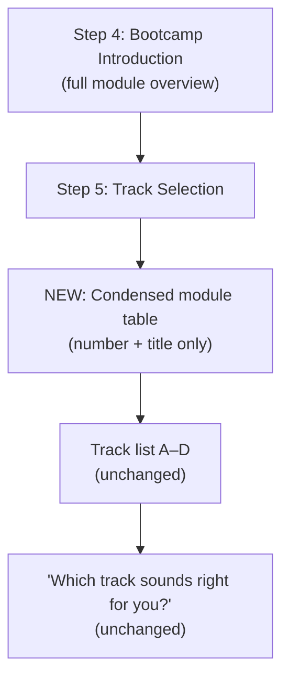

# Design: Show Modules at Track Selection

## Overview

This feature adds a condensed module reference table to Step 5 (Track Selection) of the `senzing-bootcamp/steering/onboarding-flow.md` steering file. The table lists each module's number and title so users can cross-reference track descriptions (which cite module numbers like "4→5→7") without scrolling back to the full module overview in Step 4.

This is a static content edit — no new files, components, or executable code are introduced.

## Architecture

There is no software architecture change. The modification is confined to a single markdown steering file that an AI agent reads at runtime to guide the bootcamp onboarding flow.

The new content is inserted between the `## 5. Track Selection` heading and the existing track list, so the agent displays the quick-reference table immediately before presenting the tracks.

## Components and Interfaces

### Modified file

`senzing-bootcamp/steering/onboarding-flow.md` — Step 5 section only.

### Inserted content

1. A brief agent instruction line telling the agent to display the quick-reference table before presenting the tracks.
2. A two-column markdown table covering modules 0–11:

| Module | Title |
|--------|-------|
| 0 | Set Up SDK |
| 1 | Quick Demo |
| 2 | Understand Business Problem |
| 3 | Data Collection Policy |
| 4 | Data Quality & Mapping |
| 5 | Load Single Data Source |
| 6 | Multi-Source Orchestration |
| 7 | Query and Visualize |
| 8 | Performance Testing and Benchmarking |
| 9 | Security Hardening |
| 10 | Monitoring and Observability |
| 11 | Package and Deploy |

### Placement

The table goes after the `## 5. Track Selection` heading and before the line that begins "Present tracks — not mutually exclusive…". This ensures the module reference and track descriptions are visible together.

### What is NOT changed

- The track descriptions (A–D) remain exactly as they are.
- The "Present tracks with…" instruction remains unchanged.
- The full module overview in Step 4 is not modified.
- No other sections of onboarding-flow.md are touched.

## Data Models

Not applicable. No data structures, databases, or state are involved. The change is static markdown content consumed by an AI agent at runtime.

## Error Handling

The only failure mode is malformed markdown that breaks the agent's ability to parse the steering file. This is mitigated by:

1. Running CommonMark lint validation (`validate_commonmark.py`) on the edited file.
2. Running `validate_power.py` to confirm the steering file remains valid within the power structure.

If either validation fails, the edit must be corrected before merging.

## Testing Strategy

Property-based testing does **not** apply to this feature. The change is a static markdown content edit with no executable code, no functions, no input/output behavior, and no data transformations. There are no universal properties to assert across generated inputs.

### Validation approach

- **CommonMark lint**: Run `python senzing-bootcamp/scripts/validate_commonmark.py` on the edited `onboarding-flow.md` to catch formatting issues (missing blank lines around headings, malformed tables, etc.).
- **Power structure validation**: Run `python senzing-bootcamp/scripts/validate_power.py` to confirm the steering file is still recognized and valid within the power distribution.
- **Manual review**: Verify the table contains all 12 modules (0–11), titles match the canonical module documentation, and the table appears in the correct position relative to the track list.

### Design decisions

| Decision | Rationale |
|----------|-----------|
| Two-column table (Module, Title) only | Requirement 4 prohibits duplicating the full descriptions from Step 4. Number + title is enough to jog memory. |
| All modules 0–11 included | Requirement 2 requires covering all modules referenced by tracks A–D. Including all 12 avoids confusion if a user wonders about a module not in their chosen track. |
| Placed between heading and track list | Requirement 3 requires the table and track question to be visible together. Placing the table immediately before the tracks minimizes scrolling. |
| Agent instruction line before table | Tells the agent to actively display the table, not just have it in the steering file passively. |
