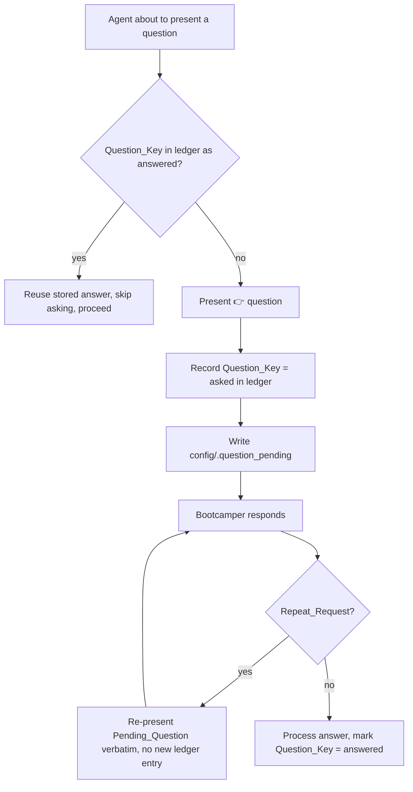

# Design Document

## Overview

Today, "ask each question once" relies on conversational memory plus a handful of local "do not re-ask" notes. That is fragile: after context compaction or a session resume the agent can lose track of what it already asked. This design makes the guarantee durable by introducing a **persisted Question_Ledger** as the single source of truth for what has been asked and answered, a small stdlib helper to manipulate it, and steering/hook changes so both the agent and the `ask-bootcamper` Stop hook consult it. It also adds an explicit **Repeat_Request** path so the bootcamper can re-see a question without it counting as a duplicate.

This complements — and does not replace — the existing single-question and self-answering-prevention specs (`single-question-format`, `self-answering-prevention-v2`, `leading-question-enforcement`). Those govern *how many* and *what shape* a question is; this spec governs *how many times the same question may be asked*.

## Architecture



### Components

| Component | Role |
| --- | --- |
| `config/question_ledger.jsonl` | Persisted ledger. One JSON object per line: `{"key","status","ts"}`. Per-member path in team mode. |
| `scripts/question_ledger.py` | Stdlib helper: `record-asked`, `mark-answered`, `is-answered`, `get-pending` operations via argparse. |
| `steering/conversation-protocol.md` | Home of the single normative "ask at most once unless Repeat_Request" rule. |
| `steering/agent-behavior-rules.md`, `steering/agent-instructions.md` | Reference the normative rule; remove/consolidate scattered "do not re-ask" notes. |
| `hooks/ask-bootcamper.json` | Stop hook consults the ledger before emitting a closing question. |
| `hooks/review-bootcamper-input.json` | UserPromptSubmit hook recognizes Repeat_Request phrases. |

### Question_Key Scheme

Keys are stable and derived from the owning step so the same logical question always maps to the same key:

- Onboarding: `onboarding.<step>` — e.g., `onboarding.language_selection`, `onboarding.track_selection`, `onboarding.verbosity`, `onboarding.er_explore`, `onboarding.comprehension`.
- Module steps: `module.<N>.<step-or-substep>` — e.g., `module.5.7a`.
- Cross-module singletons: a fixed key — e.g., `global.hardware_target` (the Module 8 hardware question reused in Modules 9/11).

The step-owning steering file names the Question_Key when it defines the question, so the agent and hooks use the same key. This reuses the existing checkpoint discipline (`current_step`, `step_history`) rather than inventing a parallel identity.

## Components and Interfaces

### `scripts/question_ledger.py`

```text
question_ledger.py record-asked  --key KEY [--member ID]
question_ledger.py mark-answered --key KEY [--member ID]
question_ledger.py is-answered   --key KEY [--member ID]   # exit 0 = answered, 1 = not
question_ledger.py get-pending   [--member ID]             # prints pending key or nothing
```

- Resolves the ledger path: `config/question_ledger.jsonl` (single-user) or `config/question_ledger_{member_id}.jsonl` (co-located team mode), mirroring the preferences/progress convention.
- `record-asked` appends an `asked` entry only if the key is not already present as `asked` or `answered` (idempotent).
- `mark-answered` upserts the key to `answered`.
- Reads tolerate missing/malformed files by treating the ledger as empty; a subsequent write recreates a clean file. Malformed individual lines are skipped, not fatal.
- Dataclass `LedgerEntry(key: str, status: str, ts: str)`; a minimal stdlib JSONL reader/writer (no PyYAML, consistent with repo conventions).

### `ask-bootcamper` Hook Changes

The Stop hook already owns the closing `👉` question. Add a step to its prompt: before emitting a closing question tied to a step whose Question_Key is already answered, do not re-ask — instead advance using the stored answer. The hook remains silent when `config/.question_pending` exists (unchanged deferral). The ledger check is advisory to the hook's question *selection*, never a reason to emit nothing when a genuinely new question is due.

### `review-bootcamper-input` Hook Changes

Add Repeat_Request trigger phrases (case-insensitive): "repeat that", "repeat the question", "say that again", "what was the question", "ask me again", "come again". On match, route to the repeat behavior: re-present the current Pending_Question verbatim, create no new ledger entry, and leave answered status unchanged. If there is no Pending_Question, say so.

### Steering Rule Consolidation

Add one normative rule to `conversation-protocol.md`:

> **Ask-Once Guarantee.** Every `👉` question has a stable Question_Key. Before asking, consult the Question_Ledger; never re-ask a question already recorded as answered — reuse the stored answer and proceed. Re-present a question only in response to an explicit Repeat_Request, which does not create a new ledger entry. The ledger (not conversational memory) is authoritative across compaction and resume.

Then reframe the existing narrow notes (Module 8 hardware "do not re-ask"; session-resume "do not re-ask loaded preference fields") as instances of this rule, cross-referencing it.

## Data Models

`config/question_ledger.jsonl` — one object per line:

```json
{"key": "onboarding.language_selection", "status": "answered", "ts": "2026-07-13T10:00:00+00:00"}
```

`status ∈ {"asked", "answered"}`. Last-writer-wins per key; `answered` supersedes `asked`.

## Error Handling

- **Missing/malformed ledger:** treated as empty on read; recreated on write. Never raises to the agent or blocks the bootcamper (Req 5.4).
- **Ledger unavailable but preferences hold the answer:** the agent must still not re-ask when the answer is already persisted in `config/bootcamp_preferences.yaml` (Req 4.4) — the ledger is the primary mechanism, preferences are the safety net.
- **Repeat_Request with no pending question:** the agent states there is no outstanding question (Req 3.3).
- **Race between ledger and `.question_pending`:** `.question_pending` remains the authority for *which* question is currently outstanding; the ledger tracks *whether it has ever been answered*. They are complementary.

## Testing Strategy

Property-based testing applies to the helper script (it has real logic); steering/hook changes are asserted with content tests, consistent with the existing hook-prompt test framework.

### Property-Based Tests (`test_question_ledger.py`)

- `st_question_key()` strategy generating valid keys.
- Idempotency: recording the same asked key N times yields exactly one `asked` entry; querying is stable.
- Answer supersedes: after `mark-answered`, `is-answered` returns true regardless of prior `asked` entries.
- Malformed tolerance: a ledger file seeded with junk lines is read as empty/partial without raising, and a subsequent write produces a valid file.
- Round-trip: record → mark-answered → is-answered holds for arbitrary key sets.

### Content/Hook Tests

- Assert `conversation-protocol.md` contains the normative Ask-Once Guarantee rule.
- Assert `agent-behavior-rules.md` / `agent-instructions.md` reference it and no longer carry conflicting standalone re-ask guidance.
- Assert `review-bootcamper-input.json` prompt lists the Repeat_Request trigger phrases (via the existing hook-prompt validation approach).
- Assert `ask-bootcamper.json` prompt instructs a ledger consult before emitting a step-tied closing question.

### Verification Approach

1. `python -m pytest senzing-bootcamp/tests/test_question_ledger.py` and the content/hook tests.
2. `python3 senzing-bootcamp/scripts/sync_hook_registry.py --verify` (CI) after editing hook JSON, plus hook JSON schema validity.
3. Full suite `python -m pytest senzing-bootcamp/tests/ tests/`.

### What NOT to Test

- Do not re-test the single-question / self-answering rules owned by other specs; only test the ask-once dimension added here.
