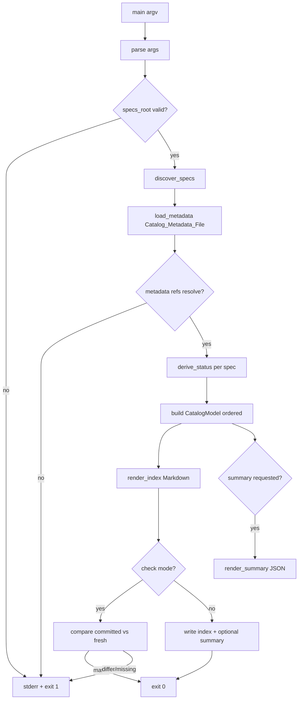

# Design Document

## Overview

The `Spec_Catalog_Generator` is a stdlib-only Python 3.11+ CLI script
(`senzing-bootcamp/scripts/generate_spec_catalog.py`) that builds a regenerable
index of the spec catalog under `.kiro/specs/`. It mirrors the structure and
conventions of the existing reference generator `generate_docs_index.py`: a pure
"collect → derive → render → write/check" pipeline whose output is deterministic
and byte-identical for unchanged inputs, and which only ever writes its own output
files (never touching the indexed spec directories).

The generator performs four logical phases:

1. **Discover** — enumerate immediate subdirectories of the specs root, recording
   document presence and reading each `.config.kiro` (JSON).
2. **Resolve metadata** — load the curated `Catalog_Metadata_File` (YAML) for status
   overrides, supersession relationships, and related-spec links.
3. **Derive status** — assign each spec exactly one `Status_Value` using a fixed
   precedence: override → supersession → task-checkbox state → document presence.
4. **Render & emit** — produce the CommonMark `Spec_Index` (always) and the optional
   JSON `Catalog_Summary`, or in `--check` mode compare without writing.

### Research Summary and Decision Point Resolutions

Research into the existing repository conventions (the reference script, the Python
steering rules, the CI workflow, and the existing curated configs) resolves the
three Decision Points recorded in the requirements:

- **Decision 1 — Index location (resolved):** The `Spec_Index` defaults to
  `.kiro/SPEC_CATALOG.md`. The index describes `.kiro/specs/`, which is
  workspace-only development tooling. Per the structure steering rule ("Everything
  in `senzing-bootcamp/` ships to users — no dev-only files"), placing the index
  under `.kiro/` keeps internal development artifacts out of the distributed power.
  The path is overridable via `--output` (Requirement 9.2), and the index is
  CommonMark-compliant at any path (Requirement 9.3).

- **Decision 2 — Relationship storage (resolved):** Supersession and related-spec
  links live in a single curated `Catalog_Metadata_File` at
  `.kiro/spec-catalog.yaml`, not in the 221 per-spec `.config.kiro` files. The
  `.config.kiro` files are tool-managed JSON (`specId`, `workflowType`, `specType`);
  adding editorial fields there risks being overwritten and scatters relationship
  data. A single curated file is analogous to `module-dependencies.yaml`. It sits
  under `.kiro/` (alongside the index) because it too is workspace-only and must not
  ship in `senzing-bootcamp/`.

- **Decision 3 — Config/metadata format (resolved):** `.config.kiro` is parsed with
  the stdlib `json` module (it is JSON in practice across the catalog). The
  `Catalog_Metadata_File` uses YAML for consistency with other curated configs
  (`module-dependencies.yaml`, `steering-index.yaml`) and is parsed by a **minimal
  in-script YAML parser** covering only the subset needed (top-level keys, nested
  mappings, and `- ` list items), matching the established repository pattern in
  `sync_hook_registry.py` and `validate_prerequisites.py`. This keeps the generator
  strictly stdlib-only (Requirement 8.9) without a PyYAML dependency.

## Architecture



The pipeline is deliberately split into **pure functions** (discovery, status
derivation, rendering) and a thin **I/O shell** (`main`). All decision logic lives
in pure functions that take in-memory inputs and return values, which makes the
behavior directly property-testable and keeps writes confined to `main` (supporting
the read-only guarantee of Requirement 7).

### Determinism Strategy

Determinism (Requirement 7.1) is achieved by:

- Sorting discovered spec directories by a case-insensitive key
  (`identifier.casefold()`) with the raw identifier as a tiebreaker.
- Iterating metadata relationships in sorted order before rendering.
- Emitting status-group counts in a fixed enumerated order (`STATUS_ORDER`), not
  dict-insertion order.
- Rendering with a stable template terminated by a single trailing newline (mirrors
  `generate_docs_index.py`).
- Serializing JSON with `json.dumps(..., indent=2, sort_keys=True)` plus a trailing
  newline.

## Components and Interfaces

All components live in `generate_spec_catalog.py`. Function signatures use Python
3.11+ type hints (`X | None`, lowercase generics) per the Python conventions
steering.

### Constants

```python
DEFAULT_SPECS_ROOT = Path(".kiro/specs")
DEFAULT_INDEX_PATH = Path(".kiro/SPEC_CATALOG.md")
DEFAULT_METADATA_PATH = Path(".kiro/spec-catalog.yaml")
CONFIG_FILENAME = ".config.kiro"
SPEC_DOCUMENTS = ("requirements.md", "design.md", "tasks.md")
STATUS_ORDER = ("in-progress", "implemented", "superseded", "abandoned", "unknown")
```

### Discovery

```python
def discover_specs(specs_root: Path) -> list[SpecRecord]:
    """Enumerate immediate subdirectories of specs_root as SpecRecords,
    sorted case-insensitively by identifier. Reads document presence and
    .config.kiro (JSON). Raises CatalogError on invalid JSON config."""

def read_config(config_path: Path) -> SpecConfig | None:
    """Parse .config.kiro JSON; return None when absent. Raise CatalogError
    naming the offending Spec_Directory when content is not valid JSON."""

def count_task_checkboxes(tasks_md: Path) -> tuple[int, int]:
    """Return (total, complete) Task_Checkbox counts by scanning lines that
    match the committed '- [ ]' / '- [x]' format (case-insensitive 'x')."""
```

`count_task_checkboxes` recognizes a checkbox as a line whose stripped form starts
with `- [ ]`, `- [x]`, or `- [X]` (the committed format). Any other content,
including prose containing brackets, is ignored.

### Metadata Resolution

```python
def load_metadata(metadata_path: Path) -> CatalogMetadata:
    """Load and parse the YAML Catalog_Metadata_File. Returns an empty
    CatalogMetadata when the file is absent (Req 3.6). Raise CatalogError on
    parse failure (Req 8.8)."""

def _parse_simple_yaml(text: str) -> dict:
    """Minimal stdlib YAML-subset parser (top-level keys, nested mappings,
    '- ' list items, scalar key: value). No PyYAML dependency."""

def validate_metadata_refs(
    metadata: CatalogMetadata, known_ids: set[str]
) -> list[str]:
    """Return the sorted list of metadata-referenced identifiers that match no
    discovered Spec_Directory. A non-empty result triggers exit code 1 (Req 3.5)."""
```

### Status Derivation

```python
def derive_status(record: SpecRecord, metadata: CatalogMetadata) -> str:
    """Assign exactly one Status_Value using fixed precedence:
    1. explicit override in metadata
    2. recorded supersession (spec appears as a superseded target)
    3. tasks.md checkbox state (all complete -> implemented;
       any incomplete -> in-progress; present but no checkbox -> unknown)
    4. document presence (requirements.md or design.md present -> in-progress)
    5. otherwise -> unknown
    """
```

### Relationship Assembly

```python
def resolve_relationships(
    metadata: CatalogMetadata,
) -> dict[str, SpecRelationships]:
    """Build per-identifier reciprocal relationships: for each directional
    supersession (A supersedes B), record A.supersedes += [B] and
    B.superseded_by += [A]; related links are recorded symmetrically. All lists
    are sorted for determinism (Req 3.3, 3.4)."""
```

### Rendering

```python
def build_catalog(
    records: list[SpecRecord],
    metadata: CatalogMetadata,
) -> Catalog:
    """Compose the fully-resolved, ordered in-memory Catalog model."""

def render_index(catalog: Catalog) -> str:
    """Render the CommonMark Spec_Index, including provenance banner,
    status-count summary, and one entry per spec with status/specType/
    workflowType, a link to the Spec_Directory, and any relationships.
    Deterministic; terminated by a single newline."""

def render_summary(catalog: Catalog) -> str:
    """Render the Catalog_Summary as JSON (indent=2, sort_keys=True) ending in
    a newline, entries ordered case-insensitively by identifier (Req 5.4)."""
```

### I/O Shell

```python
def main(argv: list[str] | None = None) -> int:
    """Parse CLI args; run the pipeline; write outputs or perform the drift
    check. Return 0 on success / in-sync, 1 on any detected error or drift."""
```

### CLI Interface

| Argument | Maps to | Behavior |
|---|---|---|
| `--specs-root PATH` | Req 8.1 | Override specs root (default `.kiro/specs`) |
| `--output PATH` | Req 9.2 | Override index output path (default `.kiro/SPEC_CATALOG.md`) |
| `--metadata PATH` | Decision 2 | Override metadata file (default `.kiro/spec-catalog.yaml`) |
| `--summary PATH` | Req 5.1, 8.3 | Write the JSON `Catalog_Summary` to PATH (omitted = no summary) |
| `--check` | Req 6, 8.2 | Drift_Check_Mode: compare without writing |

## Data Models

```python
@dataclass(frozen=True)
class SpecConfig:
    """Parsed .config.kiro contents (only the fields the catalog uses)."""
    workflow_type: str | None
    spec_type: str | None

@dataclass(frozen=True)
class SpecRecord:
    """A discovered spec directory and its derived signals."""
    identifier: str               # directory name (Req 1.2)
    has_requirements: bool        # Req 1.3
    has_design: bool              # Req 1.3
    has_tasks: bool               # Req 1.3
    config: SpecConfig | None     # Req 1.4 (None when .config.kiro absent)
    task_total: int               # total Task_Checkbox count
    task_complete: int            # complete Task_Checkbox count

@dataclass(frozen=True)
class SpecRelationships:
    """Reciprocal, sorted relationship lists for one spec."""
    supersedes: tuple[str, ...]
    superseded_by: tuple[str, ...]
    related: tuple[str, ...]

@dataclass(frozen=True)
class CatalogMetadata:
    """Curated editorial facts from the Catalog_Metadata_File."""
    status_overrides: dict[str, str]            # identifier -> Status_Value
    supersessions: tuple[tuple[str, str], ...]  # (superseding, superseded)
    related: tuple[tuple[str, str], ...]        # normalized unordered pairs

    @classmethod
    def empty(cls) -> "CatalogMetadata": ...

@dataclass(frozen=True)
class SpecEntry:
    """A fully-resolved catalog entry ready for rendering/serialization."""
    record: SpecRecord
    status: str                   # Req 2.1 (one of STATUS_ORDER)
    relationships: SpecRelationships

@dataclass(frozen=True)
class Catalog:
    """The ordered, resolved catalog model."""
    entries: tuple[SpecEntry, ...]   # case-insensitive ascending order
    status_counts: dict[str, int]    # keyed over STATUS_ORDER
```

### Catalog_Metadata_File Schema (`.kiro/spec-catalog.yaml`)

```yaml
# Curated editorial facts the generator cannot derive. Living configuration.
status_overrides:
  some-abandoned-spec: abandoned
supersessions:
  - supersedes: self-answering-prevention-v2
    superseded: self-answering-questions-fix
  - supersedes: self-answering-reinforcement
    superseded: self-answering-prevention-v2
related:
  - module-recap-document
  - module-recap-document-fix
```

`supersessions` is a list of directional `{supersedes, superseded}` mappings;
`related` groups are lists of identifiers that are mutually related. Every
identifier referenced here must resolve to a discovered `Spec_Directory`
(Requirement 3.5).

### Spec_Index Layout (CommonMark)

```markdown
<!-- Generated by generate_spec_catalog.py. Do not edit by hand; regenerate. -->

# Spec Catalog Index

> This file is generated by `generate_spec_catalog.py`. Do not edit it by hand —
> regenerate it instead.

## Status Summary

- in-progress: 12
- implemented: 30
- superseded: 4
- abandoned: 2
- unknown: 1

## Specs

### adaptive-pacing

- Status: in-progress
- Type: feature
- Workflow: requirements-first
- Directory: [.kiro/specs/adaptive-pacing/](.kiro/specs/adaptive-pacing/)

### self-answering-questions-fix

- Status: superseded
- Type: bugfix
- Workflow: requirements-first
- Directory: [.kiro/specs/self-answering-questions-fix/](.kiro/specs/self-answering-questions-fix/)
- Superseded by: self-answering-prevention-v2
- Related: module-recap-document
```

Directory links are rendered relative to the index location and are
CommonMark-compliant regardless of the configured output path (Requirement 9.3).

## Correctness Properties

*A property is a characteristic or behavior that should hold true across all valid
executions of a system — essentially, a formal statement about what the system
should do. Properties serve as the bridge between human-readable specifications and
machine-verifiable correctness guarantees.*

The properties below were derived from the prework analysis. Redundant
acceptance-criteria branches were consolidated: the eight status criteria collapse
into a "single enumerated value" invariant plus a "precedence" property; the
discovery, ordering, relationship, rendering, read-only, drift, and error criteria
each consolidate into one comprehensive property.

### Property 1: Discovery completeness and fidelity

*For any* directory tree, the set of discovered spec identifiers equals exactly the
set of names of the immediate subdirectories of the specs root, each record's
identifier equals its source directory name, and each record's
requirements/design/tasks presence flags match exactly which of those documents
exist in that directory.

**Validates: Requirements 1.1, 1.2, 1.3**

### Property 2: Config values are read faithfully

*For any* `.config.kiro` file containing a valid JSON object, the parsed
`workflowType` and `specType` returned for that spec equal the values written in
the file (and are absent when the file is absent).

**Validates: Requirements 1.4**

### Property 3: Case-insensitive ascending ordering

*For any* set of spec identifiers, the entries in both the rendered Spec_Index and
the Catalog_Summary appear in case-insensitive ascending order of identifier.

**Validates: Requirements 1.6, 5.4**

### Property 4: Status is exactly one enumerated value

*For any* spec record and any metadata, status derivation assigns exactly one
`Status_Value` drawn from {`in-progress`, `implemented`, `superseded`, `abandoned`,
`unknown`}.

**Validates: Requirements 2.1**

### Property 5: Status precedence

*For any* spec record and metadata, the derived status is determined by the
highest-precedence applicable signal in the fixed order — explicit override, then
recorded supersession, then `tasks.md` checkbox state (all complete →
`implemented`; any incomplete → `in-progress`; present with no checkbox →
`unknown`), then document presence (`requirements.md` or `design.md` present →
`in-progress`), otherwise `unknown` — and a higher-precedence signal always
overrides every lower-precedence one.

**Validates: Requirements 2.2, 2.3, 2.4, 2.5, 2.7, 2.8**

### Property 6: Relationship reciprocity and symmetry

*For any* metadata, every directional supersession from A to B causes A's entry to
list B under `supersedes` and B's entry to list A under `superseded_by`, and every
related grouping causes each member to list every other member of the group as
related.

**Validates: Requirements 3.1, 3.2, 3.3, 3.4**

### Property 7: Index rendering completeness

*For any* catalog, the rendered Spec_Index contains, for every spec, an entry
showing the spec identifier, its status, its `specType`, its `workflowType`, a link
to its Spec_Directory, and all of its recorded supersession and related
identifiers.

**Validates: Requirements 4.2, 4.3, 4.5**

### Property 8: Status counts are accurate and total

*For any* catalog, each rendered status-group count equals the actual number of
specs with that status, and the counts sum to the total number of discovered specs.

**Validates: Requirements 4.4**

### Property 9: Summary serialization round-trip

*For any* catalog, the Catalog_Summary serializes to valid JSON that, when parsed
back, yields for every spec the same identifier, status, `specType`,
`workflowType`, document-presence flags, and recorded relationships as the
in-memory model.

**Validates: Requirements 5.2**

### Property 10: Deterministic, byte-identical generation

*For any* specs root and metadata, generating the Spec_Index twice over unchanged
inputs produces byte-identical output.

**Validates: Requirements 7.1**

### Property 11: Strictly read-only over the spec catalog

*For any* specs root, after a generation run and after a drift-check run, every
Spec_Directory and Spec_Document is byte-identical to its pre-run content, and the
only filesystem paths created or modified are the configured index path and (when
requested) the configured summary path.

**Validates: Requirements 7.2, 7.3, 7.4, 6.1**

### Property 12: Drift detection

*For any* catalog, writing the freshly generated Spec_Index and then running
Drift_Check_Mode exits 0; and any subsequent change to the committed index content
or to the set of Spec_Directories causes Drift_Check_Mode to report drift and exit
1, without writing any file.

**Validates: Requirements 6.2, 6.3, 6.5**

### Property 13: Detected errors force exit code 1

*For any* input that contains a detectable error — metadata referencing an unknown
spec identifier, or a `.config.kiro` whose content is not valid JSON — the
generator reports the offending item to standard error and exits with status code
1, even when other processing could complete.

**Validates: Requirements 3.5, 8.5, 8.7**

## Error Handling

The generator centralizes error reporting through a single internal exception type
and a fixed exit-code contract, consistent with `generate_docs_index.py`.

```python
class CatalogError(Exception):
    """Raised for any detected, recoverable processing error. Carries a
    human-readable message that main() prints to stderr before returning 1."""
```

| Condition | Detection point | Behavior | Requirement |
|---|---|---|---|
| Specs root missing / not a directory | `main` pre-check | stderr message, exit 1 | 8.6 |
| `.config.kiro` not valid JSON | `read_config` | `CatalogError` naming the spec dir, exit 1 | 8.7 |
| Metadata file present but unparseable | `load_metadata` | `CatalogError` with parse detail, exit 1 | 8.8 |
| Metadata references unknown spec id | `validate_metadata_refs` | report each unresolved id, exit 1 | 3.5 |
| Required summary field uncollectable | `render_summary` | skip writing summary, exit 1 | 5.5 |
| Drift detected (`--check`) | `main` compare | report difference, exit 1 | 6.3 |
| Index file absent (`--check`) | `main` compare | report missing index, exit 1 | 6.4 |
| Any detected error reaching completion | `main` | exit 1 regardless | 8.5 |
| No errors | `main` | exit 0 | 8.4 |

Design principles for error handling:

- **Fail fast, report clearly.** All error messages go to `sys.stderr` and name the
  offending artifact (spec directory, identifier, or file path) so CI logs are
  actionable.
- **Never partially write.** When a summary cannot be fully collected, no summary
  file is written (Requirement 5.5); the index write path likewise renders the full
  string before a single `write_text` call so output is all-or-nothing.
- **Metadata absence is not an error.** A missing `Catalog_Metadata_File` yields an
  empty `CatalogMetadata` and derived-only generation (Requirement 3.6).

## Testing Strategy

This feature is a set of pure functions over file-derived data with universal,
input-varying behavior (discovery, status derivation, ordering, rendering,
serialization, drift). It is a strong fit for **property-based testing**, paired
with example-based unit tests for concrete I/O paths and error branches. Tests
follow the repository conventions in `tests/test_generate_docs_index.py`:
`sys.path` import of the script, class-based organization, Hypothesis `@given` with
`@settings(max_examples=...)`, and `st_`-prefixed strategies.

### Test Framework and Tooling

- **pytest + Hypothesis**, run via `python -m pytest senzing-bootcamp/tests/`
  (matching `validate-power.yml`).
- Tests live at `senzing-bootcamp/tests/test_generate_spec_catalog.py`.
- The script is imported via `sys.path` manipulation (scripts are not packages).

### Property-Based Tests

Each correctness property is implemented as a **single** property-based test, run
for a **minimum of 100 iterations** (`@settings(max_examples=100)`; use
`suppress_health_check=[HealthCheck.function_scoped_fixture]` when materializing
temp trees, per the reference suite). Each test is tagged with a comment in the
form:

```
# Feature: spec-catalog-index, Property {number}: {property_text}
```

| Property | Generators (sketch) |
|---|---|
| 1 Discovery completeness | `st_spec_tree()` — random subdir names + random doc presence + stray files |
| 2 Config round-trip | `st_config()` — random valid `workflowType`/`specType` JSON objects |
| 3 Ordering | `st_identifiers()` — mixed-case unique identifiers |
| 4 Status single value | `st_record()` x `st_metadata()` |
| 5 Status precedence | `st_record()` with conflicting signals x `st_metadata()` overrides/supersessions |
| 6 Relationship reciprocity | `st_supersessions()` / `st_related_groups()` over known ids |
| 7 Index completeness | `st_catalog()` — fully resolved random catalogs |
| 8 Status counts | `st_catalog()` |
| 9 Summary round-trip | `st_catalog()` to JSON parse-back |
| 10 Determinism | `st_spec_tree()` x `st_metadata()`, generate twice |
| 11 Read-only | `st_spec_tree()` — hash all files before/after run + `--check` |
| 12 Drift detection | `st_catalog()` — write, check, then mutate index/spec set |
| 13 Error conditions | `st_dangling_metadata()`, `st_invalid_json_config()` |

A reusable helper materializes a random spec tree into a temp directory (subdirs,
optional `requirements.md`/`design.md`/`tasks.md` with generated checkbox lists,
optional `.config.kiro`) and tears it down with `shutil.rmtree`, mirroring
`_write_docs` in the reference suite.

### Unit Tests (examples, edge cases, error paths)

Example/edge/smoke criteria become focused unit tests:

- **Edge cases:** empty directory leads to `unknown` and is still listed (1.5);
  `tasks.md` with prose but no checkbox leads to `unknown` (2.6); metadata file
  absent leads to derived-only, empty relationships (3.6); `--check` with no index
  file leads to exit 1 reporting missing (6.4).
- **I/O / CLI examples:** write mode creates the index at the configured path and
  exits 0 (4.1); provenance banner appears at the top of the index (4.6); `--summary`
  writes valid JSON (5.1); omitting `--summary` writes no summary (5.3); incomplete
  record leads to no summary written + exit 1 (5.5); `--specs-root` (8.1),
  `--output` (9.2), and `--check` (8.2) wiring; missing/file specs root leads to
  exit 1 (8.6); malformed metadata leads to exit 1 (8.8); default index path is
  under `.kiro/` and not under `senzing-bootcamp/` (9.1).

### Integration / Smoke (not property-tested)

- **CommonMark compliance (9.3):** generate a representative index from a small
  fixture catalog and run it through `validate_commonmark.py` (1-2 examples);
  repository-wide compliance is enforced by the existing CI step.
- **CI drift gate (9.4):** add a `generate_spec_catalog.py --check` step to
  `.github/workflows/validate-power.yml`, consistent with the existing `--check` /
  `--verify` gates. Single execution, not iterated.
- **Stdlib-only (8.9):** enforced statically by `ruff` and by the absence of
  third-party imports; verified once, not via PBT.

### Coverage Notes

Unit and property tests are complementary: property tests verify universal
correctness across the large input space (directory shapes, checkbox combinations,
identifier casing, relationship graphs), while unit tests pin down concrete I/O
behavior, the provenance banner, CLI wiring, and each error branch. The
non-destructive guarantee (Property 11) is the highest-value safety property given
the generator runs over 221 real spec directories.
