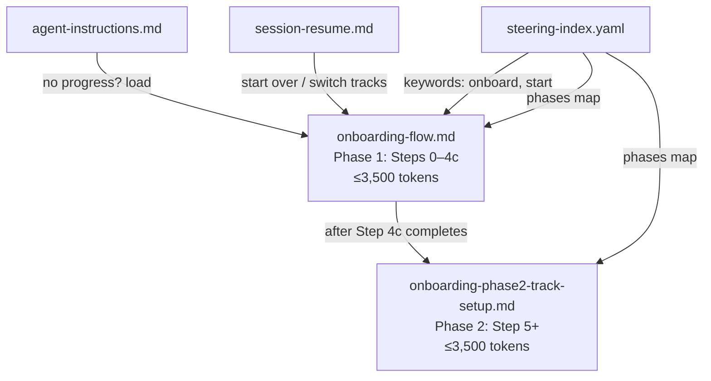

# Design: Split onboarding-flow.md Below Token Threshold

## Overview

Split the monolithic `onboarding-flow.md` (6,451 tokens) into two phase files to comply with the 5,000-token split threshold defined in `steering-index.yaml`. The split follows the natural sequential boundary in the onboarding process: Phase 1 covers initial setup through bootcamp introduction (Steps 0–4c), and Phase 2 covers track selection, switching, validation gates, and the hook registry reference (Step 5 onward).

The root file (`onboarding-flow.md`) remains the entry point and contains Phase 1 content plus phase routing logic. A new file (`onboarding-phase2-track-setup.md`) contains Phase 2 content. This mirrors the existing pattern used by modules 1, 3, 5, 6, 8, 9, 10, and 11.

## Architecture



### Split Boundary

The natural split point is between Step 4c (Comprehension Check) and Step 5 (Track Selection). This boundary is justified because:

1. **Sequential gate**: Step 4c ends with a 🛑 STOP marker — the agent waits for user input before proceeding. This is a natural session boundary.
2. **Conceptual separation**: Steps 0–4c are "setup and orientation" (environment, language, introduction). Step 5 onward is "track selection and ongoing reference" (tracks, switching, validation gates, hooks).
3. **Token balance**: Steps 0–4c contain the bulk of the content (~3,200 tokens estimated). Step 5 + Switching Tracks + Changing Language + Validation Gates + Hook Registry reference is the remainder (~3,200 tokens estimated).

### Phase Routing

The root file (`onboarding-flow.md`) will include a phase routing instruction at the end of Phase 1 content, directing the agent to load Phase 2 after Step 4c completes. This follows the same pattern as other split modules (e.g., Module 1's `module-01-business-problem.md` → `module-01-phase2-document-confirm.md`).

## Components and Interfaces

### File: `onboarding-flow.md` (Phase 1 — Root)

Retains:
- YAML frontmatter (`inclusion: manual`)
- Opening description paragraph
- Note about `ask-bootcamper` hook
- Step 0: Setup Preamble
- Step 0b: MCP Health Check
- Step 0c: Version Display
- Step 1: Directory Structure (including hook installation)
- Step 1b: Team Detection
- Step 2: Programming Language Selection
- Step 3: Prerequisite Check (including 3a, 3b, 3c, 3d)
- Step 4: Bootcamp Introduction (including 4a, 4b, 4c)
- Phase routing instruction: "After Step 4c, load `onboarding-phase2-track-setup.md` for track selection."

### File: `onboarding-phase2-track-setup.md` (Phase 2)

Contains:
- YAML frontmatter (`inclusion: manual`)
- Step 5: Track Selection
- Switching Tracks section
- Changing Language section
- Validation Gates section
- Hook Registry (`#[[file:]]` reference)

### File: `steering-index.yaml` Updates

Add a `phases` map under a new onboarding entry (similar to module entries):

```yaml
onboarding:
  root: onboarding-flow.md
  phases:
    phase1-setup-intro:
      file: onboarding-flow.md
      token_count: <measured>
      size_category: large  # or medium, depending on final count
      step_range: [0, 4c]
    phase2-track-setup:
      file: onboarding-phase2-track-setup.md
      token_count: <measured>
      size_category: large  # or medium, depending on final count
      step_range: [5, 5]
```

Update `file_metadata` to replace the single `onboarding-flow.md` entry with entries for both files.

Update `keywords` to keep `onboard` and `start` pointing to `onboarding-flow.md` (the root/entry point — unchanged).

### Cross-Reference Updates

| File | Current Reference | Action |
|------|-------------------|--------|
| `agent-instructions.md` | `load onboarding-flow.md` | No change — root file remains entry point |
| `agent-instructions.md` | `Hook Registry (#[[file:]] in onboarding-flow.md)` | No change — the `#[[file:]]` reference to `hook-registry-detail.md` moves to Phase 2 file, but the agent-instructions text can remain as-is since it describes the conceptual location |
| `session-resume.md` | `load the Hook Registry from onboarding-flow.md` | Update to reference `onboarding-phase2-track-setup.md` since the Hook Registry `#[[file:]]` moves there |
| `session-resume.md` | `follow "Switching Tracks" section in onboarding-flow.md` | Update to reference `onboarding-phase2-track-setup.md` |
| `session-resume.md` | `load onboarding-flow.md` (start over) | No change — root file remains entry point |
| `steering-index.yaml` keywords | `onboard: onboarding-flow.md`, `start: onboarding-flow.md` | No change — root file remains entry point |

### Test Updates

Tests that reference `onboarding-flow.md` need assessment:

| Test File | What It Tests | Update Needed |
|-----------|---------------|---------------|
| `test_remove_duplicate_module_table.py` | Step 5 has no duplicate table | Update path to Phase 2 file |
| `test_windows_prerequisite_installation.py` | Step 3 content | No change — Step 3 stays in root |
| `test_bootcamp_ux_preservation.py` | Welcome banner | No change — Step 4 stays in root |
| `test_version_unit.py` | Step 0c version display | No change — Step 0c stays in root |
| `test_self_answering_questions_preservation.py` | Stop markers in onboarding | May need to test both files |
| `test_module_flow_integration.py` | Step 5 track bullets | Update path to Phase 2 file |
| `test_hook_consolidation.py` | No removed hooks in onboarding | Update to check both files |
| `test_self_answering_reinforcement.py` | 🛑 STOP after 👉 questions | May need to test both files |
| `test_entity_resolution_intro_structure.py` | `#[[file:]]` loader in onboarding | No change — Step 4a stays in root |

## Data Models

### steering-index.yaml Schema Addition

The onboarding entry follows the same schema as module phase maps:

```yaml
onboarding:
  root: string          # Entry point filename
  phases:
    <phase-id>:
      file: string      # Filename in steering/
      token_count: int  # Measured by measure_steering.py
      size_category: string  # small (<300), medium (300-2000), large (>2000)
      step_range: [string|int, string|int]  # First and last step identifiers
```

This is consistent with the existing module phase map schema (e.g., `modules.1.phases`).

## Error Handling

- **Token count exceeds target**: If either file exceeds 3,500 tokens after the initial split, further content can be trimmed (e.g., moving the Validation Gates table to a separate reference file, or condensing the Windows prerequisite steps). The hard limit is 5,000 tokens.
- **Broken cross-references**: After updating references, run the full test suite to catch any missed references. The `validate_commonmark.py` script catches broken `#[[file:]]` references.
- **measure_steering.py failure**: If the script fails to parse the new file, check YAML frontmatter format and file encoding (must be UTF-8).

## Testing Strategy

Property-based testing is **not applicable** for this feature. The work is a structural refactoring of static markdown files — there are no pure functions with varying inputs, no algorithmic logic, and no universal properties to verify across generated inputs. The acceptance criteria are all single-instance structural checks (file exists, token count under threshold, section header present in correct file).

### Appropriate Test Approach

**Smoke tests** (single execution):
- `measure_steering.py --check` verifies both files are under the 5,000-token threshold
- `validate_commonmark.py` verifies both files are valid CommonMark

**Example-based unit tests**:
- Verify specific section headers exist in the correct file (Step 5 in Phase 2, Step 0c in Phase 1)
- Verify `steering-index.yaml` has the `onboarding` phases map with correct structure
- Verify keyword routing still maps `onboard` → `onboarding-flow.md`
- Verify cross-references in `session-resume.md` point to the correct file

**Integration tests** (existing test suite):
- Run the full pytest suite after the split to catch regressions
- Update test files that hardcode `onboarding-flow.md` paths to reference the correct file post-split

### Test Execution Order

1. Split the files
2. Update `steering-index.yaml`
3. Update cross-references (`session-resume.md`, `agent-instructions.md`)
4. Run `validate_commonmark.py` on both new files
5. Run `measure_steering.py` to update token counts and verify thresholds
6. Update test files to reference correct paths
7. Run full `pytest` suite to verify no regressions
