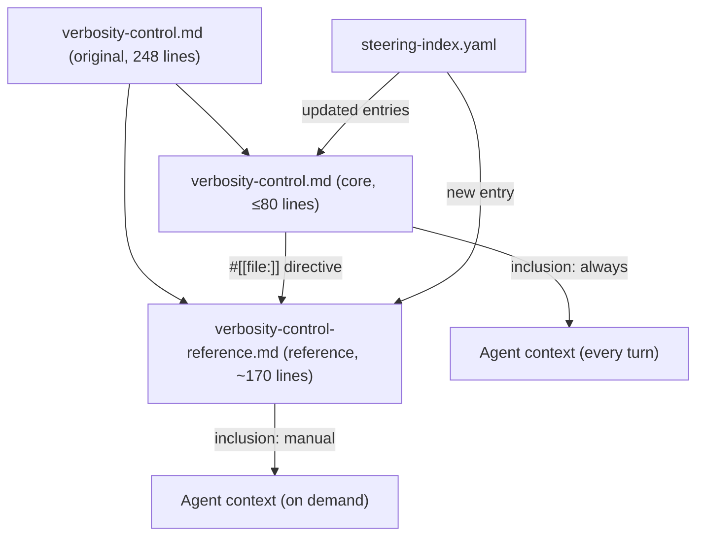

# Design Document: Split Verbosity Steering

## Overview

This feature splits the monolithic `senzing-bootcamp/steering/verbosity-control.md` (248 lines, 4,152 tokens, `inclusion: always`) into two files:

1. **Core file** (`verbosity-control.md`, `inclusion: always`, ≤80 lines) — contains the compact decision-making content the agent needs on every turn: preset definitions, category names with one-line descriptions, NL term mapping, adjustment instructions, session-start reading, and a `#[[file:]]` directive pointing to the reference file.
2. **Reference file** (`verbosity-control-reference.md`, `inclusion: manual`, ~170 lines) — contains the detailed content the agent loads on demand: full output category definitions with examples, content rules by level for all five categories, and framing pattern examples at all three levels.

This is a pure content reorganization. No new content is created, no content is removed, and no Python scripts change. The steering index is updated to reflect the new two-file structure with accurate token counts. Existing tests are updated to check the correct file for moved content.

### Design Rationale

The "Steering Kiro: Best Practices" guideline recommends always-included files stay within 40–80 lines. At 248 lines, the current file is a "context bomb" consuming 4,152 tokens on every turn. The bulk of the file — detailed per-level content rules and framing pattern examples — is only needed when the agent is actively applying a specific verbosity level's output rules. The actionable decision-making content (presets, categories, NL mapping, adjustment logic) fits comfortably within 80 lines.

## Architecture

This feature involves no runtime code changes. The architecture is purely about file organization within the steering directory.



### Content Flow

1. On every turn, the agent loads the core file automatically (always inclusion).
2. The core file contains a `#[[file:]]` directive telling the agent where to find the reference file.
3. When the agent needs to apply level-specific content rules for the first time in a session, it loads the reference file on demand.
4. The steering index tracks both files with accurate token counts for context budget management.

### File Boundary Decision

The split boundary is drawn between "decision-making" content and "application" content:

| Content Type | File | Rationale |
|---|---|---|
| Preset definitions table | Core | Agent needs this to process preset change requests |
| Category names + one-line descriptions | Core | Agent needs category awareness on every turn |
| NL term mapping table | Core | Agent needs this to interpret adjustment requests |
| Adjustment instructions (preset, NL, custom, session-start) | Core | Agent needs these to handle any verbosity request |
| `#[[file:]]` reference directive | Core | Agent needs to know where to find detailed rules |
| Full category definitions with examples | Reference | Only needed when applying level-specific rules |
| Content rules by level (all 5 categories) | Reference | Only needed when generating level-specific output |
| Framing pattern examples (3 types × 3 levels) | Reference | Only needed when structuring level-specific output |

## Components and Interfaces

### Component 1: Core File (`verbosity-control.md`)

**Path:** `senzing-bootcamp/steering/verbosity-control.md`

**Frontmatter:**
```yaml
---
inclusion: always
---
```

**Sections (in order):**
1. Title and one-paragraph intro (condensed from original)
2. Output Categories — compact list of all five category names with a one-line description each (not the full definitions)
3. Preset Definitions — the table mapping `concise`/`standard`/`detailed` to per-category levels, plus the one-line description of each preset
4. Natural Language Term Mapping — the table mapping common terms to categories, plus the "no match" fallback instruction
5. Adjustment Instructions — preset changes (4 steps), NL adjustments (7 steps), custom preset definition, session-start reading instructions
6. Reference directive — `#[[file:]]` pointing to `verbosity-control-reference.md` with instruction to load it when applying level-specific content rules for the first time in a session

**Constraint:** ≤80 lines total including frontmatter and blank lines.

### Component 2: Reference File (`verbosity-control-reference.md`)

**Path:** `senzing-bootcamp/steering/verbosity-control-reference.md`

**Frontmatter:**
```yaml
---
inclusion: manual
---
```

**Sections (in order):**
1. Title and brief intro stating this is the detailed reference companion to the core file
2. Output Categories — full definitions with definition paragraphs, examples of content in each category, and content rules by level (1, 2, 3) for all five categories: `explanations`, `code_walkthroughs`, `step_recaps`, `technical_details`, `code_execution_framing`
3. Framing Patterns — complete examples for three framing types at all three levels:
   - "What and Why" framing (explanations category)
   - Code Execution Framing (code_execution_framing category)
   - Step Recap Framing (step_recaps category)

### Component 3: Steering Index Updates (`steering-index.yaml`)

**Changes to `file_metadata`:**
- Update `verbosity-control.md` entry: new `token_count` and `size_category` reflecting the reduced core file
- Add `verbosity-control-reference.md` entry: `token_count` and `size_category` for the new reference file

**Changes to `keywords`:**
- Add keyword entries mapping to `verbosity-control-reference.md` so the agent can discover the reference file (e.g., `verbosity reference`, `verbosity levels`, `content rules`)

**Changes to `budget`:**
- Update `total_tokens` to reflect the combined token counts (should be approximately equal to the original total since no content is added or removed)

### Component 4: Test Updates

**`test_verbosity_unit.py` — `TestSteeringFileSmokeTests` class:**

The smoke tests that check for content presence in `verbosity-control.md` need updating. Content that moves to the reference file must be checked in the reference file instead.

| Test Method | Current Check | After Split |
|---|---|---|
| `test_steering_file_exists` | Core file exists | No change |
| `test_frontmatter_contains_inclusion_always` | Core file has `inclusion: always` | No change |
| `test_all_five_category_names_present` | Categories in core file | No change (core keeps category names) |
| `test_all_three_preset_names_present` | Presets in core file | No change (core keeps preset table) |
| `test_nl_term_mapping_table_present` | NL terms in core file | No change (core keeps NL mapping) |
| `test_what_why_framing_all_levels` | Framing in core file | **Update: check reference file** |
| `test_code_execution_framing_all_levels` | Framing in core file | **Update: check reference file** |
| `test_step_recap_framing_all_levels` | Framing in core file | **Update: check reference file** |
| `test_steering_index_contains_verbosity_keyword` | Index has keyword | No change |
| `test_steering_index_contains_verbose_keyword` | Index has keyword | No change |
| `test_steering_index_contains_output_level_keyword` | Index has keyword | No change |

**`test_verbosity_properties.py`:** No changes needed. Property tests exercise the Python `verbosity.py` script, not the steering file content.

## Data Models

This feature has no runtime data models. The "data" is the steering file content itself, which is plain Markdown with YAML frontmatter. The relevant data structures are:

### Steering File Frontmatter Schema

```yaml
---
inclusion: always | manual   # Controls when the agent loads the file
---
```

### Steering Index Entry Schema (per file in `file_metadata`)

```yaml
filename.md:
  token_count: <integer>     # Approximate token count of the file
  size_category: small | medium | large  # Based on token count thresholds
```

### Steering Index Keyword Schema

```yaml
keywords:
  <term>: <filename.md>      # Maps a search term to a steering file
```

### Size Category Thresholds

Based on existing patterns in the steering index:
- **small**: ≤400 tokens
- **medium**: 401–2,500 tokens
- **large**: >2,500 tokens

## Correctness Properties

Property-based testing does **not** apply to this feature. This is a static file reorganization — splitting one Markdown file into two Markdown files and updating a YAML index. There are no functions with variable input spaces, no data transformations, no parsers, and no business logic being added or changed.

All acceptance criteria are verifiable through smoke tests (file existence, line count, content presence, frontmatter values) and example-based tests (specific content blocks in specific files). The existing property-based tests in `test_verbosity_properties.py` exercise the Python `verbosity.py` script and are unaffected by this file split.

## Error Handling

This feature has minimal error surface since it is a static file reorganization with no runtime code changes.

### Potential Failure Modes

1. **Content loss during split:** A section from the original file is accidentally omitted from both the core and reference files. Mitigated by the smoke tests that check for specific content blocks in each file (Requirements 2.1–2.7, 4.1–4.5).

2. **Content duplication:** A section appears in both files, inflating the combined token count beyond the 5% threshold. Mitigated by the token count smoke test (Requirement 1.5) and by the clear split boundary defined in the Architecture section.

3. **Core file exceeds 80-line limit:** Too much content is kept in the core file. Mitigated by the line count smoke test (Requirement 1.4).

4. **Broken `#[[file:]]` directive:** The reference directive points to the wrong filename or uses incorrect syntax. Mitigated by the smoke test checking for the directive (Requirement 3.2).

5. **Steering index inconsistency:** Token counts or size categories in the index don't match the actual files. Mitigated by the CI pipeline's `measure_steering.py --check` step, which validates token counts against the index.

6. **Test regression:** A smoke test still checks the core file for content that moved to the reference file. Mitigated by explicitly updating each affected test method (Requirements 7.3–7.4) and running the full test suite.

### No Runtime Error Handling Needed

Since no Python scripts are modified and no new runtime code is introduced, there are no new error handling paths, exception types, or fallback behaviors to implement.

## Testing Strategy

### Approach

This feature uses **example-based unit tests and smoke tests only**. Property-based testing is not applicable because:
- The feature involves no functions with variable input spaces
- All checks are against specific static file content
- There are no data transformations, parsers, or business logic changes
- The existing PBT tests (`test_verbosity_properties.py`) test `verbosity.py`, not steering file content, and require zero changes

### Test Categories

#### 1. Smoke Tests (File Structure Verification)

These verify the physical structure of the split files. Most already exist in `TestSteeringFileSmokeTests` and need only minor updates.

| What to Test | Requirement | File to Check |
|---|---|---|
| Core file exists | 1.1 | `verbosity-control.md` |
| Reference file exists | 1.2 | `verbosity-control-reference.md` |
| Core file ≤80 lines | 1.4 | `verbosity-control.md` |
| Core frontmatter has `inclusion: always` | 3.1 | `verbosity-control.md` |
| Reference frontmatter has `inclusion: manual` | 5.1 | `verbosity-control-reference.md` |
| Core file contains `#[[file:]]` directive | 3.2 | `verbosity-control.md` |

#### 2. Content Placement Tests (Example-Based)

These verify that specific content blocks ended up in the correct file after the split.

**Core file content checks (Requirements 2.1–2.7):**
- Preset definitions table (concise, standard, detailed with levels)
- All five category names
- NL term mapping table
- Preset change adjustment instructions
- NL adjustment instructions
- Session-start reading instructions
- Custom preset definition

**Reference file content checks (Requirements 4.1–4.5):**
- Full category definitions with examples (all 5 categories)
- Content rules by level for all categories
- "What and Why" framing examples at all 3 levels
- Code Execution framing examples at all 3 levels
- Step Recap framing examples at all 3 levels

#### 3. Steering Index Tests (Example-Based)

These verify the steering index is correctly updated (Requirements 6.1–6.4):
- `file_metadata` has entry for `verbosity-control-reference.md`
- `file_metadata` entry for `verbosity-control.md` has updated token count
- `keywords` section has entries mapping to `verbosity-control-reference.md`
- `budget.total_tokens` is updated

#### 4. Existing Test Compatibility (Requirements 7.1–7.6)

**No changes needed:**
- `test_verbosity_properties.py` — all 4 property test classes pass unchanged (they test `verbosity.py`, not steering files)
- `test_frontmatter_contains_inclusion_always` — core file still has `inclusion: always`
- `test_all_five_category_names_present` — core file still has all category names
- `test_all_three_preset_names_present` — core file still has all preset names
- `test_nl_term_mapping_table_present` — core file still has NL mapping
- `test_steering_index_contains_verbosity_keyword` — index still has this keyword
- `test_steering_index_contains_verbose_keyword` — index still has this keyword
- `test_steering_index_contains_output_level_keyword` — index still has this keyword

**Tests to update (check reference file instead of core file):**
- `test_what_why_framing_all_levels` — framing examples moved to reference file
- `test_code_execution_framing_all_levels` — framing examples moved to reference file
- `test_step_recap_framing_all_levels` — framing examples moved to reference file

These three tests need a `_read_reference_file()` helper method added to `TestSteeringFileSmokeTests` and their assertions updated to read from the reference file.

### Test Execution

All tests run via `pytest` from the repository root:
```bash
pytest senzing-bootcamp/tests/test_verbosity_unit.py senzing-bootcamp/tests/test_verbosity_properties.py -v
```

The CI pipeline (`validate-power.yml`) runs the full test suite automatically, which includes these tests.

