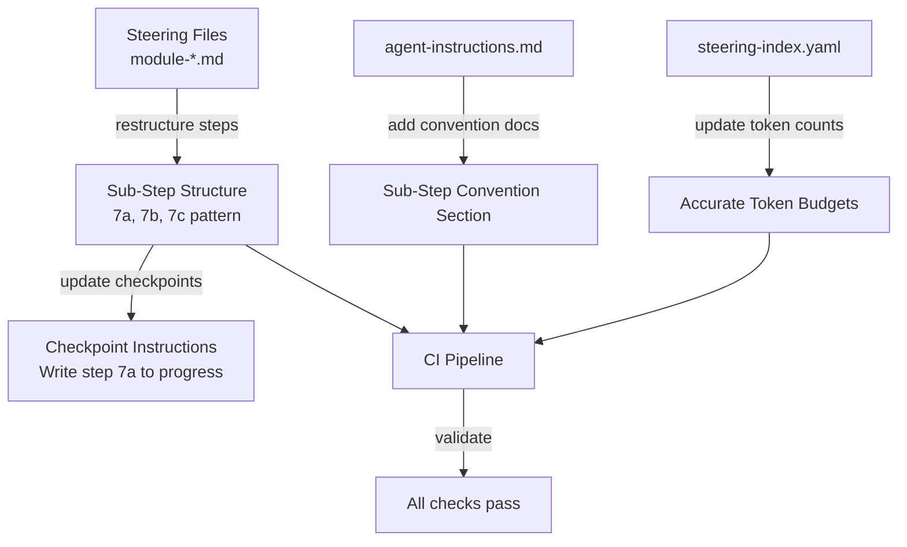

# Design Document: Standardize Multi-Question Steps

## Overview

This feature restructures module steering files so that every numbered step contains at most one 👉 question. Steps with multiple questions are split into lettered sub-steps (e.g., 7a, 7b, 7c), each with its own checkpoint instruction. The change is purely structural — all existing question text, conditional logic, and agent instructions are preserved verbatim.

The motivation is to move the "one question at a time" rule from agent interpretation (a behavioral rule in `agent-instructions.md`) to document structure (each sub-step physically contains at most one question). This eliminates an entire class of agent compliance failures where multiple questions get combined into a single turn.

### Design Decisions

1. **Manual restructuring over automated scripting**: The multi-question patterns vary significantly across modules (conditional branches, mutually exclusive questions, shared preambles). A manual, file-by-file approach with human review is safer than an automated rewrite script. The audit step identifies targets; the restructuring is done by hand.

2. **Lettered sub-steps (7a, 7b) over dotted notation (7.1, 7.2)**: The `agent-instructions.md` and `progress_utils.py` already support lettered notation (`"7a"`). The existing `validate_progress_schema` function accepts this format. Dotted notation is also supported but lettered is the convention established by prior work.

3. **Preserve parent step number in headings**: When step 7 becomes 7a/7b/7c, the parent step number is retained as a heading or preamble container (if shared context exists) but does NOT get its own checkpoint. Only sub-steps get checkpoints.

4. **Mutually exclusive conditionals stay grouped**: When a step has multiple conditional questions that are mutually exclusive (only one fires based on runtime state), they remain in a single sub-step with the conditional logic preserved. Only independent questions that could fire sequentially get their own sub-steps.

5. **Step ranges in steering-index.yaml remain integer-based**: Sub-steps like 7a, 7b, 7c are still within the range `[7, 7]` from the index perspective. The `step_range` field uses integer bounds that encompass all sub-steps within that range. No format change is needed for the index — sub-steps are contained within their parent step's range.

## Architecture

The feature touches three layers of the project:



### Workflow

1. **Audit**: Scan all `module-*.md` files for steps containing multiple 👉 markers or multiple conditional question branches. Produce a list of affected files, step numbers, and question counts.

2. **Restructure**: For each identified multi-question step, split into lettered sub-steps. Each sub-step gets exactly one 👉 question (or one group of mutually exclusive conditional questions) and its own checkpoint.

3. **Document**: Add a Sub-Step Convention section to `agent-instructions.md` describing the pattern and rules.

4. **Update Index**: Run `measure_steering.py --update` to recalculate token counts for modified files. Verify `steering-index.yaml` remains valid.

5. **Validate**: Run the full CI suite (`validate_power.py`, `measure_steering.py --check`, `validate_commonmark.py`, `pytest`) to confirm nothing is broken.

## Components and Interfaces

### Component 1: Audit Process

**Purpose**: Identify all multi-question steps across steering files.

**Approach**: Manual scan of each `module-*.md` file (and phase sub-files) counting 👉 markers per numbered step. A step is non-compliant if it contains more than one 👉 marker, OR if it contains multiple independent conditional question branches.

**Output**: A checklist of affected files and step numbers embedded in the task list for tracking.

**Files involved**: All files matching `senzing-bootcamp/steering/module-*.md` (approximately 20 files including phase sub-files).

### Component 2: Steering File Restructuring

**Purpose**: Split multi-question steps into sub-steps.

**Interface**: Each restructured step follows this pattern:

```markdown
7. **Parent step title** (shared preamble if any):

   [Shared context that applies to all sub-steps]

7a. **First question context**:

   [Context and instructions for first question]

   👉 "First question text?"

   > **🛑 STOP — End your response here.**

   **Checkpoint:** Write step 7a to `config/bootcamp_progress.json`.

7b. **Second question context**:

   [Context and instructions for second question]

   👉 "Second question text?"

   > **🛑 STOP — End your response here.**

   **Checkpoint:** Write step 7b to `config/bootcamp_progress.json`.
```

**Rules**:
- Each sub-step contains at most one 👉 question
- Each sub-step has its own checkpoint using the sub-step identifier
- Mutually exclusive conditional questions stay in one sub-step
- Independent conditional questions get separate sub-steps
- Steps with zero or one question are left unchanged
- All original question text, STOP instructions, and agent instructions are preserved verbatim

### Component 3: Agent Instructions Update

**Purpose**: Document the sub-step convention so future steering file authors follow the pattern.

**Location**: New subsection in `senzing-bootcamp/steering/agent-instructions.md` under an appropriate heading.

**Content**: Rules for the sub-step convention:
- Sub-steps use `{step_number}{letter}` format (e.g., 7a, 7b, 7c)
- Each sub-step contains at most one 👉 question
- Each sub-step has its own checkpoint instruction
- Steps with no questions remain as single steps (no sub-step splitting)
- Mutually exclusive conditionals may share a sub-step

### Component 4: Steering Index Update

**Purpose**: Keep `steering-index.yaml` token counts accurate after file modifications.

**Approach**: Run `measure_steering.py --update` after all file edits. This recalculates `token_count` and `size_category` for every steering file and updates the `total_tokens` budget.

**Step ranges**: Integer-based `step_range` values do not need format changes. Sub-steps 7a, 7b, 7c are contained within the parent step 7's range. If a phase's step range is `[1, 9]` and step 7 is split into 7a/7b/7c, the range remains `[1, 9]`.

### Component 5: CI Validation

**Purpose**: Confirm restructured files pass all existing checks.

**Tools**:
- `validate_power.py` — structural integrity (frontmatter, hooks, references)
- `measure_steering.py --check` — token counts match index
- `validate_commonmark.py` — valid CommonMark
- `pytest` — all existing tests pass (including sub-step validation property tests)

## Data Models

### Sub-Step Identifier Format

Sub-step identifiers follow the pattern already supported by `progress_utils.py`:

| Format | Example | Description |
|--------|---------|-------------|
| Integer | `7` | Whole step (unchanged) |
| Lettered | `"7a"` | Sub-step a of step 7 |
| Dotted | `"7.1"` | Alternative notation (supported but not used here) |

The `validate_progress_schema` function in `progress_utils.py` already accepts all three formats for `current_step` and `last_completed_step` fields.

### Checkpoint Format

```json
{
  "current_step": "7a",
  "step_history": {
    "1": {
      "last_completed_step": "7a",
      "updated_at": "2026-01-15T14:30:00+00:00"
    }
  }
}
```

### Steering Index Entry (unchanged format)

```yaml
modules:
  1:
    root: module-01-business-problem.md
    phases:
      phase1-discovery:
        file: module-01-business-problem.md
        token_count: 2487  # updated after restructuring
        size_category: large
        step_range: [1, 9]  # unchanged — sub-steps are within parent range
```


## Correctness Properties

*A property is a characteristic or behavior that should hold true across all valid executions of a system — essentially, a formal statement about what the system should do. Properties serve as the bridge between human-readable specifications and machine-verifiable correctness guarantees.*

### Property 1: One Question Per Sub-Step

*For any* step or sub-step in any restructured steering file, the step content SHALL contain at most one 👉 question marker.

**Validates: Requirements 2.1, 3.1, 3.2**

### Property 2: Sub-Step Naming Convention

*For any* sub-step identifier found in a restructured steering file, the identifier SHALL match the pattern `{integer}{lowercase_letter}` (e.g., `7a`, `7b`, `3c`), where the letter starts at `a` and increments alphabetically within the parent step.

**Validates: Requirements 2.2**

### Property 3: Checkpoint Correctness

*For any* sub-step in a restructured steering file, the sub-step SHALL contain exactly one checkpoint instruction referencing the sub-step's own identifier (e.g., "Write step 7a"), AND the parent step SHALL NOT contain a checkpoint if all its content has been distributed into sub-steps.

**Validates: Requirements 4.1, 4.2, 4.3**

### Property 4: Question Content Preservation

*For any* restructured steering file, the multiset of 👉 question texts extracted from the restructured file SHALL be identical to the multiset of 👉 question texts in the original file, and the count of STOP/wait instructions SHALL be preserved.

**Validates: Requirements 5.1, 5.4**

### Property 5: No-Question Steps Unchanged

*For any* step in a restructured steering file that contains zero 👉 question markers, the step SHALL remain as a single numbered step with no lettered sub-steps.

**Validates: Requirements 3.4**

## Error Handling

### Restructuring Errors

| Scenario | Handling |
|----------|----------|
| Sub-step letter exceeds `z` (>26 questions in one step) | Not expected in practice. If encountered, split the parent step into multiple numbered steps first. |
| Checkpoint regex in `lint_steering.py` doesn't match sub-step format | Verify `check_checkpoints` and `check_checkpoint_completeness` handle sub-step checkpoint patterns. Update regex if needed. |
| `measure_steering.py --check` fails after restructuring | Re-run `measure_steering.py --update` to recalculate token counts, then re-run `--check`. |
| CommonMark validation fails | Fix markdown formatting issues (usually heading levels or list indentation) introduced during restructuring. |
| Existing tests fail after restructuring | Investigate test expectations — some tests may assert specific step numbers or content patterns that changed. Update test expectations to match new structure. |

### Rollback Strategy

All changes are to tracked files in git. If restructuring introduces problems:
1. `git diff` to review all changes
2. `git checkout -- <file>` to revert individual files
3. `git stash` to temporarily shelve all changes

## Testing Strategy

### Property-Based Tests (Hypothesis)

Property-based testing is appropriate for this feature because the core invariants (one question per sub-step, correct checkpoint format, content preservation) are universal properties that should hold across all steering files regardless of content. The input space is the set of all steering file structures, which varies meaningfully.

**Library**: Hypothesis (already used in the project)
**Minimum iterations**: 100 per property test
**Tag format**: `Feature: standardize-multi-question-steps, Property {N}: {title}`

Each correctness property (1–5) maps to a property-based test that generates random steering file content and verifies the invariant holds. These tests validate the structural rules independent of specific file content.

### Unit Tests (Example-Based)

| Test | Validates |
|------|-----------|
| Audit identifies module-01 step 7 as multi-question | Req 1.1, 1.5 |
| Audit classifies single-question steps as compliant | Req 1.4 |
| Mutually exclusive conditionals grouped in one sub-step | Req 2.3 |
| Independent conditionals get separate sub-steps | Req 2.4 |
| Shared preamble placed before first sub-step | Req 5.5 |
| agent-instructions.md contains sub-step convention section | Req 6.1–6.5 |

### Integration Tests

| Test | Validates |
|------|-----------|
| `validate_power.py` passes | Req 8.1 |
| `measure_steering.py --check` passes | Req 8.2 |
| `validate_commonmark.py` passes | Req 8.3 |
| Full `pytest` suite passes | Req 8.4 |
| `steering-index.yaml` is valid YAML with correct token counts | Req 7.1–7.4 |

### Test Execution

```bash
# Run all tests
python -m pytest senzing-bootcamp/tests/ -v

# Run CI validation
python senzing-bootcamp/scripts/validate_power.py
python senzing-bootcamp/scripts/measure_steering.py --check
python senzing-bootcamp/scripts/validate_commonmark.py
```
