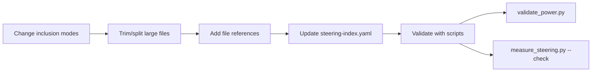

# Design Document: Steering Best Practices Alignment

## Overview

This feature aligns the senzing-bootcamp power's steering files with the best practices from the "Steering Kiro" article. An audit identified six gaps: wrong inclusion mode on the security file, always-on file exceeding the recommended line limit, several manual files far exceeding the 150-line guideline, underuse of `#[[file:]]` references, and no validation of the always-on context budget.

The approach is purely documentation and steering file changes — no Python code changes are needed. The existing `validate_power.py` and `measure_steering.py --check` scripts serve as the validation mechanism.

The work follows a deliberate sequence: change inclusion modes → trim/split large files → add file references → update the steering index → validate.

## Architecture



There is no new code or runtime architecture. All changes are to `.md` steering files and the `steering-index.yaml` metadata file. Validation uses the existing CI scripts.

### Key Design Decisions

1. **No Python code changes**: Every requirement is satisfied by editing steering file content, creating new reference files, or updating the YAML index. The validation scripts already exist and are unchanged.

2. **Extract, don't delete**: When trimming files, content moves to new reference files (e.g., `graduation-reference.md`, `hook-registry.md`) rather than being deleted. This preserves all agent behavior.

3. **File references over inline content**: The `#[[file:]]` directive lets steering files stay lean while still giving the agent access to detailed content on demand.

4. **Respect the curriculum nature**: This power IS a steering-file-driven curriculum. Some files (module steering) will necessarily exceed the 150-line guideline. The goal is to minimize where possible, not force every file under 150 lines.

## Components and Interfaces

### 1. Inclusion Mode Change — `security-privacy.md`

**Change**: Frontmatter `inclusion: auto` → `inclusion: always`

**Rationale**: Security rules must never be skipped. The file is only 27 lines (~278 tokens), so promoting it to always-on has negligible context cost.

**Impact**: The always-on set becomes `agent-instructions.md` + `security-privacy.md`. Combined token cost stays well under 3,000 tokens.

### 2. Trim `agent-instructions.md` (92 → <80 lines)

**Strategy**: Move the `## Hooks` section content to a reference directive pointing to the new `hook-registry.md` file. The hooks section currently occupies ~12 lines and can be replaced with a 2-line reference + brief instruction.

**What stays**: All critical rules — session start, file placement table, MCP rules, MCP failure handling, module steering loading, state & progress, communication rules, context budget management.

**What moves**: The detailed hook management instructions (which hooks to create, where to find definitions) become a brief pointer to `hook-registry.md`.

### 3. Split `graduation.md` (449 → <200 lines)

**Strategy**: Extract detailed reference material into a new `graduation-reference.md` manual steering file.

**Content that moves to `graduation-reference.md`**:
- The file copy/exclude tables (Steps 1's source/destination table and exclusion table)
- The configuration file templates (`.env.production`, `.env.example`, `docker-compose.yml`, CI/CD pipeline details, `.gitignore`)
- The conditional checklist logic for `MIGRATION_CHECKLIST.md`
- The graduation report template

**Content that stays in `graduation.md`**:
- Pre-checks
- Step 1–5 workflow descriptions (condensed to instructions + `#[[file:]]` references for tables/templates)
- Graduation report generation trigger
- Export-results integration contract comment

### 4. Extract Hook Registry from `onboarding-flow.md` (338 → ~190 lines)

**Strategy**: Move the entire Hook Registry section (~150 lines of hook definitions) into a new `hook-registry.md` manual steering file.

**New file `hook-registry.md`**:
- Contains all 18 hook definitions (7 critical + 11 module hooks) with their full parameters
- Frontmatter: `inclusion: manual`

**Changes to `onboarding-flow.md`**:
- Replace the inline Hook Registry with a `#[[file:]]` reference
- Keep the brief instruction about creating hooks during onboarding Step 1

**Changes to `agent-instructions.md`**:
- Update the `## Hooks` section to reference `hook-registry.md` instead of `onboarding-flow.md`

### 5. Trim `module-12-deployment.md` (359 → <250 lines)

**Strategy**: Condense platform-specific inline blocks. The file already has separate platform steering files (`deployment-azure.md`, `deployment-gcp.md`, `deployment-onpremises.md`, `deployment-kubernetes.md`). Replace repeated "If Azure/GCP/On-Premises/Kubernetes" blocks with a single "load the platform file" instruction per step.

**What stays**: All 15 step definitions, the phase gate, the AWS CDK inline blocks (since AWS has no separate file).

**What condenses**: The repeated multi-platform conditional blocks in Steps 3, 5, 6, 7, 10 become single-line "See the corresponding platform steering file" references.

### 6. Trim `module-07-multi-source.md` (341 → <250 lines)

**Strategy**: The file already references `module-07-reference.md` at the bottom. Move the Common Issues section and the detailed Stakeholder Summary instructions to the reference file. Condense verbose step descriptions where the agent instructions are repetitive.

**What stays**: All 16 step definitions, the decision gate, checkpoint instructions.

**What condenses**: Common Issues table, stakeholder summary workflow, verbose inline guidance that duplicates what's in the reference file.

### 7. Trim `common-pitfalls.md` (204 → <180 lines)

**Strategy**: Condense the Modules 9–12 section (currently a sparse table) and the Recovery Quick Reference into more compact formats. The guided troubleshooting flow and module-specific pitfall tables are preserved.

### 8. Trim `troubleshooting-decision-tree.md` (224 → <200 lines)

**Strategy**: Condense the ASCII flowcharts by removing redundant whitespace and merging closely related branches. The visual format and all six diagnostic sections (A–F) are preserved. The file already references `troubleshooting-commands.md` for diagnostic commands.

### 9. Add File References

**Target**: Increase `#[[file:]]` directives from 3 to at least 8.

**New references**:

| Steering File | Reference Target | Replaces |
|---|---|---|
| `graduation.md` | `#[[file:senzing-bootcamp/steering/graduation-reference.md]]` | Inline tables and templates |
| `onboarding-flow.md` | `#[[file:senzing-bootcamp/steering/hook-registry.md]]` | Inline Hook Registry |
| `agent-instructions.md` | `#[[file:senzing-bootcamp/steering/hook-registry.md]]` | Hook definition location reference |
| `module-12-deployment.md` | `#[[file:senzing-bootcamp/templates/stakeholder_summary.md]]` | Inline stakeholder summary reference |
| `graduation.md` | `#[[file:senzing-bootcamp/templates/stakeholder_summary.md]]` | Inline stakeholder summary reference |

**Existing references preserved**:
- `module-07-multi-source.md` → `stakeholder_summary.md`
- `module-04-data-collection.md` → `data_collection_checklist.md`
- `module-05-data-quality-mapping.md` → `transformation_lineage.md`

This brings the total to at least 8 `#[[file:]]` directives.

### 10. Update Steering Index

After all file changes, run `measure_steering.py` to recalculate token counts. The index must include entries for the two new files (`graduation-reference.md`, `hook-registry.md`).

### 11. Validate Always-On Context Budget

After changes, the always-on files are:
- `agent-instructions.md` (trimmed to <80 lines, ~1,700 tokens estimated)
- `security-privacy.md` (27 lines, ~278 tokens, now `always`)

Combined: ~1,978 tokens — well under the 3,000 token threshold.

### 12. Full Power Validation

Run both validation scripts:
- `python senzing-bootcamp/scripts/validate_power.py` — zero errors
- `python senzing-bootcamp/scripts/measure_steering.py --check` — all counts within 10%

## Data Models

No new data models. The only data structure affected is `steering-index.yaml`, which gains two new entries in `file_metadata` for the new steering files:

```yaml
file_metadata:
  graduation-reference.md:
    token_count: <calculated>
    size_category: <calculated>
  hook-registry.md:
    token_count: <calculated>
    size_category: <calculated>
```

The `budget.total_tokens` value will be recalculated to reflect all changes.

## Error Handling

| Scenario | Handling |
|---|---|
| `validate_power.py` fails after a file change | Fix the steering file before proceeding to the next change |
| `measure_steering.py --check` reports mismatches | Re-run `measure_steering.py` (update mode) to refresh counts |
| A `#[[file:]]` reference points to a non-existent file | `validate_power.py` catches missing cross-references |
| New steering file missing frontmatter | `validate_power.py` catches missing YAML frontmatter |
| Always-on budget exceeds 3,000 tokens | Further trim `agent-instructions.md` until under threshold |

## Testing Strategy

### Why PBT Does Not Apply

This feature involves only documentation and steering file edits — no functions, no parsers, no data transformations, no business logic. There are no pure functions with input/output behavior to test. Property-based testing is not applicable.

### Validation Approach

All validation is done via existing scripts:

1. **`validate_power.py`**: Checks steering file frontmatter, cross-references, hook definitions, steering index schema, and file existence. Run after each change.

2. **`measure_steering.py --check`**: Verifies stored token counts match actual file sizes within 10% tolerance. Run after updating the steering index.

3. **Manual verification**: Line counts checked with `wc -l` to confirm files meet their target thresholds.

### Acceptance Verification Checklist

| Requirement | Verification Method |
|---|---|
| Req 1: security-privacy.md → `always` | `grep 'inclusion: always' security-privacy.md` |
| Req 2: agent-instructions.md < 80 lines | `wc -l agent-instructions.md` |
| Req 3: graduation.md < 200 lines | `wc -l graduation.md` + `graduation-reference.md` exists |
| Req 4: Hook Registry extracted | `hook-registry.md` exists + `onboarding-flow.md` uses `#[[file:]]` |
| Req 5: module-12-deployment.md < 250 lines | `wc -l module-12-deployment.md` |
| Req 6: module-07-multi-source.md < 250 lines | `wc -l module-07-multi-source.md` |
| Req 7: common-pitfalls.md < 180 lines | `wc -l common-pitfalls.md` |
| Req 8: troubleshooting-decision-tree.md < 200 lines | `wc -l troubleshooting-decision-tree.md` |
| Req 9: ≥8 file references | `grep -c '#\[\[file:' steering/*.md` |
| Req 10: Steering index updated | `measure_steering.py --check` passes |
| Req 11: Always-on budget < 3,000 tokens | Sum token counts for `always` files from index |
| Req 12: Full validation passes | `validate_power.py` exits 0 + `measure_steering.py --check` exits 0 |
