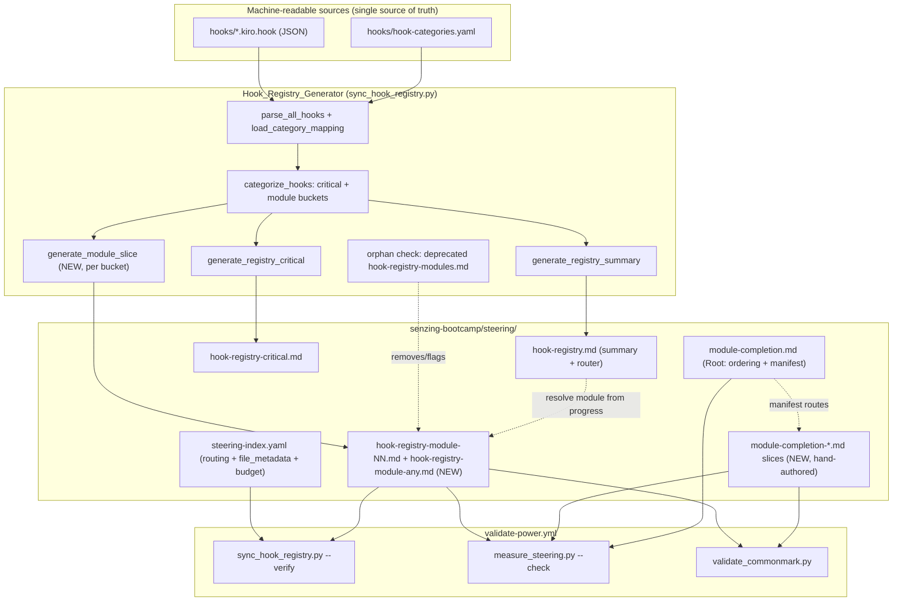
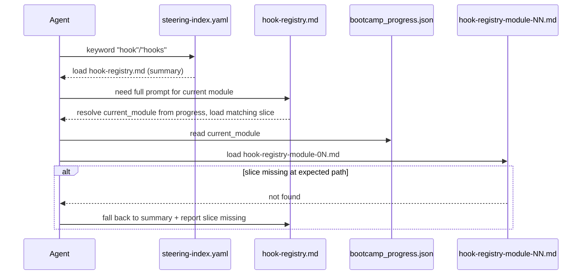

# Design Document

## Overview

This feature reduces the **worst-case loaded steering footprint** of the four largest reference-style
steering files by slicing each monolithic file into context-relevant pieces. The agent then loads only
the slice it needs — the current module's hooks, or a single module-completion concern — instead of an
entire registry as one unit.

Two of the In_Scope_Files are **generated** (`hook-registry.md`, `hook-registry-critical.md`, and today's
`hook-registry-modules.md`) by `senzing-bootcamp/scripts/sync_hook_registry.py` from the machine-readable
sources `hooks/*.kiro.hook` and `hooks/hook-categories.yaml`. The remaining In_Scope_File
(`module-completion.md`) is **hand-authored** prose. The design therefore has two cooperating workstreams:

1. **Generator workstream (automated).** Extend the Hook_Registry_Generator so `--write` emits one
   small per-module hook slice per module that has hooks, plus an `any` slice, instead of the single
   10,631-token `hook-registry-modules.md`. `--verify` keeps the generated files byte-identical to a fresh
   generation and detects the deprecated monolith as an orphan. The summary (`hook-registry.md`) is updated
   to route the agent to the correct per-module slice.

2. **Content workstream (manual).** Refactor `module-completion.md` into a lightweight
   Module_Completion_Root (ordering overview + slice manifest) plus cohesive Module_Completion_Slices
   (artifact generation, non-blocking error handling, next-step flow, track completion). Update
   `steering-index.yaml` routing, `file_metadata`, and `budget` so `measure_steering.py --check` stays green.

The change is **footprint reduction, not content removal**: every hook prompt and every completion section
remains reachable, and `budget.total_tokens` continues to reflect the full corpus (it is the sum of all
`file_metadata` token counts, so re-slicing preserves it within rounding).

### Goals

- Worst-case per-module hook load ≤ 5,000 tokens (Split_Threshold) and ≤ 50% of the pre-refactor
  10,631-token `hook-registry-modules.md`.
- Worst-case single completion-concern load ≤ 5,000 tokens.
- Preserve all information and reachability.
- Keep the generator stdlib-only and deterministic; keep CI (`sync_hook_registry.py --verify`,
  `measure_steering.py --check`, `validate_commonmark.py`) green on Python 3.11/3.12/3.13.

### Non-Goals

- Standardizing module workflow root/phase splits (owned by `module-router-standardization`).
- Reducing `budget.total_tokens` (Requirement 7.5 — the win is loaded footprint, not corpus size).
- Re-categorizing hooks or changing hook prompt content.

## Research Summary

Findings from reading the current implementation and corpus (these directly shape the design):

- **Generator output today.** `sync_hook_registry.py` produces four artifacts on `--write`:
  `hook-registry.md` (summary tables), `hook-registry-critical.md` (full critical prompts),
  `hook-registry-modules.md` (full module prompts — one monolithic file), and `hooks.lock.yaml`.
  `--verify` regenerates each and compares byte-for-byte (the lockfile compares structure minus its
  `generated_at:` timestamp). Exit is 0 only when all match; otherwise non-zero with a per-file `FAIL:` line.
- **Categorization is already multi-module aware.** `categorize_hooks()` reads per-hook module membership
  via `_build_module_membership()` and files a hook under **every** module bucket it belongs to; the `any`
  bucket is a single key. Buckets are sorted alphabetically by `hook_id`; module keys sort integers
  ascending then `"any"` last. This is exactly the grouping a per-module slice needs — the missing piece is
  rendering one file per bucket instead of one combined file.
- **Measured per-module footprint** (from the live `hook-registry-modules.md`, chars/4 estimate): the
  largest bucket is `any` at ~3,783 tokens (6 hooks), then Module 3 at ~2,273 tokens (5 hooks). Every other
  bucket is well under 1,500 tokens. So **every per-module slice fits under 5,000 tokens with headroom**,
  and the worst case (~3,800) is below 50% of 10,631 (5,315). No module currently needs a sub-split.
- **Measured module-completion sections** (chars/4): total ~6,076 tokens. Largest sections are Path
  Completion Celebration (~1,213), Recap Append (~700), Non-Blocking Error Handling (~597), Next-Step
  Options (~548), Module Completion Certificate + sub-sections (~825), Bootcamp Journal + template (~900),
  Backfill (~462). A root + four cohesive slices each land under 3,000 tokens.
- **Token model.** `measure_steering.py` uses `round(len(content) / 4)` and classifies `<500` small,
  `<=2000` medium, else large. `--check` fails if any `file_metadata` count drifts >10% from measured, if a
  phase count drifts, if a `file_metadata` entry references a file missing on disk, **or** if
  `budget.total_tokens` differs from the sum of `file_metadata` token counts (exact equality). Running
  `measure_steering.py` with no flags rescans every `*.md`, rebuilds `file_metadata` + `budget`, preserves
  `split_threshold_tokens` and `router_ceiling`, and sets `total_tokens` to the sum — the standard way to
  reconcile after adding/removing steering files.
- **Routing.** `steering-index.yaml` `keywords` currently maps `hook`/`hooks` to `hook-registry.md` and
  `completion` to `module-completion.md`. `file_metadata` lists `hook-registry-modules.md` (10,628),
  `hook-registry-critical.md` (8,503), `hook-registry.md` (1,772), and `module-completion.md` (6,076).
- **Conventions.** Scripts are Python 3.11+, stdlib-only, with a custom minimal YAML parser
  (`_parse_simple_yaml`). Steering files are kebab-case `.md` with `inclusion: manual` frontmatter, live
  under `senzing-bootcamp/steering/`, contain no external URLs, and must pass CommonMark validation. CI runs
  the whole gate on the 3.11/3.12/3.13 matrix.

## Architecture



### Runtime routing flow (agent perspective)



### Worst-case footprint: before vs after

| Load scenario | Before | After (worst slice) | Bound |
|---|---|---|---|
| Hooks for the heaviest module | 10,631 (`hook-registry-modules.md`) | ~3,800 (`hook-registry-module-any.md`) | ≤ 5,000 and ≤ 5,315 (50%) |
| One module-completion concern | 6,076 (`module-completion.md`) | ≤ ~2,900 (artifacts slice) | ≤ 5,000 |

## Components and Interfaces

### 1. Hook_Registry_Generator changes (`sync_hook_registry.py`)

The generator keeps its existing parse to categorize pipeline. The module-rendering stage changes from
"one combined file" to "one file per bucket", and the write/verify stage iterates the bucket set.

New/changed functions (stdlib-only, type-hinted, Google-style docstrings, `X | None` style):

```python
# Path helper — deterministic kebab-case slice filenames.
def module_slice_filename(key: int | str) -> str:
    """Return the slice filename for a module bucket key.

    Numbered modules use a zero-padded two-digit number; the unmapped group
    uses a distinct 'any' name.

    Examples:
        3      -> "hook-registry-module-03.md"
        11     -> "hook-registry-module-11.md"
        "any"  -> "hook-registry-module-any.md"
    """

# Render one slice for a single bucket (mirrors generate_registry_modules,
# scoped to one module's hooks). Reuses the existing entry formatting so a
# hook renders identically whether it appears in one slice or several.
def generate_module_slice(key: int | str, hooks: list[HookEntry], total_count: int) -> str:
    """Generate the markdown for one Hook_Registry_Module_Slice.

    Begins with inclusion: manual frontmatter, a module-scoped title, a short
    intro that points back to hook-registry.md and hook-registry-critical.md,
    then the full prompt entry for each hook in *hooks* (already sorted by
    categorize_hooks). Line endings are normalized to \\n.
    """

# Build the full {slice_path: content} map for every NON-EMPTY bucket.
def build_module_slices(
    module_hooks: dict[int | str, list[HookEntry]],
    steering_dir: Path,
    total_count: int,
) -> dict[Path, str]:
    """Map each non-empty module bucket to its slice path and content.

    Buckets come straight from categorize_hooks(), which only contains
    non-empty buckets, so a module with no hooks yields no slice (no empty
    file). 'any' maps to hook-registry-module-any.md.
    """

# Known deprecated outputs that --write must remove and --verify must flag.
DEPRECATED_REGISTRY_PATHS = (REGISTRY_MODULES_PATH,)  # hook-registry-modules.md
```

Behavioral contract:

- **Summary generation** (`generate_registry_summary`): the "Hook Creation" section is updated to instruct
  the agent to resolve `current_module` from `config/bootcamp_progress.json` and load
  `hook-registry-module-<NN>.md` (or `-any.md`) for full module prompts, and to fall back to this summary if
  the slice is missing. The summary continues to list every hook by ID, event flow, module label, and
  one-line description (Requirement 3.4).
- **Critical generation** (`generate_registry_critical`): its cross-reference line referencing
  `hook-registry-modules.md` is updated to reference `hook-registry.md` (the summary/router).
- **`--write`**: writes the summary, the critical file, and every slice from `build_module_slices`; deletes
  any path in `DEPRECATED_REGISTRY_PATHS` that still exists; writes the lockfile. A file-system/permission
  error during any write/delete causes a non-zero exit (Requirements 6.6, 9.4).
- **`--verify`**: regenerates the summary, critical, and slice set; compares each on disk byte-for-byte via
  `verify_registry`; additionally fails if any `DEPRECATED_REGISTRY_PATHS` file still exists (orphan) or if a
  freshly generated slice is missing on disk. Exit 0 only when all match and no orphan exists; otherwise
  non-zero with a `FAIL:` line naming the offending path (Requirements 6.3, 6.4, 6.5).
- **CLI**: the `--output-modules` single-path option is replaced by deriving slice paths from the steering
  directory (default `senzing-bootcamp/steering/`). A `--steering-dir` option (defaulting to the registry
  files' parent) keeps tests able to target a temp directory.

### 2. Module-completion refactor (hand-authored)

`module-completion.md` becomes the **Module_Completion_Root** — a router holding the completion-step ordering
overview, the Shared Boundary-Detection Trigger rules, and a manifest that names each slice and its purpose.
Content is moved (not deleted) into cohesive slices:

| File | Concern | Source sections | ~tokens |
|---|---|---|---|
| `module-completion.md` (Root) | Ordering overview + manifest | Intro, Completion Step Ordering, Shared Boundary-Detection Trigger, slice manifest | ~900 |
| `module-completion-artifacts.md` | Artifact generation | Backfill, Recap Append, Bootcamp Journal, Module Completion Certificate, Summary Index | ~2,900 |
| `module-completion-error-handling.md` | Non-blocking error handling | Non-Blocking Error Handling (per-step, 30s timeout, predecessor-failure, retry) | ~700 |
| `module-completion-next-steps.md` | Per-module next-step flow | Next-Step Options, Immediate Execution on Affirmative Response | ~600 |
| `module-completion-track.md` | Track completion | Path Completion Detection, Path Completion Celebration (export/record/analytics/certificate/graduation/feedback offers) | ~1,400 |

Each slice begins with `inclusion: manual` frontmatter, uses kebab-case naming, lives under
`senzing-bootcamp/steering/`, and contains no external URLs. The Root manifest maps each completion concern to
its single slice (Requirement 4.5) and instructs the agent to fall back to the Root if a slice is missing
(Requirement 10.2). The three concerns named in Requirement 4.4 — artifact generation, non-blocking error
handling, and track completion — are each their own independently loadable slice.

### 3. Steering index updates (`steering-index.yaml`)

- **Keywords** (Requirement 5):
  - Keep `hook`/`hooks` to `hook-registry.md`; keep `completion` to `module-completion.md`.
  - Add completion-concern routes resolving to the new slices, using keys that do not collide with existing
    entries — for example: `recap`, `journal`, `certificate`, `artifact backfill` to
    `module-completion-artifacts.md`; `completion error` to `module-completion-error-handling.md`;
    `next step` to `module-completion-next-steps.md`; `track complete`, `path completion`, `celebration` to
    `module-completion-track.md`.
  - Per-module hook routing is handled by the summary's instruction to read `config/bootcamp_progress.json`
    (Requirement 5.2), not by 12 separate keyword entries.
- **`file_metadata`** (Requirements 5.5, 7.4): remove `hook-registry-modules.md`; add an entry for each
  `hook-registry-module-NN.md`, `hook-registry-module-any.md`, the Module_Completion_Root (updated count),
  and each Module_Completion_Slice. Counts/`size_category` are produced by `measure_steering.py` so they are
  within 10% of measured and category-consistent.
- **`budget`** (Requirement 7): `reference_window: 200000`, `warn_threshold_pct: 60`,
  `critical_threshold_pct: 80`, `split_threshold_tokens: 5000` are retained; `total_tokens` is set to the
  sum of all `file_metadata` counts by `measure_steering.py`.

Every keyword route names a file that exists after the refactor (Requirement 5.6, 6.6).

### 4. Maintenance / regeneration sequence

The deterministic order that keeps CI green:

1. Run `sync_hook_registry.py --write` — writes summary, critical, all slices; removes the deprecated
   monolith.
2. Hand-edit `module-completion.md` into Root + slices.
3. Edit `steering-index.yaml` keyword routes for the new completion slices.
4. Run `measure_steering.py` (update mode) — rebuilds `file_metadata` + `budget.total_tokens` from disk.
5. Verify locally: `sync_hook_registry.py --verify`, `measure_steering.py --check`, `validate_commonmark.py`.

## Data Models

The generator's existing dataclasses are unchanged:

```python
@dataclass
class HookEntry:
    hook_id: str
    name: str
    description: str
    event_type: str
    action_type: str
    prompt: str | None = None
    file_patterns: str | None = None
    tool_types: str | None = None

@dataclass
class CategoryMapping:
    hook_id: str
    category: str                 # "critical" or "module"
    module_number: int | None = None
```

Derived structures (in-memory only):

- **Module buckets**: `dict[int | str, list[HookEntry]]` from `categorize_hooks()` — keys are module numbers
  and the literal `"any"`; only non-empty buckets are present; each list is sorted by `hook_id`. A
  multi-module hook appears in every bucket it belongs to.
- **Slice map**: `dict[Path, str]` from `build_module_slices()` — each non-empty bucket to its slice path and
  rendered content.

Module-completion slice manifest (data captured in the Root markdown, not code):

```text
concern             -> slice file
ordering/manifest   -> module-completion.md (root)
artifact generation -> module-completion-artifacts.md
error handling      -> module-completion-error-handling.md
next-step flow      -> module-completion-next-steps.md
track completion    -> module-completion-track.md
```

`steering-index.yaml` shapes (`file_metadata` entry, `budget`) are unchanged in structure; only their
membership and values change.

## Correctness Properties

*A property is a characteristic or behavior that should hold true across all valid executions of a system —
essentially, a formal statement about what the system should do. Properties serve as the bridge between
human-readable specifications and machine-verifiable correctness guarantees.*

These properties apply to the **generator slicing logic** — pure, deterministic functions over hook
inputs whose behavior varies meaningfully with the hook set and category mapping. They do **not** apply to
the hand-authored module-completion split, the `steering-index.yaml` routing edits, or the budget/metadata
reconciliation; those are content/config changes verified by `measure_steering.py --check`,
`validate_commonmark.py`, and example/integration tests (see Testing Strategy).

### Property 1: Slice coverage matches non-empty buckets

*For any* set of hooks and category mapping, the set of emitted module-slice keys equals exactly the set of
non-empty module buckets produced by `categorize_hooks` (every numbered module that has hooks, plus `any`
when it has hooks), and no slice is emitted for a bucket with zero hooks.

**Validates: Requirements 2.1, 2.2, 10.3**

### Property 2: Hook-ID union completeness and multi-module presence

*For any* set of hooks and category mapping, the union of hook IDs across the critical file and all module
slices equals the set of source hook IDs, and any hook associated with multiple modules has its full prompt
present in the slice for each of its associated modules.

**Validates: Requirements 2.3, 3.1, 3.2**

### Property 3: Deterministic, order-independent rendering

*For any* set of hooks and category mapping, rendering the slice set twice — and rendering it again from a
reordered input list — produces byte-identical content for every slice path.

**Validates: Requirements 2.6, 6.1**

### Property 4: Slice naming convention

*For any* module bucket key, the slice filename is kebab-case ending in `.md`; a numbered module produces
`hook-registry-module-NN.md` with a zero-padded two-digit number, and the unmapped group produces the
distinct name `hook-registry-module-any.md`.

**Validates: Requirements 2.5, 8.1**

### Property 5: Slice frontmatter and content integrity

*For any* non-empty module bucket, the rendered slice begins with the `inclusion: manual` frontmatter block,
contains the module label heading, and for each member hook contains its bold ID, event flow, full prompt
text (when present), and the id/name/description bullet lines, with only `\n` line endings.

**Validates: Requirements 8.2, 3.1, 8.4**

### Property 6: Slice size is the composition of its members

*For any* module bucket, the rendered slice's token estimate equals the sum of its member hook-entry
renderings plus a fixed, bounded header, and is monotonically non-decreasing as hooks are added to the
bucket. (This structural property underpins the concrete ≤ 5,000-token bound, which is asserted as an
example test against the real hook corpus — see Testing Strategy.)

**Validates: Requirements 2.4, 1.2, 1.4**

### Property 7: Verify semantics including orphan detection

*For any* generated content and on-disk state, `--verify` reports a match for a path if and only if the file
exists and is byte-identical to the freshly generated content, reports a non-match when the file is missing
or differs, and reports a non-match (orphan) when a deprecated registry path still exists on disk.

**Validates: Requirements 6.3, 6.4, 6.5**

## Error Handling

- **Generator I/O failures** (`--write`): any `OSError`/`PermissionError` while writing a slice, deleting the
  deprecated monolith, or writing the lockfile causes a non-zero exit; the error path does not leave a
  partially reported success (Requirements 6.6, 9.4).
- **Generator internal errors**: invalid hook JSON is already surfaced as a warning per file; a failure to
  load categories exits non-zero before any write. Any unexpected exception during generation, verification,
  or writing results in a non-zero exit regardless of progress (Requirement 9.4).
- **Verify mismatch / missing / orphan**: each is reported on its own `FAIL:` line naming the path, and the
  process exits non-zero so CI fails with an actionable "run --write" hint (Requirements 6.4, 6.7).
- **Empty bucket**: never written — `build_module_slices` only iterates non-empty buckets, so no empty slice
  file is produced (Requirement 10.3).
- **Agent runtime — missing hook slice**: if `hook-registry-module-<NN>.md` is absent at its expected path,
  the agent falls back to `hook-registry.md` (the summary) and reports that the per-module slice is missing
  (Requirement 10.1).
- **Agent runtime — missing completion slice**: if a referenced Module_Completion_Slice is absent, the agent
  falls back to the Module_Completion_Root and reports the slice is missing (Requirement 10.2).
- **Budget/measurement drift**: handled by `measure_steering.py` — `--check` fails loudly if any count drifts
  >10%, if `file_metadata` references a removed file, or if `total_tokens` differs from the sum of
  `file_metadata` counts. The regeneration sequence (run update mode before `--check`) prevents drift
  (Requirement 7).

## Testing Strategy

### Property-based tests (generator)

- Library: **Hypothesis** (already used in `senzing-bootcamp/tests/`). Strategies follow the existing
  conventions (`st_hook_id`, `st_hook_entry`, `st_unique_hook_entries`, `st_category_mapping`) extended to
  exercise multi-module membership and the `any` bucket.
- Minimum **100 iterations** per property (`@settings(max_examples=100, ...)`).
- Each test carries a tag comment of the form:
  **Feature: steering-budget-headroom, Property N: {property text}** and references the design property.
- One property-based test implements each of Properties 1–7 above. Tests live in
  `senzing-bootcamp/tests/test_sync_hook_registry_properties.py` (extending the existing module).

### Example / unit tests

- **Real-corpus size bound (Requirements 2.4, 1.2, 1.4):** an example test runs the generator against the
  actual `hooks/` + `hook-categories.yaml` and asserts every emitted slice is ≤ 5,000 tokens (chars/4) and
  the largest is ≤ 5,315 (50% of 10,631). This concrete bound is data-dependent, so it is an example test,
  not a property over random hooks.
- **Summary routing instruction (Requirements 5.1, 5.2):** assert `hook-registry.md` instructs resolving
  `current_module` from `config/bootcamp_progress.json` and loading the matching slice, and lists every hook.
- **Deprecated-monolith handling (Requirements 6.2, 6.3):** example test that `--write` removes a
  pre-existing `hook-registry-modules.md` and `--verify` fails when it is present.
- **Module-completion reachability (Requirements 3.3, 4.1, 4.4, 4.5):** assert each pre-refactor `##` section
  of `module-completion.md` is present in the Root or exactly one slice, and the Root manifest names each
  slice with its concern.

### Integration / config tests (CI gate)

- `sync_hook_registry.py --verify` exits 0 on the refactored corpus (Requirement 6.7).
- `measure_steering.py --check` exits 0: no removed-file entries, all counts within tolerance, and
  `budget.total_tokens` equals the sum of `file_metadata` counts (Requirements 7.1, 7.3, 7.4).
- `validate_commonmark.py` reports no violations across all new/modified steering files (Requirement 8.3).
- A check (manual or scripted) that every keyword route target in `steering-index.yaml` exists on disk and
  that no new steering file contains an external URL (Requirements 5.6, 8.4, 8.5).
- The CI matrix exercises Python 3.11/3.12/3.13 (Requirement 9.3).

### Why PBT is scoped to the generator

The generator is a set of pure functions whose output varies meaningfully with the hook set, category mapping,
and input order — ideal for universal properties (coverage, union completeness, determinism, naming,
structure, verify semantics). The module-completion split, index routing, and budget reconciliation are
one-shot content/config edits with no meaningful input space to quantify over; they are best validated by the
existing deterministic checks (`measure_steering.py`, `validate_commonmark.py`) and targeted example tests.
