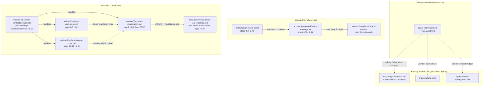

# Design Document

## Overview

This feature reorganizes the four oversized, always-loaded / early-loaded steering files in the
`senzing-bootcamp` power so that every individually-loadable steering unit is at or under the
documented `split_threshold_tokens` (5,000), and the per-session baseline context cost shrinks —
without losing any guidance content and without breaking the existing phase-loading and
keyword-routing machinery.

The work is **mechanical restructuring**, not authoring: it relocates and (where redundant) trims
existing Guidance_Content, registers the resulting Loadable_Units in `steering-index.yaml` using the
exact format `split_steering.py` produces, repoints every Routing_Reference, and adds test coverage
that fails if any unit exceeds the threshold without an exemption or if any relocated section becomes
unroutable. The agent's runtime thresholds, the Generated_Files (`hook-registry*.md`), and
`sync_hook_registry.py` are explicitly out of scope.

### Authoritative measured counts (re-verified against the live index)

All decisions below are grounded in fresh `measure_steering.py` measurements
(`Token_Count = round(len(content) / 4)`), per Requirement 6.2/6.3. These match the
`file_metadata` values in `steering-index.yaml` at design time.

| File | Measured tokens | inclusion / load timing | In scope? |
|---|---|---|---|
| `module-03-system-verification.md` | 6419 | manual; Module 3 phase-1 root; Early_Loaded | **yes** |
| `onboarding-flow.md` | 5438 | manual; loaded at session start for new users; Early_Loaded | **yes** |
| `module-03-phase2-visualization.md` | 5312 | manual; Module 3 phase-2 (Step 9 detail); Early_Loaded | **yes** |
| `agent-instructions.md` | 5013 | **always** (every session) | **yes (priority 1)** |
| `hook-registry-modules.md` | 8476 | manual; `hook`/`hooks` keyword route | no — Generated_File |
| `hook-registry-critical.md` | 8169 | manual; onboarding hook creation | no — Generated_File |
| `hook-registry.md` | 1765 | manual; `hook`/`hooks` keyword route | no — Generated_File (≤ threshold anyway) |

No other file in the corpus exceeds the threshold (next largest: `module-completion.md` 4703,
`common-pitfalls.md` 4610, `visualization-guide.md` 4334 — all ≤ 5,000 and therefore excluded per
Requirement 1.6).

### Goals

- Reduce `agent-instructions.md` (the only Always_Loaded_File in scope) below 5,000 by relocating
  genuinely on-demand sections into existing manual files, leaving pointer stubs (Requirement 5).
- Split each of the three large manual Module 3 / onboarding files into phase/companion units that
  are each ≤ 5,000 (Requirements 2, 3, 4).
- Register every new unit in `steering-index.yaml` so nothing is orphaned, and refresh
  `file_metadata` / `budget` by running `measure_steering.py` in update mode (Requirement 4).
- Add threshold-compliance and routability tests, and keep the existing CI green (Requirements 7, 8).

### Non-Goals (Requirement 9)

- No change to `warn_threshold_pct`, `critical_threshold_pct`, `split_threshold_tokens`, or
  `reference_window`.
- No rewriting of guidance semantics — only relocation and redundancy-trimming permitted by
  Requirement 3.
- No hand-editing of `hook-registry*.md` and no change to `sync_hook_registry.py`.
- No change to module step numbering, `step_range` semantics, or keyword-trigger meanings (only
  repointing a trigger to a relocated unit).

## Architecture

### Current corpus mechanics (reused, not reinvented)

- **`steering-index.yaml`** is the machine-readable map. A split module entry has a `root` filename
  plus a `phases` map; each phase has `file`, `token_count`, `size_category`, and `step_range`. Flat
  files appear only in `file_metadata`. Routing also flows through `keywords`, `languages`, and
  `deployment` maps.
- **`phase-loading-guide.md`** resolves a `current_step` to a phase sub-file: read `current_step`
  from `config/bootcamp_progress.json`, reduce sub-steps to their parent integer via
  `parse_parent_step` (`"5.3"` to 5, `"7a"` to 7), then load the single phase whose `step_range`
  contains that integer; fall back to the root file if the sub-file is missing.
- **`split_steering.py`** is the sanctioned split mechanism: `parse_phases` splits on `## Phase …`
  headings, `build_root_file` writes the preamble + a `## Phase Sub-Files` manifest, `build_sub_file`
  emits each phase with `---\ninclusion: manual\n---` frontmatter, and `update_steering_index`
  rewrites the module entry, `file_metadata`, and `budget.total_tokens`. New index entries in this
  design follow exactly this shape.
- **`measure_steering.py`** computes `round(len(content)/4)`; `--check` is the CI gate that fails if a
  stored count drifts > 10% from the measured value or a file appears/disappears.

### Target corpus after this feature



### Implementation ordering and the Sync_Spec dependency (Requirement 6)

This feature is sequenced **after** the `steering-index-token-count-sync` spec, which reconciles
drifted `phases.*.token_count` values against the authoritative `file_metadata`. Because that spec
may not be merged when work begins, the design mandates that every split decision is made against a
**fresh `measure_steering.py` measurement** of the in-scope file (already performed above), never
against a stored `phases.*.token_count`. After the splits, `measure_steering.py` (update mode)
regenerates `file_metadata` and `budget.total_tokens` so the new file set is reflected, and
`--check` must pass in CI.

## Components and Interfaces

The feature touches four kinds of artifacts. No new runtime code is introduced; the only new code is
in tests.

### 1. Steering content files (Markdown)

For each in-scope file, content is partitioned at heading boundaries chosen so that no `👉` question
is separated from its `STOP`/`WAIT` instruction and no numbered step is separated from its
`**Checkpoint:**` (Requirement 3.5). Each resulting file keeps `kebab-case.md` naming, the
`module-NN-phaseX-…` convention for module sub-files, and YAML frontmatter (`inclusion: manual` for
non-always files; `inclusion: always` retained for `agent-instructions.md`).

### 2. `steering-index.yaml`

Updated in the `split_steering.py` shape:

- `modules.3` gains/repoints `phases` entries; `onboarding.phases` gains one entry.
- `file_metadata` gains entries for every new file and updates the shrunk originals.
- `keywords` gains routes for relocated reference content.
- `budget.total_tokens` is recomputed by `measure_steering.py` update mode. The four threshold keys
  are left untouched (Requirement 9.1).

### 3. CLI scripts (unchanged behavior, re-run)

- `measure_steering.py` — run in update mode to refresh `file_metadata`/`budget`, then `--check` in CI.
- `split_steering.py` — its `MODULE_CONFIG` covers modules 5/6 only; Module 3's structure (`## Phase`
  + `### Step` mix, plus a non-step reference tail) is split following the **same output format** but
  the index edits are applied directly (the design does not add Module 3 to `MODULE_CONFIG`, to avoid
  changing sanctioned tooling beyond need; the produced files and index entries are byte-compatible
  with what `split_steering.py` would emit).
- `sync_hook_registry.py` — **not changed and not re-run with `--write`**; `--verify` must still pass
  because the Generated_Files are untouched (Requirement 7.2, 9.3).

### 4. Test suites (`senzing-bootcamp/tests/`)

New `test_steering_corpus_split.py` (threshold + routability + step-coverage properties) plus updates
to the existing structure/optimization suites for the new file structure.

### Per-file split plans

#### A. `agent-instructions.md` — reduce the always-loaded baseline (Requirement 5)

`agent-instructions.md` stays `inclusion: always`. Only sections that are needed **on demand** (not on
every turn) are relocated into existing manual files that already own the corresponding keyword route,
leaving a one-line pointer stub. Sections whose absence on any turn would change always-on behavior
are **retained** (Requirement 5.3).

**Kept always-on core (must stay):**

- Session-start routing rule (load `session-resume.md` vs `onboarding-flow.md`).
- Answer Processing Priority (delete-and-process rule, protocol-violation rule).
- File Placement + Root Prohibitions tables.
- MCP Rules core + **MCP-First Invariant** + MCP Failure (the always-on MCP precedence).
- Mandatory Gate Precedence.
- Communication core (one-question-at-a-time, the 👉 prefix rules) + **Question Stop Protocol**.
- Module Transition Execution (zero-tolerance rule).
- Hooks silence/retry rules + State & Progress checkpointing rules.

**Relocated on-demand sections (with pointer stubs):**

| Section (measured) | New home (existing manual file) | Existing keyword route | Pointer stub left behind |
|---|---|---|---|
| `### SDK Method Discovery` (~379 tok) | `mcp-usage-reference.md` | `sdk method discovery` to `mcp-usage-reference.md` | "SDK method discovery & disambiguation flow: load `mcp-usage-reference.md` (trigger: *sdk method discovery*)." |
| `## Track Switching` trigger list (~100 tok) | `track-switching.md` | `switch track` / `change track` to `track-switching.md` | "Track switch triggers (*switch track*, *change track*, …): load `track-switching.md`." |
| `## Context Budget` detail (~159 tok) | `agent-context-management.md` | `context budget` / `pacing` / `unload` to `agent-context-management.md` | "Context-budget warn/critical/unload detail: load `agent-context-management.md` (trigger: *context budget*)." |

**Pointer-stub format:** a single bullet line that names the trigger term and the Routing_Reference
(filename + keyword), so the relocated content is reachable (Requirement 5.4, 4.6).

**Target / exemption:** relocating just `SDK Method Discovery` takes the file from 5013 to ~4634
(< 5,000); the Track Switching and Context Budget trims add margin. **No exemption is required** for
`agent-instructions.md` (Requirement 5.5 is not triggered; Requirement 2.5/5.1 satisfied).

**Content preservation:** before relocating, a section inventory confirms whether the target file
already contains equivalent guidance. `mcp-usage-reference.md` already advertises "SDK method
discovery flow"; if the discovery flow is already present, the move is a redundancy-trim
(Requirement 3.2) and only the pointer stub is added; otherwise the block is appended verbatim
(Requirement 3.1). The same inventory check governs the Track Switching and Context Budget moves.

#### B. `onboarding-flow.md` — split phase 1 (Requirement 1, 3, 4)

Boundary measured at `## 3. Entity Resolution Introduction`: steps 0-2d ~ 3394 tok; steps 3-5b
~ 2044 tok. The existing `onboarding` phase map already has `phase1-setup-intro` (the root) and
`phase2-track-setup` (`onboarding-phase2-track-setup.md`). We split the root further.

| New unit | Content (onboarding steps) | Est. tokens | `step_range` |
|---|---|---|---|
| `onboarding-flow.md` (root, kept) | Preamble, 0 Setup, 0b MCP Health, 0c Version, 1 Directory, 1b Team, 2/2a-2d Prerequisites | ~3.4k | `[0, 2]` |
| `onboarding-phase1b-intro-language.md` (new) | 3 Entity-Resolution Intro, 4 Programming-Language Selection, 5 Bootcamp Intro, 5a Verbosity, 5b Comprehension | ~2.1k | `[3, "5b"]` |
| `onboarding-phase2-track-setup.md` (unchanged) | 5 Track Selection, switching, gates, hook registry | 991 | `[5, 5]` |

- The root gains a `## Phase Sub-Files` manifest line for `onboarding-phase1b-intro-language.md` and
  a one-line "continue to phase 1b" instruction at the end of Step 2d.
- The existing "After Step 5b, load `onboarding-phase2-track-setup.md`" instruction moves with Step
  5b into phase 1b — preserving the documented load Routing_Reference (Requirement 4.4).
- Keyword routes `onboard` / `start` to `onboarding-flow.md` (root) are unchanged; the root loads
  first, then routes onward, matching `phase-loading-guide.md`.
- The `👉`/`STOP` pairs (Steps 2a, 4, 5a, 5b) stay intact within a single unit (boundary at `## 3`
  does not bisect any pair) (Requirement 3.5).

> Note: onboarding files are top-level (`onboarding.*`), not under `modules`, so the per-module
> structural rules in `test_steering_structure_properties.py` (Before/After, Prerequisites) do not
> apply to them; the index-existence and content-preservation rules still do.

#### C. `module-03-system-verification.md` — split by phase/step_range (Requirement 1, 3, 4)

Measured cumulative offsets: Step 1 @ 525 tok, Step 9 @ 3112, Phase-2 Report @ 3913, Phase Sub-Files
@ 5527, end 6419. The file currently mixes Phase 1 (Steps 1-8), a Step 9 gate stub that delegates to
the visualization file, and Phase 2 (Steps 10-12) plus reference tails — and the existing phase map
incorrectly maps `phase2-visualization` to `step_range [9,12]` even though Steps 10-12 live in this
root. The split fixes both size and the step-resolution defect.

| New / kept unit | Content | Est. tokens | `step_range` |
|---|---|---|---|
| `module-03-system-verification.md` (root) | Title, banner instruction, Prerequisites, Before/After, TruthSet note, Opt-Out Gate, `## Phase Sub-Files` manifest, shared Error Handling / Success Criteria / Agent Rules | ~1.5k | n/a (root) |
| `module-03-phase1-verification.md` (new) | `## Phase 1` + Steps 1-8, ending with a one-line "Step 9 is mandatory — load `module-03-phase2-visualization.md`" pointer | ~2.6k | `[1, 8]` |
| `module-03-phase2-visualization.md` (kept name, trimmed — see D) | `## Step 9` detail | ~4.0k | `[9, 9]` |
| `module-03-phase3-report-close.md` (new) | PRE-ADVANCEMENT self-check, `## Phase 2` Steps 10 (Report), 11 (Cleanup), 12 (Close) | ~1.9k | `[10, 12]` |

- **Step 9 stub handling:** the Step 9 numbered item + its `⛔` "UNCONDITIONAL EXECUTION REQUIREMENT"
  block currently in the verification file is **not** duplicated as a numbered step in phase 1.
  Section inventory shows `module-03-phase2-visualization.md` already carries an equivalent
  "⚠️ DO NOT SKIP — Phase 2 Execution Is Mandatory" gate; the unique gate language is relocated into
  the visualization file (Requirement 3.1/3.2), and phase 1 ends with a prose pointer. The
  PRE-ADVANCEMENT VERIFICATION self-check (about not advancing to Module 4) relocates to the top of
  `module-03-phase3-report-close.md`, where Step 10's pre-report validation already references it.
- **Disjoint coverage:** `[1,8]` ∪ `[9,9]` ∪ `[10,12]` = steps 1-12, each step in exactly one phase
  (Requirement 4.2, 8.4). This is the corrected map (the old `[9,12]` overlap is removed).
- **References preserved:** the internal "Load `module-03-phase2-visualization.md`" references move
  with their surrounding steps and still point to the same (kept) filename. The Generated
  `hook-registry-modules.md` references to `module-03-phase2-visualization.md` remain valid **because
  the visualization filename is intentionally unchanged** — no Generated_File edit is needed
  (Requirement 1.3, 9.3).
- Root keeps Before/After + Prerequisites so the module-root structural properties still pass
  (Requirement 3.4).

#### D. `module-03-phase2-visualization.md` — trim Step 9 below threshold (Requirement 2, 3, 4)

Step 9 is a single (sub-stepped) step; `phase-loading-guide.md` maps one integer step to exactly one
file, so Step 9 cannot be represented by two phase sub-files. Instead, the verbose **reference**
material is relocated into a manual **companion** file (registered in `file_metadata` only, not in the
phase map), keeping the executable Step 9 instructions in the phase file.

Measured: `### 9.2 API Endpoints` @ 1768 tok, `### 9.3 …` @ 2870 tok (so the 9.1 `search_builder`
enrichment spec + the 9.2 endpoint JSON schemas are the bulk).

| Unit | Content kept/relocated | Est. tokens |
|---|---|---|
| `module-03-phase2-visualization.md` (kept) | Purpose, prerequisites, critical generation lessons, the mandatory gate, 9.1 generation approach + required-files table, **compact** endpoint summaries, 9.3 page-component spec, 9.4 start/verify + guided tour + the `👉`/`STOP` + `**Checkpoint:**`, plus a `#[[file:]]` ref to the companion | ~4.0k |
| `module-03-visualization-api-reference.md` (new) | Full `/api/stats`, `/api/graph`, `/api/merges`, `/api/search` JSON response schemas + the `search_builder.py` enrichment specification (extraction functions, graceful-degradation, single-record/error response examples) | ~1.7k |

- **Routing for the relocated reference:** a `#[[file:]]` reference from the Step 9 file plus a new
  keyword route `visualization api` / `api reference` to `module-03-visualization-api-reference.md`
  (Requirement 4.3/4.6). The companion is `inclusion: manual`.
- The `👉 Take your time exploring…` question and its `🛑 STOP`, and the `**Checkpoint:**` block, stay
  in the Step 9 file (Requirement 3.3, 3.5).
- Both resulting units are ≤ 5,000; **no exemption required**.

### Why no file needs an exemption

Every in-scope file reduces below 5,000 by relocation alone, so the exemption path (Requirement 2.2,
5.5) is **defined and tested** but **unused in v1**. The threshold test ships with an **empty**
enumerated exemption set; if a future indivisible unit cannot be reduced, it is added there with a
written justification and the test still passes only because the file is enumerated and exists.

## Data Models

### Steering index — new/changed entries (`split_steering.py` format)

```yaml
modules:
  3:
    root: module-03-system-verification.md
    phases:
      phase1-verification:
        file: module-03-phase1-verification.md
        token_count: <measured>      # ~2600
        size_category: large
        step_range: [1, 8]
      phase2-visualization:
        file: module-03-phase2-visualization.md
        token_count: <measured>      # ~4000
        size_category: large
        step_range: [9, 9]
      phase3-report-close:
        file: module-03-phase3-report-close.md
        token_count: <measured>      # ~1900
        size_category: medium
        step_range: [10, 12]

onboarding:
  root: onboarding-flow.md
  phases:
    phase1-setup-prereqs:
      file: onboarding-flow.md
      token_count: <measured>        # ~3400
      size_category: large
      step_range: [0, 2]
    phase1b-intro-language:
      file: onboarding-phase1b-intro-language.md
      token_count: <measured>        # ~2100
      size_category: large
      step_range: [3, "5b"]
    phase2-track-setup:
      file: onboarding-phase2-track-setup.md
      token_count: 991
      size_category: medium
      step_range: [5, 5]

keywords:
  # repointed/added — relocated reference content
  visualization api: module-03-visualization-api-reference.md
  api reference: module-03-visualization-api-reference.md
  # existing routes reused as relocation targets (values unchanged):
  #   sdk method discovery: mcp-usage-reference.md
  #   switch track / change track: track-switching.md
  #   context budget / pacing / unload: agent-context-management.md
```

New `file_metadata` keys (counts filled by `measure_steering.py` update mode, Requirement 4.7):
`module-03-phase1-verification.md`, `module-03-phase3-report-close.md`,
`module-03-visualization-api-reference.md`, `onboarding-phase1b-intro-language.md`; and refreshed
counts for the shrunk `agent-instructions.md`, `onboarding-flow.md`,
`module-03-system-verification.md`, `module-03-phase2-visualization.md`. `budget.total_tokens` is
recomputed; the four threshold keys are preserved verbatim.

### Loadable_Unit (test model)

```
Loadable_Unit:
  name: str                 # filename, kebab-case .md
  token_count: int          # round(len(content)/4)
  source: enum              # phase_map | file_metadata
  step_range: [int|str, int|str] | None   # present iff source == phase_map
```

### Content inventory record (preservation method, Requirement 3)

For each in-scope file the implementation produces a before/after inventory used by the preservation
test and review:

```
SectionInventory:
  file: str
  guidance_blocks: list[str]        # normalized non-blank lines / headings
  markers: { "👉": int, "⛔": int, "STOP|WAIT": int, "Checkpoint": int }
  destinations: map[block -> unit]  # exactly-one destination per block
```

The invariant: `union(destinations.values()) == guidance_blocks` (no drop, no orphan) and every
marker count in the union equals the original count.

## Correctness Properties

*A property is a characteristic or behavior that should hold true across all valid executions of a
system — essentially, a formal statement about what the system should do. Properties serve as the
bridge between human-readable specifications and machine-verifiable correctness guarantees.*

The corpus split is largely declarative content reorganization, but four invariants over
`steering-index.yaml` and the on-disk corpus *are* universally quantifiable and cheap to check across
many generated inputs, so they are expressed as property-based tests. (Per-file content authoring and
the one-time CLI/CI runs are validated by example/integration tests in the Testing Strategy.)

### Property 1: Threshold compliance

*For any* Loadable_Unit registered in the Steering_Index (every `phases.*.file`, every flat
`file_metadata` entry, and every keyword/language/deployment target), its measured Token_Count
(`round(len(content)/4)`) is at or below `budget.split_threshold_tokens`, OR the unit's filename is a
member of the enumerated exemption set (and that file exists in the Steering_Index).

**Validates: Requirements 2.1, 2.2, 2.3, 8.1, 8.2, 5.5**

### Property 2: Routability / no orphan

*For any* filename referenced by a Phase_Map `file`, or by the `keywords`, `languages`, or
`deployment` maps of the Steering_Index, that filename resolves to a file that exists on disk.

**Validates: Requirements 4.3, 4.5, 4.6, 8.3, 8.6**

### Property 3: Step coverage is total and unambiguous

*For any* module that has a Phase_Map, every integer step in the union of that module's phases'
`step_range` values resolves, via the `phase-loading-guide.md` rules, to **exactly one** phase
sub-file.

**Validates: Requirements 4.2, 8.4**

### Property 4: Content preservation and always-on-core retention

*For any* in-scope file that was split or trimmed, the union of the resulting Loadable_Units contains
every Guidance_Content block of the original (no block dropped, no orphan) and preserves the original
count of each behavioral marker (`👉`, `⛔`, `STOP`/`WAIT`, `**Checkpoint:**`); and *for any* session,
`agent-instructions.md` retains `inclusion: always` and every always-on rule named in Requirement 5.3
(Answer Processing Priority, MCP-First Invariant, Mandatory Gate Precedence, Question Stop Protocol).

**Validates: Requirements 3.1, 3.2, 3.3, 5.1, 5.3**

## Error Handling

- **Missing sub-file at load time:** governed by the existing `phase-loading-guide.md` fallback —
  if a phase sub-file is absent, the agent loads the root file and logs a warning. The routability
  test (Property 2) prevents this state from shipping.
- **Step outside any `step_range`:** `phase-loading-guide.md` already specifies loading the root file
  only. Property 3 guarantees every enumerated step is covered, so this fallback applies only to
  genuinely out-of-range inputs.
- **Token-count drift after edits:** `measure_steering.py --check` fails CI if any stored count drifts
  > 10% from measured. The update-mode run before commit keeps `file_metadata`/`budget` authoritative
  (Requirement 4.7, 7.1).
- **Generated_File drift:** `sync_hook_registry.py --verify` fails CI if any `hook-registry*.md`
  changed. Since the design touches none of them (and keeps the `module-03-phase2-visualization.md`
  filename that they reference), `--verify` stays green (Requirement 7.2, 9.3).
- **Broken cross-reference:** `validate_power.py` / `validate_commonmark.py` catch dangling
  `#[[file:]]` references and malformed Markdown introduced during relocation.
- **Indivisible oversized section:** if relocation cannot bring a unit ≤ 5,000 without splitting an
  indivisible `👉`→`STOP` or step→`Checkpoint` pair, the unit is recorded in the exemption set with a
  written justification (Requirement 2.2); Property 1 still passes via the exemption branch. Not
  expected in v1.

## Testing Strategy

### Dual approach

- **Property tests** (new `test_steering_corpus_split.py`) verify the four universal invariants above
  across generated index/corpus inputs.
- **Example / integration tests** verify the concrete v1 outcome: the specific new filenames exist,
  the Module 3 step map is `[1,8]/[9,9]/[10,12]`, the onboarding phase 1b exists, pointer stubs are
  present in `agent-instructions.md`, and the CI validators pass.

### New tests (Requirement 8)

In `senzing-bootcamp/tests/test_steering_corpus_split.py`, following workspace conventions
(`from __future__ import annotations`, class-based, `st_`-prefixed strategies,
`@settings(max_examples=20)`, type hints on all signatures, stdlib + pytest + Hypothesis, import the
real `calculate_token_count` from `measure_steering` and reuse `parse_steering_index` /
`step_to_phase` patterns):

- `TestPropertyThresholdCompliance` — Property 1. Strategy `st_loadable_unit()` plus a concrete pass
  over the real index: every unit ≤ `split_threshold_tokens` or in `EXEMPTIONS` (a module-level
  `frozenset`, empty in v1); for each exemption, assert the named file exists in the index.
- `TestPropertyRoutability` — Property 2. `st_index_reference()` draws from phase-map/keyword/
  language/deployment targets; assert each resolves on disk. Plus a concrete pass over the real index.
- `TestPropertyStepCoverage` — Property 3. For each module with a Phase_Map, build the union of
  integer steps from all `step_range`s (reducing string sub-steps like `"5b"` to their parent via the
  `parse_parent_step` rule) and assert each maps to exactly one sub-file via `step_to_phase`.
- `TestPropertyContentPreservation` — Property 4. `st_split_assignment()` generates a synthetic file
  with marked guidance blocks + markers, partitions it at a random heading boundary, and asserts the
  union preserves all blocks and marker counts; plus a concrete before/after inventory check for each
  real in-scope file and an assertion that `agent-instructions.md` still has `inclusion: always` and
  contains the Requirement-5.3 rule anchors.

Test placement: power tests go in `senzing-bootcamp/tests/` (not repo-root `tests/`, which is for hook
prompt validation) per `structure.md`.

### Existing suites to update (Requirement 7.3, 7.4)

- `test_steering_structure_properties.py` — `parse_steering_index` auto-discovers Module 3's new
  phase files, so Properties 1-7 there extend automatically; verify Module 3 root retains Before/After
  + Prerequisites and that the new phase sub-files satisfy step-checkpoint, single-question, and
  frontmatter rules. The example test `test_phased_entry_resolves_to_root_plus_phases` and the
  Module-3 expectations may need the new phase filenames.
- `test_split_steering.py` — `TestUnitAgentInstructionsUpdated` asserts `agent-instructions.md` still
  documents phase loading and "Context Budget … phases"; after the Context Budget trim, keep a
  one-line phase-cost pointer so these assertions still hold (or update them to point at
  `agent-context-management.md`). Integration tests for modules 5/6 are unaffected.
- `test_token_budget_optimization.py` — `test_actual_steering_index_total_tokens_equals_sum` and
  `test_actual_steering_files_token_counts_within_tolerance` must pass after the update-mode run;
  no code change expected beyond re-measurement.
- `test_steering_optimization_unit.py` / `test_steering_optimization_properties.py` — these test the
  `optimize_steering.py` engine generically; if any hard-codes the old `agent-instructions.md` size,
  update the expected baseline to the new (smaller) measured count.

### Existing tests/validators that must stay green (Requirement 7)

Run, in this order, matching the CI pipeline:

1. `python3 senzing-bootcamp/scripts/measure_steering.py` (update mode) then `--check`
2. `python3 senzing-bootcamp/scripts/validate_power.py`
3. `python3 senzing-bootcamp/scripts/validate_commonmark.py`
4. `python3 senzing-bootcamp/scripts/validate_dependencies.py`
5. `python3 senzing-bootcamp/scripts/sync_hook_registry.py --verify`
6. `pytest senzing-bootcamp/tests/` (the full steering suite, including the new file)

### Property test configuration

- Minimum behavior: each property test uses `@settings(max_examples=20)` per workspace convention
  (the repo's PBT standard for these suites), runs in-memory against generated indexes/corpora, and
  has no third-party dependency beyond Hypothesis/pytest (Requirement 7.5).
- Each property test class is tagged with the design property it implements, e.g.
  `Feature: steering-corpus-split, Property 1: Threshold compliance`.
- No steering file may introduce an external clickable URL or an MCP URL outside `mcp.json`; a
  lightweight assertion in the new suite scans the touched files for `http(s)://` and `mcp.senzing.com`
  to enforce Requirement 7.6 / security rules.

## Requirements Mapping

| Requirement | Where addressed |
|---|---|
| **1** In-scope set & selection | Overview "Authoritative measured counts" + per-file plans; Generated_Files excluded with reasons (1.3-1.5); ≤-threshold files excluded (1.6); regeneration-only rule for Generated_Files noted (1.4, 9.3) |
| **2** Per-unit token target | Per-file plans A-D (each unit ≤ 5,000); "Why no file needs an exemption"; Property 1; measure via `calculate_token_count` (2.3) |
| **3** No guidance lost | "Content preservation" notes in A-D; SectionInventory data model; Property 4; structural-rule preservation for Module 3 root/phases (3.4); marker/`STOP`/`Checkpoint` boundary rule (3.5) |
| **4** Index registration & loadability | Data Models index entries; keyword repointing; `#[[file:]]`/load-instruction moves; Properties 2 & 3; `measure_steering.py` update mode (4.7) |
| **5** agent-instructions special handling | Plan A (kept core vs relocated, pointer-stub format, no-exemption result); Property 4 (always-on core retention) |
| **6** Sync_Spec dependency | "Implementation ordering and the Sync_Spec dependency"; re-measure-before-decide; authoritative `file_metadata` use (6.3) |
| **7** CI & suites green | Testing Strategy "Existing tests/validators that must stay green"; stdlib-only (7.5); no external/MCP URLs (7.6); `sync_hook_registry --verify` unaffected (7.2) |
| **8** Threshold & routability coverage | "New tests" — `TestPropertyThresholdCompliance`, `TestPropertyRoutability`, `TestPropertyStepCoverage`; Hypothesis conventions (8.5); routability fails on un-repointed move (8.6) |
| **9** Out of scope | Non-Goals; threshold keys untouched (9.1); no semantic rewrite (9.2); Generated_Files hand-edit prohibition + `sync_hook_registry.py` unchanged (9.3); step numbering/`step_range`/keyword semantics preserved (9.4) |
