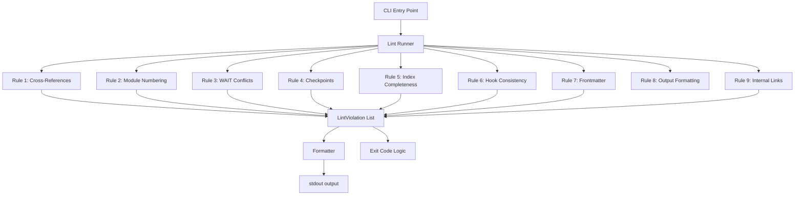

# Design Document: Steering File Linter

## Overview

The steering file corpus (`senzing-bootcamp/steering/`, `senzing-bootcamp/hooks/`, and `steering-index.yaml`) has grown to 45+ files with dense cross-references, module numbering conventions, WAIT instructions, and checkpoint requirements. Bugs in these files — orphaned references, misnumbered modules, WAIT instructions that conflict with hook ownership, missing checkpoints — are only caught during live bootcamp sessions.

This design adds `scripts/lint_steering.py`, a standalone Python script that statically validates the steering corpus across 9 rule categories and runs in CI. The script uses only the Python standard library, produces machine-readable output, and returns a clear pass/fail exit code.

### Key Design Decisions

1. **Single script, multiple rule modules** — all lint rules live in `scripts/lint_steering.py` as separate functions, each returning a list of `LintViolation` objects. This keeps the linter self-contained while allowing rules to be tested independently.
2. **No third-party dependencies** — the script uses only `pathlib`, `re`, `json`, `yaml` (via a minimal inline YAML parser or the existing `steering-index.yaml` parsing pattern used by `measure_steering.py`), and `sys`. Since `steering-index.yaml` uses simple key-value YAML, a lightweight parser suffices.
3. **Error vs. warning severity** — violations that would cause agent runtime failures (missing files, missing checkpoints, invalid frontmatter) are errors. Violations that indicate drift but don't break runtime (unlisted module files, sequence gaps, trailing WAIT warnings) are warnings.
4. **Line-number tracking** — each rule function receives file content as lines with indices, enabling accurate line-number reporting in the `{level}: {file}:{line}: {message}` output format.
5. **Code-block awareness** — reference validation skips content inside fenced code blocks (``` delimiters) to avoid false positives on example code.

## Architecture



Each rule function follows the same signature pattern:

```python
def check_<rule_name>(steering_dir: Path, hooks_dir: Path, index_data: dict) -> list[LintViolation]:
```

The runner calls all rule functions, collects violations, formats output, and determines the exit code.

## Components and Interfaces

### 1. Data Structures

```python
@dataclass
class LintViolation:
    level: str      # "ERROR" or "WARNING"
    file: str       # relative path to the file
    line: int       # line number (0 when not applicable)
    message: str    # human-readable description

    def format(self) -> str:
        return f"{self.level}: {self.file}:{self.line}: {self.message}"
```

### 2. Utility Functions

```python
def parse_frontmatter(content: str) -> tuple[dict | None, int]:
    """Parse YAML frontmatter from file content.
    
    Returns:
        Tuple of (frontmatter_dict_or_None, end_line_number).
        Returns (None, 0) if no frontmatter block found.
    """

def is_in_code_block(lines: list[str], line_index: int) -> bool:
    """Check if a given line index falls inside a fenced code block."""

def parse_steering_index(index_path: Path) -> dict:
    """Parse steering-index.yaml and return structured data.
    
    Returns dict with keys: modules, file_metadata, keywords, languages, deployment.
    """

def get_final_substantive_line(lines: list[str]) -> tuple[int, str]:
    """Return the index and content of the last non-blank, non-comment line."""
```

### 3. Rule Functions

```python
def check_cross_references(steering_dir: Path, index_data: dict) -> list[LintViolation]:
    """Rule 1: Detect orphaned #[[file:path]] includes and backtick-quoted .md references."""

def check_module_numbering(steering_dir: Path, index_data: dict) -> list[LintViolation]:
    """Rule 2: Verify module numbering consistency between index, filenames, and content."""

def check_wait_conflicts(steering_dir: Path, hooks_dir: Path) -> list[LintViolation]:
    """Rule 3: Flag WAIT instructions that conflict with closing-question ownership."""

def check_checkpoints(steering_dir: Path) -> list[LintViolation]:
    """Rule 4: Detect numbered steps missing checkpoint instructions."""

def check_index_completeness(steering_dir: Path, index_data: dict) -> list[LintViolation]:
    """Rule 5: Verify every .md file has file_metadata with valid fields."""

def check_hook_consistency(steering_dir: Path, hooks_dir: Path) -> list[LintViolation]:
    """Rule 6: Verify hook registry and hook file bidirectional consistency."""

def check_frontmatter(steering_dir: Path) -> list[LintViolation]:
    """Rule 7: Validate YAML frontmatter presence and inclusion field."""

def check_internal_links(steering_dir: Path) -> list[LintViolation]:
    """Rule 9: Validate prose references (load/follow/see `filename.md`)."""
```

### 4. Runner and CLI

```python
def run_all_checks(steering_dir: Path, hooks_dir: Path, index_path: Path,
                   warnings_as_errors: bool = False) -> tuple[list[LintViolation], int]:
    """Run all lint rules and return (violations, exit_code).
    
    Args:
        steering_dir: Path to senzing-bootcamp/steering/
        hooks_dir: Path to senzing-bootcamp/hooks/
        index_path: Path to steering-index.yaml
        warnings_as_errors: If True, treat WARNING as ERROR for exit code.
    
    Returns:
        Tuple of (all_violations, exit_code).
        exit_code is 0 if no errors (or no errors+warnings when flag set), else 1.
    """

def main() -> None:
    """CLI entry point. Parses --warnings-as-errors flag, runs checks, prints output."""
```

## Data Models

### LintViolation

| Field | Type | Description |
|-------|------|-------------|
| `level` | `str` | `"ERROR"` or `"WARNING"` |
| `file` | `str` | Relative path from repo root |
| `line` | `int` | 1-based line number, or `0` when not applicable |
| `message` | `str` | Human-readable violation description |

### Steering Index Structure (parsed from YAML)

```python
{
    "modules": {
        1: "module-01-business-problem.md",
        2: "module-02-sdk-setup.md",
        # ...
    },
    "file_metadata": {
        "agent-instructions.md": {"token_count": 1234, "size_category": "large"},
        # ...
    },
    "keywords": { ... },
    "languages": { ... },
    "deployment": { ... },
}
```

### Regex Patterns

| Pattern | Purpose | Used In |
|---------|---------|---------|
| `#\[\[file:(.*?)\]\]` | Include references | Rule 1 |
| `` `([a-zA-Z0-9_-]+\.md)` `` | Backtick-quoted .md filenames | Rule 1, 9 |
| `module-(\d{2})-.*\.md` | Module steering file naming | Rule 2 |
| `^(\d+)\.\s` | Numbered step detection | Rule 4 |
| `\*\*Checkpoint:\*\*.*step\s+(\d+)` | Checkpoint instruction | Rule 4 |
| `WAIT for` | WAIT instruction detection | Rule 3 |
| `(load\|follow\|see)\s+` `` `([^`]+\.md)` `` | Prose file references | Rule 9 |
| `^---\s*$` | Frontmatter delimiter | Rule 7 |
| `^inclusion:\s*(.+)` | Inclusion field extraction | Rule 7 |

## Correctness Properties

*A property is a characteristic or behavior that should hold true across all valid executions of a system — essentially, a formal statement about what the system should do. Properties serve as the bridge between human-readable specifications and machine-verifiable correctness guarantees.*

### Property 1: Cross-Reference Detection Completeness

*For any* steering file content containing `#[[file:path]]` references, the linter shall report an error for every reference whose target path does not exist on disk, and shall not report an error for references whose target path does exist.

**Validates: Requirements 1.1, 1.3**

### Property 2: Bidirectional Module Numbering Consistency

*For any* set of module numbers in the steering index and set of module steering files on disk, the linter shall report every module number that exists in one set but not the other — no index entry without a file and no file without an index entry shall go unreported.

**Validates: Requirements 2.1, 2.2**

### Property 3: Module Sequence Gap Detection

*For any* sequence of module numbers in the steering index, the linter shall report a warning for every integer gap in the sequence (e.g., if modules 1–5 and 7–11 exist but 6 does not).

**Validates: Requirements 2.4**

### Property 4: WAIT-at-End-of-File Detection

*For any* steering file content, the linter shall report a warning if and only if the final substantive line (ignoring trailing blank lines and comments) contains a `WAIT for` instruction, unless the WAIT is preceded by a `👉` question on the same or previous non-blank line.

**Validates: Requirements 3.2, 3.4**

### Property 5: Step-Checkpoint Matching

*For any* module steering file content with numbered steps, the linter shall report an error for every numbered step that lacks a corresponding checkpoint instruction before the next step or end of file, and shall report an error when a checkpoint's step number does not match the step it follows.

**Validates: Requirements 4.2, 4.3**

### Property 6: File Metadata Completeness

*For any* set of `.md` files on disk and `file_metadata` entries in the steering index, the linter shall report an error for every file that has no metadata entry, and shall report an error for every metadata entry missing a valid `token_count` (positive integer) or `size_category` (one of `small`, `medium`, `large`).

**Validates: Requirements 5.1, 5.2, 5.3, 5.4**

### Property 7: Bidirectional Hook Registry Consistency

*For any* set of hook IDs in the hook registry and set of `.kiro.hook` files on disk, the linter shall report every ID that exists in one set but not the other, and shall report an error when the event type documented in the registry does not match the `when.type` field in the corresponding hook file.

**Validates: Requirements 6.2, 6.3, 6.4**

### Property 8: Frontmatter Inclusion Validation

*For any* steering file content, the linter shall report an error if the file lacks a YAML frontmatter block, and shall report an error if the `inclusion` field is missing or has a value not in `{always, auto, fileMatch, manual}`. When `inclusion` is `fileMatch`, the linter shall additionally require a non-empty `fileMatchPattern` field.

**Validates: Requirements 7.1, 7.2, 7.3, 7.4, 7.5**

### Property 9: Exit Code Correctness

*For any* set of lint violations, the exit code shall be 0 if and only if there are zero error-level violations (or zero error+warning violations when `--warnings-as-errors` is set). Otherwise the exit code shall be 1.

**Validates: Requirements 8.2, 8.3, 8.6**

### Property 10: Violation Output Format

*For any* `LintViolation` object, the formatted output string shall match the pattern `{ERROR|WARNING}: {file}:{line}: {message}`.

**Validates: Requirements 8.4**

### Property 11: Code-Block-Aware Reference Validation

*For any* steering file content containing file references both inside and outside fenced code blocks, the linter shall validate only references outside code blocks and skip those inside code blocks.

**Validates: Requirements 9.3**

## Error Handling

| Scenario | Handling |
|----------|----------|
| `steering-index.yaml` missing or unparseable | Script exits with code 1 and prints `ERROR: Cannot parse steering-index.yaml: {reason}` |
| Steering directory does not exist | Script exits with code 1 and prints `ERROR: Steering directory not found: {path}` |
| Hooks directory does not exist | Script exits with code 1 and prints `ERROR: Hooks directory not found: {path}` |
| Individual steering file unreadable (permissions) | Rule skips the file and reports `WARNING: {file}:0: Could not read file: {reason}` |
| Hook file contains invalid JSON | Rule 6 reports `ERROR: {file}:0: Invalid JSON in hook file` and skips the file |
| `steering-index.yaml` missing `file_metadata` section | Rule 5 reports `ERROR: steering-index.yaml:0: Missing file_metadata section` |
| `steering-index.yaml` missing `modules` section | Rule 2 reports `ERROR: steering-index.yaml:0: Missing modules section` |
| No `.md` files found in steering directory | Script completes with 0 violations (no files to lint) |

## Testing Strategy

### Property-Based Tests (Hypothesis)

The linter's rule functions are pure functions that take file content/paths and return violation lists, making them well-suited for property-based testing.

**Library:** [Hypothesis](https://hypothesis.readthedocs.io/) (Python) — already used in the project.

**Configuration:** Minimum 100 iterations per property test (`@settings(max_examples=100)`).

**Tag format:** `Feature: steering-file-linter, Property {N}: {title}`

Each of the 11 correctness properties maps to a single property-based test:

| Property | Test Strategy |
|----------|---------------|
| P1: Cross-reference detection | Generate random file content with `#[[file:path]]` references pointing to existing/non-existing paths, verify linter reports exactly the missing ones |
| P2: Bidirectional module numbering | Generate random sets of module numbers in index and on disk, verify linter reports all mismatches in both directions |
| P3: Module sequence gaps | Generate random integer sequences, verify linter reports exactly the gaps |
| P4: WAIT-at-end detection | Generate random file content with WAIT instructions at various positions, verify linter warns only for final-line WAIT without preceding 👉 |
| P5: Step-checkpoint matching | Generate random module content with numbered steps and optional checkpoints, verify linter reports exactly the missing/mismatched checkpoints |
| P6: File metadata completeness | Generate random sets of files and metadata entries with valid/invalid fields, verify linter reports exactly the issues |
| P7: Bidirectional hook consistency | Generate random sets of registry IDs and hook file IDs with matching/mismatching event types, verify linter reports all discrepancies |
| P8: Frontmatter inclusion validation | Generate random frontmatter blocks with various inclusion values and optional fileMatchPattern, verify linter accepts valid and rejects invalid |
| P9: Exit code correctness | Generate random sets of violations with various levels, verify exit code matches the rule |
| P10: Violation output format | Generate random LintViolation objects, verify formatted string matches the pattern |
| P11: Code-block-aware references | Generate random file content with references inside and outside fenced code blocks, verify linter validates only outside references |

### Example-Based Unit Tests

| Test | What it verifies |
|------|-----------------|
| Real steering corpus has no orphaned `#[[file:]]` references | Run Rule 1 on actual files (Req 1.1) |
| Real module numbering is consistent | Run Rule 2 on actual index + files (Req 2.1) |
| Real module files have checkpoints for all steps | Run Rule 4 on actual module files (Req 4.1) |
| Real steering files have valid frontmatter | Run Rule 7 on actual files (Req 7.1) |
| Real hook registry matches hook files | Run Rule 6 on actual registry + hooks (Req 6.1) |
| `--warnings-as-errors` flag changes exit code | Run with warnings present, verify exit code changes (Req 8.6) |
| Output format matches `{level}: {file}:{line}: {message}` | Verify formatted output of known violations (Req 8.4) |

### Integration Tests

| Test | What it verifies |
|------|-----------------|
| Full linter run on real corpus | `python scripts/lint_steering.py` exits 0 on the current corpus |
| Linter runs with no third-party imports | Script executes without import errors using only stdlib |
| Summary line shows correct counts | Run on corpus, verify summary line format |
