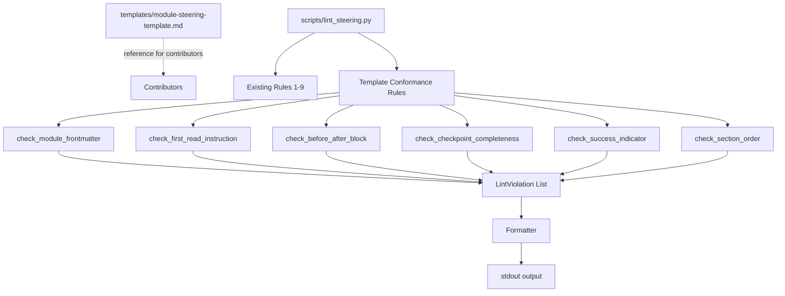

# Design Document: Steering File Template

## Overview

Every module steering file (`module-NN-*.md`) follows roughly the same structural pattern — YAML frontmatter, a first-read instruction, before/after framing, prerequisites, numbered workflow steps with checkpoints, and a success indicator — but with slight variations that have accumulated over time. This design creates a canonical template file (`senzing-bootcamp/templates/module-steering-template.md`) and adds template-conformance lint rules to the existing `scripts/lint_steering.py` script. Together, these catch structural drift before it ships.

### Key Design Decisions

1. **Template is documentation, not code** — the template file is a reference for contributors, not a programmatic schema. The linter rules encode the structural requirements independently.
2. **Integrated into existing linter** — template-conformance checks are added as new rule functions in `scripts/lint_steering.py`, not a separate script. This keeps the single-command CI story (`python scripts/lint_steering.py`).
3. **Section detection via regex** — each template section (frontmatter, first-read, before/after, workflow steps, success indicator) is detected by a specific regex pattern. This is robust enough for the consistent markdown structure used in the bootcamp.
4. **Ordering validation only for present sections** — missing sections are reported by their individual rules. The ordering rule only checks that sections which are present appear in the correct sequence, avoiding duplicate violations.
5. **`--skip-template` flag** — allows running the linter without template checks, useful during template migration or for non-module steering files.
6. **Warning vs. error severity** — missing frontmatter and missing checkpoints are errors (they break agent behavior). Missing before/after blocks, missing success indicators, and ordering issues are warnings (they degrade quality but don't break runtime).

## Architecture



The template conformance rules follow the same `check_*` function pattern as existing linter rules, returning `list[LintViolation]`. They are called by the runner unless `--skip-template` is passed.

## Components and Interfaces

### 1. Template File

**Location:** `senzing-bootcamp/templates/module-steering-template.md`

The template contains placeholder sections in the required order with HTML comments explaining each section:

```markdown
---
inclusion: manual
---
<!-- Frontmatter: must be "inclusion: manual" for all module files -->

# Module NN — [Module Title]

**🚀 First:** Read `config/bootcamp_progress.json` ...
<!-- First-read instruction: must reference bootcamp_progress.json and module-transitions.md -->

👤 **User reference:** ...
<!-- User reference line -->

**Before/After:**
<!-- Before/After block: describes state before and after module completion -->
| Before | After |
|--------|-------|
| [description] | [description] |

**Prerequisites:** ...
<!-- Prerequisites block -->

## Workflow Steps

1. [Step description]

   **Checkpoint:** Write step 1 to `config/bootcamp_progress.json`.

2. [Step description]

   **Checkpoint:** Write step 2 to `config/bootcamp_progress.json`.

<!-- Each numbered step must have a checkpoint instruction -->

**Success indicator:** ✅ [Completion criteria description]
<!-- Success indicator: must appear after all workflow steps -->
```

### 2. Template Conformance Rule Functions

```python
def get_module_steering_files(steering_dir: Path) -> list[Path]:
    """Return all module-NN-*.md files in the steering directory."""

def check_module_frontmatter(steering_dir: Path) -> list[LintViolation]:
    """Validate frontmatter in all module steering files.
    
    Checks:
    - File begins with --- delimited YAML frontmatter
    - Frontmatter contains inclusion: manual
    
    Returns errors for missing frontmatter, warnings for non-manual inclusion.
    """

def check_first_read_instruction(steering_dir: Path) -> list[LintViolation]:
    """Validate first-read instruction in all module steering files.
    
    Checks:
    - File contains **🚀 First:** within first 10 non-blank lines after frontmatter
    - Instruction references config/bootcamp_progress.json and module-transitions.md
    
    Returns errors for missing instruction, warnings for missing references.
    """

def check_before_after_block(steering_dir: Path) -> list[LintViolation]:
    """Validate before/after block in all module steering files.
    
    Checks:
    - File contains a line with **Before/After** (case-insensitive)
    - Block appears before the first workflow step
    
    Returns warnings for missing or misplaced blocks.
    """

def check_checkpoint_completeness(steering_dir: Path) -> list[LintViolation]:
    """Validate checkpoint instructions for all workflow steps.
    
    Checks:
    - Every top-level numbered step has a checkpoint instruction
    - Checkpoint step numbers match their parent step
    - Files with zero steps are skipped
    
    Returns errors for missing or mismatched checkpoints.
    """

def check_success_indicator(steering_dir: Path) -> list[LintViolation]:
    """Validate success indicator in all module steering files.
    
    Checks:
    - File contains **Success indicator:** line (case-insensitive)
    - Success indicator appears after all workflow steps
    
    Returns warnings for missing indicator, errors for out-of-order placement.
    """

def check_section_order(steering_dir: Path) -> list[LintViolation]:
    """Validate section ordering in all module steering files.
    
    Required order (for present sections only):
    frontmatter → first-read → before/after → workflow steps → success indicator
    
    Returns warnings for out-of-order sections.
    """
```

### 3. CLI Integration

The existing `run_all_checks` function in `lint_steering.py` is extended:

```python
def run_all_checks(steering_dir: Path, hooks_dir: Path, index_path: Path,
                   warnings_as_errors: bool = False,
                   skip_template: bool = False) -> tuple[list[LintViolation], int]:
    """Run all lint rules including template conformance (unless skip_template is True)."""
```

The `main()` function adds `--skip-template` to the argparse configuration.

## Data Models

### Section Detection Patterns

| Section | Detection Pattern | Type |
|---------|-------------------|------|
| Frontmatter | `^---\s*$` on first line | Regex |
| First-Read Instruction | `\*\*🚀 First:\*\*` | Regex |
| Before/After Block | `\*\*Before/After\*\*` (case-insensitive) | Regex |
| Workflow Steps | `^\d+\.\s` at top indentation | Regex |
| Checkpoint Instruction | `\*\*Checkpoint:\*\*.*step\s+(\d+)` | Regex |
| Success Indicator | `\*\*Success indicator:\*\*` (case-insensitive) | Regex |

### Section Order Enum

```python
SECTION_ORDER = [
    "frontmatter",
    "first_read",
    "before_after",
    "workflow_steps",
    "success_indicator",
]
```

### Violation Severity by Rule

| Rule | Missing Section | Invalid Content | Out of Order |
|------|----------------|-----------------|--------------|
| Frontmatter (Req 2) | ERROR | WARNING (non-manual) | — |
| First-Read (Req 3) | ERROR | WARNING (missing refs) | — |
| Before/After (Req 4) | WARNING | — | WARNING |
| Checkpoints (Req 5) | ERROR | ERROR (mismatch) | — |
| Success Indicator (Req 6) | WARNING | — | ERROR |
| Section Order (Req 7) | — | — | WARNING |

## Correctness Properties

*A property is a characteristic or behavior that should hold true across all valid executions of a system — essentially, a formal statement about what the system should do. Properties serve as the bridge between human-readable specifications and machine-verifiable correctness guarantees.*

### Property 1: Frontmatter Detection and Validation

*For any* file content, the frontmatter checker shall report an error if the content does not begin with a `---` delimited YAML block, and shall report a warning if the `inclusion` field value is not `manual`.

**Validates: Requirements 2.1, 2.2, 2.3, 2.4**

### Property 2: First-Read Instruction Detection

*For any* module file content, the first-read checker shall report an error if no line matching `**🚀 First:**` appears within the first 10 non-blank lines after frontmatter, and shall report a warning if the instruction does not reference both `config/bootcamp_progress.json` and `module-transitions.md`.

**Validates: Requirements 3.1, 3.2, 3.3, 3.4**

### Property 3: Step-Checkpoint Matching

*For any* module file content with numbered workflow steps, the checkpoint checker shall report an error for every step that lacks a corresponding checkpoint instruction, and shall report an error when a checkpoint's step number does not match the step it belongs to. Files with zero steps shall produce no checkpoint violations.

**Validates: Requirements 5.1, 5.2, 5.3, 5.4**

### Property 4: Section Ordering Validation

*For any* module file content with two or more detected template sections, the ordering checker shall report a warning for every pair of sections that appears out of the required sequence (frontmatter → first-read → before/after → workflow steps → success indicator). Missing sections shall not trigger ordering violations.

**Validates: Requirements 7.1, 7.2, 7.3**

### Property 5: Success Indicator Position

*For any* module file content containing both workflow steps and a success indicator, the success indicator checker shall report an error if the success indicator line appears before any workflow step line.

**Validates: Requirements 6.3, 6.4**

### Property 6: Before/After Block Position

*For any* module file content containing both a before/after block and workflow steps, the before/after checker shall report a warning if the before/after block appears after the first workflow step.

**Validates: Requirements 4.1, 4.3**

### Property 7: Template Conformance Violation Format

*For any* template conformance violation, the formatted output shall match the pattern `{ERROR|WARNING}: {file}:{line}: {message}`, consistent with all other linter violations.

**Validates: Requirements 8.2**

## Error Handling

| Scenario | Handling |
|----------|----------|
| Module steering file unreadable | Rule skips the file and reports `WARNING: {file}:0: Could not read file` |
| Template file missing at expected path | Not a runtime error — the template is documentation. Linter rules work independently of the template file |
| `--skip-template` flag passed | All template conformance rules are skipped; no violations reported for template checks |
| Module file has no recognizable sections | Individual rules report their specific missing-section violations; ordering rule produces no violations |
| Frontmatter YAML is malformed | Frontmatter rule reports `ERROR: {file}:1: Malformed YAML frontmatter` |
| Multiple sections detected at the same line | Each section is tracked by its first detected line; ordering uses these line numbers |

## Testing Strategy

### Property-Based Tests (Hypothesis)

The template conformance rules are pure functions that take file content and return violation lists, making them well-suited for property-based testing.

**Library:** [Hypothesis](https://hypothesis.readthedocs.io/) (Python) — already used in the project.

**Configuration:** Minimum 100 iterations per property test (`@settings(max_examples=100)`).

**Tag format:** `Feature: steering-file-template, Property {N}: {title}`

Each of the 7 correctness properties maps to a single property-based test:

| Property | Test Strategy |
|----------|---------------|
| P1: Frontmatter detection | Generate random file content with/without frontmatter and various inclusion values, verify correct error/warning reporting |
| P2: First-read detection | Generate random module content with the instruction at various positions, verify detection within first 10 non-blank lines and reference validation |
| P3: Step-checkpoint matching | Generate random module content with numbered steps and optional checkpoints, verify correct error reporting for missing/mismatched checkpoints |
| P4: Section ordering | Generate random module content with template sections in various orders, verify warnings for out-of-order pairs |
| P5: Success indicator position | Generate random module content with success indicator at various positions relative to workflow steps, verify error when before steps |
| P6: Before/after position | Generate random module content with before/after block at various positions, verify warning when after first step |
| P7: Violation format | Generate random template violations, verify formatted output matches the standard pattern |

### Example-Based Unit Tests

| Test | What it verifies |
|------|-----------------|
| Template file exists at expected path | `senzing-bootcamp/templates/module-steering-template.md` exists (Req 1.1) |
| Template contains all required sections in order | Parse template and verify section presence and order (Req 1.2) |
| Template contains HTML comments | Verify `<!-- ... -->` comments exist (Req 1.3) |
| Template contains placeholder values | Verify `NN`, `[Module Title]` placeholders (Req 1.4) |
| Real module files have valid frontmatter | Run frontmatter check on actual module files (Req 2.1) |
| Real module files have first-read instruction | Run first-read check on actual files (Req 3.1) |
| Real module files have checkpoints for all steps | Run checkpoint check on actual files (Req 5.1) |
| `--skip-template` flag skips template checks | Run linter with flag, verify no template violations (Req 8.3) |
| Template violations use standard output format | Verify format matches `{level}: {file}:{line}: {message}` (Req 8.2) |

### Integration Tests

| Test | What it verifies |
|------|-----------------|
| Full linter run includes template checks | `python scripts/lint_steering.py` output includes template conformance results |
| `--skip-template` suppresses template output | Run with flag, verify no template-related lines in output |
| Linter with template checks uses only stdlib | No third-party imports required (Req 8.4) |
