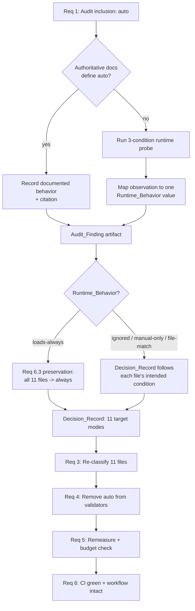

# Design Document

## Overview

This design covers verifying how the Kiro runtime interprets the non-standard
`inclusion: auto` frontmatter value used by eleven steering files, deciding the
correct standard inclusion mode for each, re-classifying the files, and
realigning the project's validators and budget accounting with the verified
truth.

The work is deliberately sequenced so that every downstream change rests on
established fact rather than assumption:

1. **Audit (Req 1)** — establish the runtime behavior of `inclusion: auto` from
   authoritative documentation or, failing that, a runtime probe. Record the
   result as a durable `Audit_Finding` artifact.
2. **Decide (Req 2)** — map each of the eleven `Auto_File`s to a standard mode
   (`always` | `fileMatch` | `manual`) in a `Decision_Record`. Provisional
   recommendations are stated now; the final assignment is contingent on the
   `Audit_Finding` (specifically to honor the "preserve always-loaded" safety
   constraint of Req 6.3).
3. **Re-classify (Req 3)** — rewrite the eleven files' frontmatter to their
   decided modes, preserving description, body, and keyword routing.
4. **Align validators (Req 4)** — remove `auto` from `VALID_INCLUSIONS` in
   `validate_power.py` and `lint_steering.py` so both enforce exactly
   `{always, fileMatch, manual}`.
5. **Realign budget (Req 5)** — ensure `measure_steering.py` computes the
   `Baseline_Footprint` from the files the runtime actually always-loads and
   checks it against the configured ceiling.
6. **Protect CI + workflow (Req 6)** — keep every CI gate green and preserve the
   guided bootcamp's loading behavior.

### Scope and constraints

- Python 3.11+, standard library only. `measure_steering.py`, `lint_steering.py`,
  and `validate_power.py` already parse YAML frontmatter with minimal regex
  helpers (no PyYAML); this design keeps that convention.
- Everything under `senzing-bootcamp/` ships to users. No dev-only artifacts are
  introduced; the `Audit_Finding` and `Decision_Record` live inside this spec
  folder (`.kiro/specs/steering-inclusion-auto-audit/`), not in the shipped
  power.
- Steering files remain Markdown + YAML frontmatter with kebab-case names.
- CI (`.github/workflows/validate-power.yml`) must continue to pass.

### Key finding that shapes the design

`measure_steering.py` **already** implements the always-loaded budget check from
a prior spec: `collect_always_loaded_set` returns exactly the `inclusion: always`
files, `compute_baseline_footprint` sums their measured `token_count`,
`parse_always_loaded_ceiling_pct` reads the ceiling from the index, and
`check_always_loaded_budget` fails when the footprint strictly exceeds the
ceiling. Once `inclusion: auto` is eliminated, "the files the runtime
always-loads" (Req 5.1) is exactly the `inclusion: always` set, so the existing
computation becomes precisely correct. Req 5 is therefore mostly a
**confirm-and-remeasure** effort rather than new logic. The two genuinely new
code changes are the validator set edit (Req 4) and the re-classification
rewrite (Req 3).

## Architecture

The audit is a linear pipeline where each stage produces an artifact consumed by
the next. The only branch is in the audit stage, where the evidence source
(documentation vs. runtime probe) and the observed behavior steer the
`Decision_Record`.



### Components touched

| Component | File(s) | Requirement | Nature of change |
|---|---|---|---|
| Audit_Finding | `.kiro/specs/steering-inclusion-auto-audit/audit-finding.md` | Req 1 | New spec-local design artifact |
| Decision_Record | `.kiro/specs/steering-inclusion-auto-audit/decision-record.md` | Req 2 | New spec-local design artifact |
| Steering frontmatter | 11 `senzing-bootcamp/steering/*.md` files | Req 3 | Frontmatter rewrite (body preserved) |
| Re-classification helper | `senzing-bootcamp/scripts/reclassify_steering.py` (or direct edits — see Req 3) | Req 3 | New pure helper OR direct edits |
| Inclusion_Validator | `validate_power.py`, `lint_steering.py` | Req 4 | Remove `"auto"` from the accepted set |
| Budget_Analyzer | `measure_steering.py` | Req 5 | Confirm + remeasure (`file_metadata`, budget) |
| Steering_Index | `steering-index.yaml` | Req 3, Req 5 | Refreshed `token_count`/`size_category`; keyword routing unchanged |
| CI + tests | `validate-power.yml`, `senzing-bootcamp/tests/` | Req 6 | No workflow change; new/updated tests |

## Components and Interfaces

### 1. Audit approach (Req 1)

**Objective:** establish the `Runtime_Behavior` of `inclusion: auto` as exactly
one of `{loads-always, loads-on-file-match, loads-manual-only, ignored}` with an
evidence source (Req 1.1).

**Evidence resolution order:**

1. **Documentation first (Req 1.2).** Consult authoritative Kiro steering
   documentation for the handling of an unrecognized/`auto` inclusion value. If
   it defines the behavior, record the documented `Runtime_Behavior` plus a
   concrete citation (documentation title + section/locator).
2. **Runtime probe if undefined (Req 1.3).** If the documentation does not define
   `auto`, run a controlled probe: author a single throwaway probe steering file
   declaring `inclusion: auto` whose body contains a unique, unambiguous sentinel
   string, and a `fileMatchPattern`-plausible target (e.g. a specific file glob it
   could match). Observe whether the sentinel is present in the agent's available
   context across three session conditions:

   | Condition | Setup | What presence/absence indicates |
   |---|---|---|
   | (a) idle | New session, no matching-file edit, no explicit reference | Present ⇒ `loads-always`; absent ⇒ not always-on |
   | (b) file-match | New session, edit a file the probe could plausibly match | Present only here ⇒ `loads-on-file-match` |
   | (c) explicit reference | New session, explicitly reference the probe file | Present only here ⇒ `loads-manual-only` |

   Mapping of observations to a single `Runtime_Behavior` (Req 1.3):
   - Present in (a) → `loads-always`
   - Absent in (a), present in (b) → `loads-on-file-match`
   - Absent in (a) and (b), present in (c) → `loads-manual-only`
   - Absent in all three → `ignored`

3. **Verification metadata (Req 1.4).** Record the calendar date of verification
   and a Kiro version identifier; where no version identifier is available, record
   an environment description in its place.
4. **Footprint consequence (Req 1.5).** Where the verified behavior is
   `loads-always`, state the resulting `Baseline_Footprint` as the summed measured
   `token_count` of the always-loaded files **with the eleven `Auto_File`s counted
   as always-loaded** — computed as `≈ 6,668 + 18,162 = 24,830` tokens using
   current measured counts (still below the 30,000-token ceiling; see Req 5).

**Artifact:** `audit-finding.md` in the spec folder records all of the above in a
fixed structure (see Data Models → `Audit_Finding`). The probe steering file is
throwaway and MUST NOT be committed under `senzing-bootcamp/` (Req 6.4: only
repository files are modified, and no dev-only files ship).

### 2. Decision model (Req 2)

Each `Auto_File` gets a `Decision_Record` entry: target mode, intended loading
condition, and rationale (Req 2.1–2.3). Conditional loading in this project is
currently expressed through the `steering-index.yaml` **keyword routing map**, so
a keyword-routed file's natural standard target is `manual` (it is pulled in on
demand when the agent matches a routing keyword or the user references it).

**Keyword-routed `Auto_File`s** (appear as values in `steering-index.yaml`
`keywords:`): `agent-context-management.md` (context budget / pacing / unload),
`design-patterns.md` (pattern), `mcp-response-caching.md` (cache / mcp cache),
`module-prerequisites.md` (prerequisite), `project-structure.md`
(project-structure), `session-resume.md` (resume), `verbosity-control.md`
(output level / verbose / verbosity / content rules).

**Not keyword-routed:** `agent-behavior-rules.md`, `conversation-protocol.md`,
`file-placement.md`, `qa-transcript.md`.

**Provisional recommendations** (final assignment contingent on `Audit_Finding`
— see the contingency rule below). Token counts are the current measured values
from `steering-index.yaml`.

| # | Auto_File | Tokens | Provisional mode | Intended loading condition | Rationale (Req 2.3) |
|---|---|---|---|---|---|
| 1 | agent-behavior-rules.md | 822 | `always` | Every session | Four foundational behavior rules that must govern every turn; not keyword-routed, no natural trigger. |
| 2 | conversation-protocol.md | 4600 | `always` | Every session | Turn-taking / question-handling / transition protocol the guided workflow relies on being present throughout an active session. |
| 3 | qa-transcript.md | 1284 | `always` | Every session | Emits Q&A completion events whenever the agent asks a 👉 leading question; must be loaded for that behavior to fire across the bootcamp. |
| 4 | file-placement.md | 288 | `fileMatch` | When creating/writing any project file | Its stated trigger — "load when creating or writing any project file" — is a classic file-edit match. `fileMatchPattern: "**/*"`. |
| 5 | agent-context-management.md | 1326 | `manual` | On explicit reference / keyword | Keyword-routed (context budget, pacing, unload); pulled in when those concerns arise. |
| 6 | design-patterns.md | 810 | `manual` | On explicit reference / keyword | Keyword-routed (pattern); a reference gallery loaded when discussing patterns. |
| 7 | mcp-response-caching.md | 1442 | `manual` | On explicit reference / keyword | Keyword-routed (cache); situational guidance. |
| 8 | module-prerequisites.md | 1394 | `manual` | On explicit reference / keyword | Keyword-routed (prerequisite); consulted when checking module readiness. |
| 9 | project-structure.md | 764 | `manual` | On explicit reference / keyword | Keyword-routed (project-structure); reference material. Has **no** `description` — must remain absent (Req 3.2). |
| 10 | session-resume.md | 3384 | `manual` | On explicit reference / keyword | Keyword-routed (resume); loaded at resume time. Also a `session-resume:` root in the index. |
| 11 | verbosity-control.md | 2048 | `manual` | On explicit reference / keyword | Keyword-routed (verbose/verbosity/output level); loaded when adjusting output. |

Provisional projected `Baseline_Footprint` (Req 2.5) if the audit permits the
above split: `always` = agent-instructions (4482) + module-transitions (1908) +
security-privacy (278) + agent-behavior-rules (822) + conversation-protocol
(4600) + qa-transcript (1284) = **13,374 tokens** (well under the 30,000 ceiling).

**Audit contingency rule (couples Req 2 to Req 6.3):**

- **If `Runtime_Behavior != loads-always`** (i.e. `ignored`, `loads-manual-only`,
  or `loads-on-file-match`): no `Auto_File` was unconditionally present in every
  session, so Req 6.3 imposes no "must stay always" constraint from these files.
  The provisional 3× `always` / 1× `fileMatch` / 7× `manual` split stands. This
  also matches what the current budget accounting already assumes (baseline
  6,668).
- **If `Runtime_Behavior == loads-always`**: all eleven files were loaded into
  every active session before the change. Req 6.3 then requires each to remain
  always-loaded, so the safe, requirement-satisfying assignment maps **all eleven
  to `always`** (projected baseline ≈ 24,830 tokens, still under the ceiling). Any
  later tightening of individual files to `manual`/`fileMatch` becomes a separate,
  separately-verified behavior change outside this preservation-focused audit.

For `fileMatch` assignments the `Decision_Record` states a single non-empty glob
(Req 2.4); for `always` assignments it includes the file's measured `token_count`
in the projected baseline (Req 2.5); for `manual` assignments it records the
explicit-reference condition (Req 2.6).

### 3. Re-classification mechanics (Req 3)

The rewrite must, for each of the eleven files: set `inclusion` to the decided
mode (Req 3.1); preserve the existing `description` exactly, and neither add nor
remove it when absent (Req 3.2); add `fileMatchPattern` equal to the decided glob
for `fileMatch` files (Req 3.3); leave the Markdown body byte-identical (Req 3.5);
and leave the `steering-index.yaml` keyword routing entries untouched (Req 3.4).
After all eleven are rewritten, zero files declare `inclusion: auto` (Req 3.6).

**Reuse assessment.** `optimize_steering.py` (splits/compresses always-on files)
and `split_steering.py` (splits modules into phase files) both restructure
*content*; neither performs a targeted frontmatter-mode rewrite, and repurposing
them risks disturbing the body. They are not a fit.

**Chosen mechanism.** A small, stdlib-only pure function is the unit of change:

```
rewrite_inclusion(content: str, mode: str, file_match_pattern: str | None = None) -> str
```

Contract:
- Operates only on the leading `---`-fenced frontmatter block; the body after the
  closing fence is copied through unchanged (guarantees Req 3.5).
- Replaces the value on the existing `inclusion:` line with `mode`; leaves the
  `description:` line (and its continuation lines, e.g. `qa-transcript.md`)
  untouched (guarantees Req 3.2).
- For `mode == "fileMatch"`, ensures a single `fileMatchPattern:` line equal to
  `file_match_pattern` exists in the block (added directly after `inclusion:` if
  absent); for other modes it does not inject one (guarantees Req 3.3).
- Raises on `mode not in {"always", "fileMatch", "manual"}` and on
  `fileMatch` without a non-empty pattern, so a malformed Decision_Record can
  never produce a bad file.

Two placements are acceptable; the design recommends the first:

- **(Recommended) Direct, reviewed edits** to the eleven files, with
  `rewrite_inclusion` living in a **test helper** and exercised by property tests
  as the reference mechanism. This is a one-time migration touching only 11
  frontmatter blocks, adds no shipped surface, and keeps the "no dev-only files"
  rule clean. Correctness of the actual edits is then enforced by the strengthened
  validators (Req 4) plus a corpus test (below).
- **(Alternative) A shipped `reclassify_steering.py`** maintenance tool wrapping
  `rewrite_inclusion` with an argparse CLI, if maintainers want a reusable,
  repeatable operation. It follows the `scripts/` conventions and is stdlib-only.

**Verification that zero `auto` remain (Req 3.6):** a corpus test scans every
`senzing-bootcamp/steering/*.md` via the existing `parse_inclusion`
(`measure_steering.py`) / `parse_frontmatter` (`lint_steering.py`) helpers and
asserts no file returns `auto` and every file returns a value in
`{always, fileMatch, manual}`. The strengthened validators (Req 4) enforce the
same invariant in CI.

### 4. Validator alignment (Req 4)

Both validators currently accept `auto`:

- `lint_steering.py` module constant: `VALID_INCLUSIONS = {"always", "auto", "fileMatch", "manual"}`
- `validate_power.py` local set in `check_steering_files`: `{"always", "auto", "fileMatch", "manual"}`

**Change:** remove `"auto"` from both so each is exactly
`{"always", "fileMatch", "manual"}` (Req 4.1, Req 4.3). Both compare the parsed
value as a case-sensitive exact string against the set, so mixed-case variants
(`Always`, `MANUAL`) and any other value are rejected.

Both already satisfy Req 4.2 and Req 4.4:
- `lint_steering.check_frontmatter` reports an ERROR naming the file and value for
  a missing `inclusion` ("Frontmatter missing 'inclusion' field"), an empty value
  (parsed as `""`, unrecognized), or any out-of-set value ("unrecognized inclusion
  value: '<value>'"). ERRORs drive `run_all_checks` to exit code 1.
- `validate_power.check_steering_files` fails the `inclusion '<value>' is valid`
  check (naming file and value) for out-of-set values, and fails the "has
  'inclusion' in frontmatter" check when the value is missing/empty (its
  `inclusion:\s*(\w+)` regex does not match an empty value). `main()` calls
  `sys.exit(1)` when any error is recorded.

Both remain standard-library only (Req 4.5). To lock in Req 4.3, a shared
constant is not introduced across scripts (they are independent CLIs); instead a
parity property test asserts the two sets agree for all candidate values.

### 5. Budget accounting realignment (Req 5)

The `Budget_Analyzer` (`measure_steering.py`) already implements the required
computation:

- `collect_always_loaded_set(steering_dir)` → sorted filenames with
  `inclusion: always`. After re-classification this is exactly the set the
  runtime always-loads (Req 5.1).
- `compute_baseline_footprint(always_loaded, file_metadata)` → sum of **measured**
  `token_count` (from `scan_steering_files`, i.e. current on-disk content, not
  stored index values) over that set (Req 5.1).
- `check_always_loaded_budget` derives the warn threshold as
  `round(warn_threshold_pct/100 * reference_window)` and the ceiling as
  `round(always_loaded_ceiling_pct/100 * warn_threshold_tokens)`, all read from
  `steering-index.yaml` `budget` (Req 5.2), and sets `over_budget` when the
  footprint is **strictly greater** than the ceiling (Req 5.3). `main(--check)`
  prints the footprint and ceiling and exits non-zero on `over_budget` (Req 5.3).
- `check_counts` enforces per-file `token_count` within 10% of measured, and
  `classify_size` / `scan_steering_files` derive `size_category` from the measured
  count so the stored category matches (Req 5.4).
- Everything uses only the standard library (Req 5.5).

**Work required for Req 5 (no algorithm change):** after re-classification,
run `measure_steering.py` in update mode to refresh `file_metadata` and
`budget.total_tokens` (the frontmatter edits change each file's character count by
a few bytes — far inside the 10% tolerance and matching size categories), then run
`measure_steering.py --check` to confirm the footprint is within the ceiling under
the finalized `always` set. Adding `fileMatchPattern` and changing the inclusion
value are the only content deltas; they do not move any file across a
`size_category` boundary.

If the `Audit_Finding` is `loads-always` and the Decision_Record maps all eleven
to `always`, the check still passes (24,830 < 30,000). No hardcoded footprint
value is introduced anywhere; the ceiling and thresholds are read from the index.

### 6. CI and regression safety (Req 6)

No change is made to `.github/workflows/validate-power.yml`; the same gates run
(`validate_power.py`, `measure_steering.py --check`, `validate_commonmark.py`,
`validate_dependencies.py`, `compose_hook_prompts.py --verify`,
`sync_hook_registry.py --verify`, `lint_steering.py`, the remaining validators,
`ruff`, and `pytest` on 3.11/3.12/3.13). After the change:

- `validate_power.py` and `lint_steering.py` pass because every steering file now
  declares a value in `{always, fileMatch, manual}` (Req 6.5) and the validators
  accept exactly that set (Req 4).
- `measure_steering.py --check` passes because `file_metadata`/budget were
  refreshed and the always-loaded footprint is under the ceiling (Req 5, Req 6.1).
- `validate_commonmark.py` is unaffected — only frontmatter changed, not
  CommonMark body content.
- `sync_hook_registry.py --verify` is unaffected — no hooks or registry change.
- `pytest` passes — new/updated tests (below) plus the existing suite.

**Workflow-behavior preservation (Req 6.2, 6.3):** the Decision_Record's intended
loading condition per file is the contract. `fileMatch`/`manual` targets keep
their keyword routing entries (Req 3.4) so the agent still pulls them in on the
same triggers; `always` targets are unconditionally present. Under the audit
contingency rule, any file that was always-loaded before the change (per the
verified `Runtime_Behavior`) is assigned `always`, guaranteeing it remains present
after (Req 6.3). All edits are confined to files inside the repository (Req 6.4);
the runtime probe file from Req 1 is throwaway and never committed.

## Data Models

### Runtime_Behavior (enum)

One of: `loads-always`, `loads-on-file-match`, `loads-manual-only`, `ignored`.

### Audit_Finding (spec artifact: `audit-finding.md`)

```
runtime_behavior:   one of {loads-always, loads-on-file-match, loads-manual-only, ignored}   # Req 1.1
evidence_source:    one of {documentation, runtime-test}                                      # Req 1.1
citation:           <doc title + section/locator>        # present iff evidence_source=documentation (Req 1.2)
probe_observations:                                       # present iff evidence_source=runtime-test (Req 1.3)
  condition_a_idle:            present | absent
  condition_b_file_match:      present | absent
  condition_c_explicit_ref:    present | absent
  mapping_conclusion:          <one Runtime_Behavior value derived from the table>
verified_on:        <calendar date>                       # Req 1.4
kiro_version:       <version id> | <environment description if no version available>   # Req 1.4
baseline_if_always: <numeric token total>                 # present iff runtime_behavior=loads-always (Req 1.5)
```

### Decision_Record (spec artifact: `decision-record.md`)

One entry per `Auto_File` (eleven total):

```
filename:              <steering file name>
target_mode:           one of {always, fileMatch, manual}                     # Req 2.1
intended_condition:    one of {every-session, on-file-match, on-explicit-ref} # Req 2.2
file_match_pattern:    <non-empty glob>        # required iff target_mode=fileMatch (Req 2.4)
token_count:           <measured tokens>       # included in projected baseline iff target_mode=always (Req 2.5)
rationale:             <text tying condition to mode>                          # Req 2.3
```

Plus a `projected_baseline_footprint` total (tokens) summing the `always` entries
together with the pre-existing always-loaded files (Req 2.5), and a note recording
which audit branch (contingency rule) produced the final assignment.

### Steering frontmatter (per re-classified file)

```
---
inclusion: <always | fileMatch | manual>       # Req 3.1
description: <unchanged, or absent if originally absent>   # Req 3.2
fileMatchPattern: <glob>                        # present iff inclusion=fileMatch (Req 3.3)
---
<Markdown body — byte-identical to pre-change>  # Req 3.5
```

### Budget configuration (read from `steering-index.yaml` `budget:`)

```
reference_window:            200000
warn_threshold_pct:          60      # warn threshold = 60% * 200000 = 120000 tokens
always_loaded_ceiling_pct:   25      # ceiling = 25% * 120000 = 30000 tokens (Req 5.2)
```

These are inputs to `check_always_loaded_budget`; the design reads them, never
hardcodes derived token values.

## Correctness Properties

*A property is a characteristic or behavior that should hold true across all
valid executions of a system — essentially, a formal statement about what the
system should do. Properties serve as the bridge between human-readable
specifications and machine-verifiable correctness guarantees.*

The audit (Req 1), decision (Req 2), and CI/runtime-behavior criteria (Req 6) are
established by documentation, artifact review, and integration/runtime checks —
they are not universally quantifiable and are handled by the example, integration,
and smoke tests in the Testing Strategy. The universal properties below cover the
two pieces of genuine code logic (the re-classification rewrite and the inclusion
validators) plus the budget accounting.

### Property 1: Inclusion validator acceptance and failure naming

*For any* candidate inclusion value (any string, including `auto`, mixed-case
variants, the empty string, and a missing value), the `Inclusion_Validator`
accepts it **iff** it is exactly one of `always`, `fileMatch`, or `manual`
compared case-sensitively; for every non-accepted value the validator reports a
failure that names both the offending steering file and the offending value.

**Validates: Requirements 4.1, 4.2**

### Property 2: Validator parity across both scripts

*For any* candidate inclusion value, `validate_power.py` and `lint_steering.py`
reach the same accept/reject verdict, so the two independently-maintained accepted
sets can never drift apart.

**Validates: Requirements 4.3**

### Property 3: Re-classification preserves body and description

*For any* steering file (with or without a `description`, quoted or unquoted,
single- or multi-line) and *any* valid target mode, rewriting the inclusion mode
leaves the Markdown body byte-identical and leaves the `description` value
byte-identical; when the file has no `description`, the rewrite neither adds nor
removes one.

**Validates: Requirements 3.2, 3.5**

### Property 4: Re-classification yields the assigned standard mode

*For any* steering file and *any* `Decision_Record` entry, the rewritten
frontmatter declares an `inclusion` value equal to the assigned mode and drawn
from `{always, fileMatch, manual}`; when the mode is `fileMatch` the frontmatter
contains a `fileMatchPattern` exactly equal to the decided glob; and the result
never contains `inclusion: auto`.

**Validates: Requirements 3.1, 3.3, 3.6**

### Property 5: Baseline_Footprint equals the measured always-loaded sum

*For any* steering corpus, the `Baseline_Footprint` equals the sum of the measured
`token_count` (from current on-disk content) over exactly the files declaring
`inclusion: always`, with files absent from the measured metadata contributing
zero and the result independent of ordering.

**Validates: Requirements 5.1**

### Property 6: Over-budget decision matches the configured ceiling boundary

*For any* budget configuration read from the `Steering_Index`, the ceiling in
tokens equals `always_loaded_ceiling_pct%` of the warn threshold, where the warn
threshold equals `warn_threshold_pct%` of `reference_window`; and the analyzer
reports over-budget **iff** the `Baseline_Footprint` is strictly greater than that
ceiling, stating both the footprint and the ceiling.

**Validates: Requirements 5.2, 5.3**

### Property 7: Token count and size category reconciliation

*For any* re-classified steering file, the `Steering_Index` per-file `token_count`
is within 10 percent of the file's measured token count, and its `size_category`
equals the category into which that measured count falls.

**Validates: Requirements 5.4**

## Error Handling

- **Malformed Decision_Record input to the rewrite.** `rewrite_inclusion` raises
  a `ValueError` when the target mode is outside `{always, fileMatch, manual}` or
  when `fileMatch` is requested without a non-empty pattern, so a bad decision can
  never produce an invalid file (supports Req 3.1, 3.3).
- **Missing or malformed frontmatter.** The existing parsers degrade safely:
  `measure_steering.parse_inclusion` returns `None` for a file with no leading
  `---` block or no `inclusion` key; `lint_steering.parse_frontmatter` returns
  `(None, 0)`. The validators turn these into named failures (Req 4.2) rather than
  crashing.
- **Empty / whitespace / mixed-case inclusion values.** Treated as not accepted
  and reported with the offending value (Req 4.1, 4.2); the case-sensitive exact
  comparison rejects `Always`, `MANUAL`, `Auto`, etc.
- **Index budget keys absent.** `check_always_loaded_budget` falls back to
  documented defaults (`reference_window` 200000, `warn_threshold_pct` 60,
  `always_loaded_ceiling_pct` 25) via localized regex reads, so the check still
  runs; it never divides by zero (guards a zero warn threshold).
- **Runtime probe inconclusive (Req 1.3).** If the three-condition observation is
  ambiguous, the `Audit_Finding` records `ignored` only when the sentinel is
  absent in all three conditions; any presence maps to the most-inclusive matching
  behavior. The probe file is deleted after the audit and never committed
  (Req 6.4).
- **Over-budget after re-classification (Req 5.3).** If the finalized `always` set
  pushes the footprint above the ceiling, `measure_steering.py --check` exits
  non-zero and names the contributing files; this is a hard CI failure that forces
  the Decision_Record to demote files (or split them) before merge.

## Testing Strategy

Tests follow the project convention: pytest with Hypothesis for property-based
testing, class-based organization, `st_`-prefixed strategies, and example counts
driven by the active Hypothesis profile (`fast` locally, `thorough` in CI) with no
hand-set `max_examples`. All validator, rewrite, and budget tests live in
`senzing-bootcamp/tests/`. Scripts are imported via the established
`sys.path`-insertion pattern.

### Property-based tests (minimum 100 iterations via the `thorough` CI profile)

Each property test is tagged with a comment referencing its design property in the
form **Feature: steering-inclusion-auto-audit, Property N: <text>**.

- **Property 1 & 2 — validators** (new `test_inclusion_validator_standard_set.py`,
  or extend `test_validator_rejections.py` / `test_lint_steering_properties.py`).
  Strategy `st_inclusion_value` draws standard values, `auto`, mixed-case,
  empty/whitespace, and arbitrary unicode strings, plus a "missing" sentinel.
  Materialize a synthetic PII-free steering file in a temp dir and assert: (P1)
  each validator accepts iff the value is exactly in `{always, fileMatch, manual}`
  and otherwise reports a failure naming the file and value; (P2) both validators'
  verdicts agree for every drawn value.
- **Property 3 & 4 — rewrite** (new `test_reclassify_steering_properties.py`).
  Strategies generate arbitrary frontmatter (description present/absent, quoted,
  multi-line; extra keys) and arbitrary bodies (fenced code blocks, unicode,
  trailing whitespace), plus a target mode and glob. Assert: (P3) body and
  description are byte-identical after `rewrite_inclusion`, and description absence
  is preserved; (P4) output `inclusion` equals the assigned mode, `fileMatchPattern`
  equals the glob for `fileMatch`, and no `inclusion: auto` appears.
- **Property 5, 6, 7 — budget** already covered by the existing
  `test_always_loaded_budget_check.py` (footprint sum, ceiling boundary,
  config-driven ceiling) and `test_measure_steering.py` (10% tolerance,
  size_category). These are **reused**, not duplicated; a small addition confirms
  the post-reclassification corpus still passes `--check`.

### Example and edge-case unit tests

- **Corpus invariant (Req 3.6, 6.5):** scan every `senzing-bootcamp/steering/*.md`
  and assert none parses to `auto` and every file's inclusion is in the standard
  set. This locks in the migration result.
- **Keyword routing preserved (Req 3.4):** assert the `steering-index.yaml`
  `keywords:` block still routes every previously-routed `Auto_File` to its file
  after re-classification (routing entries unchanged).
- **Artifact shape (Req 1, Req 2):** example checks that `audit-finding.md` records
  exactly one `Runtime_Behavior` value, an evidence source, verification date, and
  version/environment; and that `decision-record.md` assigns all eleven files a
  valid mode with a `fileMatch` glob where required and a rationale.
- **Validator exit code (Req 4.4):** run each validator over a corpus containing a
  single invalid file and assert a non-zero exit / non-passing result.
- **Baseline scenario arithmetic (Req 1.5, Req 2.5):** assert the stated
  loads-always footprint (≈24,830) and the projected always-set baseline equal the
  measured sums.

### Integration and smoke tests

- **CI gate (Req 6.1):** the full `validate-power.yml` gate suite runs in CI; the
  branch must be green before merge.
- **Runtime behavior (Req 1.3, Req 6.2, Req 6.3):** the three-condition probe and
  the post-change presence checks are runtime observations recorded in the
  `Audit_Finding`; they are not automated pytest cases.
- **Stdlib-only (Req 4.5, Req 5.5):** `ruff` plus code review confirm no
  third-party imports are introduced into the touched scripts.

### Why not more PBT

The audit (Req 1), the decision artifact (Req 2), CI aggregation (Req 6.1),
runtime loading (Req 6.2/6.3), and scope constraints (Req 6.4) are not pure
functions of generated inputs — they are established by documentation, one-time
runtime observation, artifact review, or the CI run itself. Forcing property tests
onto them would test scaffolding rather than behavior, so they use example,
integration, and smoke tests instead.
