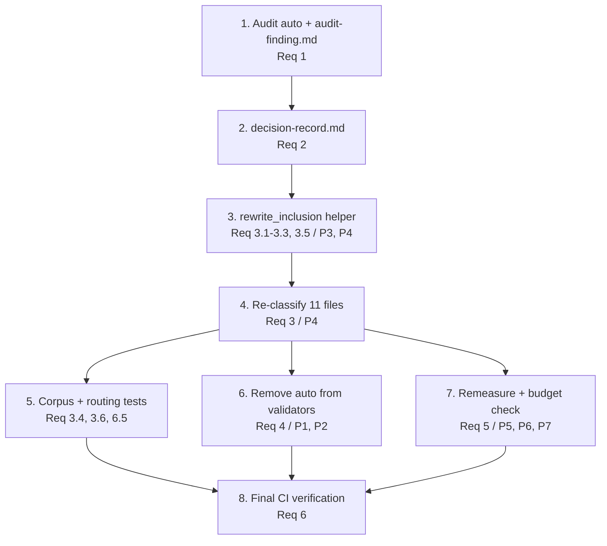

# Implementation Plan: steering-inclusion-auto-audit

## Overview

This plan sequences the audit as a linear pipeline: verify the runtime behavior of
`inclusion: auto` (Req 1) → decide a standard mode per file (Req 2) → re-classify
the eleven files (Req 3) → align the validators (Req 4) → realign budget accounting
(Req 5) → confirm CI and workflow behavior (Req 6). Each stage produces an artifact
or code change the next stage depends on, so downstream work rests on established
fact rather than assumption.

All code is Python 3.11+, standard-library only. Property-based tests use pytest +
Hypothesis, live in `senzing-bootcamp/tests/`, and are tagged with a comment of the
form `Feature: steering-inclusion-auto-audit, Property N: <text>`. The
`Audit_Finding` and `Decision_Record` artifacts live in this spec folder
(`.kiro/specs/steering-inclusion-auto-audit/`) and never ship under
`senzing-bootcamp/`.

## Task Dependency Graph

## Tasks

- [x] 1. Perform the runtime audit of `inclusion: auto` and record the Audit_Finding
  - Consult authoritative Kiro steering documentation first; if it defines the handling of an unrecognized/`auto` inclusion value, record the documented `Runtime_Behavior` plus a concrete citation (documentation title + section/locator).
  - If documentation does not define `auto`, run the three-condition runtime probe: author a single throwaway steering file declaring `inclusion: auto` with a unique sentinel string in its body and a plausible `fileMatchPattern` target, then observe sentinel presence across (a) an idle session, (b) a session editing a plausibly-matching file, and (c) a session with an explicit reference. Map the observation to exactly one value of `{loads-always, loads-on-file-match, loads-manual-only, ignored}`. This is interactive runtime observation, NOT an automated pytest case.
  - Delete the throwaway probe file after observation; it MUST NOT be committed anywhere under `senzing-bootcamp/`.
  - Write `.kiro/specs/steering-inclusion-auto-audit/audit-finding.md` recording the single `Runtime_Behavior` value, the evidence source (`documentation` or `runtime-test`), the citation or probe observations + mapping conclusion, the verification date, and a Kiro version identifier (or environment description if no version is available). Where the behavior is `loads-always`, state the resulting `Baseline_Footprint` as the summed measured `token_count` of the always-loaded files with the eleven Auto_Files counted as always-loaded.
  - _Requirements: 1.1, 1.2, 1.3, 1.4, 1.5, 6.4_

- [x] 2. Produce the Decision_Record mapping all eleven Auto_Files to standard modes
  - Write `.kiro/specs/steering-inclusion-auto-audit/decision-record.md` with one entry per Auto_File (agent-behavior-rules.md, agent-context-management.md, conversation-protocol.md, design-patterns.md, file-placement.md, mcp-response-caching.md, module-prerequisites.md, project-structure.md, qa-transcript.md, session-resume.md, verbosity-control.md).
  - For each file record: target mode from `{always, fileMatch, manual}`, intended loading condition (`every-session` | `on-file-match` | `on-explicit-ref`), and a written rationale tying the condition to the mode. For `fileMatch` entries specify a single non-empty glob; for `always` entries include the measured `token_count` in the projected baseline total.
  - Apply the audit-contingency rule from the design: if the Audit_Finding is `loads-always`, map all eleven files to `always` (Req 6.3 preservation); otherwise use the provisional 3×`always` / 1×`fileMatch` / 7×`manual` split. Record which audit branch produced the final assignment and the projected `Baseline_Footprint` total.
  - _Requirements: 2.1, 2.2, 2.3, 2.4, 2.5, 2.6_

- [x] 3. Implement and test the `rewrite_inclusion` frontmatter-rewrite helper
  - [x] 3.1 Implement `rewrite_inclusion(content, mode, file_match_pattern=None) -> str` as a stdlib-only pure function in a test helper module under `senzing-bootcamp/tests/`.
    - Operate only on the leading `---`-fenced frontmatter block; copy the body after the closing fence through byte-for-byte unchanged.
    - Replace only the value on the existing `inclusion:` line; leave `description:` and its continuation lines untouched. For `mode == "fileMatch"`, ensure a single `fileMatchPattern:` line equal to the pattern exists (added directly after `inclusion:` if absent); for other modes inject none.
    - Raise `ValueError` when `mode` is outside `{always, fileMatch, manual}` or when `fileMatch` is requested without a non-empty pattern.
    - _Requirements: 3.1, 3.2, 3.3, 3.5_

  - [x] 3.2 Write property test for body and description preservation
    - **Property 3: Re-classification preserves body and description**
    - Generate frontmatter with description present/absent, quoted, multi-line, plus extra keys, and arbitrary bodies (fenced code, unicode, trailing whitespace); assert body and description are byte-identical after rewrite and description absence is preserved.
    - **Validates: Requirements 3.2, 3.5**

  - [x] 3.3 Write property test for assigned standard mode output
    - **Property 4: Re-classification yields the assigned standard mode**
    - Assert output `inclusion` equals the assigned mode drawn from `{always, fileMatch, manual}`, `fileMatchPattern` equals the decided glob for `fileMatch`, and the result never contains `inclusion: auto`.
    - **Validates: Requirements 3.1, 3.3, 3.6**

  - [x] 3.4 Write unit tests for `rewrite_inclusion` error handling
    - Assert `ValueError` on an out-of-set mode and on `fileMatch` without a non-empty pattern.
    - _Requirements: 3.1, 3.3_

- [x] 4. Re-classify the eleven Auto_Files to their decided standard modes
  - Apply the Decision_Record assignments to each of the eleven steering files in `senzing-bootcamp/steering/` (agent-behavior-rules.md, agent-context-management.md, conversation-protocol.md, design-patterns.md, file-placement.md, mcp-response-caching.md, module-prerequisites.md, project-structure.md, qa-transcript.md, session-resume.md, verbosity-control.md), using `rewrite_inclusion` as the reference mechanism.
  - Set each file's `inclusion` to its decided mode; preserve `description` exactly (and keep it absent for project-structure.md, which has none); add `fileMatchPattern` equal to the decided glob for any `fileMatch` file; leave each Markdown body byte-identical.
  - Do not modify the `steering-index.yaml` keyword routing entries for these files.
  - _Requirements: 3.1, 3.2, 3.3, 3.4, 3.5, 3.6_

- [x] 5. Verify the re-classification corpus and preserved routing
  - [x] 5.1 Write a corpus invariant test
    - Scan every `senzing-bootcamp/steering/*.md` via the existing `parse_inclusion` / `parse_frontmatter` helpers and assert no file returns `auto` and every file returns a value in `{always, fileMatch, manual}`.
    - _Requirements: 3.6, 6.5_

  - [x] 5.2 Write a keyword-routing preservation test
    - Assert the `steering-index.yaml` `keywords:` block still routes every previously keyword-routed Auto_File to its file after re-classification (routing entries unchanged).
    - _Requirements: 3.4_

- [x] 6. Remove `auto` from the inclusion validators
  - [x] 6.1 Remove `"auto"` from `VALID_INCLUSIONS` in `lint_steering.py` and from the local accepted set in `validate_power.py`'s `check_steering_files`, leaving each exactly `{"always", "fileMatch", "manual"}` compared as case-sensitive exact strings. Keep both stdlib-only.
    - _Requirements: 4.1, 4.2, 4.3, 4.4, 4.5_

  - [x] 6.2 Write property test for validator acceptance and failure naming
    - **Property 1: Inclusion validator acceptance and failure naming**
    - Draw standard values, `auto`, mixed-case, empty/whitespace, arbitrary unicode, and a "missing" sentinel; materialize a synthetic PII-free steering file in a temp dir and assert each validator accepts iff the value is exactly in `{always, fileMatch, manual}` and otherwise reports a failure naming the file and value.
    - **Validates: Requirements 4.1, 4.2**

  - [x] 6.3 Write property test for validator parity
    - **Property 2: Validator parity across both scripts**
    - For every drawn candidate value, assert `validate_power.py` and `lint_steering.py` reach the same accept/reject verdict.
    - **Validates: Requirements 4.3**

  - [x] 6.4 Write unit test for validator exit code
    - Run each validator over a corpus containing a single invalid file and assert a non-zero exit / non-passing result.
    - _Requirements: 4.4_

- [x] 7. Realign budget accounting via remeasurement
  - [x] 7.1 Run `measure_steering.py` in update mode to refresh `steering-index.yaml` `file_metadata` and `budget.total_tokens` after the frontmatter edits, then run `measure_steering.py --check` and confirm the always-loaded footprint is within the configured ceiling under the finalized `always` set.
    - _Requirements: 5.1, 5.2, 5.3, 5.4_

  - [x] 7.2 Confirm/extend property tests for budget accounting
    - **Property 5: Baseline_Footprint equals the measured always-loaded sum** (reuse `test_always_loaded_budget_check.py`)
    - **Property 6: Over-budget decision matches the configured ceiling boundary** (reuse `test_always_loaded_budget_check.py`)
    - **Property 7: Token count and size category reconciliation** (reuse/extend `test_measure_steering.py`)
    - Add a small assertion confirming the post-reclassification corpus still passes `--check`.
    - **Validates: Requirements 5.1, 5.2, 5.3, 5.4**

  - [x] 7.3 Write baseline scenario arithmetic unit test
    - Assert the stated `loads-always` footprint (~24,830) and the projected always-set baseline equal the measured sums read from the index.
    - _Requirements: 1.5, 2.5_

- [x] 8. Checkpoint — final CI and regression verification
  - Run the full local equivalent of the CI gates (`validate_power.py`, `measure_steering.py --check`, `validate_commonmark.py`, `lint_steering.py`, `sync_hook_registry.py --verify`, then `pytest`) and confirm every check passes with zero failures.
  - Confirm every steering file that ships under `senzing-bootcamp/` declares an inclusion mode in `{always, fileMatch, manual}` and that files always-loaded before the change (per the Audit_Finding) remain `always` after.
  - Ensure all tests pass, ask the user if questions arise.
  - _Requirements: 6.1, 6.2, 6.3, 6.4, 6.5_

## Notes

- Tasks marked with `*` are optional test sub-tasks and can be skipped for a faster MVP; core implementation tasks are never optional.
- Each task references specific requirement IDs and, where applicable, the correctness property it implements or validates.
- Task 1 involves interactive runtime observation (not automated pytest); the throwaway probe file must never be committed.
- Properties 1–4 are new tests; Properties 5–7 reuse/extend the existing `test_always_loaded_budget_check.py` and `test_measure_steering.py` suites.
- The sequence is strict: audit → decide → re-classify → (validators + budget) → CI verification.
