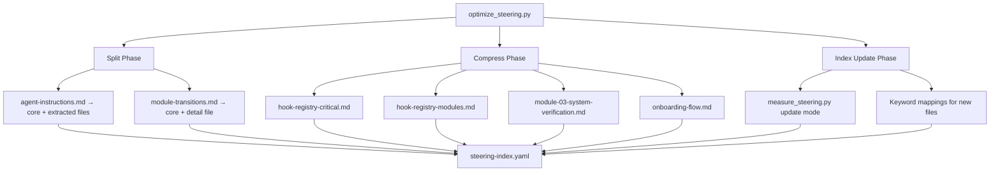

# Design Document: Steering Optimization

## Overview

This feature optimizes the senzing-bootcamp Kiro Power's steering file organization to reduce always-on context consumption while preserving all behavioral correctness. The optimization applies three strategies:

1. **Splitting** — Extract context-specific sections from always-on files into auto/manual files loaded on demand
2. **Compression** — Apply Refine-style optimization (tables, shorthand, structured formats) to large manual files
3. **Index synchronization** — Update `steering-index.yaml` to reflect all changes and pass CI validation

The design produces a Python script (`optimize_steering.py`) that performs all transformations programmatically, ensuring reproducibility and CI compatibility.

## Architecture



### Design Decisions

1. **Single script orchestrator** — A single `optimize_steering.py` script coordinates all transformations rather than manual edits. This ensures reproducibility and allows CI to verify the optimization can be re-applied cleanly.

2. **In-place file modification** — Compressed files replace originals at the same path. This avoids breaking existing cross-references in other steering files and hooks.

3. **Reuse existing `measure_steering.py`** — Token counting and index updates use the existing script rather than reimplementing. The optimizer calls it as a subprocess after all file changes are complete.

4. **Rule extraction via marker parsing** — The splitter identifies extractable sections by H2/H3 headings and moves complete sections to destination files. Dispatch pointers are inserted at the extraction point.

5. **Compression via structural transformation** — The compressor converts prose to tables/bullets using regex-based pattern matching on common prose structures (lists of 3+ items, repeated "WHEN X THEN Y" patterns, verbose explanations with inline examples).

## Components and Interfaces

### Component 1: `optimize_steering.py` (Orchestrator)

**Location:** `senzing-bootcamp/scripts/optimize_steering.py`

**Responsibilities:**
- Parse CLI arguments (steering directory, index path, dry-run mode)
- Execute split phase, compress phase, and index update phase in sequence
- Report results (files modified, token savings, any failures)

**Interface:**
```python
def main(argv: list[str] | None = None) -> int:
    """Entry point. Returns 0 on success, 1 on failure."""

def optimize(steering_dir: Path, index_path: Path, dry_run: bool = False) -> OptimizeResult:
    """Run all optimization phases. Returns result with metrics."""
```

### Component 2: `SplitEngine` (Section Extraction)

**Location:** Within `optimize_steering.py`

**Responsibilities:**
- Parse always-on files into sections (by H2/H3 headings)
- Identify sections marked for extraction (configured via a mapping)
- Write extracted sections to destination files (new or append)
- Insert dispatch pointers in the source file
- Verify line count constraints on resulting core files

**Interface:**
```python
@dataclass
class ExtractionRule:
    """Defines how a section is extracted from a source file."""
    source_heading: str          # H2/H3 heading text to match
    destination_file: str        # Target filename (existing or new)
    append: bool = False         # True = append to existing file
    dispatch_pointer: str = ""   # Pointer text for source file

@dataclass
class SplitResult:
    """Result of splitting a file."""
    source_path: Path
    core_line_count: int         # Non-blank lines in resulting core
    extracted_sections: list[str]
    destination_files: list[Path]
    dispatch_pointers: list[str]

def split_always_on_file(
    source_path: Path,
    rules: list[ExtractionRule],
    steering_dir: Path,
) -> SplitResult:
    """Extract sections from an always-on file per the given rules."""
```

### Component 3: `CompressEngine` (Refine-Style Optimization)

**Location:** Within `optimize_steering.py`

**Responsibilities:**
- Read a steering file and identify compressible regions
- Preserve all markers verbatim (⛔, 👉, hook names, step numbers)
- Convert prose paragraphs to tables/bullets
- Remove filler words, transitional phrases, redundant context
- Verify token reduction targets are met
- Report if targets cannot be achieved without semantic loss

**Interface:**
```python
@dataclass
class CompressTarget:
    """Defines compression target for a file."""
    filename: str
    max_token_ratio: float  # e.g., 0.70 means ≤70% of original

@dataclass
class CompressResult:
    """Result of compressing a file."""
    path: Path
    original_tokens: int
    compressed_tokens: int
    ratio: float
    target_met: bool
    markers_preserved: bool

def compress_file(
    file_path: Path,
    target: CompressTarget,
) -> CompressResult:
    """Compress a file using Refine-style optimization."""
```

### Component 4: `IndexUpdater` (Steering Index Synchronization)

**Location:** Within `optimize_steering.py` (delegates to `measure_steering.py`)

**Responsibilities:**
- Run `measure_steering.py` in update mode to regenerate file_metadata and budget
- Add keyword mappings for new files
- Verify budget.total_tokens consistency

**Interface:**
```python
def update_index(
    steering_dir: Path,
    index_path: Path,
    new_files: list[Path],
    keyword_mappings: dict[str, str],
) -> None:
    """Update steering-index.yaml after all file changes."""
```

### Component 5: `RulePreserver` (Behavioral Correctness Validator)

**Location:** Within `optimize_steering.py`

**Responsibilities:**
- Extract all behavioral rule markers from original files before optimization
- After optimization, verify all markers appear in the output file set
- Count distinct rules by category and verify counts match
- Flag any missing rules as optimization failures

**Interface:**
```python
@dataclass
class RuleInventory:
    """Inventory of behavioral rules in a file set."""
    gate_markers: list[str]       # Lines containing ⛔
    question_markers: list[str]   # Lines containing 👉
    mcp_rules: list[str]          # MCP-first invariant statements
    hook_rules: list[str]         # Hook creation/naming rules
    file_rules: list[str]         # File placement rules
    
    @property
    def total_count(self) -> int:
        return sum(len(getattr(self, f)) for f in self.__dataclass_fields__)

def extract_rule_inventory(file_paths: list[Path]) -> RuleInventory:
    """Extract all behavioral rules from a set of files."""

def verify_preservation(
    original: RuleInventory,
    optimized: RuleInventory,
) -> list[str]:
    """Compare inventories, return list of missing rules."""
```

## Data Models

### ExtractionConfig (agent-instructions.md split)

```python
AGENT_INSTRUCTIONS_EXTRACTIONS = [
    ExtractionRule(
        source_heading="### SDK Method Discovery",
        destination_file="mcp-usage-reference.md",
        append=True,
        dispatch_pointer="For SDK method discovery: load `mcp-usage-reference.md`",
    ),
    ExtractionRule(
        source_heading="## Track Switching",
        destination_file="track-switching.md",
        append=True,
        dispatch_pointer="For track switching triggers: load `track-switching.md`",
    ),
    ExtractionRule(
        source_heading="### Question_Pending File Format",
        destination_file="conversation-protocol.md",
        append=True,
        dispatch_pointer="For .question_pending format: load `conversation-protocol.md`",
    ),
    ExtractionRule(
        source_heading="## Module Transition Execution",
        destination_file="module-transitions.md",
        append=True,
        dispatch_pointer="For transition execution: see `module-transitions.md`",
    ),
]
```

### CompressionTargets

```python
COMPRESSION_TARGETS = [
    CompressTarget(filename="hook-registry-critical.md", max_token_ratio=0.70),
    CompressTarget(filename="hook-registry-modules.md", max_token_ratio=0.70),
    CompressTarget(filename="module-03-system-verification.md", max_token_ratio=0.75),
    CompressTarget(filename="onboarding-flow.md", max_token_ratio=0.75),
]
```

### ModuleTransitionsSplit

```python
# Sections to keep in always-on module-transitions.md (≤60 lines)
TRANSITIONS_KEEP = [
    "Module Start Banner",
    "Journey Map (at module start)",
    "Before/After Framing (at module start)",
    "Step-Level Progress",
    "Module Completion",
    "Transition Integrity",
    "Confirmation Response Requirements",
]

# Sections to extract to module-transitions-detail.md (auto inclusion)
TRANSITIONS_EXTRACT = [
    "Quality Feedback Loop",
    "Sub-Step Convention",
]
```

### Token Counting (consistent with measure_steering.py)

```python
def token_count(text: str) -> int:
    """Approximate token count: round(len(text) / 4)."""
    return round(len(text) / 4)

def size_category(token_count: int) -> str:
    if token_count < 500:
        return "small"
    elif token_count <= 2000:
        return "medium"
    else:
        return "large"
```

## Correctness Properties

*A property is a characteristic or behavior that should hold true across all valid executions of a system — essentially, a formal statement about what the system should do. Properties serve as the bridge between human-readable specifications and machine-verifiable correctness guarantees.*

### Property 1: Behavioral rule preservation across optimization

*For any* behavioral rule marker (⛔ gate, 👉 question protocol, SHALL/NEVER/MUST/ALWAYS directive, hook definition, or file placement rule) present in the original steering file set, that marker SHALL appear in the optimized output file set (the union of all modified and newly created files), and the total count of distinct behavioral rules in the optimized set SHALL equal the count in the original set.

**Validates: Requirements 1.2, 1.6, 2.5, 3.5, 6.1, 6.2, 6.8**

### Property 2: Token reduction for always-on files

*For any* always-on steering file (files with `inclusion: always` frontmatter) that undergoes Refine-style optimization, the optimized file's token count (calculated as `round(len(content) / 4)`) SHALL be at most 85% of the original file's token count, representing a minimum 15% reduction.

**Validates: Requirements 4.3**

### Property 3: Steering index completeness

*For any* `.md` file present in the `senzing-bootcamp/steering/` directory, the `file_metadata` section of `steering-index.yaml` SHALL contain an entry for that file with a `token_count` value within 10% of `round(len(file_content) / 4)` and a `size_category` matching the thresholds (small < 500, medium 500–2000, large > 2000).

**Validates: Requirements 5.1, 5.2**

### Property 4: Budget total consistency

*For any* valid `steering-index.yaml` after optimization, the `budget.total_tokens` value SHALL equal the arithmetic sum of all `token_count` values in the `file_metadata` section.

**Validates: Requirements 5.5**

### Property 5: YAML frontmatter validity for new files

*For any* newly created steering file, the file SHALL begin with a YAML frontmatter block (delimited by `---`) containing at minimum an `inclusion` field (with value `always`, `auto`, `fileMatch`, or `manual`) and a `description` field (non-empty string).

**Validates: Requirements 7.4**

### Property 6: Index referential integrity

*For any* filename referenced in the `modules`, `file_metadata`, or `keywords` sections of `steering-index.yaml`, a corresponding `.md` file SHALL exist in the `senzing-bootcamp/steering/` directory.

**Validates: Requirements 7.5**

### Property 7: Gate and question marker verbatim preservation

*For any* line containing a ⛔ or 👉 marker in the original steering files, the exact same line (character-for-character, including the marker and its associated step number or instruction) SHALL appear in the corresponding optimized output file, with no alteration to the marker text or its immediate context (the step number or gate condition on the same line).

**Validates: Requirements 3.7, 6.1, 6.2**

## Error Handling

| Error Condition | Handling Strategy |
|---|---|
| Compression target not achievable | Report file, achieved count, and target count. Do NOT discard semantic content. Exit with warning, not failure. |
| Source heading not found during extraction | Skip that extraction rule, log warning. Continue with remaining rules. |
| Destination file doesn't exist for append | Create the file with appropriate YAML frontmatter before appending. |
| Line count constraint exceeded after split | Report violation. The optimizer does not force compliance by removing content — it reports the issue for manual resolution. |
| `measure_steering.py` fails | Propagate the error. The optimizer cannot proceed without valid index state. |
| YAML frontmatter missing from source file | Preserve file as-is, log warning. Do not attempt to add frontmatter. |
| Marker count mismatch after optimization | Treat as optimization failure. Report which markers are missing. Exit with code 1. |
| File referenced in index doesn't exist | Detected by `validate_power.py`. The optimizer ensures it doesn't create this condition. |

## Testing Strategy

### Property-Based Tests (Hypothesis)

The test file `senzing-bootcamp/tests/test_steering_optimization_properties.py` implements all correctness properties using Hypothesis with `@settings(max_examples=100)`.

**Test structure:**
- `class TestProperty1RulePreservation` — Generates subsets of rule markers from originals, verifies all appear in optimized output
- `class TestProperty2TokenReduction` — Tests always-on files meet ≥15% reduction
- `class TestProperty3IndexCompleteness` — Draws random .md files from steering dir, verifies index entries
- `class TestProperty4BudgetConsistency` — Verifies sum invariant holds
- `class TestProperty5FrontmatterValidity` — Tests new files have valid frontmatter
- `class TestProperty6ReferentialIntegrity` — Draws filenames from index, verifies existence
- `class TestProperty7MarkerPreservation` — Draws marker lines from originals, verifies verbatim match in output

**PBT library:** Hypothesis (already in project dependencies)
**Minimum iterations:** 100 per property
**Tag format:** `Feature: steering-optimization, Property N: [property text]`

### Unit Tests (Example-Based)

The test file `senzing-bootcamp/tests/test_steering_optimization_unit.py` covers:

- Line count constraints (agent-instructions.md ≤ 80, module-transitions.md ≤ 60)
- Token count targets for each compressed file
- Specific section extraction (SDK Method Discovery → mcp-usage-reference.md)
- Dispatch pointer presence in core files
- New file frontmatter structure
- Keyword mappings in steering-index.yaml for new files

### Integration/Smoke Tests

- Run `measure_steering.py --check` → exit 0
- Run `validate_commonmark.py` → exit 0
- Run `validate_power.py` → exit 0
- Full CI pipeline passes (tested via GitHub Actions)

### Test Execution

```bash
# Run all optimization tests
python -m pytest senzing-bootcamp/tests/test_steering_optimization_properties.py -v
python -m pytest senzing-bootcamp/tests/test_steering_optimization_unit.py -v

# Run CI validation scripts
python senzing-bootcamp/scripts/measure_steering.py --check
python senzing-bootcamp/scripts/validate_commonmark.py
python senzing-bootcamp/scripts/validate_power.py
```
