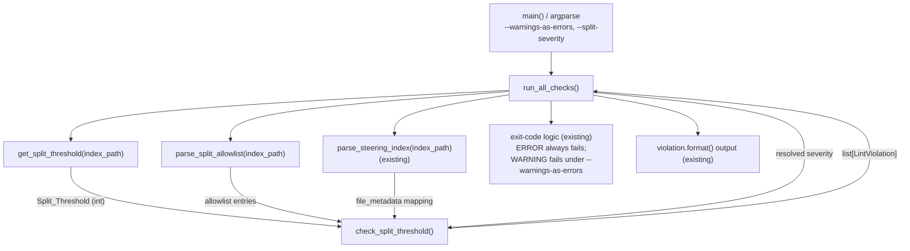

# Design Document

## Overview

This feature adds a new lint rule — the **Split_Check** — to
`senzing-bootcamp/scripts/lint_steering.py`. The rule enforces the
`budget.split_threshold_tokens` budget declared in
`senzing-bootcamp/steering/steering-index.yaml`: any measured steering file
whose recorded `token_count` exceeds the configured threshold is flagged as a
candidate for splitting into phases via `split_steering.py`, unless it is
explicitly exempted on an allowlist.

The Split_Check is deliberately modeled on the existing **router-ceiling**
machinery in the same linter (`get_router_ceiling` + `check_router_convention`),
which already enforces a companion budget so Router_Root files stay thin. Reusing
that shape keeps the linter coherent: the threshold is read from the index with a
localized regular-expression lookup, classification is a pure function over the
already-parsed `file_metadata` mapping, missing token counts are reported the same
way `check_router_convention` reports an unmeasured root, and every finding is
emitted through the existing `LintViolation` dataclass so output formatting and
exit-code handling are unchanged.

Three design decisions distinguish the Split_Check from the router rule:

1. **Configurable severity.** The requirements defer the ERROR-vs-WARNING choice
   to design (Requirement 3). The Split_Check defaults to `WARNING` (advisory),
   promotable to `ERROR` through a validated severity override, and relies on the
   existing `--warnings-as-errors` flag for soft-gate enforcement. This lets the
   team adopt soft warnings now and promote to a hard gate later without changing
   the rule.
2. **An allowlist with justifications.** Intentionally large files can be exempted
   by listing them in the index with a non-empty justification string (1–280
   characters). Stale or malformed allowlist entries are themselves reported, so
   the exemption mechanism cannot silently rot.
3. **No hardcoded threshold.** The only constant permitted in the linter is the
   `Default_Threshold` fallback of 5000 tokens, used when the index is missing or
   the configured value is invalid.

The rule runs inside the existing `run_all_checks` aggregation, so it executes on
every pull request through the unchanged "Lint steering files" CI step
(`.github/workflows/validate-power.yml`) across the Python 3.11/3.12/3.13 matrix —
no new workflow step is added.

### Goals

- Read the Split_Threshold from the index (never hardcode it, except the 5000
  fallback).
- Classify every `file_metadata` entry against the threshold using its recorded
  `token_count`.
- Support a justified allowlist for intentionally large files.
- Support a default-soft, promotable-to-hard severity.
- Run inside the existing CI lint gate with no workflow changes.
- Surface the known over-threshold files (`hook-registry-critical.md`,
  `graduation.md`, `module-05-phase2-data-mapping.md`,
  `module-01-phase1-discovery.md`).

### Non-Goals

- Actually splitting files (that remains `split_steering.py`'s job).
- Recomputing token counts (those come from `measure_steering.py` and are read
  from the index as-is).
- Adding a third-party YAML dependency (minimal regex/line parsing only, per
  project conventions).

## Architecture

The Split_Check is composed of small, single-responsibility functions that mirror
the router-ceiling rule, then wired into the existing aggregation. Pure
classification logic is isolated from I/O so it can be exercised directly by
property-based tests.



### Data flow

1. `run_all_checks` reads the Split_Threshold (`get_split_threshold`), the
   allowlist (`parse_split_allowlist`), and the already-parsed `file_metadata`
   (from the existing `parse_steering_index` call).
2. It resolves the severity (default `WARNING`, or an override validated against
   `{WARNING, ERROR}`).
3. It calls the pure `check_split_threshold(file_metadata, split_threshold,
   allowlist, severity)`, which returns a list of `LintViolation`.
4. The returned violations are merged into the aggregate list; the existing
   exit-code and output code handle them with no change.

### Why mirror the router rule

`check_router_convention` already establishes the exact patterns this feature
needs: a localized-regex budget reader (`get_router_ceiling`), an integer
`token_count` comparison with strict-greater-than semantics, a MISSING branch when
a file has no measurable count, and ERROR-level `LintViolation` emission keyed to
the index path. The Split_Check is the same shape with a different budget, an
added allowlist filter, and a configurable severity. Mirroring minimizes
cognitive load for maintainers and guarantees output/exit-code consistency.

## Components and Interfaces

All components are added to `senzing-bootcamp/scripts/lint_steering.py`. Function
signatures follow project conventions (`from __future__ import annotations`,
lowercase generics, `X | None`, Google-style docstrings, 100-char lines).

### `get_split_threshold(index_path: Path) -> int`

Reads `budget.split_threshold_tokens` from the index using a localized regular
expression, mirroring `get_router_ceiling` and `measure_steering.py`
(`re.search(r"split_threshold_tokens:\s*(\d+)", content)`).

Behavior:

- If the index file does not exist → return `DEFAULT_SPLIT_THRESHOLD` (5000).
- Scan matches in document order (`re.finditer`); return the **first** match whose
  captured value parses to a **positive integer (≥ 1)**.
- If no match is a positive integer (key absent; value non-numeric, zero, or
  negative) → return `DEFAULT_SPLIT_THRESHOLD` (5000).

The `\d+` capture inherently excludes non-numeric and negative values (the leading
`-` is not captured); zero is excluded by the explicit `≥ 1` check. Returning the
first positive-integer match satisfies the "first matched value when the key
appears more than once" requirement.

A module-level constant `DEFAULT_SPLIT_THRESHOLD = 5000` is the **only** permitted
hardcoded threshold value.

### `parse_split_allowlist(index_path: Path) -> list[SplitAllowlistEntry]`

Parses the `split_allowlist:` section of the index using the same minimal,
indentation-based line parsing as `parse_steering_index` (no PyYAML). Each entry
maps an exact, case-sensitive steering filename to a justification string.

Behavior:

- If the index file does not exist, or the `split_allowlist:` section is absent or
  empty → return `[]`.
- For each `  <filename>: <justification>` line under the section, produce a
  `SplitAllowlistEntry(filename, justification)`. The raw justification (including
  the empty string when omitted) is preserved so `check_split_threshold` can
  validate it; parsing does not itself reject malformed entries.

### `check_split_threshold(file_metadata, split_threshold, allowlist, severity="WARNING") -> list[LintViolation]`

The pure classification rule. Mirrors `check_router_convention`'s structure and
MISSING handling. Inputs:

- `file_metadata: dict` — the `file_metadata` mapping from the index (filename →
  `{"token_count": int|str, "size_category": str}`).
- `split_threshold: int` — the resolved Split_Threshold.
- `allowlist: list[SplitAllowlistEntry]` — parsed allowlist entries.
- `severity: str` — `"WARNING"` (default) or `"ERROR"`; the level used for
  over-threshold violations.

Algorithm (each `file_metadata` entry evaluated exactly once):

1. **Validate allowlist entries.** For each allowlist entry, check the
   justification is present and 1–280 characters. Invalid entries produce a
   violation (Requirement 4.6) and are **excluded** from the effective exemption
   set, so their files remain enforced. Valid entries form the
   `exempt_filenames` set.
2. **Stale allowlist entries.** For each allowlist filename not present in
   `file_metadata`, produce a violation identifying the obsolete exemption
   (Requirement 4.5). Remaining entries are unaffected.
3. **Classify each file.** Iterating `file_metadata` in sorted filename order
   (deterministic output):
   - If the filename is in `exempt_filenames` → no over-threshold violation
     (Requirement 4.2). (A missing/invalid count on an exempt file is also
     skipped, since the file is intentionally unmanaged.)
   - Else resolve `token_count`. If it is absent or not an `int` → produce one
     MISSING violation naming the file and stating it cannot be classified
     (Requirement 2.4), mirroring `check_router_convention`.
   - Else if `token_count > split_threshold` → produce exactly one over-threshold
     violation at `severity` level, naming the filename, the integer
     `token_count`, and the Split_Threshold (Requirement 2.2).
   - Else (`token_count <= split_threshold`, including equality) → no violation
     (Requirement 2.3).

Allowlist-validation and stale-entry violations use `ERROR` level (they indicate a
misconfigured index, analogous to other index-integrity ERRORs); over-threshold
violations use the configurable `severity`. All violations are emitted via
`LintViolation(level, file=str(INDEX_PATH), line=0, message=...)`.

### `normalize_split_severity(value: str | None) -> str`

Centralizes severity validation (Requirement 3.7). Returns `"WARNING"` when
`value` is `None` (no override). Returns the canonical `"WARNING"`/`"ERROR"` for a
valid override. Raises `ValueError` for any other value so the caller surfaces an
error indication rather than silently defaulting.

### CLI / `run_all_checks` integration

- `main()` adds an argument
  `--split-severity`, `choices=["WARNING", "ERROR"]`, `default="WARNING"`.
  argparse's `choices` rejects any other value with a non-zero exit and an error
  message, satisfying Requirement 3.7 at the CLI boundary;
  `normalize_split_severity` enforces the same invariant for any non-CLI caller.
- `run_all_checks` gains a `split_severity: str = "WARNING"` parameter, threaded
  from `args.split_severity`. After the existing router block it adds:

  ```python
  split_threshold = get_split_threshold(index_path)
  split_allowlist = parse_split_allowlist(index_path)
  violations.extend(check_split_threshold(
      index_data.get("file_metadata", {}),
      split_threshold,
      split_allowlist,
      severity=normalize_split_severity(split_severity),
  ))
  ```

- The existing exit-code logic is unchanged: an `ERROR`-level Split_Check
  violation always yields a non-zero exit; a `WARNING`-level violation yields
  non-zero only under `--warnings-as-errors`. This satisfies Requirements 3.2,
  3.4, 3.5, 5.3, and 5.4 without new exit-code code.

### CI integration

No change to `.github/workflows/validate-power.yml`. The "Lint steering files"
step already runs `python senzing-bootcamp/scripts/lint_steering.py`; because the
Split_Check executes inside `run_all_checks`, it runs automatically on the
3.11/3.12/3.13 matrix (Requirements 5.1, 5.2). With the current corpus and an
empty allowlist, the known over-threshold files are reported (Requirement 5.6); at
the default `WARNING` severity they are advisory unless `--warnings-as-errors` is
supplied.

## Data Models

### `SplitAllowlistEntry` (new dataclass)

```python
@dataclass
class SplitAllowlistEntry:
    """One Split_Check allowlist exemption parsed from the steering index."""

    filename: str        # exact, case-sensitive steering filename
    justification: str    # raw justification text (validated downstream)
```

### `LintViolation` (existing — reused unchanged)

```python
@dataclass
class LintViolation:
    level: str   # "ERROR" or "WARNING"
    file: str    # relative path to the file (str(INDEX_PATH) for Split_Check)
    line: int    # 0 (index-level finding, matching check_router_convention)
    message: str  # names file, token_count, and Split_Threshold as applicable
```

### Steering index schema additions

The threshold already exists in the `budget` block:

```yaml
budget:
  split_threshold_tokens: 5000   # read by get_split_threshold
  router_ceiling: 1000
```

The allowlist is a new top-level section, parsed by `parse_split_allowlist`
(filename → justification, 1–280 chars):

```yaml
split_allowlist:
  hook-registry-critical.md: "Canonical hook ownership registry; splitting would fragment the single source of truth agents depend on."
```

`file_metadata` is consumed as already parsed by `parse_steering_index`:

```yaml
file_metadata:
  graduation.md:
    token_count: 5394
    size_category: large
```

### Threshold resolution (decision table)

| Index / value condition                              | Resolved Split_Threshold |
|------------------------------------------------------|--------------------------|
| Index file missing                                   | 5000 (Default)           |
| `split_threshold_tokens` absent                      | 5000 (Default)           |
| Value non-numeric (e.g. `abc`)                       | 5000 (Default)           |
| Value `0` or negative                                | 5000 (Default)           |
| Value positive integer `N`                           | `N`                      |
| Key repeated; first positive-integer value is `N`    | `N`                      |

### Classification (decision table, non-allowlisted file)

| `token_count` condition                 | Outcome                                   |
|-----------------------------------------|-------------------------------------------|
| absent or not an `int`                   | 1 MISSING violation (cannot classify)     |
| integer `> threshold`                    | 1 over-threshold violation (at severity)  |
| integer `== threshold`                   | no violation                              |
| integer `< threshold`                    | no violation                              |

## Correctness Properties

*A property is a characteristic or behavior that should hold true across all valid
executions of a system — essentially, a formal statement about what the system
should do. Properties serve as the bridge between human-readable specifications and
machine-verifiable correctness guarantees.*

The Split_Check is pure classification logic over structured input (a
`file_metadata` map, an integer threshold, and an allowlist), so it is a strong
fit for property-based testing. The properties below are derived directly from the
prework analysis; redundant criteria have been consolidated (e.g. the
strictly-greater-than rule, the "each entry once" rule, and the "none over → none
flagged" rule all collapse into the single IFF property mandated by Requirement
6.7). Exit-code behavior, CI wiring, and real-corpus assertions are intentionally
left to integration/smoke tests (see Testing Strategy).

### Property 1: Over-threshold classification is an IFF on strictly-greater-than

*For any* `file_metadata` map of files with integer `token_count` values (0 to
1,000,000), any Split_Threshold (1 to 1,000,000), and an empty allowlist, the
Split_Check produces exactly one over-threshold `LintViolation` for an entry **if
and only if** that entry's `token_count` is strictly greater than the
Split_Threshold — including the boundary case where `token_count` equals the
Split_Threshold, which produces no violation. Each entry is evaluated exactly
once, and each over-threshold violation's message contains the filename, the
integer `token_count`, and the Split_Threshold.

**Validates: Requirements 2.1, 2.2, 2.3, 2.5, 6.2, 6.3, 6.7**

### Property 2: Missing or non-integer counts yield exactly one unclassifiable violation

*For any* `file_metadata` entry whose `token_count` is absent or is not an integer
(and whose file is not exempt), the Split_Check produces exactly one
"cannot classify" `LintViolation` naming that file and produces no over-threshold
violation for it, mirroring the MISSING handling in `check_router_convention`.

**Validates: Requirements 2.4**

### Property 3: A configured positive-integer threshold is honored (first occurrence wins)

*For any* positive integer `N` (and any additional positive-integer values that
follow it) written as `budget.split_threshold_tokens` in the index,
`get_split_threshold` returns the first positive-integer value, i.e. `N`.

**Validates: Requirements 1.2, 1.6**

### Property 4: An invalid or absent threshold falls back to the Default_Threshold

*For any* `budget.split_threshold_tokens` value that is not a positive integer
(non-numeric, zero, or negative), and when the key is absent, `get_split_threshold`
returns the Default_Threshold of 5000.

**Validates: Requirements 1.5**

### Property 5: Over-threshold violations carry the configured severity

*For any* `file_metadata` map and any severity in `{WARNING, ERROR}`, every
over-threshold `LintViolation` produced by the Split_Check has its `level` field
equal to that severity; with no override the severity is `WARNING`.

**Validates: Requirements 3.1, 3.3**

### Property 6: Every emitted violation is a well-formed LintViolation

*For any* input to the Split_Check, every object it returns is a `LintViolation`
whose `level` is in `{WARNING, ERROR}`, whose `file` is a non-empty string, whose
`line` is an integer, and whose `message` is a non-empty string.

**Validates: Requirements 3.6**

### Property 7: Invalid severity overrides are rejected

*For any* string that is neither `WARNING` nor `ERROR`, `normalize_split_severity`
raises an error rather than silently returning a default.

**Validates: Requirements 3.7**

### Property 8: Exemption holds iff a file exactly (case-sensitively) matches a valid allowlist entry

*For any* over-threshold `file_metadata` entry, the Split_Check produces no
over-threshold violation for it **if and only if** its filename exactly matches
(case-sensitively) the filename of an allowlist entry with a valid justification;
files that do not match any valid allowlist entry — including the empty-allowlist
case — are evaluated against the Split_Threshold per Property 1.

**Validates: Requirements 4.2, 4.3, 4.4, 6.4**

### Property 9: Stale allowlist entries are reported while others still apply

*For any* allowlist containing one or more filenames absent from `file_metadata`,
the Split_Check produces exactly one stale-entry `LintViolation` naming each absent
filename, and the remaining (present) allowlist entries still exempt their files.

**Validates: Requirements 4.5**

### Property 10: Invalid justifications produce a violation and do not exempt

*For any* allowlist entry whose justification is empty or longer than 280
characters, the Split_Check produces a `LintViolation` naming that entry and does
**not** exempt its file, so an over-threshold file with an invalid justification is
still flagged against the Split_Threshold.

**Validates: Requirements 4.6**

### Property 11: Allowlist parsing round-trips filename/justification pairs

*For any* set of (exact case-sensitive filename, justification of 1–280
characters) pairs rendered into the `split_allowlist:` section of the index,
`parse_split_allowlist` returns entries that preserve each filename and its
justification.

**Validates: Requirements 4.1**

## Error Handling

The Split_Check treats malformed configuration as reportable findings rather than
crashes, consistent with the rest of the linter:

- **Missing index file.** `get_split_threshold` and `parse_split_allowlist` return
  the Default_Threshold (5000) and an empty allowlist respectively when the index
  does not exist. (In practice `run_all_checks` already returns an ERROR and exits
  before reaching the Split_Check when the index is absent, but the helpers remain
  defensive so they are safe to call and unit-test in isolation.)
- **Invalid threshold value.** Non-positive or non-numeric
  `split_threshold_tokens` values do not raise; they fall back to the
  Default_Threshold (Property 4).
- **Missing / non-integer `token_count`.** Reported as a single "cannot classify"
  violation per file (Property 2); the entry's existing index data is left intact.
- **Malformed allowlist entries.** A missing/empty/over-length justification yields
  a violation and leaves the file enforced (Property 10); a stale filename yields a
  violation while other entries continue to apply (Property 9). Neither aborts the
  check.
- **Invalid severity override.** `normalize_split_severity` raises `ValueError`
  (Property 7); the CLI surfaces the same condition through argparse `choices`,
  which exits non-zero with a descriptive message rather than silently defaulting.
- **No PII / secrets / external URLs** are read or emitted; the Split_Check
  operates only on filenames, integer counts, and justification text already
  present in the tracked index.

## Testing Strategy

Tests live in `senzing-bootcamp/tests/test_steering_split_threshold_enforcement.py`,
organized into test classes with `test_`-prefixed methods, and import
`lint_steering.py` via the standard `sys.path` manipulation used by the other test
files (Requirements 6.1, 6.8):

```python
_SCRIPTS_DIR = str(Path(__file__).resolve().parent.parent / "scripts")
if _SCRIPTS_DIR not in sys.path:
    sys.path.insert(0, _SCRIPTS_DIR)
from lint_steering import (
    get_split_threshold, parse_split_allowlist,
    check_split_threshold, normalize_split_severity, SplitAllowlistEntry,
)
```

### Property-based tests (Hypothesis)

Each of the 11 correctness properties is implemented as a **single** Hypothesis
property test. Per Requirement 6.7, property tests use `@given` with
`st_`-prefixed strategies and are decorated with `@settings(max_examples=20)` (an
intentional non-baseline override, as the requirement specifies). Each test is
tagged with a comment referencing its design property:

```
# Feature: steering-split-threshold-enforcement, Property 1: <property text>
```

Key strategies:

- `st_token_count()` -> `st.integers(min_value=0, max_value=1_000_000)`
- `st_threshold()` -> `st.integers(min_value=1, max_value=1_000_000)`
- `st_filename()` -> steering-like `kebab-case.md` names (exact, case-sensitive)
- `st_justification_valid()` -> `st.text(min_size=1, max_size=280)`
- `st_justification_invalid()` -> empty text or `st.text(min_size=281, max_size=400)`
- `st_file_metadata()` -> maps of filename -> `{"token_count": int}`
- `st_invalid_severity()` -> text excluding `{"WARNING", "ERROR"}`

The Property 1 test is the canonical IFF check mandated by Requirement 6.7:
generate a `token_count` (0-1,000,000) and a `threshold` (1-1,000,000), run the
Split_Check with an empty allowlist, and assert a violation is produced **iff**
`token_count > threshold`, explicitly exercising the `==` boundary.

### Unit / example tests

- Default-threshold fallback when the index file is missing and when the key is
  absent (Requirements 1.3, 1.4, 6.6).
- Empty `file_metadata` map -> zero violations (Requirement 2.6).
- argparse rejects an invalid `--split-severity` value (Requirement 3.7,
  CLI boundary).

### Integration / smoke tests

These verify wiring, exit codes, output format, and the real corpus — areas where
input variation adds no value and PBT is inappropriate:

- **Aggregation wiring:** `run_all_checks` against a temp index with a known
  over-threshold file includes a Split_Check violation in the aggregate
  (Requirement 5.1).
- **Exit codes:** WARNING-level Split_Check violations do not by themselves fail
  the linter, but do under `--warnings-as-errors`; ERROR-severity violations always
  fail (Requirements 3.2, 3.4, 3.5, 5.3, 5.4).
- **Output format:** printed lines use `LintViolation.format()` and contain the
  file path, `token_count`, and Split_Threshold (Requirement 5.5).
- **Real corpus:** running the Split_Check against the actual
  `steering-index.yaml` with an empty allowlist reports `hook-registry-critical.md`,
  `graduation.md`, `module-05-phase2-data-mapping.md`, and
  `module-01-phase1-discovery.md` (Requirement 5.6).
- **CI configuration (smoke):** the "Lint steering files" step in
  `validate-power.yml` is unchanged and the test matrix lists Python 3.11/3.12/3.13
  (Requirement 5.2); no new workflow step is introduced.

### Test execution

Tests run under the existing Hypothesis profiles and pytest harness:

```bash
# Fast local run
python -m pytest senzing-bootcamp/tests/test_steering_split_threshold_enforcement.py

# Thorough run (matches CI coverage)
HYPOTHESIS_PROFILE=thorough python -m pytest senzing-bootcamp/tests/test_steering_split_threshold_enforcement.py
```
