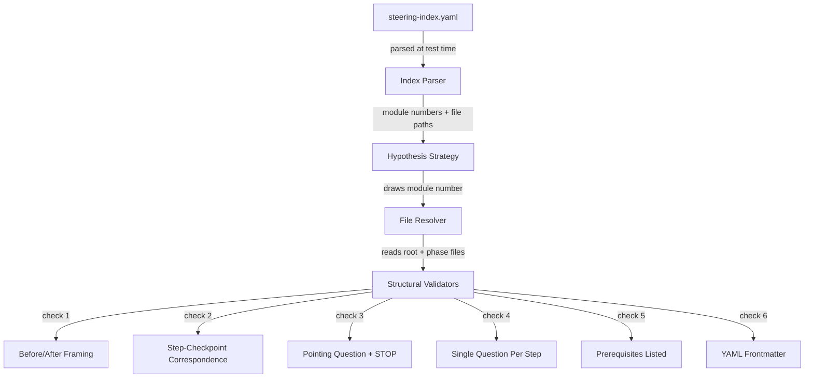

# Design Document: Steering Structural Validation

## Overview

This feature adds a property-based test suite that validates structural invariants across all module steering files in the senzing-bootcamp power. The test file lives at `senzing-bootcamp/tests/test_steering_structure_properties.py` and uses pytest + Hypothesis to draw module numbers from the steering index, resolve them to file paths, and verify six structural rules: before/after framing presence, step-checkpoint correspondence, pointing-question-followed-by-STOP, single question per step, prerequisites listed, and YAML frontmatter with `inclusion: manual`.

The steering index (`senzing-bootcamp/steering/steering-index.yaml`) is the single source of truth for which modules and files exist. New modules added to the index are automatically covered without editing the test file.

### Design Rationale

The existing test suite already has property-based tests for template conformance (`test_steering_template_properties.py`) and linting rules (`test_lint_steering_properties.py`), but those test the *linter functions* against synthetic content. This new suite tests the *actual steering files on disk* against structural invariants — it reads real files and checks real content. The Hypothesis strategy draws from the set of module numbers in the steering index, so every module is exercised across 100 test runs per property.

## Architecture



### Key Architectural Decisions

1. **Test real files, not synthetic content.** Unlike the existing template property tests that generate synthetic markdown, this suite reads the actual steering files from disk. This catches real regressions — a new module missing its prerequisites section, a refactored step losing its checkpoint, etc.

2. **Hypothesis draws module numbers, not file paths.** The strategy samples from the set of module numbers in the steering index. For each drawn number, the test resolves all associated files (root + phases). This means Hypothesis can shrink failing cases to a single module number, making failures easy to diagnose.

3. **Validators are pure functions.** Each structural check is a pure function that takes file content (string) and returns a list of violations. This keeps the validators testable independently and composable.

4. **Steering index is parsed once per session.** The index is loaded in a `@pytest.fixture(scope="session")` fixture to avoid re-parsing on every test case. The parsed data is passed to the Hypothesis strategy via `st.sampled_from`.

## Components and Interfaces

### 1. Index Parser

Parses `steering-index.yaml` and returns a structured mapping of module numbers to file paths.

```python
@dataclass
class ModuleFiles:
    """Resolved file paths for a single module."""
    module_number: int
    root_file: Path
    phase_files: list[Path]

    @property
    def all_files(self) -> list[Path]:
        """Return root file plus all phase files."""
        return [self.root_file] + self.phase_files


def parse_steering_index(index_path: Path) -> dict[int, ModuleFiles]:
    """Parse steering-index.yaml and resolve module file paths.

    Args:
        index_path: Path to steering-index.yaml.

    Returns:
        Mapping of module number to ModuleFiles.

    Raises:
        FileNotFoundError: If index_path does not exist.
        ValueError: If a file listed in the index does not exist on disk.
    """
```

The parser handles both index entry formats:
- **Simple string**: `2: module-02-sdk-setup.md` → root file only, no phases.
- **Object with phases**: `5: {root: ..., phases: {phase1: {file: ...}, ...}}` → root file + phase sub-files.

### 2. Hypothesis Strategy

```python
def st_module_number(index: dict[int, ModuleFiles]) -> st.SearchStrategy[int]:
    """Hypothesis strategy that draws from available module numbers."""
    return st.sampled_from(sorted(index.keys()))
```

### 3. Structural Validators

Each validator is a function with the signature:

```python
def check_<rule>(content: str, file_path: Path) -> list[str]:
    """Check a structural invariant against file content.

    Args:
        content: The full text content of a steering file.
        file_path: Path to the file (for error messages).

    Returns:
        List of violation descriptions. Empty list means the check passed.
    """
```

#### Validator Functions

| Function | Rule | Applies To |
|---|---|---|
| `check_before_after_framing` | Before/After section present | Root files and phase files with steps (or root covers it) |
| `check_step_checkpoint_correspondence` | Every numbered step has a checkpoint | Files with numbered steps |
| `check_pointing_question_stop` | Every 👉 question followed by STOP/WAIT | All module files |
| `check_single_question_per_step` | At most one 👉 per numbered step | Files with numbered steps |
| `check_prerequisites_listed` | Prerequisites section present | Root module files only |
| `check_yaml_frontmatter` | YAML frontmatter with `inclusion: manual` | All module files |

### 4. Regex Patterns

```python
# Numbered step: "1. **Step title**" or "1. **Check for...**"
RE_NUMBERED_STEP = re.compile(r"^(\d+)\.\s+\*\*")

# Checkpoint instruction: "**Checkpoint:** Write step N to ..."
RE_CHECKPOINT = re.compile(r"\*\*Checkpoint:\*\*.*?step\s+(\d+)", re.IGNORECASE)

# Pointing question: line containing 👉 followed by quoted text
RE_POINTING_QUESTION = re.compile(r"👉")

# Stop/Wait instruction: line containing STOP or WAIT as a directive
RE_STOP_INSTRUCTION = re.compile(r"\b(STOP|WAIT)\b")

# Before/After framing: "**Before/After**" or "**Before/After:**"
RE_BEFORE_AFTER = re.compile(r"\*\*Before/After\*\*")

# Prerequisites section: "Prerequisites" followed by colon
RE_PREREQUISITES = re.compile(r"Prerequisites\s*:", re.IGNORECASE)

# YAML frontmatter delimiters
RE_FRONTMATTER_START = re.compile(r"^---\s*$")
```

## Data Models

### ModuleFiles Dataclass

```python
@dataclass
class ModuleFiles:
    """Resolved file paths for a single module."""
    module_number: int
    root_file: Path
    phase_files: list[Path]
```

### Steering Index Structure (YAML)

The steering index has two module entry formats:

**Simple (no phases):**
```yaml
modules:
  2: module-02-sdk-setup.md
```

**Phased:**
```yaml
modules:
  5:
    root: module-05-data-quality-mapping.md
    phases:
      phase1-quality-assessment:
        file: module-05-phase1-quality-assessment.md
        token_count: 1684
        size_category: medium
        step_range: [1, 7]
```

### Validation Result

Validators return `list[str]` — a list of human-readable violation messages. An empty list means the check passed. This keeps the interface simple and avoids coupling to any specific violation dataclass.


## Correctness Properties

*A property is a characteristic or behavior that should hold true across all valid executions of a system — essentially, a formal statement about what the system should do. Properties serve as the bridge between human-readable specifications and machine-verifiable correctness guarantees.*

The following properties are derived from the acceptance criteria prework analysis. Each property is universally quantified over module numbers drawn from the steering index. Requirements 1.1–1.2 are subsumed by 1.3, requirements 2.1–2.3 by 2.4, requirements 3.1–3.3 by 3.4, requirements 4.1–4.2 by 4.3, requirements 5.1–5.2 by 5.3, and requirements 6.1–6.4 by 6.5. Requirements 7.x are structural/design constraints on the test suite itself (verified by code review, not PBT). Requirements 8.2–8.4 are example-based tests for specific index entry formats.

### Property 1: Before/After Framing Presence

*For any* module number in the steering index, every associated module steering file SHALL either contain a `**Before/After**` section, or be a phase sub-file whose root module file contains the `**Before/After**` section.

**Validates: Requirements 1.1, 1.2, 1.3**

### Property 2: Step-Checkpoint Correspondence

*For any* module number in the steering index, and for every module steering file that contains numbered steps, every numbered step SHALL have a corresponding `**Checkpoint:**` instruction with a matching step number appearing between that step and the next step (or end of file).

**Validates: Requirements 2.1, 2.2, 2.3, 2.4**

### Property 3: Pointing Question Followed by STOP

*For any* module number in the steering index, and for every module steering file, every line containing a 👉 pointing question SHALL be followed by a `STOP` or `WAIT` instruction within the next 5 non-blank lines or before the next numbered step, whichever comes first.

**Validates: Requirements 3.1, 3.2, 3.3, 3.4**

### Property 4: Single Question Per Step

*For any* module number in the steering index, and for every module steering file that contains numbered steps, each numbered step SHALL contain at most one 👉 pointing question.

**Validates: Requirements 4.1, 4.2, 4.3**

### Property 5: Prerequisites Listed

*For any* module number in the steering index, the root module steering file SHALL contain a prerequisites section (a line matching `Prerequisites` followed by a colon).

**Validates: Requirements 5.1, 5.2, 5.3**

### Property 6: YAML Frontmatter with Manual Inclusion

*For any* module number in the steering index, every associated module steering file (root and phase sub-files) SHALL begin with a YAML frontmatter block (delimited by `---` lines) containing an `inclusion` key with the value `manual`.

**Validates: Requirements 6.1, 6.2, 6.3, 6.4, 6.5**

### Property 7: Steering Index File Existence

*For any* module number in the steering index, every file path referenced by that module entry (root file and all phase sub-files) SHALL exist on disk.

**Validates: Requirements 8.1, 8.4**

## Error Handling

### Index Parsing Errors

- **Missing steering index file**: The session-scoped fixture raises `FileNotFoundError` with a clear message pointing to the expected path (`senzing-bootcamp/steering/steering-index.yaml`). All tests in the module are skipped.
- **Malformed YAML**: The parser raises `ValueError` with the parse error details. Since the project uses a custom minimal YAML parser (per tech stack conventions), the error message includes the line number where parsing failed.
- **Missing file on disk**: When a file listed in the steering index does not exist, `parse_steering_index` raises `ValueError` identifying the missing file path and the module number that references it. This satisfies Requirement 8.4.

### Validator Errors

- Each validator function returns `list[str]` — an empty list on success, violation descriptions on failure.
- Validators never raise exceptions for structural violations. They accumulate all violations and return them.
- If a file cannot be read (permissions, encoding), the validator raises `OSError` which pytest reports as a test error (distinct from a test failure).

### Test Failure Reporting

- Each property test asserts `violations == []` with a message that includes the module number and the full list of violations. This makes failures immediately actionable — the maintainer sees which module broke which rule.
- Hypothesis shrinking reduces the failing case to the smallest module number that triggers the violation.

## Testing Strategy

### Property-Based Tests (Hypothesis)

The primary test approach. Each of the 7 correctness properties maps to one Hypothesis property test class. The strategy draws module numbers from the steering index using `st.sampled_from(sorted(index.keys()))`.

**Configuration:**
- `@settings(max_examples=100)` on every property test
- `suppress_health_check=[HealthCheck.too_slow]` since tests read files from disk
- Session-scoped fixture for index parsing (parsed once, reused across all tests)

**Tag format:** Each test class docstring includes:
```
Feature: steering-structural-validation, Property N: <property title>
```

**Test file location:** `senzing-bootcamp/tests/test_steering_structure_properties.py`

**Library:** pytest + Hypothesis (already in the project's test dependencies)

### Example-Based Tests

For requirements that are better served by specific examples:

- **Simple index entry resolution** (Req 8.2): Verify that module 2 (a simple string entry) resolves to a single file.
- **Phased index entry resolution** (Req 8.3): Verify that module 5 (a phased entry) resolves to root + 3 phase files.
- **Missing file error** (Req 8.4): Create a temporary index with a non-existent file path, verify `ValueError` is raised.

### Test Organization

Following the project's class-based test organization convention:

| Class | Property | Requirements |
|---|---|---|
| `TestProperty1BeforeAfterFraming` | Before/After framing presence | 1.1, 1.2, 1.3 |
| `TestProperty2StepCheckpointCorrespondence` | Step-checkpoint correspondence | 2.1, 2.2, 2.3, 2.4 |
| `TestProperty3PointingQuestionStop` | Pointing question + STOP | 3.1, 3.2, 3.3, 3.4 |
| `TestProperty4SingleQuestionPerStep` | Single question per step | 4.1, 4.2, 4.3 |
| `TestProperty5PrerequisitesListed` | Prerequisites listed | 5.1, 5.2, 5.3 |
| `TestProperty6YamlFrontmatter` | YAML frontmatter compliance | 6.1, 6.2, 6.3, 6.4, 6.5 |
| `TestProperty7IndexFileExistence` | Index file existence | 8.1, 8.4 |
| `TestIndexResolution` | Example-based index parsing | 8.2, 8.3 |

### What Is NOT Tested with PBT

- **Requirements 7.x** (test suite structure): These are design constraints on the test file itself — verified by code review, not by running property tests. The test file either uses Hypothesis with `st.sampled_from` and `@settings(max_examples=100)` or it doesn't.
- **Requirements 8.2, 8.3** (specific index formats): These are example-based — there are exactly two formats, and we test each with a concrete example.
