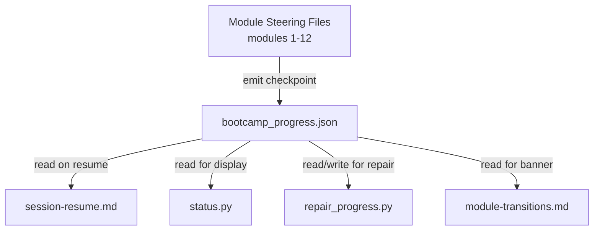

# Design Document: Step-Level Checkpointing

## Overview

This feature extends the senzing-bootcamp power's progress tracking from module-level granularity to step-level granularity. Currently, `config/bootcamp_progress.json` records which modules are completed and which module is current. When a session drops mid-module, the agent must scan project artifacts to guess where the user left off — a slow heuristic that often misjudges position within long modules (5, 7, 12).

Step-level checkpointing adds two new fields to the progress file (`current_step` and `step_history`), updates the agent's checkpoint-emission behavior in module steering files, and modifies the session-resume workflow, status script, repair script, and module-transitions steering to consume step-level data. The result: session resume jumps directly to the correct step, and users always see exactly where they are.

### Design Decisions

1. **Flat `current_step` field** rather than nesting under `current_module` — keeps the top-level schema simple and avoids breaking existing consumers that read `current_module` directly.
2. **`step_history` keyed by string module number** — JSON keys must be strings; using `"4"` rather than `4` avoids serialization ambiguity.
3. **Agent-driven checkpoint writes** — the agent (guided by steering files) writes checkpoints, not a separate daemon or hook. This keeps the architecture simple and consistent with how `modules_completed` is already maintained.
4. **Graceful degradation** — every consumer treats missing `current_step`/`step_history` as absent data and falls back to existing behavior. No migration script is needed.

## Architecture

The feature touches four layers of the bootcamp power:



**Data flow:**
1. As the agent completes each numbered step in a module steering file, it writes a checkpoint to `bootcamp_progress.json` (updating `current_step` and `step_history`).
2. On session resume, `session-resume.md` reads `current_step` to tell the user exactly where they are and instructs the agent to skip completed steps.
3. `status.py` reads `current_step` to display step-level progress in the terminal.
4. `repair_progress.py` scans artifacts to reconstruct `current_step` and `step_history` when the progress file is corrupted.
5. `module-transitions.md` reads `current_step` to include step info in the journey map.

### Change Scope

| File | Change Type |
|------|-------------|
| `senzing-bootcamp/steering/session-resume.md` | Modify — read `current_step`, skip-to-step logic |
| `senzing-bootcamp/steering/module-transitions.md` | Modify — step display in journey map |
| `senzing-bootcamp/steering/agent-instructions.md` | Modify — add checkpoint-emission rule |
| `senzing-bootcamp/steering/module-01-business-problem.md` through `module-12-deployment.md` | Modify — add checkpoint emission after each numbered step |
| `senzing-bootcamp/scripts/status.py` | Modify — display step progress |
| `senzing-bootcamp/scripts/repair_progress.py` | Modify — reconstruct step-level data |
| `config/bootcamp_progress.json` (runtime) | Schema extension — new fields |

## Components and Interfaces

### 1. Progress File Schema Extension

The progress file gains two new optional fields:

```json
{
  "modules_completed": [1, 2, 3],
  "current_module": 4,
  "current_step": 3,
  "step_history": {
    "1": { "last_completed_step": 5, "updated_at": "2026-05-10T14:30:00Z" },
    "4": { "last_completed_step": 3, "updated_at": "2026-05-12T09:15:00Z" }
  },
  "data_sources": [],
  "database_type": "sqlite"
}
```

- `current_step` (integer | null): The last completed step number within `current_module`. Set to `null` or removed when the module completes.
- `step_history` (object): Keyed by module number as string. Each value has `last_completed_step` (integer) and `updated_at` (ISO 8601 string).

### 2. Checkpoint Emission (Agent Behavior)

The agent writes a checkpoint after completing each numbered step in a module steering file. The checkpoint write is a JSON read-modify-write cycle:

1. Read `config/bootcamp_progress.json`
2. Set `current_step` to the completed step number
3. Set `step_history[<module_number>]` to `{ "last_completed_step": <step>, "updated_at": "<ISO 8601 now>" }`
4. Write the file back

On module completion:
1. Add the module number to `modules_completed`
2. Set `current_step` to `null`
3. Retain the `step_history` entry (it records the final step)
4. Increment `current_module`

### 3. Session Resume (session-resume.md)

Modified Step 1 and Step 3 of the existing session-resume workflow:

**Step 1 — Read State:** After reading `bootcamp_progress.json`, extract `current_step` if present.

**Step 3 — Summarize:** If `current_step` is present, include it in the welcome-back summary:
```
Current: Module 5 — Data Quality & Mapping, Step 3 of 12
```

**Step 4 — Load Module Steering:** If `current_step` is present, instruct the agent to skip to step `current_step + 1` in the module steering file. If `current_step` references a non-existent step, log a warning and fall back to artifact scanning.

### 4. Status Script (status.py)

New behavior in `main()`:
- After printing `Current Module: Module N`, if `current_step` is present, append `, Step S`.
- In `sync_progress_tracker()`, include step info for the current module line.

### 5. Repair Script (repair_progress.py)

New behavior:
- `detect()` returns step-level hints alongside module detection (e.g., presence of `docs/data_source_evaluation.md` implies Module 5 Phase 1 complete → step ~7).
- `main()` with `--fix` populates `current_step` and `step_history` when step-level artifacts are identifiable.
- `main()` without `--fix` reports detected step-level progress.
- When step cannot be determined, omits `current_step` rather than guessing.

### 6. Module Transitions (module-transitions.md)

Modified journey map rendering:
- If `current_step` is present for the current module, display `🔄 Current — Step S/T` instead of `🔄 Current`.
- If `current_step` is absent, display existing `🔄 Current` status.

## Data Models

### Progress File Schema (Extended)

| Field | Type | Required | Description |
|-------|------|----------|-------------|
| `modules_completed` | `integer[]` | Yes | Sorted list of completed module numbers |
| `current_module` | `integer` | Yes | Module currently in progress (1-12) |
| `current_step` | `integer \| null` | No | Last completed step in current module. Null/absent when no module is active or step is unknown |
| `step_history` | `object` | No | Per-module step records. Keys are module numbers as strings |
| `step_history.<N>.last_completed_step` | `integer` | Yes (within entry) | Highest completed step number |
| `step_history.<N>.updated_at` | `string` (ISO 8601) | Yes (within entry) | Timestamp of last checkpoint |
| `data_sources` | `string[]` | Yes | List of registered data source names |
| `database_type` | `string` | Yes | `"sqlite"` or `"postgresql"` |
| `language` | `string` | No | Chosen programming language |

### Step Count Reference (per module)

Each module steering file defines a different number of steps. The step counts are not hardcoded in the progress file — they are derived from the steering files at runtime. The agent counts numbered steps/phases when loading a module steering file.

| Module | Approximate Steps | Notes |
|--------|-------------------|-------|
| 1 | 15 | Business problem discovery |
| 2 | ~8 | SDK setup |
| 3 | ~6 | Quick demo |
| 4 | ~5 | Data collection |
| 5 | ~13 (2 phases) | Quality assessment + mapping |
| 6 | ~8 | Single source loading |
| 7 | ~10 | Multi-source orchestration |
| 8 | ~8 | Query & validation |
| 9 | ~8 | Performance testing |
| 10 | ~8 | Security hardening |
| 11 | ~8 | Monitoring |
| 12 | ~15 (2 phases) | Packaging + deployment |


## Correctness Properties

*A property is a characteristic or behavior that should hold true across all valid executions of a system — essentially, a formal statement about what the system should do. Properties serve as the bridge between human-readable specifications and machine-verifiable correctness guarantees.*

### Property 1: Progress file schema conformance

*For any* valid progress state (with any combination of completed modules 1-12, any current_module in 1-12, any current_step as a positive integer or null, and any step_history with string-integer keys mapping to objects with last_completed_step and ISO 8601 updated_at), serializing the state to JSON and validating it against the extended schema SHALL produce a valid document where all step_history keys are string representations of integers 1-12 and all values contain the required fields with correct types.

**Validates: Requirements 1.2, 1.5**

### Property 2: Module completion clears current step

*For any* progress file state where a module number is present in `modules_completed` and that module equals `current_module`, the `current_step` field SHALL be `null` or absent. Equivalently: for any sequence of checkpoint writes followed by a module-completion write, the resulting progress file SHALL have `current_step` as null while retaining the `step_history` entry for that module.

**Validates: Requirements 1.4**

### Property 3: Checkpoint write consistency

*For any* valid module number (1-12) and valid step number (positive integer), performing a checkpoint write SHALL produce a progress file where `current_step` equals the written step number AND `step_history[<module>].last_completed_step` equals the same step number AND `step_history[<module>].updated_at` is a valid ISO 8601 timestamp not earlier than the timestamp before the write.

**Validates: Requirements 4.2**

### Property 4: Backward compatibility of scripts with legacy progress files

*For any* valid legacy progress file (containing `modules_completed`, `current_module`, `data_sources`, and `database_type` but lacking `current_step` and `step_history`), both `status.py` and `repair_progress.py` SHALL execute without raising an error, and `status.py` output SHALL contain module-level progress information without any step-level detail.

**Validates: Requirements 2.3, 2.4, 5.2**

### Property 5: Step display in status output

*For any* valid progress file where `current_step` is a positive integer and `current_module` is not in `modules_completed`, the output of `status.py` SHALL contain a string indicating both the current module number and the current step number.

**Validates: Requirements 5.1**

### Property 6: Repair script omits step when undetermined

*For any* project state where no step-specific artifacts exist for the current module (i.e., only module-level completion can be detected), the repair script with `--fix` SHALL produce a progress file that either omits `current_step` or sets it to `null`, rather than guessing a step number.

**Validates: Requirements 6.2**

## Error Handling

### Invalid `current_step` Values

- If `current_step` is negative, zero, or exceeds the number of steps in the module steering file, the session-resume workflow logs a warning and falls back to artifact scanning (Requirement 3.4).
- `status.py` displays the raw step number even if it seems out of range — the script has no knowledge of step counts per module.
- `repair_progress.py` never writes a `current_step` it cannot verify from artifacts.

### Corrupted or Missing Fields

- Missing `current_step`: treated as unknown — all consumers fall back to module-level behavior.
- Missing `step_history`: treated as empty object — no step history is displayed or used.
- Malformed `step_history` entries (e.g., missing `updated_at`): consumers skip the malformed entry and log a warning.
- Non-integer `current_step`: `status.py` and `repair_progress.py` catch `TypeError`/`ValueError` and fall back to module-level display.

### File I/O Errors

- If `bootcamp_progress.json` cannot be read (permissions, corruption), existing error handling in `status.py` and `repair_progress.py` already handles this gracefully. No new error paths are introduced.
- Checkpoint writes use the existing read-modify-write pattern. If the write fails, the agent reports the error and continues — the user loses at most one step of progress.

### Concurrent Access

- The progress file is written by a single agent in a single session. Concurrent writes are not expected. No locking mechanism is added.

## Testing Strategy

### Unit Tests (Example-Based)

Unit tests cover specific scenarios and edge cases:

1. **Schema validation examples**: Verify specific valid and invalid progress file structures.
2. **Status script output**: Verify output format with and without step data for specific progress states.
3. **Repair script artifact mapping**: Verify specific artifact configurations map to expected step numbers (e.g., `docs/data_source_evaluation.md` exists → Module 5 step ~7).
4. **Sync flag output**: Verify `PROGRESS_TRACKER.md` includes step info when `--sync` is used with step data.
5. **Edge cases**: `current_step` of 0, negative numbers, very large numbers, non-integer values, missing fields.

### Property-Based Tests

Property-based tests verify universal properties across generated inputs using `hypothesis` (Python PBT library). Each property test runs a minimum of 100 iterations.

- **Property 1** (Schema conformance): Generate random valid progress states → serialize → validate schema.
- **Property 2** (Module completion clears step): Generate random progress states with a completed module → verify current_step is null.
- **Property 3** (Checkpoint write consistency): Generate random (module, step) pairs → perform checkpoint write → verify consistency.
- **Property 4** (Backward compatibility): Generate random legacy progress files → run status.py and repair_progress.py → verify no errors.
- **Property 5** (Step display): Generate random progress files with current_step → run status.py → verify step appears in output.
- **Property 6** (Repair safety): Generate random project states with no step artifacts → run repair with --fix → verify current_step is absent.

Tag format: `Feature: step-level-checkpointing, Property N: <property_text>`

### Integration Tests

Integration tests verify agent behavior and steering file interactions:

1. **Checkpoint emission**: Simulate agent completing a step → verify progress file is updated.
2. **Session resume with step**: Provide progress file with current_step → verify resume message includes step info.
3. **Session resume without step**: Provide legacy progress file → verify fallback to artifact scanning.
4. **Module transitions display**: Verify journey map includes step info when available.

### Steering File Verification (Smoke)

- Verify all 12 module steering files contain checkpoint emission instructions after each numbered step.
