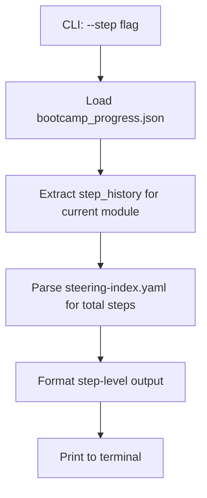

# Design: Step-Level Status Command

## Overview

This feature adds a `--step` flag to `scripts/status.py` that displays step-level progress within the current module. Today the status command shows which module a bootcamper is on; with `--step`, it also shows which step within that module they've completed, how many total steps the module has, and when the last step was completed.

The implementation reads `step_history` from `config/bootcamp_progress.json`, cross-references the total step count from `steering-index.yaml` phase `step_range` values, and formats a concise one-line summary plus edge-case handling.

## Architecture

The feature extends the existing `status.py` CLI with minimal new code:



**Key design decisions:**

1. **Single new function** (`_show_step_detail`) keeps the feature isolated from existing terminal output logic.
2. **Minimal YAML parser** — `steering-index.yaml` uses a simple structure; we parse only the `step_range` values with regex rather than importing PyYAML (stdlib-only constraint).
3. **Reuse `progress_utils.py`** — the existing `parse_parent_step()` and `_is_valid_sub_step_identifier()` functions handle sub-step parsing (e.g., "5.3", "7a").
4. **No changes to existing output** — the `--step` flag appends step detail after the standard status display, preserving backward compatibility.

## Components and Interfaces

### New CLI Flag

```python
parser.add_argument("--step", action="store_true",
                    help="Show step-level progress for the current module")
```

The `--step` flag is independent of `--html`, `--sync`, `--graph`. When combined with the default terminal output, it appends a step-detail section.

### New Function: `_show_step_detail`

```python
def _show_step_detail(
    current_module: int,
    progress_data: dict,
    steering_index_path: Path,
) -> None:
```

**Responsibilities:**
1. Look up `step_history[str(current_module)]` from progress data.
2. Parse `steering-index.yaml` to determine total step count for the module.
3. Format and print the step-level line.
4. Handle edge cases (no history, null step, sub-step identifiers).

### New Function: `_get_module_total_steps`

```python
def _get_module_total_steps(steering_index_path: Path, module_number: int) -> int | None:
```

**Responsibilities:**
- Parse `steering-index.yaml` to find all `step_range` entries for the given module.
- Return the maximum step number (the upper bound of the last phase's `step_range`).
- Return `None` if the module has no phase structure (e.g., module 4 and 7 which are single-file entries without phases).

### Steering Index Parsing Strategy

The `steering-index.yaml` structure for modules with phases looks like:

```yaml
modules:
  5:
    root: module-05-data-quality-mapping.md
    phases:
      phase1-quality-assessment:
        step_range: [1, 7]
      phase2-data-mapping:
        step_range: [8, 20]
      phase3-test-load-validate:
        step_range: [21, 26]
```

For modules without phases (e.g., `4: module-04-data-collection.md`), there's no step_range data. The parser will:
1. Read the YAML file as text.
2. Use a targeted regex/line-by-line approach to extract `step_range` values for the requested module number.
3. Return the max upper bound across all phases, or `None` for single-file modules.

### Output Format

**Normal case (step history exists):**
```
Step Detail:
  Module 5: Data Quality & Mapping — Step 8 of 26 completed
  Last updated: 2026-05-12T09:15:00Z
```

**Active step (current_step is set):**
```
Step Detail:
  Module 5: Data Quality & Mapping — Step 8 of 26 completed
  Active step: Step 9
  Last updated: 2026-05-12T09:15:00Z
```

**Sub-step identifier:**
```
Step Detail:
  Module 5: Data Quality & Mapping — Step 5.3 of 26 completed
  Active step: Step 5.3
  Last updated: 2026-05-12T09:15:00Z
```

**No step history:**
```
Step Detail:
  Module 5: Data Quality & Mapping — Not started
```

**Null current_step (between steps):**
```
Step Detail:
  Module 5: Data Quality & Mapping — Step 8 of 26 completed
  Active step: Between steps
  Last updated: 2026-05-12T09:15:00Z
```

**Module without phase data (no total available):**
```
Step Detail:
  Module 4: Data Collection — Step 3 completed
  Last updated: 2026-05-12T09:15:00Z
```

## Data Models

### Input: `bootcamp_progress.json` (relevant fields)

```json
{
  "current_module": 5,
  "modules_completed": [1, 2, 3, 4],
  "current_step": 8,
  "step_history": {
    "5": {
      "last_completed_step": 8,
      "updated_at": "2026-05-12T09:15:00Z"
    }
  }
}
```

- `current_step`: `int`, `str` (sub-step like "5.3"), or `null`
- `step_history[N].last_completed_step`: `int` or `str` (sub-step)
- `step_history[N].updated_at`: ISO 8601 timestamp string

### Input: `steering-index.yaml` (relevant structure)

```yaml
modules:
  N:
    phases:
      phase-name:
        step_range: [start, end]
```

The total step count for module N = max(end) across all phases.

### Module Total Steps (derived)

| Module | Total Steps | Source |
|--------|-------------|--------|
| 1 | 18 | phase1 [1,9] + phase2 [10,18] |
| 2 | 9 | phase1 [1,9] |
| 3 | 12 | phase1 [1,8] + phase2 [9,12] |
| 4 | None | No phases defined |
| 5 | 26 | phase1 [1,7] + phase2 [8,20] + phase3 [21,26] |
| 6 | 27 | phaseA [1,3] + phaseB [4,10] + phaseC [11,19] + phaseD [20,27] |
| 7 | None | No phases defined |
| 8 | 13 | phaseA [1,3] + phaseB [4,7] + phaseC [8,13] |
| 9 | 12 | phaseA [1,4] + phaseB [5,12] |
| 10 | 10 | phaseA [1,5] + phaseB [6,10] |
| 11 | 15 | phase1 [1,12] + phase2 [13,15] |


## Correctness Properties

*A property is a characteristic or behavior that should hold true across all valid executions of a system — essentially, a formal statement about what the system should do. Properties serve as the bridge between human-readable specifications and machine-verifiable correctness guarantees.*

### Property 1: Step detail output format correctness

*For any* valid progress data where `step_history` contains an entry for the current module with a valid `last_completed_step` (integer or sub-step string), and *for any* module that has phases defined in `steering-index.yaml`, the formatted output SHALL contain "Module N: [Name] — Step X of Y completed" where N is the current module number, Name is the module name, X is the `last_completed_step` value, and Y is the maximum upper bound of all `step_range` values for that module.

**Validates: Requirements 2, 3**

### Property 2: Active step and timestamp display

*For any* valid `current_step` value (integer, dotted sub-step string, or lettered sub-step string) and *for any* valid ISO 8601 `updated_at` timestamp in the step history entry, the step detail output SHALL display the active step value and the timestamp. When `current_step` is `null`, the output SHALL display "Between steps" instead.

**Validates: Requirements 4, 5, 6**

### Property 3: Total steps extraction from steering-index

*For any* module number that has a phases structure in `steering-index.yaml`, the extracted total step count SHALL equal the maximum upper-bound value across all `step_range` entries for that module. For modules without phases, the function SHALL return `None`.

**Validates: Requirements 3**

## Error Handling

| Scenario | Behavior |
|----------|----------|
| `bootcamp_progress.json` missing | Print "No progress data found" (existing behavior); `--step` section skipped |
| `bootcamp_progress.json` has invalid JSON | Print warning to stderr (existing behavior); `--step` section skipped |
| `step_history` key missing for current module | Display "Not started" |
| `step_history` entry missing `last_completed_step` | Display "Not started" |
| `step_history` entry missing `updated_at` | Omit timestamp line |
| `steering-index.yaml` missing or unreadable | Omit "of Y" from format (show "Step X completed" without total) |
| Module has no phases in steering-index | Omit "of Y" from format |
| `current_step` is `None` | Display "Between steps" for active step |
| `current_step` is invalid type | Ignore and omit active step line |

All error handling follows the existing `status.py` pattern: graceful degradation with informative output, never crashing.

## Testing Strategy

### Unit Tests (example-based)

| Test Case | Validates |
|-----------|-----------|
| `--step` flag accepted by argparse | Req 1 |
| No progress file → step section skipped | Req 10 |
| Empty step_history → "Not started" | Req 6, 10 |
| Valid step_history → correct format output | Req 2, 3 |
| `current_step` integer → "Active step: Step N" | Req 4, 10 |
| `current_step` sub-step "5.3" → "Active step: Step 5.3" | Req 4, 6, 10 |
| `current_step` null → "Between steps" | Req 6, 10 |
| Module completed → step detail still shows last step | Req 10 |
| Module without phases → "Step X completed" (no total) | Req 3 |
| Timestamp displayed from `updated_at` | Req 5 |

### Property-Based Tests (Hypothesis)

The following property-based tests use the Hypothesis library with `@settings(max_examples=100)`:

| Property | Strategy | Assertion |
|----------|----------|-----------|
| Property 1: Format correctness | Generate random module (1-11 with phases), random step (1-max), random total | Output contains "Module N: [Name] — Step X of Y completed" |
| Property 2: Active step + timestamp | Generate random current_step (int/sub-step/None), random ISO timestamp | Output contains correct active step text and timestamp |
| Property 3: Total steps extraction | For each module with phases, parse steering-index and verify max(step_range upper bounds) | Extracted total matches expected value |

**Property test configuration:**
- Library: Hypothesis (already used in the project)
- Minimum iterations: 100 per property
- Tag format: `Feature: step-level-status-command, Property N: [title]`

### Test File Location

Tests go in `senzing-bootcamp/tests/test_status_step_detail.py` following the existing pattern from `test_status_steps.py`.

### Documentation Updates

- `POWER.md` "Useful Commands" section: add `python3 senzing-bootcamp/scripts/status.py --step` line
- `docs/guides/SCRIPT_REFERENCE.md`: add `--step` to the status.py flags table
