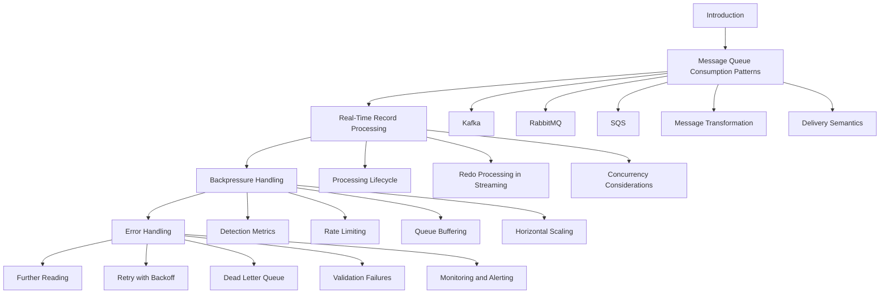

# Design Document

## Overview

This feature adds a conceptual guide at `senzing-bootcamp/docs/guides/STREAMING_INTEGRATION.md` covering real-time streaming integration patterns for Senzing entity resolution. The guide teaches bootcampers how to architect event-driven pipelines using message queues (Apache Kafka, RabbitMQ, Amazon SQS), process records through Senzing in real time, handle backpressure when processing can't keep up with inbound rates, and manage errors in streaming contexts where failed records can't simply be retried by re-running a script.

The guide is conceptual — it explains patterns and architecture rather than providing step-by-step framework setup. It uses Mermaid diagrams for architecture visualization and relies on MCP tools (`search_docs`, `find_examples`) for authoritative Senzing content. Module 11 references the guide as optional advanced reading, and the guides README indexes it for discoverability.

### Design Rationale

The guide follows the same conventions as existing guides in the `docs/guides/` directory (e.g., `INCREMENTAL_LOADING.md`, `DATA_UPDATES_AND_DELETIONS.md`):

- Level-1 heading with the guide title
- Introductory paragraph explaining the guide's purpose and context
- Agent instruction callouts for MCP tool usage
- A "Further Reading" section pointing to MCP tools and related guides
- Conceptual pseudocode patterns rather than language-specific code

The streaming integration guide is a natural progression from the incremental loading guide — incremental loading covers file-based ongoing ingestion, while streaming integration covers event-driven ingestion from message queues. The guide explicitly bridges this gap in the introduction.

## Architecture

### Document Structure

The guide is a single Markdown file organized into logical sections that build on each other:

### Integration Points

The guide integrates with three existing artifacts:

1. **Module 11 steering** (`senzing-bootcamp/steering/module-11-deployment.md`): A new "Further Reading" block is appended after the Phase Gate section, presenting the streaming guide as optional advanced reading. This does not alter the Module 11 workflow steps.

2. **Guides README** (`senzing-bootcamp/docs/guides/README.md`): A new entry is added in the "After the Bootcamp" section and the Documentation Structure tree, following the existing format (filename as Markdown link, bold title, description).

3. **MCP tools**: The guide includes agent instruction callouts directing the agent to use `search_docs` and `find_examples` for authoritative Senzing content at runtime, consistent with the pattern used in `INCREMENTAL_LOADING.md`.

## Components and Interfaces

### Component 1: Streaming Integration Guide (`STREAMING_INTEGRATION.md`)

**Location:** `senzing-bootcamp/docs/guides/STREAMING_INTEGRATION.md`

**Sections:**

| Section | Purpose | Requirements Covered |
|---|---|---|
| Introduction | Why streaming matters, how it differs from batch/incremental loading | 1.2, 1.3, 1.4 |
| Message Queue Consumption Patterns | Consumer patterns for Kafka, RabbitMQ, SQS; message transformation; delivery semantics | 2.1, 2.2, 2.3, 2.4 |
| Real-Time Record Processing Through Senzing | Processing lifecycle, redo in streaming, concurrency | 3.1, 3.2, 3.3, 3.4 |
| Backpressure Handling | Detection metrics, three strategies, throughput vs parallelism | 4.1, 4.2, 4.3, 4.4 |
| Error Handling for Streaming Pipelines | Retry with backoff, DLQ pattern, validation failures, monitoring/alerting | 5.1, 5.2, 5.3, 5.4, 5.5 |
| Further Reading | MCP tool pointers, related guides | 7.3 |

**Mermaid Diagrams (minimum 2):**

1. **High-level architecture diagram** (Requirement 6.2): End-to-end flow showing source systems → message queue → streaming consumers → Senzing → dead letter queue. Uses a `flowchart LR` diagram.

2. **Error handling and retry flow** (Requirement 6.3): Message consumption → processing attempt → retry decision → DLQ routing. Uses a `flowchart TD` diagram.

Both diagrams use fenced code blocks with the `mermaid` language identifier (Requirement 6.4).

**Agent Instruction Callouts:**

The guide includes `> **Agent instruction:**` blocks directing the agent to call MCP tools at runtime:

- `search_docs` for Senzing SDK behavior (add_record, redo processing, concurrency) — Requirement 7.1
- `find_examples` for streaming implementation patterns — Requirement 7.2

These follow the same pattern used in `INCREMENTAL_LOADING.md`.

### Component 2: Module 11 Cross-Reference

**Location:** `senzing-bootcamp/steering/module-11-deployment.md`

**Change:** Add a "Further Reading" section after the existing Phase Gate section (before the Error Handling section) containing a reference to the streaming integration guide. The reference:

- Describes the guide as covering real-time streaming patterns for event-driven architectures using message queues (Requirement 8.2)
- Is presented as optional further reading, not a required workflow step (Requirement 8.3)
- Uses a relative path link to `../../docs/guides/STREAMING_INTEGRATION.md`

### Component 3: Guides README Update

**Location:** `senzing-bootcamp/docs/guides/README.md`

**Changes:**

1. Add an entry in the "After the Bootcamp" section with the filename as a Markdown link, bold title, and 2-3 line description covering streaming patterns, message queue integration, backpressure, and error management (Requirement 9.2).

2. Add `STREAMING_INTEGRATION.md` to the Documentation Structure tree under `guides/` (Requirement 9.3).

## Data Models

This feature produces documentation artifacts only — no runtime data models, database schemas, or API contracts are involved.

**File artifacts produced:**

| Artifact | Type | Format |
|---|---|---|
| `STREAMING_INTEGRATION.md` | New file | Markdown with Mermaid code blocks |
| `module-11-deployment.md` | Modified file | Markdown with YAML frontmatter (existing format preserved) |
| `README.md` (guides) | Modified file | Markdown (existing format preserved) |

## Error Handling

Since this feature produces static documentation, error handling applies to the authoring process rather than runtime behavior:

1. **MCP tool unavailability**: Agent instruction callouts in the guide direct the agent to use `search_docs` and `find_examples`. If MCP tools are unavailable at guide-authoring time, the guide's conceptual content stands on its own — MCP tools enrich the content at runtime when a bootcamper reads the guide with agent assistance.

2. **Mermaid rendering**: Diagrams use standard Mermaid syntax compatible with GitHub, GitLab, and Kiro IDE renderers. If a viewer doesn't support Mermaid, the fenced code block displays the source text, which is readable as pseudocode.

3. **Cross-reference integrity**: The Module 11 reference uses a relative path (`../../docs/guides/STREAMING_INTEGRATION.md`). If the guide file is moved or renamed, the link breaks — but this is consistent with how all cross-references work in the bootcamp documentation.

## Testing Strategy

### PBT Applicability Assessment

Property-based testing is **not applicable** to this feature. The feature produces static Markdown documentation — there are no functions with inputs/outputs, no data transformations, no business logic, and no code that varies meaningfully with input. The Correctness Properties section is omitted.

### Recommended Testing Approach

**Structural validation tests** (example-based, using pytest):

1. **File existence**: Verify `senzing-bootcamp/docs/guides/STREAMING_INTEGRATION.md` exists.
2. **Required sections**: Verify the guide contains all required section headings (Introduction, Message Queue Consumption Patterns, Real-Time Record Processing, Backpressure Handling, Error Handling, Further Reading).
3. **Mermaid diagrams**: Verify the guide contains at least two fenced code blocks with the `mermaid` language identifier.
4. **Queue coverage**: Verify the guide mentions Kafka, RabbitMQ, and SQS.
5. **MCP tool references**: Verify the guide references `search_docs` and `find_examples`.
6. **Module 11 cross-reference**: Verify `module-11-deployment.md` contains a reference to `STREAMING_INTEGRATION.md` and that the reference is not inside a numbered step (confirming it's optional, not a required workflow step).
7. **Guides README entry**: Verify `README.md` contains an entry for `STREAMING_INTEGRATION.md` in both the guide listing and the Documentation Structure tree.
8. **Heading conventions**: Verify the guide starts with a level-1 heading followed by an introductory paragraph.
9. **Conceptual focus**: Verify the guide does not contain language-specific import statements or framework installation commands (confirming conceptual focus over step-by-step setup).

**Manual review**: Content accuracy, readability, and diagram clarity should be reviewed by a human — these are not automatable.
