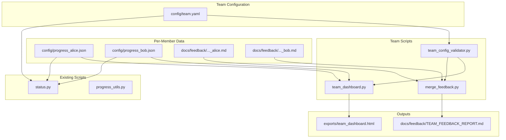

# Design Document: Team Bootcamp

## Overview

This feature extends the senzing-bootcamp power from single-user to multi-user team support. It introduces:

1. A shared YAML configuration file (`config/team.yaml`) defining team membership and mode.
2. A dashboard generator (`senzing-bootcamp/scripts/team_dashboard.py`) producing a self-contained HTML overview.
3. A feedback merge script (`senzing-bootcamp/scripts/merge_feedback.py`) consolidating individual feedback into one report.
4. Team-aware progress tracking that keeps per-member progress files while computing team-level statistics.
5. An ER comparison view in the dashboard showing how entity resolution outcomes differ across members.
6. Onboarding integration that detects `config/team.yaml` and activates team mode automatically.
7. Support for both co-located (shared repo) and distributed (separate repos) team setups.

All new scripts depend only on the Python standard library and are cross-platform (Linux, macOS, Windows).

## Architecture



### Key Design Decisions

1. **Shared validation module**: A `team_config_validator.py` module provides `load_and_validate(path) -> TeamConfig` used by all team scripts. This avoids duplicating validation logic across `team_dashboard.py`, `merge_feedback.py`, and `status.py`.

2. **No third-party dependencies**: All scripts use only the Python standard library (`yaml` is NOT in stdlib, so the team config parser uses a minimal YAML subset parser or we use a simple custom parser for the restricted YAML schema). *Decision*: Since PyYAML is not stdlib, we implement a focused YAML parser that handles only the flat/list structure of `team.yaml`. The schema is constrained enough (string scalars, lists of dicts) that a line-by-line parser is reliable.

3. **Co-located vs. distributed as a strategy pattern**: The mode determines file path resolution. A `PathResolver` abstraction returns the correct paths for progress files, feedback files, and artifact directories based on mode.

4. **Backward compatibility**: When no `config/team.yaml` exists, all scripts behave exactly as they do today. Team mode is purely additive.

5. **HTML dashboard is self-contained**: All CSS is inlined. No JavaScript frameworks. The HTML uses semantic elements and a responsive grid layout.

## Components and Interfaces

### 1. Team Config Validator (`senzing-bootcamp/scripts/team_config_validator.py`)

```python
@dataclass
class TeamMember:
    id: str
    name: str
    repo_path: str | None = None

@dataclass
class TeamConfig:
    team_name: str
    members: list[TeamMember]
    mode: str  # "colocated" | "distributed"
    shared_data_sources: list[str]

class TeamConfigError(Exception):
    """Raised when team.yaml validation fails."""
    pass

def parse_team_yaml(content: str) -> dict:
    """Parse the restricted YAML subset used by team.yaml into a dict."""

def validate_team_config(raw: dict) -> list[str]:
    """Return list of validation error strings. Empty list = valid."""

def load_and_validate(path: str = "config/team.yaml") -> TeamConfig:
    """Load, parse, validate, and return TeamConfig. Raises TeamConfigError on failure."""
```

### 2. Path Resolver (`senzing-bootcamp/scripts/team_config_validator.py`)

```python
class PathResolver:
    def __init__(self, config: TeamConfig):
        ...

    def progress_path(self, member: TeamMember) -> Path:
        """Return the path to a member's progress JSON."""

    def feedback_path(self, member: TeamMember) -> Path:
        """Return the path to a member's feedback markdown."""

    def preferences_path(self, member: TeamMember) -> Path:
        """Return the path to a member's preferences YAML."""

    def journal_path(self, member: TeamMember) -> Path:
        """Return the path to a member's bootcamp journal."""
```

**Co-located mode paths:**
- Progress: `config/progress_{member_id}.json`
- Feedback: `docs/feedback/SENZING_BOOTCAMP_POWER_FEEDBACK_{member_id}.md`
- Preferences: `config/preferences_{member_id}.yaml`
- Journal: `docs/bootcamp_journal_{member_id}.md`

**Distributed mode paths:**
- Progress: `{repo_path}/config/bootcamp_progress.json`
- Feedback: `{repo_path}/docs/feedback/SENZING_BOOTCAMP_POWER_FEEDBACK.md`
- Preferences: `{repo_path}/config/preferences.yaml`
- Journal: `{repo_path}/docs/bootcamp_journal.md`

### 3. Team Dashboard Script (`senzing-bootcamp/scripts/team_dashboard.py`)

```python
def collect_member_progress(config: TeamConfig, resolver: PathResolver) -> list[dict]:
    """Read each member's progress file. Returns list of dicts with member info + progress data.
       Members with missing/unreadable files get status='No data available'."""

def compute_team_stats(member_data: list[dict]) -> dict:
    """Compute team-level statistics: avg completion %, total modules completed,
       lowest-completion module, count of fully-completed members."""

def collect_er_stats(config: TeamConfig, resolver: PathResolver) -> list[dict]:
    """Read ER statistics (records loaded, entities resolved, duplicates, cross-source matches)
       for members who completed Module 6+."""

def render_dashboard_html(config: TeamConfig, member_data: list[dict],
                          team_stats: dict, er_data: list[dict]) -> str:
    """Generate self-contained HTML string with all sections."""

def main():
    """CLI entry point. Parses --output arg, loads config, generates dashboard."""
```

### 4. Merge Feedback Script (`senzing-bootcamp/scripts/merge_feedback.py`)

```python
@dataclass
class FeedbackEntry:
    member_id: str
    member_name: str
    title: str
    date: str
    module: str
    priority: str  # High | Medium | Low
    category: str  # Documentation | Workflow | Tools | UX | Bug | Performance | Security
    body: str

def parse_feedback_file(content: str) -> list[FeedbackEntry]:
    """Parse a feedback markdown file and extract improvement entries."""

def merge_feedback(entries_by_member: dict[str, list[FeedbackEntry]]) -> str:
    """Generate the consolidated TEAM_FEEDBACK_REPORT.md content."""

def compute_feedback_stats(all_entries: list[FeedbackEntry]) -> dict:
    """Compute breakdown by priority and category."""

def main():
    """CLI entry point. Parses --output arg, loads config, merges feedback."""
```

### 5. Status Script Extension (`senzing-bootcamp/scripts/status.py`)

The existing `status.py` is extended with:
- `--member <id>` argument to show a specific member's progress in team mode.
- Team summary display when team mode is active and no `--member` is given.
- Detection of `config/team.yaml` to activate team mode.

### 6. Onboarding Integration

The onboarding flow (agent-driven via steering files) is updated to:
1. Check for `config/team.yaml` at onboarding start.
2. If found and valid, present the member list and ask the user to identify themselves.
3. Create the member-specific progress file.
4. Display team name and member count in the welcome banner.
5. If not found, proceed with standard single-user onboarding.

This is primarily a steering file update (`senzing-bootcamp/steering/onboarding-flow.md`) rather than a script change.

## Data Models

### Team Config YAML Schema (`config/team.yaml`)

```yaml
team_name: "Acme ER Team"
mode: colocated  # or "distributed"
shared_data_sources:
  - customers
  - vendors
members:
  - id: alice
    name: "Alice Johnson"
  - id: bob
    name: "Bob Smith"
    repo_path: /home/bob/senzing-bootcamp  # required in distributed mode
```

### Progress JSON Schema (unchanged from existing)

```json
{
  "modules_completed": [1, 2, 3, 4, 5, 6],
  "current_module": 7,
  "language": "python",
  "data_sources": ["customers"],
  "current_step": 3,
  "step_history": {
    "6": {
      "last_completed_step": 5,
      "updated_at": "2025-01-15T10:30:00+00:00"
    }
  },
  "er_stats": {
    "records_loaded": 500,
    "entities_resolved": 420,
    "duplicate_count": 80,
    "cross_source_matches": 35
  }
}
```

The `er_stats` field is a new optional addition to the progress JSON, populated after Module 6+ completion. It is used by the ER comparison view.

### Team Feedback Report Structure

```markdown
# Team Feedback Report: {team_name}

**Generated**: {date}
**Members with feedback**: {count} of {total}

## Summary

- Total entries: {n}
- By priority: High ({n}), Medium ({n}), Low ({n})
- By category: Documentation ({n}), Workflow ({n}), ...

## Alice Johnson

### Improvement: {title}
...

## Bob Smith

### Improvement: {title}
...
```


## Correctness Properties

*A property is a characteristic or behavior that should hold true across all valid executions of a system — essentially, a formal statement about what the system should do. Properties serve as the bridge between human-readable specifications and machine-verifiable correctness guarantees.*

### Property 1: Valid team configs are accepted, invalid configs produce specific errors

*For any* dict representing a team config, if it has a non-empty `team_name` string, a `members` list with ≥2 entries each having unique non-empty `id` and `name`, a `mode` of `"colocated"` or `"distributed"`, and (when distributed) every member has a non-empty `repo_path`, then `validate_team_config` SHALL return an empty error list. Conversely, *for any* dict missing or violating any of these constraints, the error list SHALL be non-empty and SHALL contain a message identifying each specific violation.

**Validates: Requirements 1.2, 1.3, 1.4, 1.5, 1.6, 1.8, 1.9, 9.2, 9.3, 9.4, 9.5, 9.6, 9.8**

### Property 2: Path resolution produces correct mode-specific paths for all file types

*For any* `TeamConfig` and *any* `TeamMember` in that config, the `PathResolver` SHALL return paths that:
- In `colocated` mode: contain the member's `id` as a suffix (e.g., `config/progress_{id}.json`, `docs/feedback/..._FEEDBACK_{id}.md`, `config/preferences_{id}.yaml`, `docs/bootcamp_journal_{id}.md`).
- In `distributed` mode: are rooted at the member's `repo_path` using standard single-user filenames (e.g., `{repo_path}/config/bootcamp_progress.json`).

**Validates: Requirements 1.7, 2.6, 2.7, 3.5, 3.6, 4.6, 7.1, 7.2, 7.3, 7.4, 7.5, 8.3**

### Property 3: Dashboard HTML contains all required member data

*For any* valid `TeamConfig` and *any* list of member progress data, the rendered dashboard HTML SHALL contain: the team name, the total member count, the overall completion percentage, each member's display name, each member's current module number, and each member's completion percentage.

**Validates: Requirements 2.8, 2.9, 2.10, 10.5**

### Property 4: Feedback report statistics match input data

*For any* collection of `FeedbackEntry` objects with known priority and category values, the `compute_feedback_stats` function SHALL return counts where the sum of all priority counts equals the total entry count, and the sum of all category counts equals the total entry count, and each individual priority/category count matches the actual number of entries with that value.

**Validates: Requirements 3.8, 3.9, 3.10**

### Property 5: Team statistics are correctly computed from member progress

*For any* list of member progress dicts (each with a `modules_completed` list of ints 1–12), `compute_team_stats` SHALL return: an `average_completion` equal to the mean of each member's `len(modules_completed) / 12`, a `total_modules_completed` equal to the sum of all members' completed module counts, and a `fully_completed_count` equal to the number of members with all 12 modules completed.

**Validates: Requirements 4.5**

### Property 6: ER comparison correctly identifies top-performing members

*For any* list of member ER stats where each entry has `records_loaded > 0` and `entities_resolved >= 0` and `cross_source_matches >= 0`, the ER comparison logic SHALL identify the member with the highest `entities_resolved / records_loaded` ratio as the top ER rate member, and the member with the highest `cross_source_matches` as the top cross-source member.

**Validates: Requirements 5.2, 5.5**

## Error Handling

### Team Config Errors

| Error Condition | Behavior |
|---|---|
| `config/team.yaml` missing | Scripts fall back to single-user mode (no error) |
| `config/team.yaml` malformed YAML | `TeamConfigError` with parse error details, exit code 1 |
| Missing required fields | Validation error listing each missing field, exit code 1 |
| Duplicate member IDs | Validation error listing the duplicate IDs, exit code 1 |
| Invalid mode value | Validation error specifying valid values, exit code 1 |
| Distributed mode missing `repo_path` | Validation error per member missing the field, exit code 1 |

### Progress File Errors

| Error Condition | Behavior |
|---|---|
| Member progress file missing | Dashboard shows "No data available" for that member |
| Progress file malformed JSON | Dashboard shows "No data available", warning to stderr |
| Distributed `repo_path` inaccessible | Warning to stderr, member shown as "No data available" |

### Feedback File Errors

| Error Condition | Behavior |
|---|---|
| Member feedback file missing | Report notes "No feedback submitted" for that member |
| Feedback file has no improvement entries | Report notes "No feedback submitted" |
| Feedback file malformed | Warning to stderr, member noted as "No feedback submitted" |

### General Principles

- Validation errors are fatal: scripts exit with code 1 and a descriptive message.
- Missing data files are non-fatal: scripts continue processing other members and note the absence.
- All error messages go to stderr; normal output goes to stdout or the output file.

## Testing Strategy

### Property-Based Testing

This feature is well-suited for property-based testing because the core logic involves:
- Validation of structured input (team config) with clear accept/reject criteria
- Path computation (pure functions with clear input/output)
- Statistics computation (pure functions over collections)
- HTML rendering that must contain specific data elements

**Library**: [Hypothesis](https://hypothesis.readthedocs.io/) (Python)

**Configuration**: Minimum 100 iterations per property test.

**Tag format**: `Feature: team-bootcamp, Property {number}: {property_text}`

Each correctness property above maps to a single property-based test:

| Property | Test Target | Generator Strategy |
|---|---|---|
| 1 | `validate_team_config()` | Generate random dicts with valid/invalid field combinations |
| 2 | `PathResolver.progress_path()`, `.feedback_path()`, etc. | Generate random member IDs, repo_paths, and modes |
| 3 | `render_dashboard_html()` | Generate random TeamConfig + member progress lists |
| 4 | `compute_feedback_stats()` | Generate random FeedbackEntry lists with known distributions |
| 5 | `compute_team_stats()` | Generate random member progress dicts |
| 6 | ER comparison logic | Generate random ER stat dicts with positive values |

### Unit Tests (Example-Based)

- CLI argument parsing (`--output`, `--member`)
- Default output paths
- Self-contained HTML verification (no external stylesheet links)
- Generation timestamp in footer
- Semantic HTML elements present
- Color coding classes for module statuses
- Navigation bar with section links
- "No data available" / "No feedback submitted" display
- Validation error exit code behavior

### Integration Tests

- End-to-end dashboard generation from sample `team.yaml` + progress files
- End-to-end feedback merge from sample feedback files
- `status.py` team mode display
- Onboarding flow team detection (manual/agent-driven)
- Cross-platform path handling (Windows backslash vs. Unix forward slash)
