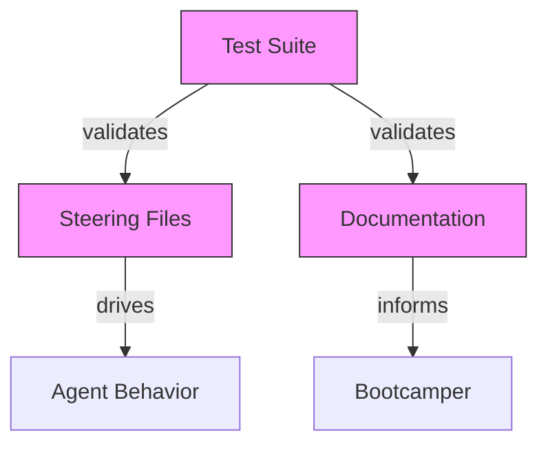

# Design Document: Test Data Terminology

## Overview

This feature performs a terminology replacement across the senzing-bootcamp power, changing all instances of "mock data" to "test data" or "sample data." The change affects steering files, documentation guides, the main POWER.md, and the test suite.

The scope is intentionally narrow: find-and-replace text in a known set of files, update one test method name, and update test assertions to validate the new terminology. No new modules, scripts, or architectural components are introduced.

### Design Rationale

- **"test data"** is used when referring to data generated for testing entity resolution behavior (e.g., "test data can be generated at any point").
- **"sample data"** is used when referring to the pre-built named datasets (Las Vegas, London, Moscow) since they are curated samples, not arbitrary test fixtures.
- The steering file in Step 4 uses both: "test data" for the general concept and "sample datasets" for the three named cities.

## Architecture

No architectural changes. This is a content-level terminology update across existing files. The affected layers are:

All three pink nodes (Steering Files, Documentation, Test Suite) are modified. Agent Behavior and Bootcamper experience change as a consequence — no code changes needed for those.

## Components and Interfaces

### Affected Files

| File | Location of "mock data" | Replacement |
|------|------------------------|-------------|
| `steering/onboarding-flow.md` | Step 4 bullet: "Mock data available anytime" | "Test data available anytime" (with "sample datasets" for the city list) |
| `POWER.md` | "mock data can be generated at any point" | "test data can be generated at any point" |
| `docs/guides/QUICK_START.md` | "Mock data can be generated at any point" | "Test data can be generated at any point" |
| `docs/guides/ONBOARDING_CHECKLIST.md` | "can generate mock data at any point" | "can generate test data at any point" |
| `tests/test_track_selection_gate_preservation.py` | `test_step4_contains_mock_data` method + assertion | Rename to `test_step4_contains_test_data`, update regex to match "test data" or "sample data" |
| `tests/test_comprehension_check.py` | `test_step_4_mock_data_and_license` method + assertion | Rename to `test_step_4_test_data_and_license`, update assertion |

### No Script Filename Changes Required

The requirements mention `generate_test_data.py` vs `generate_mock_data.py`. After inspecting the codebase, no file named `generate_mock_data.py` exists — the steering files reference data generation conceptually but no such script is shipped. The terminology update in steering file text (changing any textual reference to "mock data generation script") is sufficient.

## Data Models

No data model changes. The feature modifies only human-readable text content (Markdown) and test assertions (Python string literals/regex patterns).

## Correctness Properties

*A property is a characteristic or behavior that should hold true across all valid executions of a system — essentially, a formal statement about what the system should do. Properties serve as the bridge between human-readable specifications and machine-verifiable correctness guarantees.*

### Property 1: No "mock data" in file content

*For any* file with extension `.md`, `.py`, or `.yaml` within the `senzing-bootcamp/` directory, the file content SHALL NOT contain the phrase "mock data" (case-insensitive).

**Validates: Requirements 1.1, 1.3, 2.1, 2.2, 2.3, 3.2, 4.2, 5.1**

### Property 2: No "mock_data" or "mock-data" in filenames

*For any* file path within the `senzing-bootcamp/` directory, the filename component SHALL NOT contain the substring `mock_data` or `mock-data` (case-insensitive).

**Validates: Requirements 3.1, 5.2**

## Error Handling

This feature has no runtime error paths. The changes are static text replacements. If a replacement is missed, the property-based tests will catch it as a regression.

Potential issues during implementation:
- **Partial replacement**: Replacing "mock data" in one location but missing another. Mitigated by Property 1 which scans ALL files.
- **Test assertion breakage**: Updating steering file content without updating the corresponding test assertion. Mitigated by running the full test suite after changes.
- **Case sensitivity**: "Mock data" vs "mock data" vs "MOCK DATA". The property test uses case-insensitive matching to catch all variants.

## Testing Strategy

### Property-Based Tests (Hypothesis)

Two property tests validate the universal invariants using Hypothesis. Each generates random file selections from the `senzing-bootcamp/` directory and verifies the terminology constraints hold.

- **Library**: Hypothesis (already used in the test suite)
- **Minimum iterations**: 100 per property
- **Tag format**: `Feature: test-data-terminology, Property N: <description>`

Property tests are the primary regression guard — they ensure no file in the power contains the old terminology regardless of future additions.

### Example-Based Tests (pytest)

Unit tests verify specific replacement correctness:

1. **Step 4 content marker**: Assert `onboarding-flow.md` Step 4 contains "test data" or "sample data" (replaces the existing `test_step4_contains_mock_data` test).
2. **POWER.md terminology**: Assert POWER.md uses "test data" in the data availability sentence.
3. **QUICK_START.md terminology**: Assert the guide uses "test data."
4. **ONBOARDING_CHECKLIST.md terminology**: Assert the checklist uses "test data."
5. **Test method naming**: Assert no test method in the suite contains "mock_data" in its name when testing steering file content.

### Test Updates (Existing Tests)

Two existing test methods require modification:

1. `test_track_selection_gate_preservation.py::TestStep4ContentMarkers::test_step4_contains_mock_data`
   - Rename to `test_step4_contains_test_data`
   - Change assertion from `re.search(r"[Mm]ock data", step4)` to `re.search(r"[Tt]est data|[Ss]ample data", step4)`

2. `test_comprehension_check.py::TestExistingStepPreservation::test_step_4_mock_data_and_license`
   - Rename to `test_step_4_test_data_and_license`
   - Update assertion to check for "test data" or "sample data" instead of "Mock data"
