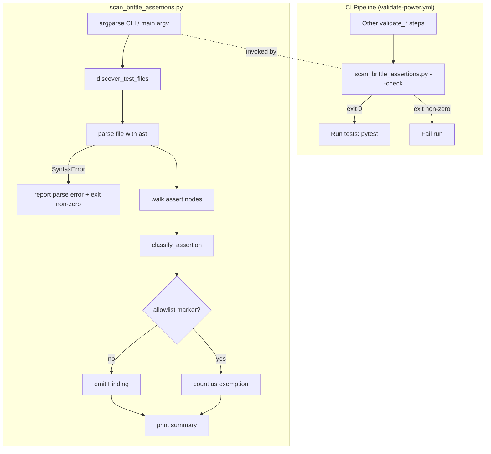

# Design Document

## Overview

This feature reduces brittleness in the senzing-bootcamp pytest + Hypothesis test
suite while preserving the genuine regression-protection intent of the preservation
tests. It delivers three things:

1. **A brittleness taxonomy** — a precise, documented definition of the four
   brittle-assertion categories recognized for this codebase and the
   structural-assertion forms that replace them (Requirement 1).
2. **A brittleness scanner** — a stdlib-only Python 3.11+ script,
   `senzing-bootcamp/scripts/scan_brittle_assertions.py`, that statically detects
   brittle assertions, supports an allowlist, exposes an `argparse` CLI with a
   `--check` mode, and is wired into the CI pipeline before pytest (Requirements 2,
   3, 7).
3. **Remediation of existing brittle assertions** — replacing exact total-test-count
   equality, whole-file/section SHA-256 snapshots, and exact heading/line-sequence
   snapshots with structural assertions that still catch real regressions, without
   reducing historical bug-condition coverage (Requirements 4, 5, 6).

The scanner is a **static AST analyzer**. It never executes test code; it parses
each `test_*.py` file with Python's `ast` module and classifies `assert` statements
by matching syntactic shapes against the four brittle categories. This keeps it
fast, deterministic, and dependency-free — the same constraints every other script
in `senzing-bootcamp/scripts/` already follows.

### Research Notes

Grounding observations from the existing codebase that shape this design:

- **Exact_Count_Assertion** appears as a hard-coded integer compared with `==`
  against a measured length or count. Example from
  `test_mcp_tool_inventory.py`: `_EXPECTED_COUNT = 13` then
  `assert len(bullets) == _EXPECTED_COUNT`. The requirements also cite a
  whole-suite `_PASSING_BASELINE == 4648`. Not every `== <int>` is brittle — only
  those representing a **total test count or whole-suite passing count**. Domain
  counts like "13 MCP tools" or `record_count == expected_count` (a computed,
  test-generated value) are not whole-suite counts and must not be flagged.
- **Whole_File_Snapshot_Assertion** appears as
  `assert _sha256(content) == _HASH_ONBOARDING_FLOW`, where `content` is the full
  text/bytes of a tracked file and the right side is a 64-hex-char literal (often
  via a module-level constant). Seen in `test_module_closing_question_ownership.py`,
  `test_onboarding_question_ownership.py`, `test_hook_registry_preservation.py`.
- **Section_Snapshot_Assertion** is the same shape, but the hashed input is a
  substring/section extracted from a tracked file (e.g. `_snapshot_section_content`
  in `test_sdk_method_discovery_preservation.py`, `_SNAP_*` constants).
- **Exact_Sequence_Snapshot_Assertion** appears as
  `assert _extract_headings(content) == _HEADINGS_MODULE_01`, comparing the full
  ordered list of every heading/line against a literal list (seen in
  `test_module_closing_question_ownership.py`).
- **Legitimate_Hash_Use** must be preserved. `test_cord_data_freshness.py` and
  `cord_metadata.py` hash **test-generated data** as part of the behavior under
  test (content-hash round-trip), and `test_generate_spec_catalog.py` uses
  `_snapshot_tree` to assert a tool *wrote nothing* (comparing two freshly computed
  snapshots, not a hard-coded literal). Neither couples to a tracked source file's
  literal digest, so neither is brittle.
- **Good structural patterns already exist** in the suite and inform the
  replacement forms: `test_typescript_language_maturity.py` checks required
  headings are *present* (membership); `test_scoop_supportpath_preservation.py`
  checks step 9 *follows* step 8 (ordered relationship, tolerating additions).
  These are the target shapes for remediation.

The CI pipeline (`.github/workflows/validate-power.yml`) runs a sequence of
`validate_*`/`measure_*` checks, then `Run tests` (pytest). The scanner step is
inserted as a validation step **before** the `Run tests` step.

## Architecture



The system has three cooperating parts:

1. **Scanner core (pure classification)** — `classify_assertion(node, source_lines)`
   takes an `ast.Assert` node (plus access to the source for marker/line lookups)
   and returns an optional brittle category. This is the heart of the feature and
   the primary unit under property-based test (Requirement 7). It is a pure
   function of its inputs with no I/O.

2. **Scanner driver (I/O + orchestration)** — file discovery, parsing, allowlist
   detection, Finding aggregation, summary printing, and exit-code logic. This
   layer handles the side effects and the CLI contract (Requirements 2, 3).

3. **Remediation (test edits)** — the existing brittle assertions are rewritten to
   structural forms. This is not code in the scanner; it is a set of edits to test
   files guided by the taxonomy, verified by re-running the scanner (zero
   non-allowlisted findings) and the full suite (still green).

The separation matters: keeping classification pure means we can exhaustively
property-test it (feed generated brittle/structural snippets and assert the
category), independent of the filesystem.

## Components and Interfaces

### `scan_brittle_assertions.py` module surface

Following the project script pattern (shebang, module docstring, `from __future__
import annotations`, stdlib only, dataclasses, `argparse`, `main(argv=None)`,
exit 0 success / non-zero failure):

```python
class BrittleCategory(enum.Enum):
    EXACT_COUNT = "exact_count"
    WHOLE_FILE_SNAPSHOT = "whole_file_snapshot"
    SECTION_SNAPSHOT = "section_snapshot"
    EXACT_SEQUENCE_SNAPSHOT = "exact_sequence_snapshot"

@dataclass(frozen=True)
class Finding:
    file_path: str          # path relative to repo root
    line_number: int        # 1-based line of the assert
    category: BrittleCategory
    allowlisted: bool        # True when an Allowlist_Marker exempts it

@dataclass(frozen=True)
class ScanResult:
    files_scanned: int
    findings: list[Finding]              # non-allowlisted only
    exemptions: list[Finding]            # allowlisted
    parse_errors: list[tuple[str, str]]  # (file_path, error message)

    @property
    def findings_by_category(self) -> dict[BrittleCategory, int]: ...
```

Key functions:

| Function | Signature | Responsibility |
|---|---|---|
| `classify_assertion` | `(node: ast.Assert, source_lines: list[str]) -> BrittleCategory \| None` | Pure classifier. Returns the matched category or `None` (structural / not brittle). |
| `has_allowlist_marker` | `(node: ast.Assert, source_lines: list[str]) -> bool` | True if the assert's line(s) carry the `Allowlist_Marker` comment. |
| `discover_test_files` | `(roots: list[Path]) -> list[Path]` | Find every `test_*.py` under the target roots, sorted. |
| `scan_file` | `(path: Path) -> tuple[list[Finding], str \| None]` | Parse one file, classify its asserts; return findings and an optional parse-error message. |
| `scan` | `(roots: list[Path]) -> ScanResult` | Orchestrate discovery + per-file scan into a `ScanResult`. |
| `format_summary` | `(result: ScanResult) -> str` | Render the files-scanned / findings-by-category / exemptions summary. |
| `main` | `(argv: list[str] \| None = None) -> int` | argparse CLI; returns process exit code. |

### CLI contract

```
python senzing-bootcamp/scripts/scan_brittle_assertions.py [--check] [--root PATH ...]
```

- Default roots: `senzing-bootcamp/tests/` and `tests/` (Requirement 2.2).
- `--root` (repeatable) overrides the scan roots (used by self-tests on fixtures).
- Without `--check`: print the summary and findings, exit 0 (report-only).
- With `--check`: exit non-zero if there is **≥1 non-allowlisted Finding**, else 0
  (Requirements 3.2, 3.3).
- On any unparseable file: print the file path and parse error to stderr and exit
  non-zero, regardless of `--check` (Requirements 2.8, 7-adjacent).
- If the scan cannot complete over all target files (unhandled error), exit
  non-zero (Requirement 3.7).

### Classification rules (syntactic matching)

`classify_assertion` inspects the `assert` test expression, which for the brittle
forms is a `Compare` node using `==`. The decision logic:

- **EXACT_COUNT** — a `==` comparison where one side is an integer literal (or a
  module-level constant whose name matches a count pattern such as
  `*_BASELINE`, `*PASSING*`, `*_TOTAL*`, `*TEST_COUNT*`) **and** the other side is
  a count expression representing a whole-suite/total test count (e.g. a
  `len(...)` over collected tests, or a name/attribute matching
  `*passing*`/`*total*`/`*test_count*`). Domain-count comparisons whose operands
  do not match the whole-suite-count heuristics are **not** flagged. To avoid
  false positives, only flag when the comparison's count side references a
  test-count concept; otherwise classify as `None`. Ambiguous cases are resolved
  conservatively toward `None` and handled by the allowlist if a maintainer
  decides otherwise.
- **WHOLE_FILE_SNAPSHOT** — a `==` comparison where one side is a SHA-256
  computation (`hashlib.sha256(...).hexdigest()` or a helper named `_sha256`/
  `sha256*`) whose hashed argument derives from reading an entire tracked file
  (`*.read_bytes()`, `*.read_text(...)`, or a `_read_file(...)`/`_read_hook()`
  helper result), and the other side is a 64-hex-char string literal or a constant
  named `*_HASH*`/`*_DIGEST*`/`*BASELINE_HASH*`.
- **SECTION_SNAPSHOT** — same SHA-256-vs-literal shape, but the hashed argument is
  a *section/substring* of file content (a slice, a regex/extract helper result
  such as `_snapshot_section_content(...)`, `_extract_*section*(...)`), rather than
  the whole file.
- **EXACT_SEQUENCE_SNAPSHOT** — a `==` comparison where one side is a list of every
  heading/line extracted from a file (a call to a helper like `_extract_headings`,
  `_extract_all_h2_headings`, or `re.findall(...)` over file content) and the other
  side is a list literal or a constant named `*_HEADINGS*`/`*_SEQUENCE*`.
- **Legitimate_Hash_Use guard** — if the hashed argument derives from
  test-generated data (a local variable built in the test, a Hypothesis-drawn
  value, a `tmp_path` file written earlier in the test) rather than a tracked
  source file, return `None` (Requirements 1.3, 2.9). Comparisons of two freshly
  computed digests/snapshots (neither side a hard-coded literal) are likewise
  `None`.

The classifier is intentionally **literal-anchored**: a snapshot category requires
a hard-coded digest/list literal (or a constant resolved to one) on one side.
"Compare two computed values" is never brittle by this definition, which cleanly
excludes the `test_generate_spec_catalog.py` "wrote nothing" pattern.

### Allowlist marker

`Allowlist_Marker` is an inline comment on the assert's line (or the line opening a
multi-line assert):

```python
assert _sha256(content) == _HASH_LEGAL_NOTICE  # brittle-allow: legal text must be byte-exact
```

The marker token is `brittle-allow`. `has_allowlist_marker` reads the source line(s)
spanning the assert node (`node.lineno`..`node.end_lineno`) and returns `True` if
any carries the token. Allowlisted asserts are reported as **exemptions**, never as
findings (Requirements 2.7, 3.4, 7.4).

### CI integration

A new step is added to `.github/workflows/validate-power.yml` immediately **before**
the `Run tests` step (Requirement 3.5):

```yaml
      - name: Scan for brittle test assertions
        run: python senzing-bootcamp/scripts/scan_brittle_assertions.py --check
      - name: Run tests
        run: |
          pip install pytest hypothesis
          python -m pytest senzing-bootcamp/tests/ tests/ -v --tb=short
```

Because the step runs before pytest and a non-zero exit fails the job, any
non-allowlisted brittle assertion (existing or newly introduced) blocks the PR
(Requirements 3.5, 3.6).

### Remediation patterns (taxonomy → structural replacement)

These are the concrete replacement forms applied to existing brittle assertions and
documented as the taxonomy's structural counterparts (Requirements 1.2, 4, 5).

| Brittle category | Structural replacement |
|---|---|
| Exact_Count_Assertion (total/passing count `==`) | **Non-regression threshold**: `assert observed >= FLOOR` where `FLOOR` is the recorded baseline, with a comment naming the behavior guarded. Adding/splitting tests keeps it green; a real drop fails it (Req 4.1–4.4). |
| Whole_File_Snapshot_Assertion | **Marker / cross-reference membership + invariant checks**: assert the required markers, headings, cross-references, or counts the snapshot was protecting are present (Req 5.1). |
| Section_Snapshot_Assertion | **Section content invariants**: assert the section contains its required markers/sentinels in the required relation (Req 5.2). |
| Exact_Sequence_Snapshot_Assertion | **Ordered-subsequence check**: assert the required headings appear in the required relative order, tolerating unrelated additions (Req 5.3). |

For each remediated assertion, the original intent is preserved as a comment or
docstring (Req 4.2, 6.2), and any historical bug condition a Preservation_Test
guarded is retained via an equivalent structural assertion (Req 6.6).

## Data Models

The scanner has no persistent data store; its data models are in-memory dataclasses
(shown above) plus the constants that drive classification:

```python
# Whole-suite count name heuristics (EXACT_COUNT)
_COUNT_NAME_PATTERNS = ("passing", "total", "test_count", "baseline")

# Snapshot literal/constant name heuristics
_HASH_NAME_PATTERNS = ("hash", "digest")          # WHOLE_FILE / SECTION
_SEQUENCE_NAME_PATTERNS = ("headings", "sequence") # EXACT_SEQUENCE
_SHA256_HELPERS = ("sha256", "_sha256", "_sha256_bytes")
_FILE_READ_CALLS = ("read_bytes", "read_text")
_FILE_READ_HELPERS = ("_read_file", "_read_hook")
_SECTION_EXTRACT_HINTS = ("section", "extract", "snapshot_section")
_HEADING_EXTRACT_HELPERS = ("_extract_headings", "_extract_all_h2_headings")

# Allowlist marker token
_ALLOWLIST_TOKEN = "brittle-allow"

# SHA-256 hex literal: exactly 64 hex chars
_SHA256_HEX_RE = re.compile(r"^[0-9a-f]{64}$")

# Default scan roots (relative to repo root)
_DEFAULT_ROOTS = ("senzing-bootcamp/tests", "tests")
```

A `Finding` is fully described by `(file_path, line_number, category, allowlisted)`.
A `ScanResult` aggregates findings, exemptions, scanned-file count, and parse
errors, and derives `findings_by_category` for the summary.

For remediation, the **non-regression floor** is the only persisted datum, and it
lives inline in the test as a named constant (e.g. `_PASSING_FLOOR = 4648`) with a
comment, not in an external file — matching the existing baseline-constant
convention.

## Correctness Properties

*A property is a characteristic or behavior that should hold true across all valid
executions of a system — essentially, a formal statement about what the system
should do. Properties serve as the bridge between human-readable specifications and
machine-verifiable correctness guarantees.*

These properties are amenable to property-based testing because the scanner's
classifier is a **pure function** (`ast.Assert` node + source lines → category or
`None`) over a large, structured input space, and the remediated structural assertions encode
**invariants** (thresholds, marker membership, ordered subsequence) that must hold
across arbitrary content. The properties below were derived from the prework
analysis; redundant criteria were consolidated (e.g. 7.2 subsumes 2.3–2.6; 7.3
subsumes 1.3/2.9; the tolerate-additions and detect-removal halves of 5.4/5.5 fold
into the marker and sequence invariants).

### Property 1: Brittle assertions classify into their category

*For any* assertion generated to match one of the four brittle categories
(Exact_Count, Whole_File_Snapshot, Section_Snapshot, Exact_Sequence_Snapshot),
`classify_assertion` returns exactly that category, and the resulting Finding
records the correct file path, line number, and category.

**Validates: Requirements 2.3, 2.4, 2.5, 2.6, 7.2**

### Property 2: Structural assertions and legitimate hash uses are not flagged

*For any* assertion generated to be structural — a membership check, a threshold
check, an ordered-subsequence check, a comparison of two computed values, or a
Legitimate_Hash_Use that hashes test-generated data rather than a tracked source
file's literal digest — `classify_assertion` returns `None` (no Finding).

**Validates: Requirements 1.3, 2.9, 7.3**

### Property 3: Allowlist marker converts a Finding into an exemption

*For any* brittle assertion (of any of the four categories) annotated with the
`brittle-allow` Allowlist_Marker, the scan reports it as an allowlisted exemption
and never as a non-allowlisted Finding.

**Validates: Requirements 2.7, 7.4**

### Property 4: Discovery finds exactly the test files

*For any* directory tree placed under the scan roots containing a mix of
`test_*.py` files and non-matching files, `discover_test_files` returns exactly the
set of `test_*.py` files and nothing else.

**Validates: Requirements 2.2**

### Property 5: `--check` exit code reflects non-allowlisted findings

*For any* set of scanned fixtures, invoking the scanner with `--check` exits
non-zero if and only if there is at least one non-allowlisted Finding; fixtures with
zero non-allowlisted Findings (clean or fully allowlisted) exit 0.

**Validates: Requirements 3.2, 3.3**

### Property 6: Summary counts match the scan result

*For any* scan, the printed summary reports a files-scanned count, per-category
Finding counts, and an exemption count that each equal the corresponding values
computed in the `ScanResult`.

**Validates: Requirements 3.4**

### Property 7: Remediated count assertion is a non-regression threshold

*For any* observed total/passing test count, the remediated count assertion passes
if and only if the observed count is greater than or equal to the recorded floor —
so adding or splitting tests never fails it, while a count below the floor always
fails it.

**Validates: Requirements 4.1, 4.3, 4.4**

### Property 8: Remediated snapshot assertion checks marker presence and tolerates additions

*For any* file/section content that contains all required markers (in any
arrangement, with arbitrary unrelated content added), the remediated whole-file and
section structural assertions pass; *for any* content with a required marker removed,
they fail.

**Validates: Requirements 5.1, 5.2, 5.4, 5.5**

### Property 9: Remediated sequence assertion checks ordered subsequence and tolerates additions

*For any* heading list in which the required headings appear in the required
relative order, the remediated sequence assertion passes even when arbitrary
unrelated headings are interleaved; *for any* list where a required heading is
removed or two required headings are reordered, it fails.

**Validates: Requirements 5.3, 5.4, 5.5**

## Error Handling

| Condition | Handling | Requirement |
|---|---|---|
| File fails to parse as Python (`SyntaxError`) | Catch during `scan_file`, record `(path, message)` in `parse_errors`, print to stderr, and exit non-zero regardless of `--check` | 2.8, 3.7 |
| A scan root does not exist | Print a clear error to stderr and exit non-zero (a missing target means the scan is incomplete) | 3.7 |
| Unreadable file (permission/encoding) | Treat as a parse/scan error: record, report, exit non-zero | 3.7 |
| Ambiguous assertion shape | Resolve conservatively to `None` (not a Finding); maintainers use the allowlist for deliberate exemptions, avoiding false-positive CI failures | 2.7 |
| Constant referenced on the literal side cannot be resolved within the module | Fall back to name-pattern heuristics; if still ambiguous, classify `None` (conservative) | 1.3, 2.9 |
| No findings and no errors | Print summary, exit 0 | 3.3 |

Error messages name the file path and the specific problem. The scanner never
silently skips a target file: an unscannable file is an error that fails the run, so
CI cannot pass on a partial scan.

## Testing Strategy

The scanner's classification logic is a pure function over a large structured input
space, so property-based testing is appropriate and primary. Remediated structural
assertions encode invariants that are likewise property-tested. End-state and
wiring requirements are covered by smoke/integration-style example tests.

### Property-Based Tests (Hypothesis)

Implemented with **Hypothesis** (already a project dependency). Each property test:

- Runs a minimum of **100 iterations** (`@settings(max_examples=100)`; raise where
  generation is cheap). The debrittling self-tests are fast (in-memory AST/string
  work), so 100+ is the default here.
- Is tagged with a comment referencing the design property, in the format:
  `# Feature: test-suite-debrittling, Property {number}: {property_text}`
- References the requirements it validates in the test class docstring (matching the
  project convention).

Generators (`st_`-prefixed, per conventions):

- `st_exact_count_assertion()`, `st_whole_file_snapshot_assertion()`,
  `st_section_snapshot_assertion()`, `st_exact_sequence_snapshot_assertion()` —
  emit source snippets for each brittle category (Properties 1, 3, 5).
- `st_structural_assertion()` — emits membership/threshold/ordered-subsequence/
  computed-vs-computed/legitimate-hash snippets (Property 2).
- `st_required_markers()` + `st_extra_content()` — drive the marker-presence and
  ordered-subsequence invariants (Properties 8, 9).
- `st_test_tree()` — generates directory trees of `test_*.py` and non-matching files
  (Property 4).

Property-to-test mapping: one property-based test per property (Properties 1–9),
each importing `scan_brittle_assertions` via the standard `sys.path` insertion.

### Unit / Example Tests

- **Enum shape** — `BrittleCategory` has exactly the four categories (Req 1.1).
- **Stdlib-only** — importing the module pulls in no third-party packages (Req 2.1).
- **CLI entry point** — `main([])` and `main(["--check"])` return integer exit codes
  (Req 3.1).
- **Parse error** — a fixture file with invalid Python yields a reported parse error
  and non-zero exit (Req 2.8, 3.7 — EDGE_CASE).
- **CI wiring** — parse `validate-power.yml`; assert the scanner step uses `--check`,
  has no `continue-on-error`, and precedes the `Run tests` step (Req 3.5, 3.6).

### Whole-Suite / End-State Checks (SMOKE)

These verify the remediation outcome against the real suite rather than generated
inputs:

- After remediation, `scanner --check` against `senzing-bootcamp/tests/` and
  `tests/` reports **zero** non-allowlisted Findings in every category (Req 4.5,
  5.6).
- The full pytest suite passes after remediation (Req 6.3, 6.4).
- The inventory of Exploration_Tests / historical bug conditions does not decrease
  (Req 6.1, 6.5), with equivalent structural assertions retained for any remediated
  Preservation_Test (Req 6.6 — verified by the Property 8/9 regression-detection
  half plus review).

### Documentation Review (non-automated)

- The four-category taxonomy and its structural replacements (Req 1.1, 1.2).
- Each remediated assertion preserves original intent as a comment/docstring
  (Req 4.2, 6.2).
