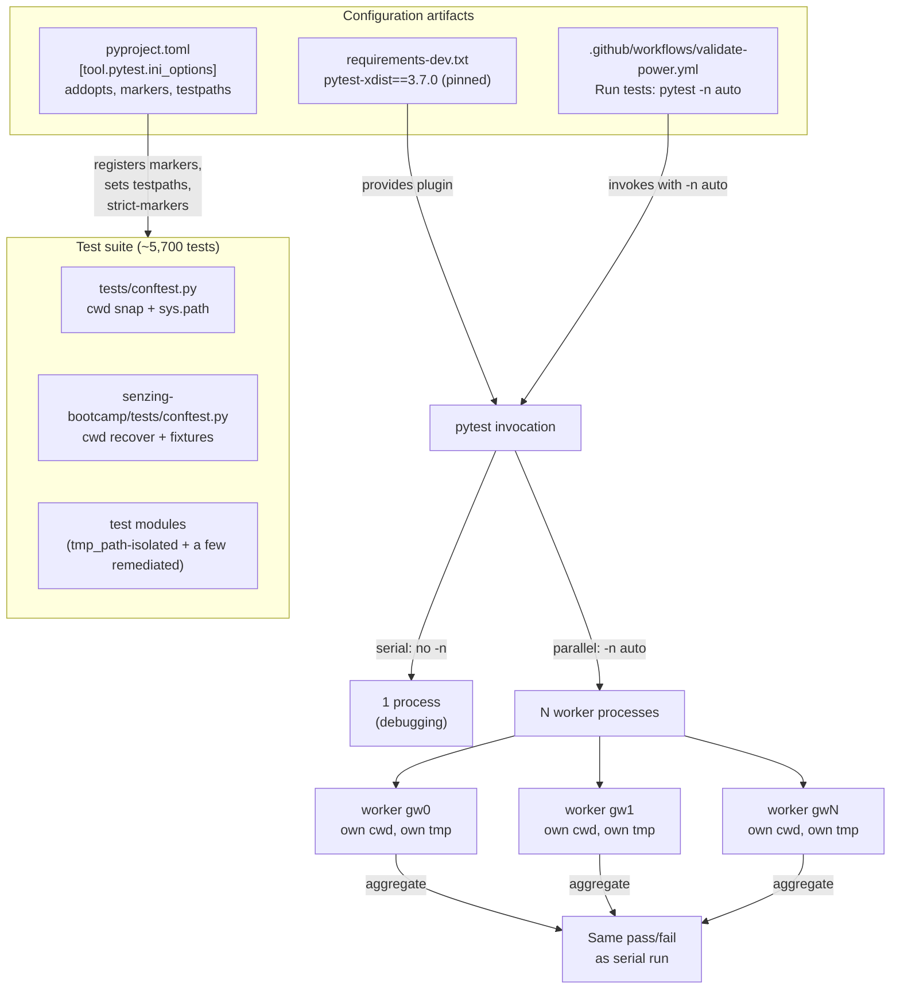

# Design Document

## Overview

This feature makes the senzing-bootcamp pytest + Hypothesis suite (~5,700 tests across ~349 files) run in parallel via `pytest-xdist`, cutting the dominant ~150s wall-clock cost of the local and CI feedback loop. It introduces a new `[tool.pytest.ini_options]` section in the root `pyproject.toml` that registers a small strict marker taxonomy and centralizes default options, remediates the handful of tests whose filesystem/working-directory assumptions break under concurrent worker processes, and wires the GitHub Actions matrix to invoke pytest with parallel workers on Python 3.11/3.12/3.13.

The design is deliberately conservative about behavior: the suite must produce the **same pass/fail outcome and the same determinism** it has today. Parallelism is an execution-mode change, not a semantics change. The Hypothesis example-count profiles remain owned by the `hypothesis-settings-centralization` spec and are untouched here.

### Key Design Decisions (resolving the Open Design Decisions)

These choices resolve the seven deferred decisions in the requirements. Each is justified inline.

1. **Worker count strategy — `-n auto` in CI, opt-in locally.** CI runners on GitHub Actions expose a small, predictable core count; `-n auto` (one worker per logical CPU) maximizes throughput without manual tuning. Locally, developers opt in with `-n auto` when they want speed and omit it when they want a readable, serial debug run.
2. **Location of `-n` — CI invocation only, NOT baked into `addopts`.** Keeping `addopts` serial-by-default preserves local debugging ergonomics (clean tracebacks, `pdb`, ordered output) and keeps a single-worker run the trivial default. Parallelism is opted into explicitly (`-n auto`) by CI and by developers who want it. This avoids surprising contributors who run `pytest path/to/test.py` expecting serial behavior.
3. **Marker taxonomy — `slow`, `property`, `serial`.** `slow` and `property` satisfy Requirement 3.1 (long-running and Hypothesis categories). `serial` is the pin for tests that cannot be made parallel-safe through isolation; combined with `--dist loadgroup` it forces same-group tests onto one worker (Requirement 6.3). `integration` and `smoke` are intentionally **not** added now to keep the taxonomy minimal — they can be layered later without rework.
4. **Non-parallel-safe scheduling — per-test temp-dir isolation first, `xdist_group` pin as fallback.** The vast majority of file-writing tests already use pytest's `tmp_path`, which xdist makes unique per worker, so they are already safe. The conftest CWD fixtures are process-local and therefore naturally isolated across worker processes. For any residual test that writes a shared repo-relative path, the remedy order is: (a) convert to `tmp_path`/`monkeypatch.chdir`; (b) if that is infeasible, mark `@pytest.mark.serial` (an `xdist_group`) so it never runs concurrently with a colliding peer. We run with `--dist loadgroup` so group markers are honored.
5. **Dependency pinning — pin in `requirements-dev.txt`.** The repo already centralizes pinned dev tooling in `requirements-dev.txt` (`ruff`, `pytest`, `hypothesis`) and CI installs it via `pip install -r requirements-dev.txt`. Adding `pytest-xdist==3.7.0` there (rather than an inline `pip install` in the workflow) keeps one source of truth and reproducible CI. The workflow already runs `pip install -r requirements-dev.txt`, so no separate install line is strictly required — but Requirement 9.1 asks for an explicit install in the "Run tests" step, satisfied because that step's environment is provisioned from the pinned file.
6. **Hypothesis + xdist — shared database, no per-worker config.** Hypothesis's `DirectoryBasedExampleDatabase` (the `.hypothesis/` directory) stores each example as a separate file keyed by a hash, which is safe for concurrent reads and tolerant of concurrent writes across processes. No per-worker database is needed, and profiles stay untouched (Requirement 7.3).
7. **`addopts` contents — `-v --tb=short --strict-markers`.** These move into `addopts` so every invocation (local and CI) gets consistent verbosity, short tracebacks (matching today's behavior, Requirement 2.5), and strict marker enforcement (Requirement 3.2). `-n` is deliberately excluded per decision 2.

## Architecture

There is no application runtime here — the "system" is the test-execution configuration and the test suite's behavior under it. The architecture is the relationship between four artifacts and the two execution modes (serial and parallel).



### Why parallel safety mostly already holds

Two structural facts make this feature low-risk:

- **Workers are OS processes, not threads.** Each xdist worker has its own process-global state: its own current working directory, its own `sys.path`, its own module imports, its own Python globals. A `os.chdir()` in one worker cannot affect another. The existing `CWD_Fixture` behavior (snap-to-root before each test in `tests/conftest.py`, recover-from-stale in `senzing-bootcamp/tests/conftest.py`) is autouse and runs independently inside each worker, so per-test cwd isolation is preserved without modification (Requirement 4.1, 4.2).
- **`tmp_path` is already worker-unique.** pytest derives `tmp_path` from the worker id under xdist, so tests already using `tmp_path` / `tmp_path_factory` write to non-colliding directories by construction (Requirement 5.1, 5.2). A repo audit shows the overwhelming majority of file-writing tests use `tmp_path` or `tempfile.mkdtemp()`/`TemporaryDirectory()`, both of which are unique per process.

The remediation work (Requirement 6) is therefore an **audit-and-fix-the-exceptions** task, not a rewrite: find tests that write a **fixed, shared, repo-relative path** concurrently, and isolate or serialize them.

## Components and Interfaces

### Component 1: Pytest configuration (`[tool.pytest.ini_options]` in `pyproject.toml`)

New section appended to the existing `pyproject.toml` (which currently holds only `[tool.ruff]`).

```toml
[tool.pytest.ini_options]
# Default discovery roots (Requirement 2.3, 2.4)
testpaths = ["senzing-bootcamp/tests", "tests"]
# Consistent defaults; -n is intentionally NOT here (serial-by-default, see design decision 2).
# Preserves today's "-v --tb=short" behavior (Requirement 2.5) and enforces strict markers (Requirement 3.2).
addopts = "-v --tb=short --strict-markers"
# Registered marker taxonomy (Requirement 2.2, 3.1)
markers = [
    "slow: long-running tests that dominate wall-clock time",
    "property: Hypothesis property-based tests",
    "serial: tests that must not run concurrently with colliding peers (pinned to one worker via xdist_group)",
]
```

Interface contract:
- `testpaths` makes a bare `pytest` (no path args) collect exactly the two roots (Requirement 2.4).
- `--strict-markers` causes collection to **error** on any unregistered marker, naming it (Requirement 3.3).
- All markers actually used in the suite must appear in `markers` so a strict collection succeeds (Requirement 3.5).

### Component 2: Marker application in test modules

Tests opt into categories with standard pytest markers:

```python
@pytest.mark.slow
def test_expensive_end_to_end(...): ...

@pytest.mark.property
@given(st_world_spec())
def test_round_trip(...): ...

@pytest.mark.serial            # alias usage: applied as an xdist_group below
@pytest.mark.xdist_group("serial")
def test_writes_shared_repo_path(...): ...
```

Selective runs (Requirement 3.4) use marker expressions, e.g. a quick smoke run:

```bash
pytest -m "not slow and not property"
```

### Component 3: Non-parallel-safe scheduling (`xdist_group` + `--dist loadgroup`)

For any test that cannot be isolated to a unique path, the `serial` marker is paired with `@pytest.mark.xdist_group("serial")`. Running under `--dist loadgroup` guarantees all tests sharing a group land on the same worker, so they execute without concurrent collision relative to each other (Requirement 6.3). This is the fallback; the preferred fix is path isolation.

### Component 4: CI invocation (`.github/workflows/validate-power.yml`)

The `tests` job's "Run tests" step changes from serial to parallel on the existing 3.11/3.12/3.13 matrix:

```yaml
- name: Run tests
  env:
    HYPOTHESIS_PROFILE: thorough
  run: python -m pytest senzing-bootcamp/tests/ tests/ -n auto
```

Notes:
- `pytest-xdist` is provisioned via the existing `pip install -r requirements-dev.txt` step, with the package pinned (Requirement 8.1, 9.1, 9.2).
- `-v --tb=short --strict-markers` now come from `addopts`, so they are dropped from the explicit command (behavior preserved, Requirement 2.5). Explicit paths are kept for clarity but are redundant with `testpaths`.
- The matrix is unchanged, so parallel runs cover all three Python versions (Requirement 8.3).

### Component 5: Dependency pinning (`requirements-dev.txt`)

```text
ruff==0.15.19
pytest==9.1.1
hypothesis==6.155.7
pytest-xdist==3.7.0
```

`pytest-xdist` is test/dev tooling only; no production script imports it, so production scripts remain dependency-free (Requirement 9.4). Python 3.11+ is retained (Requirement 9.3).

## Data Models

This feature has no runtime data structures. Its "data models" are the configuration schemas it touches:

### Pytest_Config schema (`[tool.pytest.ini_options]`)

| Key | Type | Value | Requirement |
|-----|------|-------|-------------|
| `testpaths` | list[str] | `["senzing-bootcamp/tests", "tests"]` | 2.3, 2.4 |
| `addopts` | str | `"-v --tb=short --strict-markers"` | 2.5, 3.2 |
| `markers` | list[str] | `slow`, `property`, `serial` (with descriptions) | 2.2, 3.1 |

### Marker_Taxonomy

| Marker | Purpose | Selection example |
|--------|---------|-------------------|
| `slow` | Long-running tests | `-m "not slow"` for a fast smoke run |
| `property` | Hypothesis property tests | `-m "not property"` to skip generative tests |
| `serial` | Non-parallel-safe tests pinned via `xdist_group("serial")` | scheduling only, not typically selected |

### Worker model (conceptual)

| Property | Serial run | Parallel run (`-n auto`) |
|----------|-----------|--------------------------|
| Processes | 1 | N = logical CPUs |
| cwd ownership | single, snapped per test | per-worker, snapped per test inside each worker |
| `tmp_path` | unique per test | unique per (worker, test) |
| Hypothesis DB | shared `.hypothesis/` | shared `.hypothesis/` (concurrent-safe directory store) |
| Aggregate outcome | baseline | MUST equal baseline (Req 10.1) |

## Error Handling

Because this is configuration-and-execution work, "errors" are collection/scheduling failures and parallel-interference failures rather than runtime exceptions.

| Condition | Detection | Handling |
|-----------|-----------|----------|
| Unregistered marker used by a test | `--strict-markers` errors at collection (Req 3.3) | Register the marker in `pyproject.toml` or remove the typo; collection must be clean (Req 3.5) |
| Test writes a shared fixed path → collision under workers | Flaky failure only under `-n auto`; reproduce by running parallel repeatedly | Remediate: isolate via `tmp_path`, or pin with `serial`/`xdist_group` (Req 5.2, 6.2, 6.3) |
| Stale/invalid cwd after a test cleans up its temp dir | Existing conftest recover fixtures catch `FileNotFoundError`/`OSError` and chdir back to project root | No change needed; already handled per-worker (Req 4.1, 4.2) |
| Outcome differs parallel vs serial | Compare parallel run report against serial baseline for the same commit (Req 10.1) | Treat the divergent test as Non_Parallel_Safe_Test and remediate under Req 6 (Req 10.3) |
| `pytest-xdist` missing/unpinned in CI | `-n auto` errors with "unrecognized arguments: -n" | Pin in `requirements-dev.txt`; CI install step provisions it (Req 8.1, 9.1, 9.2) |
| Hypothesis DB write race | Concurrent worker writes to `.hypothesis/` | Tolerated by directory-based store; no corruption, same outcome (Req 7.1, 7.2) |

Leftover artifacts (Req 5.3): because remediated tests write only to per-worker temp dirs, a completed parallel run leaves no shared test-generated files that would fail a subsequent run. The audit explicitly checks that no test writes a tracked repo path as a side effect.

## Testing Strategy

### Why not property-based testing (Correctness Properties intentionally omitted)

This feature delivers **configuration changes** (a `pyproject.toml` section, a pinned dependency, a CI invocation flag) and **test-isolation remediation**. Per the PBT applicability guidance, configuration validation, CI wiring, and side-effect-oriented isolation work are explicitly **not** suitable for property-based testing, so the Correctness Properties section is omitted by design.

There is no pure function or algorithm authored here over which a universal "for all inputs X, property P(X) holds" statement can be written and exercised cheaply. The one cross-cutting invariant that reads like a property — "parallel and serial runs produce the same pass/fail set" (Requirements 4.3, 10.1) — is verified by running the actual suite in both modes and diffing the results, which is an integration/meta verification (one full-suite execution costs ~150s), not a fast 100-iteration property test. Forcing PBT here would mean testing pytest-xdist's own scheduler and pytest's marker engine, which are third-party behaviors already covered by their authors.

The repository already validates analogous config/CI changes with example/config tests (e.g. `tests/test_ci_profile_wiring_config.py`, `tests/test_ci_python_linting.py`), and this design follows that established pattern.

### Configuration tests (example-based)

These assert the static configuration is correct by parsing `pyproject.toml` and the workflow YAML — mirroring the existing CI-wiring test convention. Place in repo-root `tests/` (these validate repo-level config, consistent with the structure rule that CI/config tests live at repo root).

- `test_pytest_config.py`
  - `pyproject.toml` contains a `[tool.pytest.ini_options]` section (Req 2.1).
  - `testpaths` equals `["senzing-bootcamp/tests", "tests"]` (Req 2.3).
  - `addopts` contains `-v`, `--tb=short`, and `--strict-markers` (Req 2.5, 3.2).
  - `markers` registers `slow`, `property`, and `serial` (Req 2.2, 3.1).
  - `addopts` does NOT contain `-n` (encodes design decision 2: serial-by-default).
- `test_ci_parallel_wiring.py`
  - The "Run tests" step invokes pytest with `-n` (Req 8.2).
  - The matrix still lists `'3.11'`, `'3.12'`, `'3.13'` (Req 8.3).
  - `requirements-dev.txt` pins `pytest-xdist` at an exact version (`==`) (Req 9.1, 9.2).
- `test_dependency_pinning.py`
  - `pytest-xdist==<version>` present in `requirements-dev.txt` (Req 9.2).
  - No production script under `senzing-bootcamp/scripts/` imports `xdist`/`pytest_xdist` (Req 9.4) — a grep-style assertion.

### Strict-marker collection test (example/smoke)

- A collection-only run (`pytest --collect-only -q`) over both roots must exit cleanly, proving every in-use marker is registered (Req 3.5) and that strict mode is active (Req 3.3 is exercised by a negative check: a deliberately mis-marked throwaway test, in a tmp dir, fails collection).

### Marker-selection test (example)

- Run `pytest -m "not slow and not property" --collect-only` and assert the collected set excludes tests bearing those markers, and a complementary selection includes them (Req 3.4).

### Parallel-equivalence verification (integration / meta)

This is the central behavioral guarantee and is verified at the suite level, not per-unit:

- Run the full suite serially and under `-n auto` for the same commit; assert the set of passing and failing tests is identical (Req 4.3, 6.4, 8.4, 10.1). In practice this is a documented CI/local procedure plus a guard that the parallel CI job is green.
- Run the parallel suite twice on an unchanged commit and assert identical results (Req 10.2, determinism).
- Any test that diverges between modes is logged and remediated as a Non_Parallel_Safe_Test (Req 6.1, 6.2, 10.3). Remediation is re-verified by re-running parallel.

Because a full run is ~150s, these are run as part of the normal CI matrix (which becomes the standing parallel-equivalence check) rather than as fast unit tests.

### Filesystem-isolation audit (procedure + targeted tests)

- Audit (Req 6.1): grep the suite for fixed, repo-relative writes (`write_text`/`open(..., "w")`/`os.chdir` without `tmp_path` or `monkeypatch.chdir`). Known-safe patterns (`tmp_path`, `tempfile.mkdtemp`, `TemporaryDirectory`, subprocess with pinned `cwd`) are excluded.
- For each flagged test, add/confirm a targeted assertion that it writes only under its temp dir, or pin it with `serial`/`xdist_group` and document why (Req 5.2, 6.2, 6.3).
- Post-run check (Req 5.3): `git status --porcelain` after a parallel run shows no new tracked artifacts.

### Hypothesis-under-xdist verification (integration)

- Confirm a parallel run completes without `.hypothesis/` corruption and yields the same outcome for property tests as serial (Req 7.1, 7.2). Profiles are asserted unchanged by the existing `hypothesis_profiles` tests (Req 7.3) — this spec adds none.

### Test framework and conventions

- pytest + the existing class-based organization and `st_`-prefixed strategies (though no new property tests are added here).
- Config tests use the repo's minimal stdlib parsing conventions where practical; `tomllib` (stdlib, 3.11+) is available for parsing `pyproject.toml`.
- New config tests follow `test_<feature>.py` naming and live in repo-root `tests/` alongside the existing CI-wiring tests.
