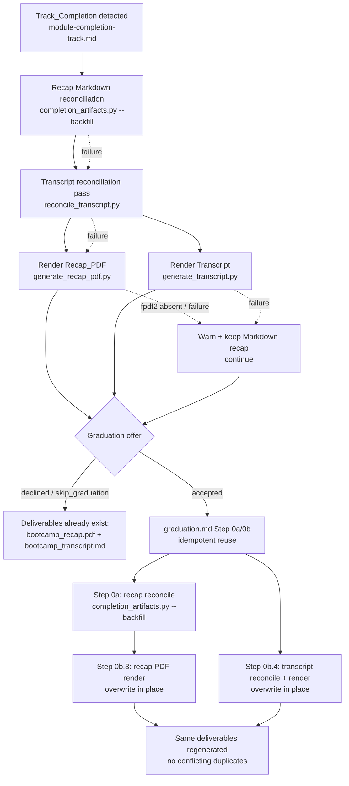

# Design Document

## Overview

At track completion the bootcamp already **always** produces two Markdown deliverables — the
completion summary (`docs/completion_summary.md`, via `completion-summary-offer.md` /
`always-create-completion-summary`) and the reconciled per-module recap (`docs/bootcamp_recap.md`,
via `module-completion-track.md`'s "Recap Reconciliation & Backfill" safety net). But the two
*shareable* derived deliverables — the **Recap_PDF** (`docs/bootcamp_recap.pdf`, from
`scripts/generate_recap_pdf.py`) and the **Transcript** (`docs/bootcamp_transcript.md`, from
`scripts/generate_transcript.py`) — are produced only inside the graduation flow
(`graduation.md` Step 0b). Graduation runs only when the bootcamper accepts the graduation offer,
and is skipped entirely when `skip_graduation: true` in `config/bootcamp_preferences.yaml`.

The consequence: a bootcamper who declines graduation keeps the Markdown recap and completion
summary but never receives the shareable recap PDF or the Q&A transcript. This feature moves recap-PDF
and Q&A-transcript generation so it **always** runs at track completion — mirroring the always-generate
pattern already used for the completion summary and the recap Markdown — so declining graduation (or
setting `skip_graduation`) no longer forfeits those two deliverables.

This is **primarily a steering-ordering change** that reuses existing, tested scripts. No new
generation logic is introduced; the same commands already invoked at graduation
(`completion_artifacts.py --backfill`, `reconcile_transcript.py`, `generate_recap_pdf.py`,
`generate_transcript.py`) are re-sequenced so the render step happens at track completion, after the
reconciliation passes that already run there. The design touches two steering files:

1. **`module-completion-track.md`** — after the existing recap Markdown reconciliation, add a
   transcript reconciliation pass and then an **always-run** render step that produces the Recap_PDF
   and the Transcript at Track_Completion, independent of graduation acceptance and regardless of
   `skip_graduation`, and **non-blocking** (warn-and-continue on any failure).
2. **`graduation.md`** (Steps 0a/0b) — becomes **idempotent reuse**: its reconcile-then-render safety
   nets still run, but because reconciliation is idempotent and the renderers overwrite in place, a
   graduation run after track completion regenerates the same deliverables rather than producing
   conflicting duplicates.

The existing graceful degradation of the Recap_PDF when `fpdf2` is absent (keep the Markdown recap,
print the `pip install fpdf2` hint) is preserved unchanged — see the related `fpdf2-preflight-note`
spec and `graduation-recap-pdf-resilience`.

### Design Goals

- Guarantee the Recap_PDF and Transcript are produced at Track_Completion for **every** exit path:
  graduation accepted, graduation declined, and `skip_graduation: true`.
- Preserve the current **reconcile-then-render** ordering guarantees at both track completion and
  graduation (the PDF never renders from an unreconciled recap; the transcript never renders from an
  unreconciled log).
- Reuse existing scripts verbatim — no new PDF/transcript generation code, no new hooks, no per-write
  cost. This is a steering re-sequencing.
- Never block track completion or graduation: any generation failure warns and the flow continues,
  consistent with the existing always-generate / non-blocking patterns.
- Avoid conflicting duplicate deliverables when graduation runs after track completion.

### Non-Goals

- Changing the recap Markdown schema, the transcript render format, or the session-log schema.
- Modifying any of the reused scripts' internals (`generate_recap_pdf.py`, `reconcile_transcript.py`,
  `generate_transcript.py`, `completion_artifacts.py`).
- Adding a write-tool hook or any per-write process spawn (explicitly avoided; generation runs only at
  the track-completion stopping point and at graduation).
- Re-implementing `fpdf2` graceful degradation — that behavior already exists in
  `generate_recap_pdf.py` and its resilience work and is preserved as-is.
- Enforcing generation success (it remains best-effort / non-blocking).

## Architecture

The change relocates the render step earlier in the flow. Today reconciliation of the recap runs at
track completion but the derived PDF/transcript render only at graduation. After this change, the
render runs at track completion too, immediately after the reconciliation passes, and graduation
re-runs the same idempotent reconcile-then-render as a safety net.



**Ordering invariant (both flows):** reconcile the recap **then** render the PDF; reconcile the
transcript log **then** render the transcript. The render steps at track completion are placed *after*
the existing "Recap Reconciliation & Backfill" section and *after* the new transcript reconciliation
pass, exactly as graduation Step 0a precedes Step 0b (Requirements 1.2, 2.2).

**Non-blocking throughout:** every render/reconcile step is warn-and-continue. A failure in any step
(including `fpdf2` absent) never halts the sequence; subsequent steps and the graduation offer still run
(Requirements 3.1, 3.2).

**Idempotent reuse at graduation:** because the recap reconciliation is a pure set-difference no-op on a
consistent recap, the transcript reconciliation is a no-op when log/recap counts already agree, and both
renderers **overwrite** their output in place rather than appending, a graduation run after track
completion reproduces the identical deliverables instead of creating conflicting duplicates
(Requirement 2.1).

## Components and Interfaces

No source files change. The design is realized as steering edits plus a small **reference model** and
steering-content tests. The reused scripts and their contracts:

### Reused scripts (no modification)

| Script | Role | Invocation (canonical paths) | Idempotence / overwrite contract |
|---|---|---|---|
| `completion_artifacts.py --backfill` | Recap Markdown reconciliation | `python senzing-bootcamp/scripts/completion_artifacts.py --progress config/bootcamp_progress.json --recap docs/bootcamp_recap.md --journal docs/bootcamp_journal.md --progress-dir docs/progress --backfill` | Pure set difference; appends only missing `## Module N:` sections, preserves existing bytes; no-op on a consistent recap. |
| `reconcile_transcript.py` | Q&A transcript reconciliation | `python senzing-bootcamp/scripts/reconcile_transcript.py` | Idempotent; backfills missing Q&A events into `config/session_log.jsonl` only on a material shortfall; no-op when counts agree. |
| `generate_recap_pdf.py` | Recap_PDF render | `python senzing-bootcamp/scripts/generate_recap_pdf.py` | Overwrites `docs/bootcamp_recap.pdf`; lazily imports `fpdf`; degrades gracefully when `fpdf2` absent. |
| `generate_transcript.py` | Transcript render | `python senzing-bootcamp/scripts/generate_transcript.py` | Overwrites `docs/bootcamp_transcript.md` rather than appending to stale content. |

### Steering change 1 — `module-completion-track.md`: always render at track completion

**File:** `senzing-bootcamp/steering/module-completion-track.md`

1. **Keep** the existing `### Recap Reconciliation & Backfill (Path A final safety net)` section
   (the `completion_artifacts.py --backfill` pass) unchanged as the first step.
2. **Add** a transcript reconciliation pass (`reconcile_transcript.py`) after the recap reconciliation
   — mirroring graduation Step 0b.4's reconcile-before-render ordering.
3. **Add** a new subsection (e.g. `### Shareable Deliverables: Recap PDF & Q&A Transcript`) that
   **always** runs, after both reconciliation passes and **before** the graduation offer, stating:
   - It renders the Recap_PDF (`generate_recap_pdf.py`) from the now-reconciled recap and the
     Transcript (`generate_transcript.py`) from the now-reconciled session log.
   - It runs **independent of whether the bootcamper accepts graduation** (Requirement 1.1) and
     **regardless of `skip_graduation`** — the `skip_graduation` preference gates only the graduation
     *workflow*, not these deliverables (Requirement 1.3).
   - It is **non-blocking**: on any failure, or when `fpdf2` is absent, log a warning, point to the
     existing `docs/bootcamp_recap.md`, and continue (Requirements 3.1, 3.2).
4. **Update** the existing note that currently reads that the recap PDF is "produced later, in the
   graduation flow." Reword it to state the PDF (and transcript) are produced **here** at track
   completion, and that graduation re-runs the same reconcile-then-render as an idempotent safety net.

### Steering change 2 — `graduation.md`: idempotent reuse (Steps 0a/0b)

**File:** `senzing-bootcamp/steering/graduation.md`

1. **Preserve** Step 0a (recap reconciliation), Step 0b.3 (recap PDF render, including its
   helper-first / inline-fallback / `fpdf2` graceful-degradation decision), and Step 0b.4 (transcript
   reconcile-then-render) exactly — these remain the graduation-time safety nets (Requirement 2.2).
2. **Add** a short note at Step 0b clarifying that when track completion has already generated these
   deliverables, Step 0a/0b **re-runs the same idempotent reconcile-then-render** and **overwrites in
   place**, so it refreshes rather than duplicates the deliverables (Requirement 2.1). Moving generation
   earlier does **not** remove or skip the graduation-time reconciliation safety nets.

### Reference model — `senzing-bootcamp/tests/` helper for the sequence

To make the ordering/idempotence/non-blocking guarantees testable without shelling out to the real
flow, the tests include a small, pure **reference model** of the completion/graduation sequence (a
plain Python module co-located with the tests, not shipped as a power script). It models the sequence
as an ordered list of steps and the resulting artifact set, parameterized by the inputs that vary the
flow. It performs **no** real I/O — it is a specification of the intended steering order.

```python
Step = str  # e.g. "recap_reconcile", "transcript_reconcile", "recap_pdf", "transcript_render"

@dataclass(frozen=True)
class SequenceInput:
    graduation_accepted: bool     # did the bootcamper accept the graduation offer?
    skip_graduation: bool         # config/bootcamp_preferences.yaml skip_graduation
    failing_steps: frozenset[str] # steps that fail this run (fpdf2 absent, FS error, ...)
    fpdf2_available: bool         # affects only the recap_pdf artifact, never the ordering

@dataclass(frozen=True)
class SequenceResult:
    executed: list[Step]          # steps attempted, in order (failures still "attempted")
    artifacts: frozenset[str]     # deliverables that exist after the run

def run_completion_sequence(inp: SequenceInput) -> SequenceResult:
    """Model module-completion-track.md track-completion order:
       recap_reconcile -> transcript_reconcile -> recap_pdf, transcript_render,
       then the graduation offer. Renders run regardless of graduation_accepted /
       skip_graduation. Any failing step is still 'attempted' and never aborts the
       remaining steps (non-blocking)."""

def run_graduation_sequence(inp: SequenceInput) -> SequenceResult:
    """Model graduation.md Step 0a/0b idempotent reuse: recap_reconcile ->
       recap_pdf, transcript_reconcile -> transcript_render, overwriting in place."""
```

The model encodes exactly the invariants the steering must satisfy; the properties below quantify over
its inputs, and separate steering-content tests assert that the real steering files contain the
matching instructions (so the model and the shipped steering stay in agreement).

## Data Models

No new persistent data model and no schema changes. The design operates over existing artifacts and a
test-only model of the flow.

### Artifacts and their producers

| Artifact | Producer | Overwrite semantics |
|---|---|---|
| `docs/bootcamp_recap.md` | `completion_artifacts.py --backfill` | append-missing-only; existing sections preserved byte-for-byte |
| `config/session_log.jsonl` | `reconcile_transcript.py` | append backfilled events only on shortfall; idempotent |
| `docs/bootcamp_recap.pdf` | `generate_recap_pdf.py` | full overwrite each render |
| `docs/bootcamp_transcript.md` | `generate_transcript.py` | full overwrite each render |

### Sequence model inputs (test-only)

The reference model's `SequenceInput` captures the dimensions that vary the flow:

- `graduation_accepted ∈ {true, false}` — whether the graduation offer was accepted. Renders at track
  completion do not depend on this (Requirement 1.1).
- `skip_graduation ∈ {true, false}` — the preference. Gates only the graduation workflow; track-completion
  renders occur regardless (Requirement 1.3).
- `failing_steps ⊆ {recap_reconcile, transcript_reconcile, recap_pdf, transcript_render}` — the set of
  steps that fail this run. Used to exercise non-blocking behavior (Requirements 3.1, 3.2).
- `fpdf2_available ∈ {true, false}` — affects only whether the `recap_pdf` **artifact** is produced;
  never affects step ordering or whether the sequence completes (Requirement 3.2).

### Ordering constraints encoded by the model

For any run, in `executed` order:

- `index(recap_reconcile) < index(recap_pdf)` — the PDF renders only after recap reconciliation.
- `index(transcript_reconcile) < index(transcript_render)` — the transcript renders only after its
  reconciliation pass.

These hold in both `run_completion_sequence` and `run_graduation_sequence` (Requirements 1.2, 2.2).

## Correctness Properties

*A property is a characteristic or behavior that should hold true across all valid executions of a
system — essentially, a formal statement about what the system should do. Properties serve as the
bridge between human-readable specifications and machine-verifiable correctness guarantees.*

Even though the change is a steering re-sequencing, property-based testing IS appropriate here: the
ordering, idempotence, and non-blocking guarantees are pure, universally-quantified statements over the
flow's inputs, captured by the reference model in Components and Interfaces. Each property below is
universally quantified and implemented as a single Hypothesis property test over generated
`SequenceInput`s (the Hypothesis profile chooses the example count — no hand-set `max_examples`), and is
paired with a steering-content test asserting the shipped steering files match the model.

### Property 1: Recap PDF and transcript are always generated at track completion

*For any* `SequenceInput` — for every combination of `graduation_accepted ∈ {true, false}` and
`skip_graduation ∈ {true, false}` — `run_completion_sequence` attempts both the `recap_pdf` and
`transcript_render` steps at track completion, and (when their steps do not fail and `fpdf2` is
available for the PDF) produces `docs/bootcamp_recap.pdf` and `docs/bootcamp_transcript.md`. Generation
never depends on graduation being accepted or on `skip_graduation` being false.

**Validates: Requirements 1.1, 1.3**

### Property 2: Reconcile-then-render ordering is preserved in both flows

*For any* `SequenceInput`, in the `executed` step order of both `run_completion_sequence` and
`run_graduation_sequence`, `recap_reconcile` precedes `recap_pdf` and `transcript_reconcile` precedes
`transcript_render`. Moving render generation earlier at track completion never removes the
graduation-time reconciliation steps.

**Validates: Requirements 1.2, 2.2**

### Property 3: Graduation after track completion is idempotent — no conflicting duplicates

*For any* `SequenceInput`, running `run_completion_sequence` and then `run_graduation_sequence` yields
the same final artifact set as track completion alone (the renderers overwrite in place and the
reconciliation steps are no-ops on the already-consistent recap and log), so graduation refreshes rather
than duplicates the deliverables and never produces a conflicting second copy.

**Validates: Requirements 2.1**

### Property 4: Generation is non-blocking under any failure

*For any* `SequenceInput` with an arbitrary `failing_steps` subset (including `fpdf2_available = false`,
which suppresses only the `recap_pdf` artifact), the sequence still attempts every subsequent step in
order and reaches the graduation offer — no failure aborts the flow — and every artifact whose step did
not fail is still produced. When the recap PDF cannot be written, the Markdown recap
(`docs/bootcamp_recap.md`) is retained.

**Validates: Requirements 3.1, 3.2**

## Error Handling

The track-completion render step and the graduation safety nets are **non-blocking by contract** —
neither track completion nor graduation ever stalls on them (Requirements 3.1, 3.2).

| Failure mode | Handling |
|---|---|
| Recap Markdown reconciliation fails / reports a remaining gap | Warn (naming still-missing modules) and continue; render proceeds against the recap as-is, backstopped by the tolerant recap parser. |
| Transcript reconciliation fails or exits non-zero | Warn and continue regardless of exit code; the transcript render falls back to the existing session-log content. |
| `generate_recap_pdf.py` errors before writing a PDF | Warn, point to `docs/bootcamp_recap.md`, continue. No false-success message is emitted. |
| `fpdf2` absent | Expected graceful degradation: skip the PDF, keep the Markdown recap, print the `pip install fpdf2` hint, continue. Owned by `generate_recap_pdf.py` / `graduation-recap-pdf-resilience`; preserved unchanged. |
| `generate_transcript.py` reports no Q&A events | No transcript written; inform the bootcamper and continue. |
| `generate_transcript.py` fails for any other reason | Warn with the reason and continue. |
| Graduation runs after track completion | Idempotent reuse: reconciliation is a no-op on consistent inputs, renderers overwrite in place; no conflicting duplicates (Requirement 2.1). |

In all cases the flow proceeds to the graduation offer (at track completion) or to Step 1 (at
graduation), consistent with the existing always-generate / non-blocking patterns
(`GRADUATION_REPORT.md`, the completion summary, and the recap PDF step).

## Testing Strategy

Tests live in `senzing-bootcamp/tests/`, follow the project pattern (pytest + Hypothesis, class-based,
`sys.path` import for any script access), and property tests draw their example count from the active
Hypothesis profile (`fast` locally, `thorough` in CI) — no hand-set `max_examples`. Fixtures are
synthetic only: no real PII, credentials, or connection strings (power-distribution safety rule).

### Property-based tests (Hypothesis)

One property test per correctness property, exercised against the pure reference model
(`run_completion_sequence` / `run_graduation_sequence`), each tagged:

`# Feature: track-completion-pdf-transcript, Property {number}: {property_text}`

A single custom strategy generates the model inputs:

- `st_sequence_input()` — random `graduation_accepted`, `skip_graduation`, `fpdf2_available`, and a
  random `failing_steps` subset drawn from
  `{recap_reconcile, transcript_reconcile, recap_pdf, transcript_render}`.

Property mapping:

- **Property 1** — over `st_sequence_input()`, assert both render steps are attempted at track
  completion for every flag combination, and produced when their step does not fail.
- **Property 2** — over `st_sequence_input()`, assert the reconcile-before-render index ordering in both
  the completion and graduation models.
- **Property 3** — over `st_sequence_input()`, run completion then graduation and assert artifact-set
  equality and that graduation reconciliation steps are no-ops on consistent inputs.
- **Property 4** — over `st_sequence_input()` (including `fpdf2_available = false`), assert every
  subsequent step is still attempted, the flow reaches the offer, non-failing artifacts are produced,
  and the Markdown recap is retained when the PDF is skipped.

### Steering-content tests

Because the behavior is delivered in steering text, complement the model properties with structural
assertions on the shipped steering files (these keep the model and the real steering in agreement, and
satisfy Requirements 4.1, 4.2):

- **`module-completion-track.md`**: asserts the always-run render subsection exists, invokes
  `generate_recap_pdf.py` and `generate_transcript.py` after the recap and transcript reconciliation
  passes, states it runs independent of graduation acceptance and regardless of `skip_graduation`, and
  is marked non-blocking. Asserts the stale "produced later, in the graduation flow" note has been
  updated.
- **`graduation.md`**: asserts Step 0a/0b (reconcile-then-render) are still present and that the
  idempotent-reuse note (overwrite in place, no conflicting duplicates) is added.

### Unit / example tests

- **Ordering at track completion**: a concrete `SequenceInput` (graduation declined) asserting the exact
  executed order recap_reconcile → transcript_reconcile → recap_pdf/transcript_render.
- **`skip_graduation` true**: concrete example asserting both renders occur and the graduation workflow
  is skipped.
- **`fpdf2` absent**: concrete example asserting the recap PDF is skipped, the Markdown recap is
  retained, and the transcript still renders (graceful degradation, Requirement 3.2).
- **Idempotent reuse**: concrete example running completion then graduation, asserting a single
  (overwritten) copy of each deliverable and no conflicting duplicate paths.

### Notes on scope

The reused scripts (`generate_recap_pdf.py`, `reconcile_transcript.py`, `generate_transcript.py`,
`completion_artifacts.py`) already have their own unit/property suites and are unchanged here; this
feature does not re-test their internals beyond the graceful-degradation cross-check. The
`fpdf2`-absent render behavior is owned by `graduation-recap-pdf-resilience` / `fpdf2-preflight-note`
and is referenced, not duplicated.
