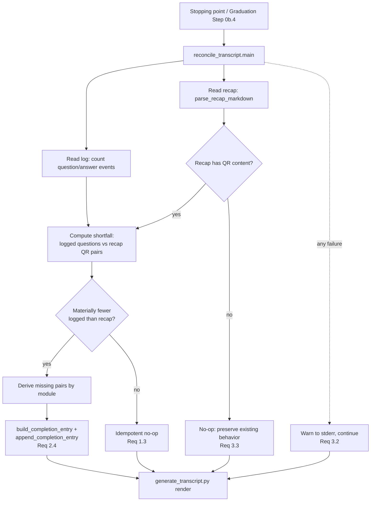

# Design Document

## Overview

The Q&A transcript (`docs/bootcamp_transcript.md`) is rendered by
`scripts/generate_transcript.py` from `question`/`answer` completion events in
`config/session_log.jsonl`. Those events are emitted *voluntarily* by the agent, following
the `qa-transcript.md` steering file — there is no hook or per-write enforcement backing them
(a deliberate design that avoids per-write logging cost, per `bootcamp-qa-transcript`
Requirement 3). When the agent omits Q&A events — a missed steering instruction, a compacted
context, or a session boundary — `generate_transcript.py` warns and writes nothing, and the
transcript silently under-represents the session.

By contrast, the per-module recap (`docs/bootcamp_recap.md`) *is* enforced: the
`module-recap-append` hook writes each module's `### Questions & Responses` (QR) section, and a
synchronous verify-and-backfill plus a track-completion reconciliation pass repair it. The
recap's QR pairs are therefore a reliable, already-captured source of the same Q&A content the
transcript needs.

This feature adds a **Reconciliation_Pass** — a pre-render step that runs at stopping points and
at graduation (before `generate_transcript.py` renders, analogous to graduation Step 0a preceding
the recap PDF). The pass counts logged QA_Events against the recap's QR pairs; when the log is
materially short, it derives the missing Q&A content from the recap and backfills it as
`question`/`answer` completion events using the existing `session_logger` schema, so the
subsequent transcript render is complete. The pass is idempotent (a no-op when counts already
agree), non-blocking (warn-and-continue on any failure), and adds **no** write-tool hook and **no**
per-write process spawn.

### Design Goals

- Repair transcript Q&A shortfalls from the enforced recap source before render.
- Preserve the no-per-write-cost architecture: no new `postToolUse` hook, no change to
  `session-log-events`, run only at stopping points / graduation.
- Reuse existing, tested building blocks: `generate_recap_pdf.parse_recap_markdown` /
  `parse_qr_section` for reading the recap, `session_logger.build_completion_entry` /
  `append_completion_entry` for writing, and `generate_transcript`'s redaction for safety.
- Never block graduation: on any error, warn and fall back to existing behavior.

### Non-Goals

- Changing the transcript render format or the session-log schema.
- Enforcing Q&A logging at write time (explicitly rejected — see Requirement 2.2).
- Reconstructing content the recap itself never captured (Requirement 3.3).

## Architecture

The Reconciliation_Pass is a new stdlib-only script,
`senzing-bootcamp/scripts/reconcile_transcript.py`, invoked immediately before
`generate_transcript.py` at each stopping point and at graduation Step 0b.4. It reads two sources,
compares their Q&A counts, and, on a shortfall, appends reconstructed QA_Events to the session log
so the existing renderer produces a complete transcript.



### Data Flow

1. **Read the recap.** Parse `docs/bootcamp_recap.md` with the existing
   `generate_recap_pdf.parse_recap_markdown`, yielding `RecapSection`s each carrying ordered
   `QRPair`s (`question`, `response`) and a `module_number`.
2. **Read the log.** Scan `config/session_log.jsonl` for `question`/`answer` completion events,
   counting them per module (reusing the tolerant line-skipping reader pattern from
   `generate_transcript.read_events`).
3. **Detect shortfall.** Compare the logged `question` count against the recap QR-pair count for
   the completed modules. A *material* shortfall triggers backfill (Requirement 1.2); consistent
   counts are a no-op (Requirement 1.3).
4. **Backfill.** For the modules that are short, derive the missing `(question, response)` pairs
   from the recap in module order and append them as paired `question`/`answer` completion events
   via `session_logger.build_completion_entry` + `append_completion_entry` (Requirement 2.4).
5. **Render.** The existing `generate_transcript.py` runs next and renders the now-complete log.
   Its built-in redaction scrubs secrets (Requirement 4.1).

### Ordering & Invocation

- The pass runs **before** `generate_transcript.py` at graduation Step 0b.4, mirroring how Step 0a
  reconciles the recap before the recap PDF (Requirement 3.1).
- Invocation is via the graduation/stopping-point steering flow only — never a hook, never
  per file write (Requirement 2.3). The graduation steering (`graduation.md` Step 0b.4) gains a
  reconcile step immediately before the render command.

## Components and Interfaces

### New script: `scripts/reconcile_transcript.py`

Follows the standard script pattern: shebang, `from __future__ import annotations`, stdlib only,
dataclasses, `argparse`, `main(argv=None)`, exit 0 on success / 1 on error (though the caller
treats it as non-blocking regardless).

```python
@dataclass
class ModuleCounts:
    """Per-module Q&A tallies from the two sources."""
    module: int
    logged_questions: int      # question events in the session log for this module
    recap_pairs: int           # QR pairs in the recap for this module

@dataclass
class ModuleShortfall:
    """Missing pairs for one module, derived from the recap."""
    module: int
    missing_pairs: list[tuple[str, str]]   # (question, response) in recap order

@dataclass
class ReconcilePlan:
    """The computed backfill plan across modules."""
    shortfalls: list[ModuleShortfall]   # modules needing backfill, in module order
    is_noop: bool                       # True when counts are consistent (Req 1.3)
    recap_has_qr: bool                  # False -> preserve existing behavior (Req 3.3)
```

Key functions:

- `count_logged_questions(log_path: str) -> dict[int, int]` — read the JSONL log (tolerant,
  never raises), returning per-module `question`-event counts. Reuses the line-skipping approach
  of `generate_transcript.read_events`.
- `count_recap_pairs(recap_doc: RecapDocument) -> dict[int, int]` — count `qr_pairs` per
  `module_number` from a parsed recap document.
- `is_material_shortfall(logged: int, recap: int) -> bool` — the shortfall predicate
  (see Data Models → Shortfall threshold).
- `build_plan(logged: dict[int, int], recap_doc: RecapDocument) -> ReconcilePlan` — compute the
  per-module shortfalls and the derived missing pairs, preserving recap module order. Sets
  `recap_has_qr=False` when the recap contributes zero QR pairs (Requirement 3.3).
- `apply_plan(plan: ReconcilePlan, log_path: str) -> int` — for each shortfall, in module order,
  append paired `question`/`answer` completion events. Returns the number of pairs backfilled.
- `main(argv=None) -> int` — orchestrate read → plan → apply, wrapping the body in a broad
  handler that logs a warning to stderr and returns without raising on any failure
  (Requirement 3.2). CLI: `--recap`, `--log` (defaulting to the canonical paths).

### Reused interfaces (no modification)

- `generate_recap_pdf.parse_recap_markdown(content) -> RecapDocument` and its `RecapSection` /
  `QRPair` dataclasses, plus `parse_qr_section` — the recap reader. Import via `sys.path`
  (scripts are not a package), consistent with the test-import convention.
- `session_logger.build_completion_entry(event_type, module, data)` and
  `append_completion_entry(log_path, entry)` — the *only* writer used (Requirement 2.4). Question
  events supply `data={"text", "question_id"}`; answer events supply the matching `question_id`
  and `data={"text", "question_id"}`, so `generate_transcript.build_model` pairs them correctly.
- `session_logger.generate_question_id()` — to mint the `question_id` linking each backfilled
  question to its answer.
- `generate_transcript.main()` — unchanged; runs after reconciliation.

### Backfilled event construction

For each missing pair `(question_text, response_text)` in module `N`:

1. `qid = generate_question_id()`
2. `q = build_completion_entry("question", N, {"text": question_text, "question_id": qid})`
3. `a = build_completion_entry("answer", N, {"text": response_text, "question_id": qid})`
4. `append_completion_entry(log_path, q)` then `append_completion_entry(log_path, a)`

Because `build_completion_entry` stamps a fresh UTC timestamp and the two events are appended
question-then-answer, `generate_transcript.build_model` (which orders by timestamp with stable
file-order tie-breaking and pairs by `question_id`) renders each backfilled pair as an answered
question in module order.

## Data Models

### Sources

| Source | Path | Reader | Unit counted |
|---|---|---|---|
| Session log | `config/session_log.jsonl` | tolerant JSONL scan | `question` completion events per module |
| Recap | `docs/bootcamp_recap.md` | `parse_recap_markdown` | `QRPair`s per `RecapSection.module_number` |

### Shortfall threshold (what "materially fewer" means)

Requirement 1.2 says backfill triggers when logged questions are *materially* fewer than the
recap's QR-pair count **for the completed modules**. The comparison is per module and aggregated:

- For module `N`, `missing(N) = max(0, recap_pairs(N) - logged_questions(N))`.
- A module is a shortfall when `missing(N) > 0`.
- The pass is a **no-op** when `sum(missing(N)) == 0` across all modules with recap QR content
  (Requirement 1.3) — i.e., the log already has at least as many questions as the recap per module.
- When the recap contributes **zero** QR pairs across all modules, `recap_has_qr=False` and the
  pass makes no changes, preserving existing `generate_transcript.py` behavior (Requirement 3.3).

Using a per-module `max(0, …)` deficit (rather than a global count) means an over-logged module can
never mask an under-logged one, and backfill never *removes* or duplicates already-logged content.

### Ordering guarantee

Missing pairs are derived and appended in recap order: modules ascending by `module_number`, and
within a module the `QRPair`s in first-to-last document order. Combined with timestamped,
question-then-answer appends, the rendered transcript presents at least `N` question/answer pairs
in module order for a recap with `N` QR pairs (Requirement 5.2).

### Privacy & distribution safety

- Backfilled answer text passes through the existing transcript redaction (`redact_secrets` in
  `generate_transcript.py`) at render time, so secrets/credentials/connection strings never reach
  the transcript (Requirement 4.1). No new redaction logic is introduced.
- Test fixtures are synthetic only — no real PII, credentials, or connection strings
  (Requirement 4.2, and the power-distribution safety rule).

## Correctness Properties

*A property is a characteristic or behavior that should hold true across all valid executions of a
system — essentially, a formal statement about what the system should do. Properties serve as the
bridge between human-readable specifications and machine-verifiable correctness guarantees.*

Each property below is universally quantified and implemented as a single Hypothesis property test
(minimum 100 iterations under the `thorough` profile).

### Property 1: Accurate per-module counts

*For any* generated recap with a known number of QR pairs per module and *any* generated session
log with a known number of `question` events per module (including interspersed malformed or blank
lines that must be skipped), `count_recap_pairs` and `count_logged_questions` return exactly those
per-module tallies.

**Validates: Requirements 1.1**

### Property 2: Plan equals the per-module deficit

*For any* pair of per-module logged-question counts and recap QR-pair counts, `build_plan` produces
a plan whose total missing pairs equals `sum over modules of max(0, recap_pairs(N) − logged(N))`,
and whose `is_noop` flag is true if and only if that sum is zero.

**Validates: Requirements 1.2, 1.3**

### Property 3: Reconciliation is idempotent

*For any* recap and session log, running the Reconciliation_Pass and then running it a second time
leaves the log identical to its state after the first run, and the second run's plan is a no-op.

**Validates: Requirements 1.3**

### Property 4: Backfilled events conform to the existing schema and pair correctly

*For any* detected shortfall, every event appended by the backfill is a valid `question` or
`answer` completion entry (as produced by `build_completion_entry`), and re-reading the log with the
existing `generate_transcript` reader pairs each backfilled question to its answer via
`question_id` — increasing the answered-pair count by exactly the number of backfilled pairs.

**Validates: Requirements 2.1, 2.4**

### Property 5: A recap with no QR content is a no-op

*For any* recap that contains no `### Questions & Responses` content across all modules, the
Reconciliation_Pass reports `recap_has_qr` false, makes no changes to the session log, and thereby
preserves the existing `generate_transcript.py` behavior.

**Validates: Requirements 3.3**

### Property 6: Reconciled transcript renders at least N pairs in module order

*For any* recap with N QR pairs across modules, reconciling against an empty or short log and then
rendering the transcript yields at least N answered question/answer pairs whose text matches the
recap's QR pairs, presented grouped by module in ascending module order.

**Validates: Requirements 2.1, 5.2**

### Property 7: Secrets in reconciled content are redacted

*For any* recap response text containing a secret-looking value (token, key, or connection
string with credentials), the reconciled-and-rendered transcript contains the redaction placeholder
and does not contain the original secret value.

**Validates: Requirements 4.1**

### Property 8: Any malformed input warns and continues

*For any* malformed or unreadable recap or session log (invalid JSON lines, corrupt Markdown,
missing files), `reconcile_transcript.main` never raises, returns to its caller, and leaves the
session log readable by the transcript renderer.

**Validates: Requirements 3.2**

## Error Handling

The pass is **non-blocking by contract** — graduation never stalls on it (Requirement 3.2).

| Failure mode | Handling |
|---|---|
| Recap file missing or unreadable | Treat as zero recap QR pairs → `recap_has_qr=False`, no-op; render proceeds on existing log (Req 3.3). |
| Recap Markdown malformed | `parse_recap_markdown` is tolerant and never raises; a section that fails to yield QR pairs simply contributes zero. |
| Session log missing | Per-module logged counts are all zero; if the recap has QR content, backfill fully reconstructs. |
| Session log has malformed / blank lines | Reader skips them (mirrors `generate_transcript.read_events`); never raises. |
| Append (write) failure | `append_completion_entry` already catches `OSError`, warns to stderr, and returns without raising. |
| Any unexpected exception in `main` | Caught by a top-level guard that logs a warning to stderr and returns, so the caller continues to the render step (Req 3.2). |

`main` returns 0 on a clean run or clean no-op and 1 only on an internally handled error path; the
graduation steering treats the step as non-blocking regardless of exit code, then always runs
`generate_transcript.py`.

## Testing Strategy

Tests live in `senzing-bootcamp/tests/`, follow the project pattern (pytest + Hypothesis,
class-based, `sys.path` import of scripts), and property tests draw their example count from the
active Hypothesis profile (`fast`=5 locally, `thorough`=100 in CI). Fixtures are synthetic only —
no real PII, credentials, or connection strings (Requirement 4.2).

### Property-based tests (Hypothesis)

Property-based testing IS appropriate here: the reconciliation logic (counting, shortfall
detection, plan-building, idempotence, schema round-trip, ordering) is pure and has universal
properties over a large input space of recaps and logs. One property test per correctness property
above, each tagged:

`# Feature: transcript-reconciliation, Property {number}: {property_text}`

Custom strategies (prefixed `st_`) generate the inputs:

- `st_recap_document()` — recaps with a varying set of modules, each with 0..k synthetic QR pairs
  (synthetic question/response text), rendered to Markdown in the `### Questions & Responses`
  Paired_Schema so `parse_recap_markdown` round-trips them.
- `st_session_log(recap)` — session logs with a chosen per-module subset (including empty) of
  the recap's questions already logged, plus optional malformed/blank lines to exercise tolerance.
- `st_secret_bearing_response()` — response text embedding token / key / connection-string
  patterns, for Property 7.

Properties 1–8 map one-to-one to the tests. Property 6 is the headline end-to-end test required by
Requirement 5.2 (for any recap with N QR pairs, the reconciled transcript renders ≥ N pairs in
module order).

### Unit / example tests

Complement the properties with focused examples and structural checks:

- **Shortfall detection** with hand-built consistent, short, and over-logged logs.
- **Backfill** from a small fixed recap; assert exact backfilled content and ordering.
- **Idempotent no-op** on an already-consistent log (concrete example).
- **Warn-and-continue** on a missing recap file and on a permission/OS error (asserting a warning
  is emitted and no exception escapes).
- **Architecture guardrails (Req 2.2, 2.3, 3.1)**: assert the feature adds no `postToolUse`
  write-tool hook, does not modify the `session-log-events` hook, and that `graduation.md`
  Step 0b.4 invokes `reconcile_transcript` immediately before `generate_transcript.py`.

### Integration test

One end-to-end test wiring the real recap parser, real `session_logger`, real reconcile script, and
real `generate_transcript` render against a temp workspace: seed a recap + empty log, run
reconcile, run render, and assert the resulting `bootcamp_transcript.md` contains the recap's Q&A
grouped by module.
