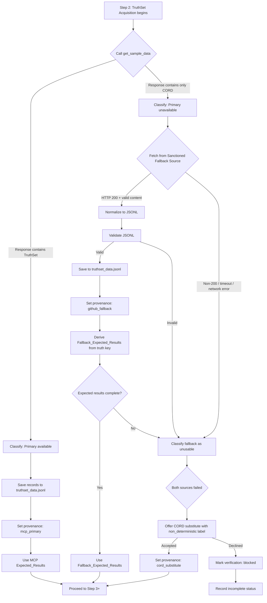

# Design Document: TruthSet Fallback Source

## Overview

This feature adds a fallback TruthSet acquisition path to Module 3 (System Verification). When the MCP server's `get_sample_data` tool does not expose a named TruthSet (only CORD collections), the module fetches the demo TruthSet from the official Senzing `truth-sets` GitHub repository so that deterministic verification (entity count tolerance, known matches, cross-record resolution) can still run.

The design preserves the existing Module 3 pipeline unchanged when the MCP-provided TruthSet is available. It introduces a clearly-bounded fallback path that:

1. Detects whether `get_sample_data` provides a usable TruthSet
2. If not, fetches records from the sanctioned fallback source
3. Normalizes records to the same JSONL format the loader expects
4. Derives expected results from the truth-set's published ground-truth key
5. Records provenance so the Verification Report transparently states which source was used

The fallback URL is declared in a single registry file (`config/fallback_sources.yaml`), enforcing the one-external-endpoint security posture with an explicit, reviewable exception.

## Architecture

### High-Level Flow



### Integration with Existing Pipeline

The fallback logic is entirely contained within **Step 2 (TruthSet Acquisition)** of Phase 1. Steps 3–12 are unmodified — they consume `src/system_verification/truthset_data.jsonl` and an expected-results object regardless of source. The only downstream impact is:

- Step 7 (Deterministic Results Validation) receives either MCP Expected_Results or Fallback_Expected_Results depending on provenance
- Step 10 (Report Generation) includes the provenance label in the report structure

### Component Boundaries

| Component | Responsibility | Location |
|-----------|---------------|----------|
| Availability Classifier | Inspect `get_sample_data` response, emit `available` / `unavailable` | Agent logic in steering |
| Fallback Fetcher | HTTP GET from sanctioned source, enforce 30s timeout | Agent-generated Python script in `src/system_verification/` |
| Record Normalizer | Convert fetched content (multi-file JSONL) to single JSONL file | Same script as fetcher |
| JSONL Validator | Validate line-by-line JSON, count match | Same script as fetcher |
| Expected Results Deriver | Parse `actual_truthset_key.csv`, compute entity count + known matches | Same script as fetcher |
| Provenance Recorder | Write source label to `bootcamp_progress.json` | Agent logic in steering |
| Registry | Declare sanctioned URL, purpose, rationale | `config/fallback_sources.yaml` |

## Components and Interfaces

### 1. Sanctioned Source Registry (`config/fallback_sources.yaml`)

A power-level configuration file declaring the single approved fallback endpoint. All other files reference this registry by identifier rather than embedding the URL.

```yaml
version: "1"
sources:
  senzing_truthset_demo:
    name: "Senzing TruthSet Demo"
    purpose: "Fallback TruthSet data for Module 3 deterministic verification"
    rationale: "Official Senzing-published deterministic data with ground-truth key"
    base_url: "https://raw.githubusercontent.com/Senzing/truth-sets/main/truthsets/demo"
    files:
      records:
        - "customers.jsonl"
        - "watchlist.jsonl"
        - "reference.jsonl"
      truth_key: "actual_truthset_key.csv"
    timeout_seconds: 30
    approved_by: "power-maintainer"
    approved_date: "2026-07-01"
```

### 2. Availability Classifier (Steering Logic)

The agent inspects the `get_sample_data` response structure:

- **Available**: Response contains a dataset with `name` matching "TruthSet" (case-insensitive) or `type` field indicating `truthset`, AND the dataset includes retrievable record content.
- **Unavailable**: Response contains only entries identified as CORD collections (Las Vegas, London, Moscow) with no TruthSet-type entry.

The classification is recorded immediately to `bootcamp_progress.json`:

```json
{
  "module_3_verification": {
    "checks": {
      "truthset_acquisition": {
        "primary_available": true | false,
        "classification_reason": "truthset_found" | "cord_only"
      }
    }
  }
}
```

### 3. Fallback Fetcher Script

A Python stdlib-only script generated by the agent at `src/system_verification/fetch_fallback_truthset.py`. It:

1. Reads `config/fallback_sources.yaml` to obtain the base URL and file list
2. Fetches each record file (`customers.jsonl`, `watchlist.jsonl`, `reference.jsonl`) via `urllib.request.urlopen` with a 30-second timeout
3. Fetches the truth key file (`actual_truthset_key.csv`)
4. Concatenates record files into a single `truthset_data.jsonl`
5. Validates the output (line-by-line JSON, count match)
6. Parses the truth key to derive expected results
7. Writes results to stdout as JSON for the agent to consume

**Interface contract** (stdout JSON):

```json
{
  "status": "success" | "fetch_failed" | "validation_failed" | "expected_results_failed",
  "records_written": 48,
  "file_path": "src/system_verification/truthset_data.jsonl",
  "expected_results": {
    "expected_entity_count": 35,
    "known_matches": [
      {"records": ["CUSTOMERS:1001", "CUSTOMERS:1002"], "entity_label": "cluster_1"},
      {"records": ["CUSTOMERS:1003", "WATCHLIST:2001"], "entity_label": "cluster_2"},
      {"records": ["REFERENCE:3001", "CUSTOMERS:1004"], "entity_label": "cluster_3"}
    ]
  },
  "error": null | "HTTP 404 for customers.jsonl" | "Timeout after 30s" | ...
}
```

### 4. Record Normalizer

The normalizer handles the fact that the fallback source provides three separate JSONL files. It:

1. Reads each fetched file line by line
2. Parses each line as JSON to validate structure
3. Adds a `DATA_SOURCE` field if not already present (derived from filename: `customers.jsonl` → `CUSTOMERS`, `watchlist.jsonl` → `WATCHLIST`, `reference.jsonl` → `REFERENCE`)
4. Writes all records to a single `truthset_data.jsonl` file, one JSON object per line

The normalization is idempotent — running it on already-normalized content produces identical output.

### 5. Expected Results Deriver

Parses `actual_truthset_key.csv` (columns: `CLUSTER_ID`, `RECORD_ID`, `DATA_SOURCE`) to compute:

- **Expected entity count**: Count of distinct `CLUSTER_ID` values
- **Known matches**: Select clusters with 2+ records to identify known merged pairs. Return at least 3 such clusters for Step 7 validation.

### 6. Steering Modifications

**`module-03-phase1-verification.md` Step 2 changes:**

The existing Step 2 is extended with a fallback branch after the `get_sample_data` call. The additions are:

- After calling `get_sample_data`, classify the response
- If primary unavailable, execute the fallback fetcher script
- Record provenance in the checkpoint
- Pass appropriate expected results to Step 7

**`module-03-system-verification.md` changes:**

Add a brief note under "Error Handling" documenting the fallback path and referencing the registry.

## Data Models

### Sanctioned Source Registry Schema (`config/fallback_sources.yaml`)

```yaml
version: "1"                        # Schema version
sources:
  <identifier>:                     # Registry identifier (referenced by other files)
    name: string                    # Human-readable name
    purpose: string                 # Why this source exists
    rationale: string               # Security approval rationale
    base_url: string                # Base URL for file fetching
    files:
      records: list[string]         # JSONL record files to fetch
      truth_key: string             # Ground-truth key file
    timeout_seconds: integer        # HTTP timeout per request
    approved_by: string             # Who approved the exception
    approved_date: string           # ISO date of approval
```

### TruthSet Data File (`src/system_verification/truthset_data.jsonl`)

Each line is a JSON object representing one record. The format is identical regardless of source:

```jsonl
{"DATA_SOURCE": "CUSTOMERS", "RECORD_ID": "1001", "NAME_FULL": "Robert Smith", ...}
{"DATA_SOURCE": "WATCHLIST", "RECORD_ID": "2001", "NAME_FULL": "Bob Smith", ...}
```

### Progress File Extensions (`config/bootcamp_progress.json`)

The `truthset_acquisition` check entry gains additional fields:

```json
{
  "module_3_verification": {
    "checks": {
      "truthset_acquisition": {
        "status": "passed|failed",
        "records": 48,
        "source_provenance": "mcp_primary|github_fallback|cord_substitute",
        "primary_available": true | false,
        "classification_reason": "truthset_found|cord_only",
        "fallback_attempted": true | false,
        "fallback_error": null | "HTTP 404" | "timeout" | "validation_failed"
      }
    }
  }
}
```

When degraded:

```json
{
  "module_3_verification": {
    "checks": {
      "truthset_acquisition": {
        "status": "passed|failed|non_deterministic|blocked",
        "source_provenance": "cord_substitute",
        "deterministic_verification": "non_deterministic|blocked"
      }
    },
    "status": "incomplete"
  }
}
```

### Expected Results Structure

```json
{
  "expected_entity_count": 35,
  "tolerance_percent": 5,
  "known_matches": [
    {
      "records": ["CUSTOMERS:1001", "CUSTOMERS:1002"],
      "entity_label": "cluster_1"
    }
  ],
  "source": "mcp_primary|github_fallback"
}
```

## Correctness Properties

*A property is a characteristic or behavior that should hold true across all valid executions of a system — essentially, a formal statement about what the system should do. Properties serve as the bridge between human-readable specifications and machine-verifiable correctness guarantees.*

### Property 1: TruthSet Availability Classification

*For any* MCP `get_sample_data` response, the classifier SHALL output `available` if and only if the response contains a named TruthSet reference with retrievable records, and SHALL output `unavailable` if and only if the response contains only CORD collection entries.

**Validates: Requirements 1.1, 1.2, 1.3**

### Property 2: Path Selection and Provenance Consistency

*For any* TruthSet availability state (primary available, primary unavailable with fallback success, primary unavailable with fallback failure + CORD accepted), the acquisition logic SHALL assign exactly the correct provenance label (`mcp_primary`, `github_fallback`, or `cord_substitute` respectively) and SHALL route expected-results selection to the matching source.

**Validates: Requirements 2.1, 2.2, 2.3, 3.1, 3.3, 5.3, 7.3**

### Property 3: HTTP Error Classification

*For any* HTTP response status code outside the 200 range returned by the fallback source, the acquisition logic SHALL classify the source as unreachable and SHALL record the specific status code.

**Validates: Requirements 3.4**

### Property 4: Normalization Round-Trip

*For any* valid set of TruthSet records fetched from the sanctioned fallback source, parsing the source JSONL representation, serializing to the TruthSet_Data_File, and parsing the TruthSet_Data_File again SHALL yield an equivalent record set (identical field names, values, and record count).

**Validates: Requirements 4.1, 4.2, 4.3**

### Property 5: JSONL Validation Detects Errors

*For any* TruthSet_Data_File that contains at least one line that is not valid JSON or whose total line count does not match the expected record count, the validator SHALL report a failure status and SHALL block progression to data loading.

**Validates: Requirements 4.4**

### Property 6: Expected Results Structural Completeness

*For any* Fallback_Expected_Results derived from a valid truth-key CSV, the structure SHALL contain a positive integer expected entity count and at least three known-match entries (each with 2+ record identifiers).

**Validates: Requirements 5.2**

### Property 7: URL Governance — Single Source of Truth

*For any* file in the distributed power (excluding `config/fallback_sources.yaml` itself), the raw fallback source URL SHALL NOT appear. Only the registry identifier SHALL be used to reference the fallback source.

**Validates: Requirements 6.1**

### Property 8: Degraded Status Propagation

*For any* verification run where the deterministic-verification check is recorded as `non_deterministic` or `blocked`, the overall Module 3 status SHALL be `incomplete`.

**Validates: Requirements 7.5**

### Property 9: Provenance Persistence Completeness

*For any* completed TruthSet acquisition (regardless of path taken), the `bootcamp_progress.json` file SHALL contain the `source_provenance` field with a value from the set `{mcp_primary, github_fallback, cord_substitute}`, and the Verification Report SHALL include the same provenance value.

**Validates: Requirements 8.1, 8.3**

## Error Handling

### Failure Modes and Recovery

| Failure | Detection | Response | Status |
|---------|-----------|----------|--------|
| MCP `get_sample_data` returns CORD-only | Response inspection | Activate fallback path | Continue |
| Fallback HTTP non-200 | Status code check | Record error, attempt graceful degradation | `failed` or offer CORD |
| Fallback timeout (>30s) | `urllib` timeout exception | Terminate request, record timeout | `failed` or offer CORD |
| Fallback network error | `urllib` exception | Record error type | `failed` or offer CORD |
| JSONL validation failure | Line-by-line JSON parse | Report which line failed, block loading | `failed` |
| Count mismatch | Compare line count vs fetched count | Report mismatch, block loading | `failed` |
| Truth key missing/incomplete | CSV parse returns <3 clusters | Classify fallback as unusable | `failed` or offer CORD |
| Both sources unavailable | Primary unavailable + fallback unreachable | Offer CORD substitute or block | `non_deterministic` or `blocked` |

### Timeout Strategy

- Each individual file fetch: 30-second timeout (from registry `timeout_seconds`)
- Total fallback acquisition budget: sum of individual timeouts (3 record files + 1 truth key = up to 120s worst case, but typically <5s total)
- If any single fetch times out, the entire fallback is classified as unreachable (no partial acquisition)

### Graceful Degradation Hierarchy

1. **Primary path** (MCP TruthSet) — full deterministic verification
2. **Fallback path** (GitHub truth-sets) — full deterministic verification with fallback source
3. **CORD substitute** (offered, not forced) — non-deterministic verification, clearly labeled
4. **Blocked** (bootcamper declines CORD) — no verification, remediation steps provided

Each degradation level is explicitly recorded in provenance and the Verification Report, ensuring the bootcamper is never misled about the determinism guarantee.

### Error Messages

All error messages follow the existing Module 3 pattern:
- Identify what failed
- State the failure reason (HTTP status, timeout, validation error)
- Provide remediation steps (check connectivity, verify endpoint reachability, retry)
- Reference `common-pitfalls.md` for known proxy/firewall issues

## Testing Strategy

### Property-Based Tests (Hypothesis)

Property-based tests validate the 9 correctness properties above. Tests live in `senzing-bootcamp/tests/test_truthset_fallback_source_properties.py`.

**Library**: Hypothesis (already in project test dependencies)

**Configuration**: Tests use the project's registered Hypothesis profiles (`fast`/`thorough`). No inline `@settings(max_examples=...)` unless a specific test needs non-baseline counts.

**Tag format**: Each test class docstring includes:
```
Feature: truthset-fallback-source, Property {N}: {title}
```

**Key strategies to implement**:
- `st_mcp_response()` — generates MCP responses with/without TruthSet references
- `st_truthset_records()` — generates valid record sets with required Senzing fields
- `st_jsonl_content()` — generates valid/invalid JSONL content
- `st_http_status()` — generates non-200 HTTP status codes
- `st_truth_key_csv()` — generates truth-key CSV content with varying cluster counts
- `st_provenance()` — generates provenance values from the valid set
- `st_verification_state()` — generates verification states with various check outcomes

### Unit Tests

Unit tests cover specific examples and edge cases. Tests live in `senzing-bootcamp/tests/test_truthset_fallback_source_unit.py`.

**Coverage areas**:
- Registry YAML parsing with expected structure
- Specific HTTP error codes (404, 500, 503)
- Timeout simulation
- Empty response handling
- Truth key with exactly 3 matches (minimum)
- Truth key with 0 matches (failure case)
- Steering file content assertions (fallback documentation present, no raw URLs)
- Progress file schema validation after each path

### Integration Tests

Integration tests validate the end-to-end fallback flow with mocked HTTP responses. Tests live in `senzing-bootcamp/tests/test_truthset_fallback_source_integration.py`.

**Scenarios**:
- Primary available → fallback not attempted
- Primary unavailable → fallback succeeds → deterministic verification runs
- Primary unavailable → fallback fails → CORD offered
- Primary unavailable → fallback partially fails (one file 404) → classified unreachable

### Steering File Tests

Structural tests validate the modified steering files contain required content:
- Fallback path documented in Step 2
- Registry identifier used (not raw URL)
- Precedence statement present
- Provenance field in report schema
